# MODEL 3

### 2024+

## 车主手册

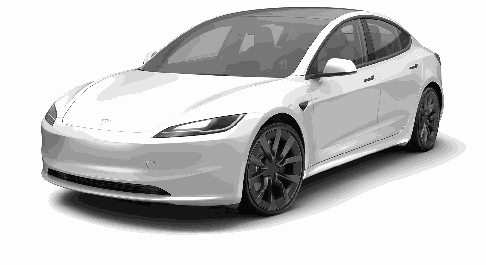

### 软件版本: 2025.2.12 China

##### **发行说明**

软件更新后,触摸屏上会显示与新功能相关的信息;可随时通过选择“手册”应用程序中的发行说明选项卡或点击控制 > 软件 > 发行说**明进行查看。如果车主手册中的车辆使用说明与发行说明中的信息相冲突,请以发行说明为准。**

##### **插图和产品规格**

本文档中提供的插图仅用于演示目的。依据车辆选装件、软件版本和市场区域,您车辆触摸屏上显示的信息可能会略有不同。

此文件中的所有规格和说明均已在打印时得到验证,以确保准确无误。同时,Tesla 以持续改进为目标,我们保留随时进行修改的权利。

如需就本文件中的错误或疏漏进行沟通,请发送电子邮件至:ownersmanualfeedback@tesla.com。

##### **安全信息**

可通过触摸屏查看 Model 3 车主手册中的安全信息。

如需关于 Model 3 的详细信息,请访问您所在地区的 Tesla 网站,然后登录您的 Tesla 账户或注册一个账户。

如果您对 Model 3 有任何疑问或问题,请拨打电话 400-910-0707 联系 Tesla。

##### **© 2012-2025 TESLA, INC.**

本文档中的所有信息和所有车辆软件受 Tesla, Inc. 及其许可人的版权和其他知识产权的保护。未经 Tesla, Inc. 及其许可人事先书面许可,不得对资料进行全部或部分复印、复制或修改。Tesla 可根据要求提供其他信息。此处所示为 Tesla, Inc. 在美国和其他国家(地区)的商标或注册商标:

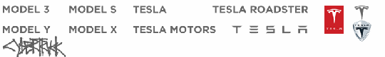

关于 辅助驾驶...........................................................................84辅助驾驶 功能...........................................................................86智能辅助驾驶 (如配备).........................................................92智能泊车...................................................................................95召唤功能...................................................................................97限制和警告.............................................................................100##### 主动安全功能................................................103

车道辅助.................................................................................103防撞辅助.................................................................................105车速辅助.................................................................................108驾驶室摄像头.........................................................................109##### 行车记录仪、哨兵模式和安全.......................110

安全&保障设置.......................................................................110行车记录仪.............................................................................112哨兵模式.................................................................................113视频记录对 USB 设备的要求..................................................115##### 温度控制.......................................................116

操作温度控制.........................................................................116调节前后通风口......................................................................120寒冷天气最佳实践..................................................................122炎热天气最佳实践..................................................................125##### 导航和娱乐....................................................126

地图和导航.............................................................................126媒体........................................................................................131剧场、游戏厅和玩具箱...........................................................133##### 充电和能耗....................................................135

车辆电气部件.........................................................................135高压电池信息.........................................................................137充电说明.................................................................................138定时预设温度和充电...............................................................142获得最大续航里程..................................................................143##### 维护.............................................................. 145

软件更新.................................................................................145保养服务间隔时间..................................................................146轮胎养护.................................................................................148清洁........................................................................................153挡风玻璃雨刮器片、喷头和清洗液.........................................156顶升和举升.............................................................................158零配件....................................................................................159临时轮胎修理工具箱...............................................................161DIY 维护..................................................................................163##### 规格.............................................................. 164

识别标签.................................................................................164车辆负载.................................................................................165尺寸和重量.............................................................................166子系统....................................................................................169### **内容**

##### 打开和关闭........................................................3

钥匙............................................................................................3车门............................................................................................7车窗............................................................................................9##### 储物区域.........................................................10

后备箱......................................................................................10前备箱......................................................................................12车内储物...................................................................................14##### 座椅和安全约束系统.......................................15

前排和后排座椅........................................................................15座椅安全带...............................................................................17儿童安全座椅...........................................................................20气囊..........................................................................................29##### 概述................................................................ 32

外部..........................................................................................32内饰..........................................................................................33触摸屏......................................................................................35车内电子设备...........................................................................39车辆状态...................................................................................41语音命令...................................................................................44摄像头......................................................................................46##### 网络连接.........................................................47

手机应用程序...........................................................................47Wi-Fi.........................................................................................49蓝牙..........................................................................................50电话、日历和 Web 会议...........................................................52智能车库...................................................................................53##### 驾驶................................................................ 55

启动和关闭电源........................................................................55方向盘......................................................................................56后视镜......................................................................................60换挡..........................................................................................61车灯..........................................................................................63雨刮器和清洗器........................................................................66制动和停止...............................................................................67驻车辅助...................................................................................70车辆保持...................................................................................72牵引力控制...............................................................................73加速模式...................................................................................74悬架..........................................................................................75赛道模式...................................................................................76驾驶员设定...............................................................................78主动防护前罩...........................................................................80行程信息...................................................................................81后置摄像头...............................................................................82行人警示系统...........................................................................83##### 辅助驾驶.........................................................84

轮毂和轮胎.............................................................................173##### 运输说明.......................................................177

运输说明.................................................................................177##### 发生紧急情况时............................................ 180

联系 Tesla 道路救援...............................................................180紧急呼叫.................................................................................181超出行驶里程.........................................................................182在没电的情况下打开前备箱盖................................................183跳线跨接启动.........................................................................184在没电的情况下打开车门.......................................................185浸水车辆指南.........................................................................186##### 故障排除.......................................................187

排除警报故障.........................................................................187##### 用户信息.......................................................240

关于本车主信息......................................................................240功能可用性声明......................................................................241免责声明.................................................................................242报告安全缺陷.........................................................................244认证合格性.............................................................................245##### 索引.............................................................. 247

### **内容**

### **钥匙**

如果要在 Model 3 内锁定车门,以使车门无法从车外打开,请关闭车门并使用触摸屏上的锁定图标。此操作会暂时忽略所有手机锁定设置,例如离车后自动上锁。否则,由于您的手机已作为钥匙启用,即使您按下手机应用程序上的锁定图标,拉动车门外把手时车门也会解锁。如果从车内打开车门,只要检测到手机钥匙,就可以再次从车外打开车门(请参阅内部锁定和解锁 页码7了解更多信息)。

#### **卡片钥匙**

Tesla 提供两个 Model 3 卡片钥匙,可以放在钱包中。

要使用卡片钥匙解锁或锁定 Model 3,请按图所示将卡片钥匙放置在驾驶侧车门柱上方约三分之一处的读卡器上。当 Model 3 检测到卡片钥匙后,外部车灯会闪烁,后视镜会展开或折叠(如果启用了“折叠后视镜”),喇叭会鸣响(如果启用了“锁定提示音”),车门会解锁或锁定。

**注: 可能需要使用卡片钥匙实际接触无线手机充电器或驾驶侧**

门柱,并且可能需要将卡片钥匙靠住收发器 1 到 2 秒。

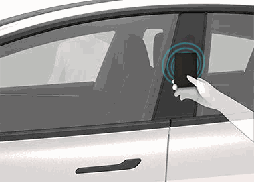

上车后,请在扫描卡片钥匙后的 2 分钟内踩下制动踏板以启动Model 3(请参阅启动和关闭电源 页码 55)。如果超过 2 分钟后无操作,则必须将卡片钥匙放置在中控台无线手机充电器的读卡器附近进行再次认证。检测到卡片钥匙后,两分钟的认证时间将重新开始计算。

#### **钥匙类型**

Model 3 支持以下类型的钥匙:

• 手机钥匙 - 您可以将个人手机设置为“手机钥匙”,以便使用蓝牙与 Model 3 通信。手机钥匙支持自动锁定和解锁功能。

• 卡片钥匙 - Tesla 提供了两种可通过短距离射频识别 (RFID) 信号与 Model 3 进行通信的卡片钥匙。与手机钥匙和遥控钥匙不同,卡片钥匙不支持自动锁定和解锁。如手机钥匙电量耗尽、丢失或被盗,可使用卡片钥匙解锁、驾驶和锁定 Model3。

• 遥控钥匙 - 可通过按下遥控钥匙(如果配备)上的按钮来打开前后行李箱,以及解锁、锁定和驾驶 Model 3。遥控钥匙也支持自动锁定和解锁(如您所在地区有售;请参阅离车后自动上锁 页码 7),可将其用作手机钥匙的备用钥匙。

Model 3 总共支持 19 把钥匙,包括手机钥匙、卡片钥匙以及最多 4 把遥控钥匙(请参阅管理钥匙 页码 4)。

**警告: 驾车时,请务必随身携带车钥匙。尽管钥匙不在身**

边仍可驾驶 Model 3,但电源关闭后,车辆将无法重新启动。

#### **手机钥匙**

**警告: 请勿将配对的手机留在车内(例如徒步旅行或在海**

滩停留时)。如果必须将手机留在车内,请禁用蓝牙和/或关闭手机。

将手机用作钥匙可以方便地进入 Model 3。在您靠近车辆时,车辆会探测到手机蓝牙信号,并且拉动车门把手时车门会解锁。同样,携带手机钥匙下车离开后,车门会自动锁闭(假定已开启离**车后自动上锁功能;请参阅离车后自动上锁 页码 7)。**

手机认证成功后,便不再需要互联网连接即可用作 Model 3 的手机钥匙。但是,要免提使用手机、访问手机的联系人、从手机播放媒体等,还必须对手机进行配对并将其连接为蓝牙设备(请参阅蓝牙 页码 50)。Model 3 会在蓝牙感应范围内时检测到手机,但无法确定手机是位于车内、车外还是远处(例如在前备箱中或藏在包里)。切勿将智能手机留在前备箱内。

**注: 也可以将 Apple 手表设置为钥匙。**

可以使用一些具有 NFC 功能的智能手机来锁定/解锁车辆,使用方法与使用钥匙卡类似。确保 Tesla 手机应用程序已与车辆正确配对,并在手机上启用 NFC 功能。启用后,只需将手机置于驾驶侧门柱上即可锁定或解锁车门。有关如何执行该操作的具体信息,请参阅智能手机的操作说明。

请注意,默认情况下手机钥匙为“主”钥匙,车辆会使用蓝牙检测手机与车辆的接近程度。车辆无法检测手机位于 Model 3 内部还是外部。如果在蓝牙启用的情况下将已配对的手机留在车内,则基本相当于在车门解锁的情况下将钥匙留在车内,即使在手机

应用程序上按下锁定图标也是如此。因此,如果您将已配对的手机钥匙锁在车内,车辆可能不安全,因为检测到手机钥匙后,车门外把手会被拉动,导致 Model 3 解锁车门。

**打开和关闭 3**

### **钥匙**

**注: 启用后,只有在携带手机钥匙或遥控钥匙离开车辆时,**

“离车后自动上锁”功能(请参阅离车后自动上锁 页码 7)才起作用。如果您携带卡片钥匙离开车辆,Model 3 不会自动解锁/锁定。

**注: 即使您随身携带了配对的手机钥匙,也不要将卡片钥匙留**

在车内。

#### **遥控钥匙**

如果已购买遥控钥匙配件,可将其想象为迷你版 Model 3,带有Tesla 徽标的一侧为车头。钥匙有三个按钮,手感较为柔软。

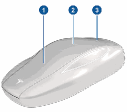

1 . 前备箱 - 按两下可解锁前备箱。

2 . 全部锁定/解锁 - 按一下可锁定车门和行李箱(所有车门和行李箱都必须关闭)。按两下可解锁车门和前后备箱。

3 . 后备箱 - 按两下可解锁后备箱。长按 1-2 秒可打开充电接口盖板。

进入车内后,在按下遥控钥匙上的解锁按钮后 2 分钟内踩下制动踏板,即可启动 Model 3(请参阅启动和关闭电源 页码 55)。

如果 2 分钟内未操作,则必须再次按下解锁按钮,或者将遥控钥匙放在中控台上无线手机充电器中的读卡器附近。检测到遥控钥匙后,两分钟认证时间将重新开始计算。

携带遥控钥匙靠近或离开 Model 3 时,点按按钮时无需将遥控钥匙对准 Model 3,但必须处于有效操控范围内。

类似频率的无线电设备会影响钥匙。此时,请将此钥匙远离其他电子设备(手机、笔记本电脑等)至少 30 厘米。

如果遥控钥匙电池电量耗尽,您仍可通过在驾驶侧车门柱的读卡器上扫描该遥控钥匙来使用它驾驶车辆(与卡片钥匙一样)。

有关电池更换说明,请参阅更换遥控钥匙电池 页码 6。

**注: 同一把遥控钥匙可控制多辆 Model 3,但需事先进行授权**

(请参阅管理钥匙 页码 4)。不过,遥控钥匙每次只能用于一辆 Model 3。因此,如需将遥控钥匙用于其他 Model 3,请将钥匙的平滑侧贴在驾驶侧车门柱上。

**警告: 请保管好钥匙,防止因撞击、高温和液体腐蚀导致**

损坏。避免接触溶剂、蜡和研磨性清洁剂。

##### **被动锁定和解锁**

使用遥控钥匙锁定和解锁 Model 3,无需动手、方便快捷。尽管您必须携带配对的遥控钥匙,但并不需要使用它。 Model 3 车身上有传感器,能够在大约 2 米范围内确认是否存在遥控钥匙。因此,您可以将遥控钥匙放在口袋或钱包中,这样,只需拉动车门把手即可解锁车辆。此外,如果您随身携带遥控钥匙,则可以通过按下 后备箱 的车门外把手来打开行李箱,而无需使用钥匙。

如果启用了离车后自动上锁,则在您下车后,如果遥控钥匙不再位于感应范围内,Model 3 将自动锁定(请参阅离车后自动上锁页码 7)。将遥控钥匙与 Model 3 配对后,被动锁定和解锁功能将自动启用。

**注: 为提升安全性,当车辆处于未使用状态时,如果您处于静**

止状态超过 5 分钟,而您位于车辆感应范围内(例如站在车外),被动锁定和解锁功能将禁用。在这种情况下,必须晃动遥控钥匙或按下遥控钥匙上的按钮才能重新启用被动锁定和解锁功能。

#### **管理钥匙**

要显示可以访问您的 Model 3 的所有钥匙的列表,请点击控制 >**车锁。每把钥匙旁边的图标指示该钥匙是手机钥匙、卡片钥匙还**

是遥控钥匙。请使用该列表来管理可访问 Model 3 的钥匙。

Model 3 一次最多支持 19 把钥匙,其中的 4 把可以是遥控钥匙。达到此上限后,必须先删除已有钥匙才能增加新钥匙。

可将一把卡片钥匙或遥控钥匙与多台 Tesla 车辆配对。这样在切换车辆时可避免处理多把钥匙的繁琐。卡片钥匙和遥控钥匙一次可与多台车辆配对和使用。与车辆配对后,您便可进入并驾驶相应车辆。

**4 MODEL 3 车主手册**

##### **从触摸屏添加钥匙**

如果您拥有已与车辆配对的卡片钥匙或遥控钥匙,则可以使用触摸屏进行新钥匙配对。

1 . 在触摸屏上,点击控制 > 车锁 > 钥匙 > 添加钥匙。

2 . 在任一无线手机充电器的读卡器上扫描新卡片钥匙或遥控钥匙。当您听到蜂鸣声时,表明系统已识别出新卡片钥匙。

**注: 添加遥控钥匙时,应确保钥匙处于室温状态。如果遥控**

钥匙温度过低,配对可能会失败。

3 . 扫描已经与车辆配对的卡片钥匙或遥控钥匙,以确认新钥匙配对情况。

4 . 完成后,钥匙列表中会包含此新钥匙。点击相关铅笔图标可自定义钥匙的名称。

##### **从手机应用程序添加钥匙**

如果您是车主,您可以使用 Tesla 手机应用程序进行新钥匙配对。如果您没有可正常工作的卡片钥匙或遥控钥匙,从 Tesla 手机应用程序添加钥匙可能会很有用。

**注: 在装有 2022.40 或更高版本软件的车辆上, 4.29.0 版 Tesla**

手机应用程序支持使用手机应用程序进行钥匙配对。

1 . 位于车内或车辆附近时,在智能手机上打开 Tesla 手机应用程序。

2 . 在手机应用程序中,点击安全与驾驶员,然后点击添加钥匙**卡。**

3 . 在任一无线手机充电器的读卡器上扫描新卡片钥匙或遥控钥匙。

**注: 添加遥控钥匙时,应确保钥匙处于室温状态。如果遥控**

钥匙温度过低,配对可能会失败。

4 . 成功将钥匙配对后,手机应用程序将显示一条确认消息。在手机应用程序中点击完成,然后从读卡器中取下卡片钥匙或遥控钥匙。

完成后,车辆触摸屏上的钥匙列表将显示此新钥匙。点击相关铅笔图标可自定义钥匙的名称。

##### **删除钥匙**

如果不想让某个钥匙再操控 Model 3(例如,发生手机或卡片钥匙丢失等情况),请执行以下步骤将其移除。

1 . 在触摸屏上,点击控制 > 车锁。

2 . 在钥匙列表中,找到要删除的钥匙,然后点击相应的垃圾桶图标。

3 . 按照提示在读卡器上扫描已认证的钥匙,以确认删除。完成后,钥匙列表不再包括已删除的钥匙。

**注: Model 3 要求至少有一个认证卡片钥匙或遥控钥匙。如果钥**

匙列表中只有一把卡片钥匙,则无法将其删除。

### **钥匙**

**注: 将遥控钥匙与车辆配对后,可以使用这把遥控钥匙被动式**

进入车辆,还可以远程解锁车门、打开后备箱和前备箱。如果将遥控钥匙与多台 Tesla 车辆配对,一次只能被动式进入一台车辆以及执行远程解锁和打开操作。通过将遥控钥匙的扁平侧贴在驾驶侧车门柱读卡器上,选择要被动式进入或者远程解锁或打开的车辆。

**注: 如果在其中一台车辆上通过点击铅笔图标自定义配对卡片**

钥匙或遥控钥匙的名称,则已认证该卡片钥匙或遥控钥匙的任何其他车辆也将显示此更改后的名称。

**注: 如果您正在租赁车辆,请联系您的租赁公司来添加或移除**

钥匙。

##### **添加手机钥匙**

将手机添加为手机钥匙后,可以使用手机进入 Model 3。开始配对手机钥匙前,请确保:

• 手机的通用蓝牙设置已启用。

• 已在手机设置中为 Tesla 手机应用程序启用了蓝牙。例如,在您的手机上,导航到“设置”,选择 Tesla 手机应用程序,确保蓝牙设置已开启。

• 已启用位置访问权限。在手机的设置中打开 Tesla 手机应用程序,然后选择 位置 > 总是。为获得最佳体验,请保持此手机应用程序在后台运行。

• 在车辆触摸屏上启用“允许手机访问”(控制 > 安全 > 允许**手机访问)。**

**注: Model 3 利用蓝牙与手机通信。许多手机会在电量不足时禁**

用蓝牙。设置手机钥匙前,请确保您手机的电池电量足以支持使用蓝牙。

添加手机钥匙:

1 . 将 Tesla 手机应用程序下载到手机上。

2 . 用 Tesla 账户用户名和密码登录 Tesla 手机应用程序。

**注: 必须保持已登录 Tesla 账户的状态才能使用手机进入**

Model 3。

**注: 许多用于访问车辆的便捷功能(例如自动开启后备箱)**

仅能在手机应用程序中当前选择的车辆上使用。如果您的Tesla 账户关联有多辆车,您必须确保要使用这些便捷功能的车辆当前已在手机应用程序上被选中。

3 . 位于车内或车辆附近时,打开 Tesla 手机应用程序并在主屏幕上点击设置手机钥匙,或导航到安全 > 设置手机钥匙。

您也可以将 Apple 手表用作钥匙。位于车内或车辆附近时,在 Apple 手表上打开 Tesla 手机应用程序,然后点击设置手**表钥匙(请参阅适用于 Apple 手表的手机应用程序 页码**

47)。

4 . 按照手机应用程序和车辆触摸屏上的提示操作,设置手机钥匙。

Model 3 可以同时连接三个手机钥匙。因此,如果检测到三个以上的手机钥匙,而您希望认证或配对另一个手机,可将其他已连接的手机钥匙移出感应范围或关闭其蓝牙设置。

**打开和关闭 5**

### **钥匙**

#### **更换遥控钥匙电池**

在正常使用情况下,根据遥控钥匙的版本和所选车辆设置,遥控钥匙配件的电池寿命可长达 1 年。电池电量较低时,触摸屏上会显示一条消息。

更换遥控钥匙电池:

1 . 将遥控钥匙放在柔软表面上(按钮的一面朝下),用小号扁刃工具撬开底盖。

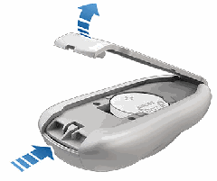

2 . 将电池提离固定夹可取下电池。

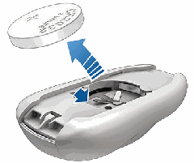

3 . 插入新电池(CR2032 型),“+”面朝上,请勿接触电池平面。

**注: 安装前将电池擦干净,避免接触电池的平面。电池平面**

上留下指纹会缩短电池使用寿命。

**注: 可在任意电池零售点购买 CR2032 电池。**

4 . 以一定角度拿着底盖,将底盖上的突耳与相应钥匙槽对齐,然后用力将盖子按压到钥匙上,直至卡入到位。

5 . 通过解锁和锁定 Model 3 来检测遥控钥匙是否工作。

**警告: 遥控钥匙电池存在化学灼伤危险,不应吞食。遥控**

钥匙包含纽扣电池。如果吞下纽扣电池,可能会在两小时内造成严重体内灼伤,并可能导致死亡。将新的和使用过的电池放在远离儿童的地方。如果电池盒无法安全关闭,请停止使用该产品并将其放在远离儿童的地方。如果您认为电池可能已被吞下或进入身体的任何部位,请立即就医。

#### **替换卡片钥匙和遥控钥匙**

如果丢失了卡片钥匙或遥控钥匙,可在 Tesla 商店购买替换钥匙。做好配对准备后,只需按照 管理钥匙 页码 4 中的步骤操作。出于安全原因,请务必从控制 > 车锁 > 钥匙中删除旧卡片钥匙。

**6 MODEL 3 车主手册**

### **车门**

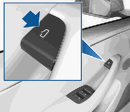

**注: 为防止儿童打开后车门,请开启儿童锁(请参阅儿童锁 页**

码 8)。

**注: 在 Model 3 没有 低压 电源的情况下,您无法使用车门把手**

顶部的按钮打开车门。请参阅在没电的情况下打开车门 页码 185了解更多信息。

#### **内部锁定和解锁**

坐在 Model 3 车内时,点击触摸屏上中的锁定图标,即可锁定和解锁所有车门和行李箱。

图标将发生变化,以指示车门是锁定还是解锁。

如果您已将手机作为钥匙启用,车辆将无法识别您的手机位于车内还是车外。如果要在 Model 3 内锁定车门,以使车门无法从车外打开,请关闭车门并使用触摸屏上的锁定图标。此操作会暂时忽略所有手机锁定设置,例如离车后自动上锁。否则,由于您的手机已作为钥匙启用,即使您按下手机应用程序上的锁定图标,拉动车门外把手时车门也会解锁。如果从车内打开车门,只要检测到手机钥匙,就可以再次从车外打开车门。(请参阅手机钥匙页码 3了解更多信息)。

#### **离车后自动上锁**

带着手机钥匙或配对的遥控钥匙离开时,车门和行李箱可以自动锁定(如果订购日期是在大约 2019 年 10 月 1 日之后)。要打开或关闭此功能,可点击控制 > 车锁 > 离车后自动上锁。

**注: 如果已将 Apple 手表认证为钥匙,也可以将该手表用于离**

车后自动上锁功能。

车门锁闭时,外部车灯闪烁一次,后视镜折叠(如果折叠后视镜开启)。要在 Model 3 锁定时听到提示音,可点击控制 > 车锁 >**锁定提示音。**

**注: 点击玩具箱 > 个性喇叭 > 锁定声音,自定义从外部锁车时**

的锁定声音(需要配备行人警示系统)。

#### **使用车门外把手**

用大拇指推门把手的较宽部分。把手向用户转动,拉动把手或拉车门边缘可打开车门。

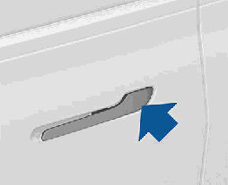

把手会自动缩回。

某个车门或行李箱打开时,触摸屏会显示车门开启指示灯。

**注: 请参阅寒冷天气最佳实践 页码 122,确保车门把手在寒冷**

天气下可以正常工作。

**警告: 使用车门把手时一定要注意,谨防手指、首饰、亚**

克力指甲等被车门或车门把手机构夹住。否则,可能会造成损坏或伤害。

**警告: 猛烈或强行关闭(包括车门、后备箱或前备箱)可**

能会导致不在保修范围内的损坏。

#### **从车内打开车门**

Model 3 标配电动车门。要从车内打开车门,可按下位于车门内把手顶部的按钮,同时将车门推开。

**打开和关闭 7**

Model 3 在以下情况时不会自动锁定:

• 您选中住宅除外复选框,并且 Model 3 停驻在您指定为住宅的地点。有关如何将某一地点指定为住宅的详细信息,请参阅住宅、公司和收藏夹目的地 页码 128。

• 在 Model 3 中探测到手机钥匙或配对遥控钥匙。

• 某个车门或行李箱未完全关闭。

• 手机钥匙的蓝牙设置已关闭。

• 如果 Model 3 在您下车并关上所有车门后几分钟内探测到经认证的钥匙,离车后自动上锁功能便会失效,当您离车时车门不会上锁。在这种情况下,您必须手动锁定车辆,直至下次驾驶。

• 驾驶员不使用驾驶位车门下车。

**注: 即使启用了“离车后自动上锁”,确保车辆锁定的最终责**

任在您。

#### **行车落锁**

Model 3 行驶速度超过 8 km/h 时自动锁闭全部车门(包括行李箱)。

#### **驾驶位车门解锁模式**

如果启用控制 > 车锁 > 驾驶位车门解锁模式,则在首次解锁Model 3 时仅会解锁驾驶位车门。仅当钥匙位于车辆驾驶位一侧而非副驾位一侧时,驾驶位车门才会解锁。要解锁其余车门,请长按驾驶座车门内把手顶部的按钮,使用触摸屏、手机应用程序或再次按下遥控钥匙。

#### **锁车提醒**

要在车门、行李箱和/或车窗未关闭或 Model 3 意外解锁的情况下收到手机通知,请点击控制 > 车锁 > 锁车提醒。

#### **儿童锁**

Model 3 后车门设有儿童锁,可防止儿童通过内部释放按钮打开车门。在触摸屏上,点击控制 > 车锁 > 儿童锁。可以选择同时以同时启用两个后车门上的儿童锁;也可以选择左或右只启用其中一个后车门上的儿童锁。

**警告: 建议在后排座椅有儿童就坐时启用儿童锁。**

#### **驻车时解锁**

停下 Model 3 并换入驻车挡时,可以选择解锁全部车门。要打开或关闭此功能,可点击控制 > 车锁 > 驻车时解锁。

### **车门**

**8 MODEL 3 车主手册**

#### **锁定后车窗**

为防止乘客使用后车窗开关,请点击控制 > 车锁 > 车窗锁定。要解锁后车窗,可再次点击车窗锁。

**警告: 有儿童坐在后排座椅时,为确保安全,建议锁定后**

车窗开关。

**警告: 切勿将儿童独自留在 Model 3 车内。**

#### **校准车窗**

倘若车窗工作异常(触碰亮条,无法正确打开或关闭,车门打开时车窗降速缓慢等情况),可通过车窗校准解决问题。

校准车窗:

1 . 关闭受影响车窗的车门。

2 . 坐在驾驶座上,关闭驾驶位车门。

3 . 使用驾驶位车门上的车窗开关升起受影响的车窗,直到完全停住。

4 . 使用驾驶位车门上的车窗开关降下受影响的车窗,直到完全停住。

5 . 重复第 3 步并升起受影响的车窗,直到完全停住。

此时,车窗校准完毕。如果多次尝试校准程序后问题仍存在,请联系 Tesla。

#### **紫外线指数等级**

Model 3 的车顶、挡风玻璃和车窗可以很好地保护您免受 UV(紫外线)的伤害。玻璃组件的紫外线指数评分低于 2。查看您所在地区的紫外线指数规格以获取更多信息。您仍有责任采取必要的防晒措施。

### **车窗**

#### **打开和关闭**

**注: 您有责任确保在锁闭车辆后车窗已关闭。**

按下开关即可降下相应的车窗。车窗开关分两级操作:

• 要完全降下车窗,将开关按到底并立即松开。

• 如欲适当降下部分车窗,请轻按开关,然后在车窗下降到所需位置时松开开关。

**注: 如果某车窗已完全降下,而此时您打开相关车门,该车窗**

会略微升高一点。同样,如果您要在车门已打开的情况下完全降下车窗,该车窗会在略高于车门边缘的位置停住。要在车门打开的情况下完全降下车窗,请再次按下开关。

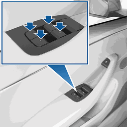

同理,向上扳动开关,可升起对应车窗:

• 如欲完全升起车窗,请将开关上拉到顶后随即松开。

• 如欲适当升起部分车窗,请轻拉开关,然后在车窗上升到所需位置时松开开关。

如无意间忘记关闭车窗,Model 3 可能会向手机应用程序发送一条通知(点击控制 > 车锁 > 锁车提醒,然后选择车门和车窗)。

您也可以通过点击控制 > 车锁 > 锁车时关闭车窗来启用锁车时关**闭车窗。启用后,当 Model 3 锁闭时,您的车辆会自动关闭车**

窗。

**注: 如需了解为应对寒冷天气而需要执行的车窗准备工作,请**

参阅寒冷天气最佳实践 页码 122。

**警告: 为避免损坏,当您打开或关闭车门时,车窗会自动**

略微降下一些。如果在车门打开时手动升起车窗,请确保关闭车门之前车窗略微降下。

**警告: 关闭车窗前,驾驶员须确保所有乘客(尤其儿童)**

未将身体任何部位探出窗外。否则,可能会导致严重伤害。

**打开和关闭 9**

### **后备箱**

#### **打开**

要打开后备箱,请确保 Model 3 处于驻车挡,然后按以下方法之一操作:

• 将手机钥匙放在前口袋中,靠近后备箱(请参阅自动开启后备箱 页码 10)。

• 在触摸屏上点击相应的打开按钮。

• 按两下遥控钥匙上的后备箱按钮。

• 在手机应用程序上点击后备箱按钮。

• 按下 后备箱 外侧把手下方的开关(必须探测到有效的车钥匙)。

**警告: 在封闭区域(例如车库)中打开 后备箱 前,请务**

必正确调节 后备箱 的打开高度,以避开低矮屋顶或物体(请参阅调节电动行李箱盖的开启高度 页码 10)。

Model 3 必须先解锁或检测到车钥匙才能使用此开关打开 后备箱。

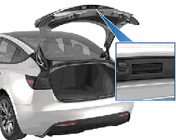

某个车门或行李箱打开时,触摸屏会显示车门开启指示灯。触摸屏上的 Model 3 图像也会显示处于开启状态的行李箱。

**警告: 猛烈或强行关闭(包括车门、后备箱或前备箱)可**

能会导致不在保修范围内的损坏。

要在 Model 3 电量耗尽时(这种情况很少发生)从车辆内部打开后备箱,请参阅行李箱内部紧急开启 页码 11。

#### **自动开启后备箱**

无需按下开关即可打开后备箱。

**注: 需要具有超宽带 (UWB) 支持以及 Tesla 手机应用程序**

4.29.5 或更高版本(对于 iOS)或 Tesla 手机应用程序 4.41.0 或更高版本(对于 Android)的 iOS 或 Android 设备。请参阅 iOS或 Android 设备制造商网站上的规格部分,查看手机是否具有后台 UWB 支持。

确保您的手机设置允许 Tesla 手机应用程序使用“附近互动”。

如果您的手机钥匙已配对,则打开 Tesla 手机应用程序,转到手**机钥匙 > 升级。**

1 . 若要启用,请点击控制 > 车锁 > 自动开启后备箱。选择住宅**除外可在您设定的住宅位置禁用自动开启后备箱(要设定您**

的住宅位置,请参阅住宅、公司和收藏夹目的地 页码128)。

2 . 将手机钥匙放在前口袋中,靠近后备箱并站稳。检测到您的手机钥匙后,Model 3 将在发出蜂鸣声后打开后备箱。要取消该请求,请离开车辆。

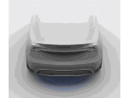

**警告: 行李箱可能会自行打开,因此请勿将手机留在其**

中。如果必须将手机留在车内,请禁用蓝牙和/或关闭手机,并确保可以通过其他方式锁定/解锁车辆,请参阅钥匙 页码 3。

**警告: 在允许自动功能打开后备箱(非手动操作)之前,**

请务必检查确认后备箱周围无障碍物(例如人员和物品)。随时查看行李箱移动路径,确保不会碰撞到人员或物品。否则,可能会造成损坏或严重伤害。

#### **调节电动行李箱盖的开启高度**

可调节电动行李箱盖(如果配备)的开启高度,便于维修处理,也可避免触碰到低矮屋顶或物品(例如车库门或照明灯):

1 . 打开行李箱盖,然后手动将其降低或升高至所需的开启高度。

2 . 长按行李箱盖下方的按钮三秒钟,直至听到确认蜂鸣音。

**10 MODEL 3 车主手册**

### **后备箱**

#### **后备箱负载极限**

将货物重量尽可能均匀地分摊到前后备箱中。

**警告: 后备箱下箱的载重量不得超过 40 千克,上箱(在**

下箱盖板的上方)的载重量不得超过 90 千克。否则可能会造成损坏。

**警告: 装载货物时,请务必考虑车辆的 技术上允许的最**

大载重量 (TPMLM)(请参阅规格 页码 164)。TPMLM 是指车辆的最大允许总质量,包括所有乘客、液体和货物。

#### **行李箱内部紧急开启**

Model 3 没电时,还可利用后备箱内侧亮起的机械解锁装置从内部打开后备箱。此机械解锁装置还可使锁在里面的人出来。

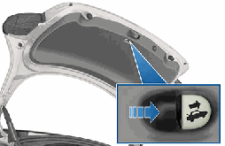

1 . 按照箭头的方向用力长按亮起的按钮以释放闩锁。

2 . 按下按钮的同时,掀开后备箱。

**注: 在短暂暴露在环境光线下时,按钮会散发微光数小时。**

**警告: 不让儿童在行李箱中玩耍,也不将儿童反锁在行李**

箱中。儿童不系安全带,如遇事故,可能遭受严重伤害或死亡。如果儿童受困车内,尤其是在温度控制关闭的情况下,容易发生中暑虚脱或死亡。

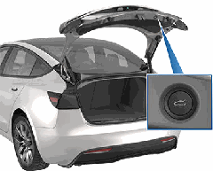

3 . 通过关闭电动行李箱,然后重新打开来确认已设置为所需高度。

**警告: 根据配置(例如车轮选择),车辆后备箱最多可以**

打开大约 2 米。调节后备箱高度,防止其触碰低矮屋顶或其他物体。

#### **关闭**

• 在触摸屏上点击相应的关闭按钮。

• 按两下遥控钥匙上的后备箱按钮。

• 按下方的开关 后备箱

**警告: 驾驶前,请小心地向上提行李箱的底部边缘并确认**

提不动,从而确保行李箱已安全地锁入完全关闭位置。

#### **打开载货区**

要打开后备箱中的载货区,请将载货盖向上拉。然后,您可以向前折叠载货盖或将其从 Model 3 上拆下。

移动 Model 3 前应固定好所有货物,并将重物置于下部行李箱内。

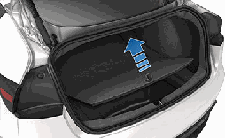

**储物区域 11**

### **前备箱**

#### **打开**

要打开前备箱,请确保 Model 3 处于驻车挡,然后按以下方法之一操作,并拉开前备箱盖:

• 点击触摸屏上的相关打开图标。

• 按两下遥控钥匙上的前备箱按钮。

• 在手机应用程序上点击前备箱按钮。

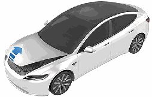

某个车门或行李箱打开时,触摸屏会显示车门开启指示灯。触摸屏上的 Model 3 图像也会显示处于开启状态的前备箱。

**警告: 打开或关闭前备箱盖前,检查前备箱盖周围无障碍**

物(人员和物品)至关重要。否则,可能会造成损坏或严重伤害。

#### **关闭**

Model 3 前备箱盖无法依靠本身的重量落锁,而且在前备箱盖的前缘或中央施加压力会导致损坏。

正确关闭前备箱盖:

1 . 降低前备箱盖,直至撞销接触到闩锁。

2 . 将双手放于前备箱盖的前侧(下图绿色所示),然后牢牢按下,锁定门闩。

3 . 小心地提升前备箱盖前部边缘,确保其已完全闭合。

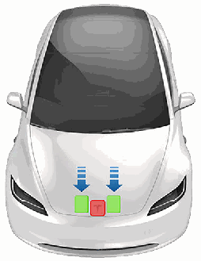

**警告: 切勿将认证的智能手机留在前备箱内。**

**警告: 防止损坏:**

• 仅向图示的绿色区域施加压力。向红色区域施加压力会造成损坏。

• 请勿单手关闭前备箱盖。这样会使作用力集中在一个区域,并可能造成凹陷或弯折。

• 请勿按压前备箱盖前部边缘。这样做可能会造成边缘弯折。

• 请勿猛力关闭前备箱盖或让其自由落下。

• 为避免剐蹭,手中勿携带任何物品(车钥匙)。珠宝首饰也会造成剐蹭。

**警告: 驾驶前,您必须小心地试着向上提前备箱盖的前部**

边缘并确认提不动,从而确保前备箱盖已安全地锁入完全关闭位置。驾驶员有责任确保在驾驶前已正确关闭前备箱。

如果在尝试换出驻车挡时前备箱未关闭,触摸屏上会显示一则通知,要求您确认驾驶意图。如果您选择在驾驶过程中让前备箱保持打开状态,则车速会受到限制。

当出现以下情况时,前备箱将锁定:

• 您使用触摸屏、钥匙或手机应用程序锁定 Model 3。

• 您携带钥匙离开 Model 3(如果 离车后自动上锁 页码 7 处于开启状态)。

• 代客模式处于激活状态(请参阅代客模式 页码 79)。

**12 MODEL 3 车主手册**

### **前备箱**

#### **装载限制**

装载货物时,应将货物重量尽可能地分布在前备箱和后备箱之间,并始终考虑车辆的技术上允许的最大载重量 (TPMLM)(请参阅规格 页码 164)。TPMLM 是指车辆的最大允许总质量,包括所有乘客、液体和货物。

**警告: 前备箱中的负载不要超过 50 kg。否则可能会造成**

损坏。

#### **内部紧急开启**

前备箱内侧亮起的内开按钮可使锁在里面的人出来。

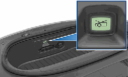

按内开按钮打开前备箱,然后,向上托起前备箱盖。

**注: 短暂接触外界光线后,内部释放按钮会变亮。**

**警告: 人员不得爬入前备箱。如果有人在前备箱中,切勿**

将其关闭。

**警告: 请小心谨慎,务必确保前备箱内的物体不会撞到该**

释放按钮,从而导致前备箱盖意外打开。

**储物区域 13**

### **车内储物**

#### **中控台**

除了读取卡片钥匙的 RFID 收发器(请参阅钥匙 页码 3)之外,中控台还包括杯托、两个储物盒、各种充电器(请参阅车内电子设备 页码 39)和后触摸屏。

要打开主储物盒,请挤压前唇部下方的闩锁。将前部储物盒盖向前滑动可打开此储物盒。

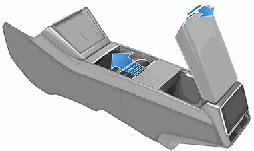

**警告: 打开中控台时,手和手指一定要远离开口边缘和铰**

链。将手和手指放在开口或铰链附近可能会导致受伤。

#### **后中控台**

Model 3 第二排座椅靠背中央装配后部一体化中控台。向下拉控制台以使用后部杯托或将其用作扶手。

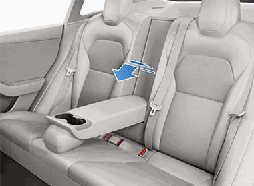

**注: 后控制台在某些情况下会自动锁定,无法降下。例如,在**

陡坡上行驶或猛烈加速时。

#### **手套箱**

要打开手套箱,请点击控制 > 手套箱

。手套箱会自动打开,同时亮起照明灯。

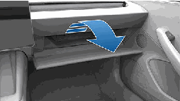

如需关闭手套箱,请向上推动,直至锁止在关闭位置。

为提升手套箱安全性,可点击

**控制 > 安全 > 手套箱 PIN 码以设置**

4 位密码(请参阅手套箱 PIN 码 页码 111)。

**注: 如果让手套箱保持开启,其照明灯最终会自动熄灭。**

**注: 只要手套箱处于闭合状态,则在您使用手机应用程序、卡**

片钥匙锁闭 Model 3、携带手机钥匙离开 Model 3(如已开启离车后自动上锁)或代客模式处于活动状态(请参阅代客模式 页码 79)时,手套箱便会锁闭。但在触摸屏上点击车锁图标锁闭Model 3 时,则不会锁闭手套箱。

**警告: 行车时,请保持手套箱闭合,以防在发生碰撞或急**

刹车时对乘客造成伤害。

#### **车内衣挂**

Model 3 第二排座椅两侧后车窗上方各有一个车内衣挂。推动车内衣挂即可将其弹出。再次推动可将其收回。

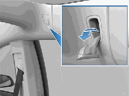

**14 MODEL 3 车主手册**

### **前排和后排座椅**

**警告: 驾驶过程中,切勿调整座椅。否则会增加事故风**

险。

**警告: 行驶中椅背过度倾斜可能在发生碰撞时导致严重伤**

害,因为此时身体非常容易滑到安全带下面,或被安全带紧紧勒住。确保车辆行驶时座椅靠背倾斜不得超过 3 0度。

##### **校准座椅**

您可以校准驾驶位座椅。如果您发现座椅移动范围受限或驾驶员设定无法自动为您调节座椅,此功能很有用。导航至控制 > 服务> 驾驶位座椅、方向盘和后视镜校准,然后按照触摸屏上的说明操作。

**警告: 校准期间,确保驾驶位座椅后方和下方没有任何物**

体。否则,可能会造成严重伤害。

#### **正确的驾驶位置**

为最大程度保护您的安全,座椅、头枕、座椅安全带和气囊需一起使用。正确使用这些安全设备,可以确保更好的保护。

调节座椅位置,以便在尽可能远离前气囊的同时正确地佩戴座椅安全带:

1 . 端正坐好,双脚放在地板上,座椅靠背处于直立位置。

2 . 确保可以轻松地踩到踏板,握方向盘时手臂略微弯曲。胸部与气囊罩壳的中心应保持至少 25 厘米的距离。

3 . 把座椅安全带中间部分放置在颈部和肩部之间。把安全带的搭接部分紧紧地绕过髋关节(而非腹部)。

Model 3 座椅配有不可调节或拆除的集成式头枕。

#### **折叠后排座椅**

Model 3 有一个拆分式后排座椅,可以向前折起。

**注: 在后排座椅向前折叠的情况下驾驶可能更明显地感受到来**

自车辆后部(行李箱、悬架等)的噪音和/或振动。

**座椅和安全约束系统 15**

#### **调节前排座椅**

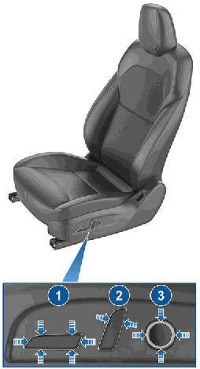

1 . 向前/向后移动座椅,并向上/向下调节座椅高度和倾斜角

度。

2 . 调整靠背。

3 . 调整腰部支撑。

要使用触摸屏调整副驾位座椅,请点击控制 > 座椅并使用副驾位

座椅视觉画面旁边的箭头将座椅向前或向后移动。

**警告: 当前排座椅位于最前端时,不要将该座椅的靠背也**

移至最前端。这样做可能导致座椅的顶部撞到遮阳板,进

而损坏遮阳板。

**警告: 调节前排座椅前,请确保座椅周围区域不存在任何**

障碍物(人员和物体)。

### **前排和后排座椅**

**警告: 在将座椅完全向下折叠之前,请确保座椅安全带未**

扣上,且座椅上没有任何物体。

折起之前,须清除座椅及后座脚部空间的物品。为了让后排座椅靠背完全平整折起,可能需要将前排座椅向前移。

要折起后排座椅,拉动相应的控制杆并把座椅向前折起。

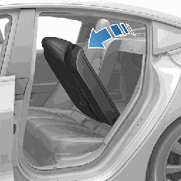

**警告: 不要为了存放或放置物品而拆下后排座椅。这样做**

会暴露低压和高压连接,从而可能导致车辆损坏或严重伤害。

#### **抬起后排座椅**

在抬起后排座椅之前,务必确保座椅安全带没有卡在靠背后面。

把座椅靠背向上拉,直至其锁定到位。

尝试向前拉,确认座椅靠背锁止在直立位置。

**警告: 务必前后推动座椅靠背,确保其锁定在直立位置。**

否则,会增加受伤的风险。

#### **头枕**

前排座椅和第二排座椅配有不可调节的集成式头枕。

#### **座椅加热器**

前排和后排座椅均从 3(最高)到 1(最低)分为三挡。要操作座椅加热器,请参阅操作温度控制 页码 116。

**警告: 为避免长时间使用导致烫伤,患有末梢神经疾病或**

因糖尿病、年龄、神经损伤或其他情况造成疼痛感知能力受限的人士,应小心使用温度控制系统和座椅加热器。

#### **椅罩**

**警告: 请勿在前排座椅上使用座椅套。否则,发生碰撞时**

会限制座椅侧气囊的展开。另外,如果车辆配备了可用来确定副驾位前气囊状态的乘员检测系统,座椅套可能会干扰此系统。

**16 MODEL 3 车主手册**

### **座椅安全带**

4 . 用力拽拉座椅安全带,检查是否系好。

5 . 向卷轴处拉紧座椅安全带,收紧多余松驰的部分。

#### **调整肩部锚固件高度**

Model 3 为每个前排座椅装配了可调式肩部锚固件,以确保座椅安全带位置正确。驾驶姿势正确时,安全带应平坦地贴在锁骨中点(请参阅正确的驾驶位置 页码 15)。如果座椅安全带的位置不正确,请调整肩部锚固件的高度:

1 . 长按肩部锚固件上的按钮释放锁定机制。

2 . 在按住按钮的同时,根据需要向上或向下移动肩部锚固件,将座椅安全带调节至正确位置。

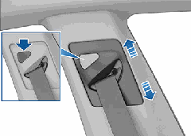

3 . 松开肩部锚固件上的按钮,使其锁定到位。

4 . 在未按下按钮的情况下,拉动安全带织带,并尝试向下移动肩部锚固件,检查是否锁定到位。

**警告: 确保座椅安全带处于正确的位置,并在驾驶前将肩**

部锚固件锁定到位。驾驶座椅安全带位于不正确的位置或肩部锚固件未锁定到位时,可能会在发生碰撞时降低座椅安全带的效果。

#### **松开座椅安全带**

握住带扣旁边的座椅安全带部分,以防座椅安全带缩卷过快,然后按下带扣上的按钮。座椅安全带将自动缩回。确保没有障碍物阻碍座椅安全带缩回。座椅安全带不应松弛下坠。如果座椅安全带无法完全收回,请预约服务。

#### **佩戴座椅安全带**

使用座椅安全带以及儿童安全座椅是发生碰撞时保护车内驾乘人员的最有效方式。因此,法律规定必须佩戴座椅安全带。

所有座椅均配有三点式惯性卷轴式座椅安全带。惯性卷轴安全带会自动收紧,使车内驾乘人员在正常驾驶条件下可以舒适移动。

座椅安全带卷轴会自动拉紧或锁定,以防 Model 3 猛烈加速、制动、转弯或碰撞时,车内驾乘人员受到冲击。

#### **座椅安全带提醒器**

如乘客未系座椅安全带,触摸屏上的安全带提醒器会发出警报。如果所有车内驾乘人员均已系好安全带,但提醒器仍然闪亮,请重新扣紧座椅安全带,以确保安全带正确锁定。此外,还要移除空座椅上的任何重物(如公文包)。如果提醒器灯继续闪亮,请预约服务,并且不要使用座椅,直至问题得到解决。

可以暂时禁用后部座位的座椅安全带提醒器。当乘客带着物品坐在会触发座椅安全带提醒器警报的后排座椅上时,这很有用。要禁用提醒器,可点击座椅安全带提醒器弹出消息上的相关座椅,当座椅安全带提醒器激活时,它会显示在触摸屏上。禁用提醒器后,座椅安全带提醒器图标被一个座椅图标替代(仅对当前驾驶有效)。再次点击座椅图标可重新启用提醒器。

**警告: 当座位有乘客就座时,请勿禁用座椅安全带提醒**

器。

**警告: 任何座位上的成年乘客都必须佩戴座椅安全带。**

**注: 如果所在区域法规要求后排座位上要有座椅安全带提醒**

器,请勿禁用这些提醒器。如果探测到未占用座椅上有物体并发出提醒,要取消此提醒,必须扣紧座椅安全带或取走物体。

#### **扣紧座椅安全带**

1 . 确保座椅位置正确。请参阅(请参阅正确的驾驶位置 页码15)了解有关驾驶位座椅正确位置的详细信息。

2 . 顺利拉出座椅安全带,确保座椅安全带平整绕过整个骨盆、胸部、锁骨中点,保持在颈部和肩部之间。确保座椅安全带走线正确且没有扭曲。切勿坐在座椅安全带或任何安全带部件上。

**警告:**

扭曲或走线不当的座椅安全带可能会造成损坏并干扰座椅安全带系统的功能。

3 . 将插销板插入带扣并按下,直到发出“咔嗒”声,确保锁定到位。

**座椅和安全约束系统 17**

### **座椅安全带**

#### **孕妇佩戴座椅安全带**

切勿将座椅安全带的肩部部分或搭接部分置于腹部。佩戴座椅安全带时,尽量将搭接部分置于髋部下方(而不是腰部)。把座椅安全带的肩部部分置于胸部之间,拉向腹部的一侧。具体指导请向医生咨询。

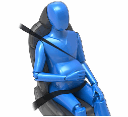

**警告: 如果座椅安全带不舒服,请调整座位,而不是不正**

确地系座椅安全带。

**警告: 切勿为在发生碰撞时减轻冲击而在身体和座椅安全**

带之间放置任何物品。

#### **座椅安全带预紧装置**

前排座椅安全带均配有预紧器;发生碰撞时,预紧器会与气囊协同运作。预紧装置会自动收紧座椅安全带下部锚固件和上肩织带,减少安全带在腿部及对角部分的松弛,从而降低驾乘人员的前倾幅度。

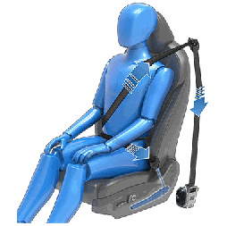

如果预紧器和气囊在碰撞时未激活,并非表示它们出现了故障。

这通常意味着,碰撞的强度或类型未足以激活它们。

后部外侧座椅配备有肩部预紧装置,用于收紧座椅安全带肩带,以降低驾乘人员的前倾幅度。

**警告: 切勿弯折、坐压或阻挡预紧装置总成。这样做可能**

会造成损坏,干扰座椅安全带系统的正常功能。

**警告: 一旦座椅安全带预紧器被激活,必须进行更换。碰**

撞发生后,气囊、座椅安全带预紧器以及其他相关组件必须送检,必要时进行更换。

#### **检测座椅安全带**

要确认座椅安全带工作正常,必须对每条座椅安全带执行以下检查:

1 . 系好座椅安全带,在最接近带扣的位置快速有力地拉出安全带。带扣应保持安全锁定。

2 . 系好座椅安全带后,快速有力地拉动最靠近车门的织带。永久性座椅安全带附件应保持牢固锁定。切勿尝试删除此附件。

3 . 解开座椅安全带,最大限度地卷回织带。查看卷回时是否有障碍物,目测检查织带是否有磨损或损坏情况。允许安全带缩回,检查安全带回缩是否平滑完全。

4 . 半拉出安全带,握住锁舌,迅速向前拉。放卷机制应自动锁定,以防止过度放卷。

如果上述测试中出现座椅安全带故障,应立即维修。切勿让乘客乘坐座椅安全带出现故障的座椅。

有关清洁座椅安全带的信息,请参阅座椅安全带 页码 154。

**18 MODEL 3 车主手册**

### **座椅安全带**

#### **座椅安全带注意事项**

**警告: 任何时候,即使在行程较短时,车内所有乘员仍需**

佩戴座椅安全带。否则,如果发生碰撞,即会增加受伤或死亡风险。

**警告: 请按照车主手册所述,将儿童固定在合适的儿童安**

全座椅上。安装时须始终遵循儿童安全座椅制造商的说明。

**警告: 确保正确佩戴座椅安全带。如果发生碰撞,座椅安**

全带佩戴不当会增加受伤或死亡风险。

**警告: 切勿坐在任何座椅安全带部件上面。此行为可导致**

安全设备损坏或错误放置。

**警告: 切勿将座椅安全带系在衣服上坚硬、易碎或尖锐的**

物件上,如钢笔、钥匙、眼镜等。座椅安全带在这些物件上所产生的压力可能会导致受伤。

**警告: 切勿佩戴织带任一部分出现扭曲的座椅安全带。**

**警告: 各座椅安全带仅供车内一位驾乘人员使用。将座椅**

安全带绕在车内驾乘人员膝上的孩童身上十分危险。

**警告: 曾在碰撞中佩戴过的座椅安全带即使没有明显损**

坏,也必须交由 Tesla 或合格修理厂检查或更换。

**警告: 如果座椅安全带出现磨损、割裂或任何形式的损**

坏,必须立即更换。

**警告: 避免座椅安全带组件受到任何化学品、液体、砂**

砾、污垢或清洁产品的污染。如果座椅安全带无法缩回或锁止在带扣里,必须立即更换。请使用移动应用程序进行服务预约。

**警告: 切勿擅自对安全带进行改装或添加,以免妨碍座椅**

安全带卷回或调整松弛部分。宽松的座椅安全带将严重降低对于乘客的保护。

**警告: 切勿擅自进行改装,以免干扰座椅安全带运作或导**

致座椅安全带无法使用。

**警告: 切勿将自购的便捷式产品固定到座椅安全带。**

**警告: 当不使用座椅安全带时,应将其完全缩回,不得悬**

垂。如果座椅安全带无法完全收回,请预约服务。

**警告: 座椅安全带系统没有用户可自行维修的零件,并可**

能配有烟火装置。切勿拆解、拆卸或更换组件。

**座椅和安全约束系统 19**

### **儿童安全座椅**

#### **副驾位前气囊必须关闭**

**警告: 如果您所在的市场区域允许儿童乘坐副驾位座椅,当副驾位前气囊处于激活状态时,切勿让儿童坐在副驾位座椅上。**

始终确保此气囊处于关闭状态(请参阅气囊状态指示灯 页码 30)。

请参考贴在遮阳板上的以下标签:

当婴儿或儿童坐在副驾位座椅上时(即使儿童坐在合适的儿童约束系统或增高座椅上),必须禁用副驾位前气囊。Tesla 强烈建议您在将儿童座椅放在副驾位座椅上之前先关闭气囊开关。如果发生碰撞,气囊展开可能会导致严重受伤或死亡,尤其是使用后向式儿童约束系统时。

**如何启用/禁用副驾位前气囊**

要禁用副驾位前气囊,请首先确保车辆处于驻车挡。然后点击控制 > 安全 > 副驾位前气囊(请参阅控制副驾位前气囊 页码 30)。

**警告: 禁用副驾位前气囊时,请记住,随后有成人在副驾位座椅上就坐时应予以启用。**

副驾位前气囊的状态会显示在触摸屏的顶角。也可以点击此状态图标来禁用和启用副驾位前气囊:

在副驾位座椅上有儿童座椅的情况下驾驶之前,应反复检查副驾位前气囊的状态,确认气囊处于关闭状态。

为保护坐在副驾位座椅上的成人,请务必重新开启副驾位前气囊。

**警告: 儿童乘坐副驾位座椅时,驾驶员有责任确认副驾位前气囊处于关闭状态。**

**警告: 如果副驾位前气囊在关闭之后仍处于开启状态(反之亦然),请立即联系 Tesla。**

#### **儿童约束系统的合适性和装配**

Model 3 所有座椅安全带都是针对成人设计的。座椅上有婴儿或儿童时,必须:

• 使用适合儿童年龄、体重或体形的儿童约束系统(请参阅根据体重推荐使用的儿童约束系统 页码 20)。

• 使用适合 Model 3 中特定座位的儿童约束系统。Model 3 上的每个乘客座椅都支持多种选择。如需详细了解哪种类型的儿童约束系统可用于每个乘客座椅,请参阅副驾位座椅 页码 22和后排座椅 页码 23。

• 按照生产商的说明,正确安装儿童约束系统(请参阅安装安全带固定式儿童约束系统 页码 24和安装 ISOFIX/i-Size 儿童约束系统 页码 24获取一般指南)。

**注: 安装儿童约束系统时,还必须扣上座椅安全带以停止座椅安全带警告蜂鸣声。**

#### **根据体重推荐使用的儿童约束系统**

Tesla 根据儿童的体重组别(定义见 ECE R44“关于儿童乘员用约束装置的统一规定”),提供了一些推荐使用的儿童约束系统。尽管所有体重组别都可以乘坐 Model 3 上的任何乘客座椅,但各座椅可以使用的儿童约束系统类型会有所不同。例如,后排中间乘客座椅只能使用安全带固定式儿童约束系统。

**20**

**MODEL 3 车主手册**

### **儿童安全座椅**

| 身高* | 体重组别** | 儿童体重 | Tesla 推荐 |
|:---:|:---:|:---:|:---:|
| - | 第 0+ 组 | 最多 13 千克(12 – 18 个月) | Maxi-Cosi CabrioFix 和 Familyfix 3, Cabriofix i-Size Base |
| 45 -105 厘米 | 第 I 组 | 9 – 18 千克 | Globalkids C05310, 天赋 加强版 |
| 100-150 厘米 | 第 II 组 | 15 - 25 千克 | Britax Römer KIDFIX I-Size |
| - | 第 III 组 | 22 - 36 千克 | Britax Römer KIDFIX I-Size |
| * 根据 R129 CRS 制造商的等级 ** 根据 R44 CRS |  |  |  |

#### **大童乘车**

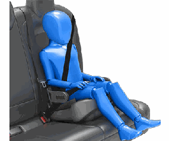

如果儿童因身形过大而无法使用儿童约束系统,但又因太小而无法使用车辆的座椅安全带来安全地固定,可以使用适合其年龄和体形的增高座椅。对于需要加高坐椅的儿童,Tesla 建议使用 Peg Perego Viaggio 2-3 Shuttle 的底座。使用和安装增高座椅时,请认真遵循制造商提供的说明书。

#### **两种安装方法**

**注: 务必遵循儿童约束系统生产商提供的说明安装 ISOFIX/iSize 儿童约束系统。**

在许多其他型号中,根据在座椅上的固定方式,有两种一般类型的儿童约束系统:

• 安全带式 - 用车辆的座椅安全带固定(请参阅安装安全带固定式儿童约束系统 页码 24)。

• ISOFIX/i-Size - 固定到内置于车辆座椅的锚筋上(请参阅安装 ISOFIX/i-Size 儿童约束系统 页码 24)。

部分儿童约束系统可以采用任何一种方式安装。请参考儿童约束系统生产商提供的说明书,确定使用哪种安装方法并了解详细的安装说明。

在 Model 3 上,安全带固定式儿童约束系统可以安装在任一乘客座椅上,ISOFIX/i-Size 系统可以安装在任一后排外侧座椅上。下文提供了可在每个座椅上使用的儿童约束系统类型的具体详细信息。

**注: ISOFIX 和 i-Size 是在乘用车上用来固定儿童安全座椅的集成式锚固件的国际标准。**

**警告: ISOFIX/i-Size 锚固件不能用于采用一体式安全带设计的儿童约束系统或增高座椅,因为此时儿童加上儿童约束系统的**

重量超过 33 千克。

**座椅和安全约束系统 21**

### **儿童安全座椅**

#### **副驾位座椅**

**警告: 当副驾位前气囊处于激活状态时,切勿让儿童坐在副驾位座椅上。否则,可能会造成重伤或死亡。请参阅气囊 页码**

29。

**警告: 为了在前排座椅上容纳安全带固定式儿童约束系统,必须将座椅上升到中间高度位置(约 3 厘米)。**

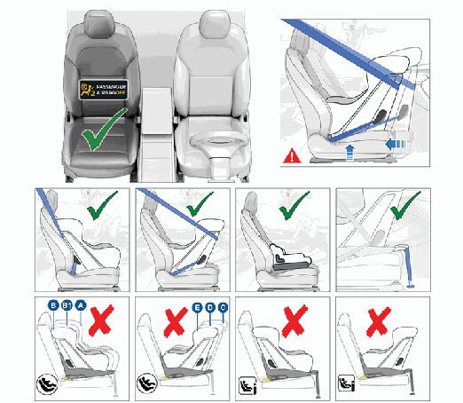

当副驾位前气囊被禁用且座椅底部升到一半时,可以使用以下类型的安全带固定式儿童约束系统,让婴儿和儿童坐在副驾位座椅上:

• 前向式,通用。

• 后向式,通用。

**注: 副驾位座椅没有配备下部锚筋来支持安装 ISOFIX/i-Size 儿童约束系统。**

**22 MODEL 3 车主手册**

### **儿童安全座椅**

#### **后排座椅**

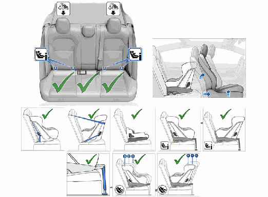

婴儿和儿童可以借助安全带固定式儿童约束系统或 ISOFIX (IU)//i-Size (i-U) 儿童约束系统乘坐后排外侧座椅。

**注: 后排座椅支持使用上部系带(请参阅系紧上部系带 页码 25)。**

大童也可以借助增高座椅乘坐后排外侧座椅,增高座椅按照儿童约束系统生产商说明书的规定固定在下部锚筋上或通过安全带固定。

后排外侧座椅支持选用以下 ISOFIX/i-Size 规格:

• 尺寸等级 A、B 和 B1 前向式。

• 尺寸等级 C、D 和 E 后向式。

**注: 为容纳大号后向式 ISOFIX/i-Size 儿童约束系统(尺寸等级 C),可能需要将相应的前排座椅前移到中间导轨位置(最后面位置**

向前最多 13 厘米),升起座椅(距离最低位置 2 厘米),并根据需要调节座椅靠背的角度。

**警告: 如果驾驶位座椅后方的后排座椅安装有儿童安全座椅,那么切勿使用便利进出(如驾驶员设定 页码 78所述)将驾驶**

位座椅自动移至最后端。座椅移动使间隙缩小,可能会冲击儿童腿部,造成损伤或座椅移位。

婴儿可以借助安全带固定式后向儿童约束系统乘坐后排中间座椅。儿童可以借助安全带固定式后向或前向儿童约束系统乘坐后排中间座椅。

**注: 后排中间座椅没有配备下部锚筋来支持安装 ISOFIX/i-Size 儿童约束系统。**

大童也可以借助增高座椅乘坐后排中间座椅,增高座椅按照儿童约束系统生产商说明书的规定安装。

**座椅和安全约束系统 23**

### **儿童安全座椅**

#### **安装安全带固定式儿童约束系统**

务必遵循儿童约束系统生产商提供的详细说明。请遵循以下关于安全带固定式儿童约束系统的通用指南:

• 确保儿童约束系统适合儿童的体重、身高和年龄。

• 避免给儿童穿着笨重的衣物。

• 不要在儿童和儿童约束系统之间放置任何物体。

• 每次行程针对每个儿童调整儿童约束系统的安全带。

1 . 将儿童约束系统置于适当的座椅并完全拉出安全带。按照儿童约束系统生产商提供的说明书,拉紧并系好安全带。

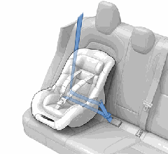

2 . 让座椅安全带缩回,将儿童约束系统牢牢推入车辆座椅,并收紧松弛的安全带。

3 . 按照儿童约束系统生产商的要求固定上部系带(请参阅系紧上部系带 页码 25)。

#### **安装 ISOFIX/i-Size 儿童约束系统**

Model 3 的后排外侧座位配备了 ISOFIX/i-Size 锚筋。这些锚筋位于座椅的座垫和靠背之间。每个锚筋的确切位置可通过位于座椅靠背上的标记(如下所示)识别,位于相关锚筋的正上方。

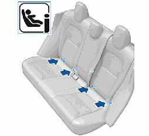

在第二排,请将 LATCH/ISOFIX 儿童安全座椅仅安装到外侧座椅位置。仅在座椅中间位置使用安全带固定座椅。

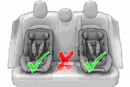

安装 ISOFIX/i-Size 儿童约束系统时,应仔细阅读并遵循儿童约束系统生产商提供的说明书。这些说明介绍了如何将儿童约束系统滑到座椅锚筋上,滑到位时会听到咔嗒声。可能需要抵着座椅靠背用力推儿童约束系统,确保系统紧贴。

**24 MODEL 3 车主手册**

### **儿童安全座椅**

#### **系紧上部系带**

Model 3 的后排座椅支持使用上部系带。如果儿童约束系统生产商提供的说明书指出要固定上部系带,可将其挂钩固定到相关座椅后面的锚固点。

**警告: 按照儿童约束系统制造商提供的说明来拉紧顶部系**

带。

**注: 后排头枕无法移动。**

系带的锚固点位于后排座椅后面的架子上。

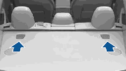

要接入锚固点,请按压锚固点罩的背面。

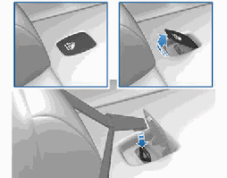

对于双侧系带,应在头枕两侧各放置一条系带。

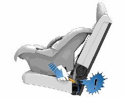

在儿童乘员就座之前,确保牢固地安装儿童约束系统。每侧用一只手抓住儿童约束系统的前部,并尝试:

• 将儿童约束系统从一侧扭到另一侧。

• 将儿童约束系统从座椅拉离。

如果儿童约束系统转动或离开座椅,说明两个闩锁没有完全啮合座椅上的锚筋。必须重新安装和重试。儿童约束系统上的两个闩锁完全啮合非常重要。

**警告: ISOFIX/i-Size 锚固件不能用于采用一体式安全带**

设计的儿童约束系统或增高座椅,因为此时儿童加上儿童约束系统的重量超过 33 千克。

#### **安全支腿**

Model 3 的所有乘客座椅都支持使用带安全支腿的儿童约束系统。如果儿童约束系统配备了支腿,可按照儿童约束系统生产商提供的说明书所述,伸展出支腿。

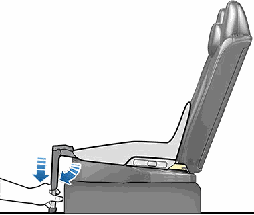

**座椅和安全约束系统 25**

### **儿童安全座椅**

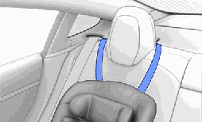

外侧座椅位置的单侧系带应绕过头枕朝外的一侧(头枕与座椅安全带缩回机构位于同一侧)。

#### **智能儿童座椅应用程序**

**注: 在使用智能儿童座椅应用程序前,Tesla 建议先启用离车后**

自动上锁(请查阅 离车后自动上锁 页码 7)。Tesla 还建议您不要启用住宅除外,这样车辆就会始终锁定。

可将 BabyFirst 156H 或 Babyfirst R155H Joy Pro-Z 儿童座椅连接到车辆后排座椅,并通过各项控制确保儿童安全。

**注: 请参阅儿童座椅制造商提供的使用说明了解安装方法和安**

全乘坐建议。

##### **配对**

车辆后排座椅最多支持两把智能儿童座椅。请参阅儿童座椅制造商提供的使用说明了解安装方法和安全乘坐建议。

从触摸屏底部菜单栏进入智能儿童座椅应用程序。Model 3 会随即自动扫描附近的 BLE 儿童座椅。对应的儿童座椅出现后,请选择连接 > 添加儿童座椅。儿童座椅现已添加至应用程序的座椅标签栏中,可根据需要自定义座椅名称。

**注: 可能需要使用附带的 USB 线为座椅供电。如未检测到座**

椅,请轻按儿童座椅或插拔座椅安全带以唤醒座椅。

**警告: 儿童座椅不会自动与车辆配对,需要通过智能儿童**

**座椅应用程序添加和连接才能完成配对。**

新座椅完成配对后,座椅标签栏的状态页会提示儿童的坐姿是否正确,是否系好安全带,以及儿童座椅是否稳妥固定至 ISOFIX连接器上(请参阅 安装 ISOFIX/i-Size 儿童约束系统 页码 24)。

如果探测到以上一项或多项出现问题,触摸屏将弹出提醒信息。

如果 Model 3 检测到儿童座椅安装错误,或儿童座椅无人乘坐,以及/或 USB 供电线未连接,触摸屏都会出现提示信息,提醒您手动检查儿童座椅。

**警告: 您应承担起主体责任,确保您的孩子安全稳妥乘坐**

儿童座椅,并且儿童座椅正确固定至车辆上。智能儿童座**椅应用程序和儿童乘坐检测系统并不能代替人工检查确**

认。

##### **下车注意事项**

从 Model 3 下车后,如果应用程序检测到儿童仍处于乘坐状态或未解开座椅安全带(表明儿童可能仍在车上),则会发出高声警报,外部车灯将闪烁,并且会向您的认证手机上的手机应用程序发送提醒。请立即返回车辆。

**警告: 如果下车后车辆未锁定,则不会出现警报、车灯和**

手机应用程序提醒(例如未启用离车后自动上锁,并且车主忘记手动锁定 Model 3 或启用了住宅除外等设置)。

Tesla 建议始终启用离车后自动上锁。请参阅离车后自动上锁 页码 7了解更多信息。

**警告: 您应承担起主体责任,下车时务必确保车上无乘客**

逗留。

**警告: tesla 不能保障车辆与第三方儿童安全座椅之间的**

交互质量,切勿全部依赖智能儿童座椅应用程序。请以自我观察和判断为准。

**26 MODEL 3 车主手册**

### **儿童安全座椅**

#### **其他信息**

座椅的 CRS 适用性

| 体重组别 | 副驾位座椅(气囊必须关闭) | 后排外侧座椅 | 后排中间座椅 |
|:---:|:---:|:---:|:---:|
| 组别 0(不超过 10 千克) | 不允许 | 允许 | 允许 |
| 组别 0+(不超过 13 千克) | 不允许 | 允许 | 不允许 |
| 组别 I(9 至 18 千克) | 不允许 | 允许 | 允许 |
| 组别 II(15 至 25 千克) | 不允许 | 允许 | 不允许 |
| 组别 III(22 至 36 千克) | 不允许 | 允许 | 不允许 |

ISOFIX/i-Size 座位的 ISOFIX/i-Size CRS 适用性

| 体重组别 | 尺寸等级 | 固定模块 | 副驾位座椅 | 后排外侧座椅 | 后排中间座椅 |
|:---:|:---:|:---:|:---:|:---:|:---:|
| 便携底座 | F | ISO/L1 | 不允许 | 不允许 | 不允许 |
|  | G | ISO/L2 | 不允许 | 不允许 | 不允许 |
|  |  | (1) |  |  |  |
| 组别 0(不超过 10 千克) | E | ISO/R1 | 不允许 | 允许特需座椅 | 不允许 |
|  |  | (1) |  |  |  |
| 组别 0+(不超过 13 千克) | E | ISO/R1 | 不允许 | 允许特需座椅 | 不允许 |
|  | D | ISO/R2 | 不允许 | 允许特需座椅 | 不允许 |
|  | C | ISO/R3 | 不允许 | 允许特需座椅 | 不允许 |
|  |  | (1) |  |  | 不允许 |
| 组别 I(9 至 18 千克) | D | ISO/R2 | 不允许 | 允许特需座椅 | 不允许 |
|  | C | ISO/R3 | 不允许 | 允许特需座椅 | 不允许 |
|  | B | ISO/F2 | 不允许 | 允许特需或前向式座椅 | 不允许 |
|  | B1 | ISO/F2X | 不允许 | 允许特需或前向式座椅 | 不允许 |
|  | A | ISO/F3 | 不允许 | 允许特需或前向式座椅 | 不允许 |
|  |  | (1) |  |  |  |
| 组别 II(15 至 25 千克) | 15 至 25 千克 | (1) |  |  | 不允许 |
| 组别 III(22 至 36 千克) | 22 至 36 千克 | (1) |  |  | 不允许 |
| (1) 对于通用或半通用儿童座椅,ISOFIX/i-Size 的尺寸可分为 A--G 级。尺寸等级信息位于 ISOFIX/i-Size 儿童座椅上。 |  |  |  |  |  |

#### **儿童约束系统警告**

**警告: 副驾位前气囊激活时,切勿让儿童坐在儿童约束系**

统或前排乘客座位的增高座椅上。否则,可能会造成重伤

或死亡。

**警告: 切勿在受已激活副驾位前气囊保护的座椅上使用后**

向式儿童约束系统。否则,可能会造成重伤或死亡。请参

阅遮阳板上的警告标签。

**警告: 部分儿童约束系统借助于腰部安全带或腰肩式安全**

带的腰带部分固定于车辆座椅上。倘若车内的儿童约束系

统未正确固定,发生碰撞时,儿童可能处于危险境地。

**警告: 不能因为触摸屏上有座椅安全带提醒就疏于检查小**

体型乘员或儿童安全座椅是否已正确固定。座椅占用传感

器可能无法识别小体型乘员或儿童座椅。

**警告: 切勿使用前向式儿童约束系统,直至儿童体重超过**

9 千克并能独立就坐。两岁以下儿童的脊柱和颈部尚未充分发育,要避免正面碰撞损伤。

**警告: 切勿让婴幼儿坐在成人大腿上。所有儿童都应该始**

终约束在适当的儿童约束系统上。

**警告: 要确保儿童安全乘坐,请遵循本文档中详述的所有**

说明,以及儿童约束系统生产商提供的说明书。

**警告: 应尽可能在较长时期内让儿童乘坐后向式儿童约束**

系统,用座椅的 5 点式集成安全带约束,直至他们达到后向式儿童约束系统的最大体形或体重限制。

**警告: 身形较大的儿童乘坐时,确保儿童的头部得到支**

持,并对儿童座椅安全带进行适当调整和固定。肩部安全带必须避开面部和颈部,搭接部分也必须避开腹部。

**警告: 切勿将两个儿童约束系统固定在一个锚固点上。发**

生碰撞时,一个锚固点可能不足以固定两个座椅。

**座椅和安全约束系统 27**

**警告: 儿童保护装置的锚筋仅承受来自正确安装的儿童保**

护装置的负载。此类固定点在任何情况下都不可用于成人座椅安全带、束带或连接其他物品或设备。

**警告: 要始终检查安全束带和系带是否发生损坏和磨损。**

**警告: 即使已将儿童固定在儿童约束系统上,也请勿将其**

独自留在车内。

**警告: 切勿使用遭遇过碰撞的儿童约束系统。报废该座椅**

并按照儿童约束系统生产商说明书的规定更换座椅。

### **儿童安全座椅**

**28 MODEL 3 车主手册**

### **气囊**

#### **气囊的位置**

气囊分别位于下图所示的近似区域。气囊警告信息印在遮阳板上。

Model 3 在两个指定的前排座位处均配备有气囊和腰带/肩带(又称为座椅安全带总成)。无论乘坐位置是否设有气囊,车内所有驾乘人员,包括驾驶员本人,应始终佩戴座椅安全带,以便在发生碰撞时,将重伤或死亡风险降至最低。

**注: 对于右侧驾驶 (RHD) 车辆,乘客和驾驶位气囊位置与上图所示相反。**

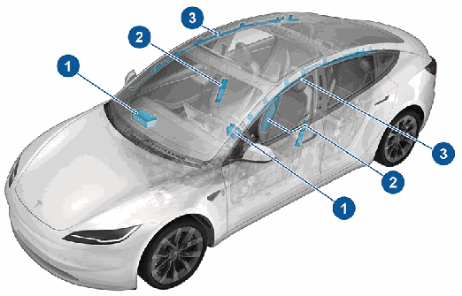

1 . 前气囊

2 . 座椅侧气囊

**注: 您的车辆还在驾驶位座椅内侧部分装配了座椅气囊。**

3 . 帘式气囊

**储物区域 29**

### **气囊**

#### **气囊如何工作**

当传感器探测到超出展开阈值的冲击力后,气囊将充气。这些阈值旨在及时为气囊预测撞击严重程度,协助保护车上乘客。气囊瞬间强力膨胀,伴有一声巨响。膨胀的气囊以及座椅安全带可限制驾乘者的活动,减少受伤风险。

在被追尾、侧翻、侧面碰撞、大力制动或驶过颠簸路段、路面坑洼等情形下,前气囊通常不会膨胀。同样,在诸如轻微正面碰撞、钻撞或与路灯或桩柱等狭窄物体轻微碰撞等所有正面碰撞情形下,前气囊可能不会膨胀。即使气囊未膨胀,车辆仍可能发生严重的表面损坏;反之,相对较小的结构损坏也可能导致气囊膨胀。因此,车辆碰撞后的外观并不代表前气囊应该或不应该膨胀。

**警告: 在以可能影响气囊系统的方式改装车辆以适合残障**

人士之前,请使用移动应用程序进行服务预约。

#### **气囊类型**

Model 3 配有以下几种气囊:

• 前气囊:如果有大童或成年人坐在前排座椅上,前气囊可用于减轻伤害。请遵循与在副驾位座椅上就坐的儿童(若相关市场地区允许)有关的所有警告和说明。请参阅儿童安全座椅 页码 20。

• 座椅侧气囊:前排座椅上的座椅侧气囊可帮助保护人体躯干的胸部及骨盆;驾驶位座椅内侧部分的座椅远端气囊可帮助保护头部和躯干。发生严重侧面碰撞或严重偏正面碰撞时,车辆碰撞侧和非碰撞侧的座椅侧气囊都会膨胀。

• 帘式气囊:帘式气囊可以帮助保护头部。车辆碰撞侧和非碰撞侧的帘式气囊只有在发生严重侧面碰撞、严重偏置正面碰撞或车辆倾翻时才会展开。

#### **气囊状态指示灯**

副驾位前气囊的状态会显示在触摸屏的顶角:

在副驾位座椅上有儿童就坐(若相关市场地区的法律允许)的情况下驾驶之前,务必反复检查副驾位前气囊的状态,确认气囊处于关闭状态。如果副驾位前气囊处于关闭状态,发生碰撞时,便不会膨胀。该指示灯在座椅无人乘坐时也会显示。

为保护坐在副驾位座椅上的成人,请确保副驾位前气囊处于开启状态。如果副驾位前气囊处于开启状态,发生碰撞时,便会膨胀。

**警告: 如果您所在市场区域的法律允许儿童坐在副驾位座**

椅上,那么驾驶员必须确保副驾位前气囊处于关闭状态。

先关闭气囊开关,然后再将儿童座椅置于副驾位座椅上。

切勿让儿童坐在气囊处于开启状态的副驾位座椅上,即使使用儿童约束系统或增高座椅也不允许。否则可能会导致儿童死亡或严重伤害。

#### **控制副驾位前气囊**

儿童乘坐副驾位座椅时(即使坐在儿童约束系统或增高座椅上),必须禁用副驾位前气囊,以防发生碰撞时气囊伤及儿童。

首先确保车辆处于驻车挡。然后点击控制 > 安全 > 副驾位前气**囊,驾驶前,确保触摸屏顶部的副驾位气囊状态指示气囊已关闭**

(请参阅气囊状态指示灯 页码 30)。

**注: Model 3 配有电容式触摸屏。如果戴普通手套操作,触摸屏**

可能不会响应。如果触摸屏未响应,需要脱下手套或戴上有导电指尖的手套,才可以使用电容式触摸屏。

**警告: 如果您所在市场区域的法律允许儿童坐在副驾位座**

椅上,则在气囊启用的情况下,切勿让儿童就座在副驾位座椅上的儿童约束系统或增高座椅上。否则,可能会造成重伤或死亡。

**警告: 如果副驾位前气囊不正常工作(例如,如果该气囊**

在关闭之后仍处于开启状态,或开启之后仍处于关闭状态),则前排座椅不得乘坐乘客。立即使用移动应用程序进行服务预约。

#### **膨胀的影响**

**警告: 气囊膨胀时会释放一种细粉末。这种粉末可能会刺**

激皮肤,应彻底冲洗眼睛以及割伤或擦伤的创口。

气囊膨胀后会回缩,从而让驾乘人员感受到震动逐渐减小,确保驾驶员的前方视野不受遮挡。

如果气囊发生过膨胀,或者车辆发生过碰撞,您的车辆需要先进行维修,然后才能启动。此外,必须检查气囊、座椅安全带预紧装置以及任何相关组件,如有必要,则进行更换。立即使用移动应用程序进行服务预约。

发生碰撞时,除气囊会膨胀外:

• 车门解锁。

• 危险报警闪光灯会打开。

• 内部照明会打开。

• 高电压会被禁用。

• 车窗达到通风位置。

• 车辆实施制动停下来。

**注: 根据碰撞的实际情况和力度,在碰撞发生后,车门可能不**

会解锁,和/或因造成的损坏可能会导致车门无法正常打开。在这种情况下,车内人员需要使用手动车门释放装置打开车门,或其他脱困方式(例如,通过打开其他车门离开车辆、打破车窗等)。

**注: 某些碰撞中,即使气囊未膨胀,高压也可能被禁用,此时**

您将无法启动和驾驶。立即使用移动应用程序进行服务预约。

**30 MODEL 3 车主手册**

### **气囊**

#### **气囊警报指示灯**

如果气囊系统出现故障,触摸屏上的气囊指示灯会一直点亮。只有在 Model 3 初次启动时,该指示灯才会短暂点亮,这也是唯一的一次。这种情况下,该指示灯会在几秒钟内熄灭。如果它仍然亮着,请立即使用移动应用程序进行服务预约,并且不要驾驶。

#### **气囊警报**

**警告: 无论乘坐位置是否设有气囊,车内所有驾乘人员,**

包括驾驶员本人,应始终佩戴座椅安全带,以便在发生碰撞时,将重伤或死亡风险降至最低。

**警告: 车内前排座椅驾乘人员不得将手臂胳膊放在气囊模**

块上。气囊膨胀可造成骨折或其他伤害。

**警告: 请勿在 Model 3 上使用座椅套。否则,发生碰撞时**

会限制座椅侧气囊的展开。装载后还会降低乘员分类系统(OCS)(如果装配)的准确性。

**警告: 气囊膨胀具有相当大的速度和力量,可能会导致人**

身伤害。要防止伤害,须确保车内所有驾乘人员均佩戴座椅安全带坐好,座椅位置应尽量靠后。

**警告: 除非相关市场地区的法律允许,否则儿童不得坐在**

副驾位座椅上。遵循您所在地区关于根据儿童体重、体形和年龄让儿童以正确方式就坐的所有法规。婴幼儿乘客最安全的乘坐位置是后排座位。使用后向式儿童约束系统让婴幼儿坐在气囊处于工作状态的座椅上会造成严重伤害或死亡。

**警告: 切勿在前部有气囊的座椅上使用后向式儿童约束系**

统。否则,如果气囊展开,可能会导致伤害或死亡。

**警告: 为确保侧气囊正确膨胀,乘员的躯干与 Model 3 的**

侧面须保持间隙且未被阻塞。

**警告: 乘客不得将头靠到车门或车窗上。否则,如果帘式**

气囊膨胀,可能会导致伤害。

**警告: 不要让乘客把脚、膝盖或身体的任何其他部分放在**

气囊上或附近,以免妨碍气囊正常工作。

**警告: 前气囊的上方或附近、前排座椅侧面、车辆侧方的**

顶篷上方以及其他任何可能会干扰气囊膨胀的气囊罩壳上,均不得负载或放置任何物品。这包括但不限于:方向盘套、贴纸、座垫、头枕等。如果车辆发生剧烈碰撞,导致气囊膨胀,这些物品就可能会造成严重伤害。

**警告: 气囊膨胀后,一些气囊部件会发热。请勿用手触**

摸,应等待其完全冷却。

**座椅和安全约束系统 31**

### **外部**

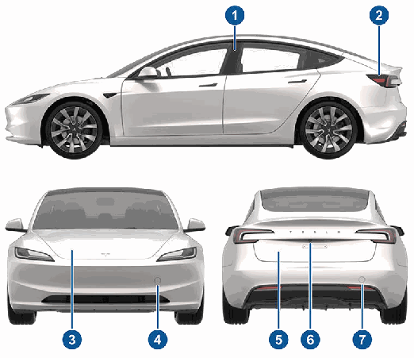

1 . 卡片钥匙传感器(钥匙 页码 3)

2 . 充电接口(充电说明 页码 138)

3 . 前备箱盖/前备箱(前备箱 页码 12)

4 . 前牵引环盖(运输说明 页码 177)

5 . 后备箱(后备箱 页码 10)

6 . 后视摄像头(后置摄像头 页码 82)

7 . 后牵引环盖(运输说明 页码 177)

有关辅助驾驶摄像头所在位置,请参阅摄像头 页码 46。

**32 MODEL 3 车主手册**

### **内饰**

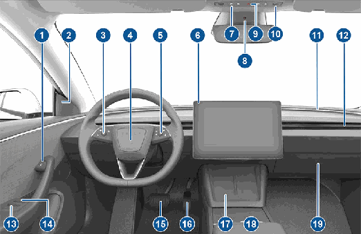

1 . 开门按钮(从车内打开车门 页码 7)

2 . 盲点警报灯(盲点警报灯 页码 104)

3 . 左滚轮 (左滚轮(多功能) 页码 58)

4 . 喇叭(喇叭 页码 59)

5 . 右滚轮 (右滚轮 (辅助驾驶) 页码 58)

6 . 触摸屏(触摸屏 页码 35)

7 . 备用行驶模式换挡面板 (P R N D) (使用车顶控制台换挡 页码 61)

8 . 驾驶室摄像头(驾驶室摄像头 页码 109)

9 . 危险警告灯(危险报警闪光灯 页码 65)

1 0. 顶灯 (车灯 页码 63)

1 1. 氛围灯带 (车灯 页码 63)

1 2. 温度控制通风口(请参阅操作温度控制 页码 116)

1 3. 电动车窗开关(车窗 页码 9)

1 4. 手动车门释放(从车内打开车门 页码 7)

1 5. 制动踏板(制动和停止 页码 67)

1 6. 加速踏板(能量回收制动 页码 67)

1 7. 无线手机充电器 (无线手机充电器 页码 39) 和卡片钥匙读取器 (钥匙 页码 3)

1 8. 中控台(中控台 页码 14)

1 9. 手套箱(手套箱 页码 14)

**概述 33**

### **内饰**

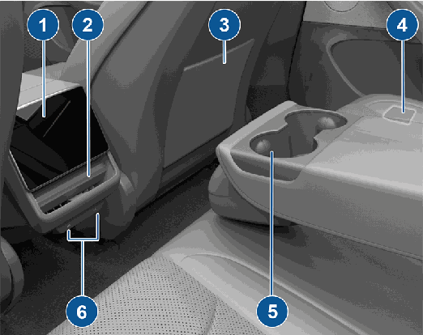

1 . 后触摸屏(后触摸屏 页码 37)

2 . 可调节温度控制通风口(操作温度控制 页码 116)

3 . 座椅置物袋

4 . 后车门手动释放(在没电的情况下打开后车门 页码 185)

5 . 杯托(后中控台 页码 14)

6 . USB 接口(USB 接口 页码 39)

**34 MODEL 3 车主手册**

### **触摸屏**

**注: 在本车主手册中,前触摸屏称为“触摸屏”,而后触摸屏称为“后触摸屏”。**

**警告: 驾驶过程中,请务必注意道路和交通状况。为尽量避免分散驾驶员注意力以及确保车辆乘员和其他道路使用者的安**

全,请避免在车辆行驶时使用触摸屏调整设置。

在传统车辆中,需要使用物理按钮控制的多项功能,均可通过触摸屏实现控制(例如:调节驾驶室加热、空调和大灯等)。还可以利用触摸屏控制媒体、导航,使用娱乐功能并根据个人偏好自定义 Model 3。可使用语音命令访问常用触摸屏控制,无需手动操作(请参阅语音命令 页码 44)。

如果触摸屏无响应或出现异常,可进行重启(请参阅重新启动触摸屏 页码 37)。

**警告: 请勿为触摸屏使用屏幕保护装置。否则,可能会导致对触摸屏的非预期输入(不明输入)、对触摸动作响应延迟或无**

响应、静电放电(可能损坏触摸屏)等。安装屏幕保护装置造成的任何损坏都不在保修范围内。

**注: 提供插图的唯一目的是让概念更好理解。根据车辆选装件、软件版本、市场区域以及地区和语言设置,屏幕上显示的详细信息**

将有所不同。

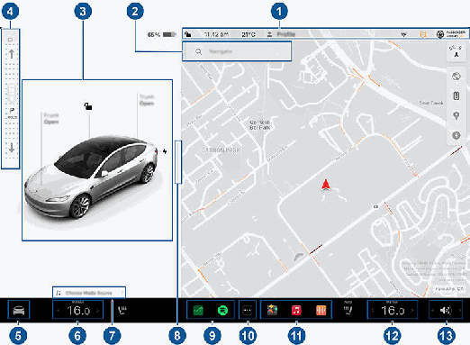

1 . 状态栏:在顶部栏中查找车辆控制和状态(请参阅顶部状态栏图标 页码 36)。

2 . 导航:更改地图方位、查找或导航至目的地以及更改导航设置(请参阅地图和导航 页码 126)。

3 . 车辆状态:此区域会随着您驾驶、驻车、开门、开灯等操作而动态显示 Model 3 的当前状态。驾驶时应注意观察此区域,因为它显示了行驶速度和警告消息等重要信息(请参阅车辆状态 页码 41)。当车辆处于驻车模式时,您可以打开行李箱或充电接口盖板。此区域还包含媒体、轮胎压力和行程信息的快捷方式“卡”。

启用 智能辅助驾驶(如配备)后,车辆状态区域将显示道路以及车辆周边的画面。左右拖动车辆状态区域可以扩大/缩小画面。

扩大画面可显示有关道路及其周围环境的更多详情,包括路标、停车灯和物体(例如垃圾桶和桩柱)。

**概述 35**

### **触摸屏**

4 . 行驶模式条:用于换入驻车挡、倒挡、空挡或前进挡。从触摸屏的边缘朝乘客方向滑动,以调出行驶模式条。(请参阅换挡 页码61。)

5 . 控制:控制各项功能并根据个人偏好自定义 Model 3。“控制”屏幕显示在地图上方。点击“控制”屏幕上的选项可显示与所选选项相关的各种设置和首选项。

要搜索特定设置,请点击“控制”屏幕顶部的搜索。直接在结果中更改或点击相应链接转至“控制”中的相应选项。

如果某一特定设置旁边显示有信息图标,点击此图标可显示一个弹出窗口,其中提供了有关相关设置的实用详细信息。

**注: 许多车辆控制、设置和偏好(如温度、媒体和导航)可以使用语音命令进行调整,无需手动操作(请参阅语音命令 页码**

44)。

**注: 长按此图标可将触摸屏反馈发送至 Tesla。**

6 . 温度控制(驾驶员):使用左侧和右侧箭头降低/升高驾驶室温度。在弹出窗口上点击拆分可分开显示适用于驾驶员和乘客的控制。点击温度图标可自定义温度控制设置(请参阅操作温度控制 页码 116)。 在拆分温度控制以分别提供适用于驾驶员和乘客的控制后会显示乘客温度控制。

7 . 媒体播放器快捷方式:使用媒体播放器应用程序时,滑动可实现最小化/最大化。

8 . 全屏驻车视图:朝乘客方向滑动,可查看带媒体和导航控制的全屏驻车视图。

9 . 我的应用程序:您可以选择此处显示的内容,以方便一键访问常用的应用程序和控制。请参阅自定义我的应用程序 页码 36。

1 0. 应用程序启动器:点击应用程序启动器以打开应用程序托盘。然后,点击任何应用程序将其打开。您选择的应用程序将显示在地图的顶部。要关闭应用程序,请将其向下拖。

1 1. 最近使用的应用程序:显示最近使用的应用程序。此处显示多少个最近使用的应用程序取决于已将多少个应用程序添加到我的应**用程序中。如果将最大数量的应用程序添加到我的应用程序,则仅显示最近使用的应用程序。**

1 2. 温度控制(乘客):当温度控制设置为分区控制后会显示此项。

1 3. 音量控制:控制媒体播放器和电话通话的音量(请参阅音量控制 页码 131)。导航指令的音量单独控制(请参阅地图和导航 页码126)。

#### **自定义我的应用程序**

您可以自定义触摸屏底部栏我的应用程序区域中显示的内容,以方便一键访问常用的应用程序和控制:

1 . 点击并按住我的应用程序区域中的任何应用程序或控制可进入自定义模式。如果此区域为空白,请点击“应用程序启动器”。

2 . 将任何应用程序或控制从应用程序托盘拖到底部栏的我的应**用程序区域。**

**注: 从应用程序托盘中选择的座椅加热器将显示在温度旁**

边,而不是“我的应用程序”区域中。

**注: 向我的应用程序中添加的应用程序或控制数达到上限后,**

再添加应用程序将删除最右侧的应用程序。

**注: 点击并按住从我的应用程序区域中的应用程序或控制,然**

后点击相关联的“X”可将其删除。

#### **顶部状态栏图标**

点击可锁定/解锁所有车门和行李箱。

**下午 4:20**

点击可显示有关天气和空气质量的信息。

车辆自动更新时间。如果时间不正确,请确认您的车辆具有互联网和 GPS 连接,并且使用的是最新的软件。

仅当 Model 3 在探测范围内发现已设置的HomeLink 且触摸屏尚未显示 HomeLink 屏幕或弹出窗口时,才会在触摸屏状态栏上显示。

请参阅智能车库 页码 53。

**36 MODEL 3 车主手册**

### **触摸屏**

#### **弹出消息和车辆警报**

触摸屏底部会显示弹出消息。例如,座椅上的乘客未系安全带时会显示座椅安全带提醒,有电话呼入时会显示通知提醒,还会在使用过程中显示短信(如果适用)和语音命令。如果适用,可以点击这些弹出窗口消息中的选项(例如接受/拒绝来电、从大灯菜单中选择选项等)。要关闭弹出窗口消息,请将其向下滑动。

如果车辆触摸屏上显示警报,请点击了解更多,了解有关该警报及其解决方法的更多信息。点击控制顶部的铃铛图标可查看车辆警报和通知列表。

**注: 目前并非所有警报都会提供额外信息。**

#### **重新启动触摸屏**

如果触摸屏无响应或表现异常,可进行重启。

**警告: 请仅在车辆停驶且换入驻车挡时才重新启动触摸**

屏。重新启动过程中,看不到车辆状态显示、安全警告、后视摄像头等信息。

1 . 换入驻车挡。

2 . 长按 方向盘 上的两个滚动按钮,直至触摸屏变黑。按住滚轮按钮的同时踩下制动踏板没有任何影响,也不需要这样做。

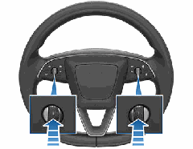

3 . 几秒钟后,Tesla 徽标出现。等待大约 30 秒,让触摸屏重新启动完成。几分钟后,如果触摸屏仍无反应或出现异常行为,请尝试循环通断车辆(如果可能)。请参阅循环通断车辆 页码 55。

**注: 按下滚轮按钮只会重启触摸屏。此操作不会重启任何其他**

车辆组件,也不会关闭和打开 Model 3 电源。

#### **后触摸屏**

后排乘客可以借助后触摸屏访问:

仅当 Model 3 处于驻车模式时,才会显示在触摸屏状态栏上。添加、配置(包括代客模式和**使用便利进出)或快速切换驾驶员设定。也可**

以从任何“控制”屏幕的顶部访问驾驶员设定。请参阅驾驶员设定 页码 78。

Model 3 处于驻车模式时可用,点击可针对当前驾驶循环手动启用或禁用哨兵模式。要在每次离开车辆时自动启用(或禁用)哨兵模式,请通过控制 > 安全 > 哨兵模式启用该设置。请参阅哨兵模式 页码 113了解更多信息。

**注: 如果通过控制 > 哨兵模式启用或禁用了哨**

兵模式,车辆触摸屏和手机应用程序上的快捷方式将仅适用于当前驾驶过程。

**注: 对于 2021 年 11 月 1 日左右之后生产的部**

分车辆,中控台 USB 接口仅支持充电设备。请使用手套箱中的 USB 接口来完成所有其他功能。

当 Model 3 连接到 Wi-Fi 网络时显示。

当 Model 3 连接到蜂窝网络时显示。点击此图标可快速访问 Wi-Fi 设置。

当 Model 3 蜂窝网络连接不可用时显示。点击此图标可快速访问 Wi-Fi 设置。

副驾位前气囊的状态(请参阅气囊 页码29)。

如果发生重大事故或严重伤害,点击可联系紧急响应人员并获得公用安全信息(请参阅紧急呼叫 页码 181)。

车主、新增驾驶员或您使用的第三方应用程序正在通过 Tesla 手机应用程序访问您车辆的GPS 位置时显示。点击图标了解详细信息。要禁用,请在触摸屏上导航至安全 > 允许手机访**问。**

在辅助驾驶启用后驾驶室摄像头主动监测驾驶员是否注意力集中时显示(请参阅 辅助驾驶 功能 页码 86或智能辅助驾驶 (如配备) 页码92)。

**概述 37**

### **触摸屏**

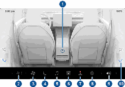

1 . 电源:点击可开启或关闭后温度控制系统。

2 . 后风扇转速:点击可调节风扇转速。

3 . 后风扇:点击可开启或关闭后部风扇、调节风扇速度并控制后通风口的气流方向(请参阅调节前后通风口 页码 120)。

4 . 座椅:控制后排座椅加热器并使用箭头向前/向后移动副驾位座椅。

5 . 媒体:播放、暂停、跳过或倒回当前播放的歌曲(请参阅媒体 页码 131)。

6 . 视频:访问通过车载流量播放网络视频服务。

7 . 游戏:点击查看游戏选项

8 . 设置:点击可配对多达两组蓝牙耳机,更改亮度或清洁显示屏。

**注: 还可以使用前触摸屏,通过启动后屏幕应用程序将蓝牙**

耳机配对到后显示屏。

9 . 音量:点击可调节音量。

1 0. 气流预设:点击可将气流快速引向乘客头部或躯干。在触摸屏上点击并移动气流,可将气流准确地引向所需的位置。

**注: 还可以使用前触摸屏调整后驾驶室的温度设置(请参阅调**

整温度控制设置 页码 116)。

**注: 调节媒体和音量控制也会同时调节前驾驶室设置。**

##### **从前部控制后触摸屏**

要从前部控制后触摸屏,请打开前触摸屏底部栏中的后屏幕遥控应用程序。除了音频、视频和温度控制外,您还可以在应用程序中锁定后显示屏或通过点击控制 > 显示 > 锁定后显示屏锁定后显示屏。

#### **自定义显示和声音设置**

点击控制 > 显示,根据个人偏好调整显示设置:

• 外观:将显示自定义为暗或亮。当设置为自动

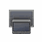

时,亮度会根据环境照明条件自动变化。

**减少蓝光:启用后,显示屏自动调整为在夜间使用较暖的颜**

色。

• 亮度:拖动滑块即可手动控制亮度。如果显示模式设置为自**动,则触摸屏会根据环境照明条件和您的亮度偏好进行深度**

调节。 Model 3 会记住您选择的亮度偏好并相应地调节触摸屏。

• 屏幕清洁模式:启用后,您的触摸屏将变暗并暂时禁用以便于清洁。请遵照屏幕上的说明退出屏幕清洁模式。

• 触摸屏语言:选择触摸屏显示的语言。

**注: Model 3 必须处于驻车挡,才能更改语言。当更改语言**

时,会经历一个短暂的延迟,Model 3 会关闭并重新启动触摸屏。

• 语音识别语言:选择要用于语音命令的语言。

• 语音导航语言:选择导航系统用于语音指令的语言。

**注: 对于需要下载的语言,请在下拉列表中选择语言以启动**

下载(需要 Wi-Fi 连接)。

• 文本大小:在标准和大之间选择,以自定义车辆触摸屏上的文本大小。

• 时间:选择是以 12 小时制还是 24 小时制显示时间。

• 能量显示:选择将剩余电量和充电单位显示为电池剩余电量的百分比或预计您可以行驶的距离。

**注: 在评估需要何时充电时,电量预估值仅供参考。能耗会**

受到许多因素的影响。请参阅影响能耗的因素 页码 143。

• 距离:选择以公制(公里、厘米等)或英制(英里、英寸等)单位显示测量值。

• 温度:选择是使用华氏度还是摄氏度来显示温度。

• 胎压:选择是使用 BAR 还是 PSI 来显示胎压。

除了自定义显示设置之外,您还可以启用 Joe 降音模式来降低与重大安全问题无关的所有蜂鸣的音量。点击控制 > 安全 > Joe 降**音模式即可启用。**

#### **命名车辆**

为了使您的车辆更加个性化,您可以为它命名。点击触摸屏右侧Model 3 图像下方的控制 > 软件 > 命名车辆。如果您的车辆已有名称,点击现有名称可进行更改。在弹出窗口中输入新的名称,然后点击保存。Model 3 的名称也会显示在 Tesla 手机应用程序中。

#### **通过出厂重置擦除个人数据**

转让 Model 3 的所有权时,先出于安全考虑执行出厂重置,然后再点击控制 > 服务 > 出厂重置,将您的车辆从您的账户中移除。

擦除数据前,Model 3 会提示输入与您的 Tesla 账户相关联的用户名和密码,以便验证凭证。

**注: 只有在车辆位于您的账户中时,才有可能执行出厂重置。**

从您的账户中移除车辆后,您将无法再将自定义的设置重置为出厂默认值,也无法擦除所有个人数据。

•

**38 MODEL 3 车主手册**

### **车内电子设备**

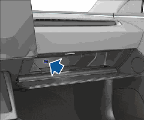

除了储物盒和杯托(请参阅车内储物 页码 14),Model 3 车内还支持各种电子设备,例如 USB 接口、无线手机充电器和 低压电源插座。

#### **USB 接口**

Model 3 具有四个 USB 接口。三个 USB-C 接口的输出功率高达42W 左右,或者两个接口的输出功率高达 65W 左右。

• 一个 USB-C 接口位于中控台的后储物盒中,用于为 USB 设备充电。

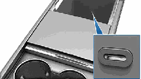

• 两个可用于为 USB 设备充电的 USB-C 接口位于中控台上,后驾驶室通风口的下方。

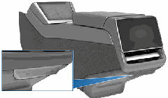

• 一个 USB-A 接口位于手套箱内部。此接口配备一个 USB 闪存盘。该 USB 接口处于安全位置,非常适合保存哨兵模式和行车记录仪视频片段。该接口还支持来自手机或 USB 设备的音频文件(请参阅播放来自设备的媒体 页码 132)。

请参阅视频记录对 USB 设备的要求 页码 115,了解有关格式化USB 闪存盘的信息。

**注: 只要车辆被认为处于“唤醒”状态,就会提供电源。车辆**

处于唤醒状态的原因不定。例如,在使用召唤功能功能时,或者启用保持温度控制、爱犬模式、露营模式或哨兵模式等功能后。

在 低压 电池充电或使用期间、高压充电期间或车辆与手机应用程序通信等活动期间,车辆也会处于唤醒状态。将配件置于通电状态不会耗尽 低压 电池的电量。

**注: 使用 USB 3.0 兼容导线将设备连接到 USB 接口。使用不兼**

容电缆会导致充电缓慢,可能发生连接问题或性能降低。

**注: 请勿使用 USB 集线器连接多个设备。那样将会使已连接的**

设备无法充电或无法被媒体播放器、哨兵模式、行车记录仪等识别。

#### **无线手机充电器**

无线手机充电器集成在前中控台内,最高可提供 15W 的电力来为支持 Qi 的智能手机充电。要为手机充电,将手机放置在两个充电板之一上。手机必须与无线充电器直接接触。充电时,设备的触感温度较高,这是感应式充电的正常效果。

**警告: 充电前,请取出手机和充电器之间的任何物品(硬**

币、钥匙、金属物品等),以及放置在手机上或其后面的任何 NFC 卡(例如,车辆卡片钥匙、信用卡或酒店钥匙)(与集成手机壳类似)。在没有先取出 NFC 卡的情况下为手机充电可能会损坏 NFC 卡。

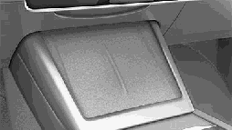

**概述 39**

### **车内电子设备**

放在无线充电器上后,只要车辆通电(触摸屏打开且您在车内),手机就会充电。下车后,手机不会充电,除非启用了保持温度控制、爱犬模式、露营模式或哨兵模式等功能。

**注: 如果手机壳过厚或采用金属材质,无线手机充电器可能无**

法工作。请尝试摘掉手机壳,然后再放在充电器上。

**注: 如果车辆高压电池的电量已耗尽,无线手机充电器便不会**

充电。

#### **低压 电源插座**

Model 3 的中控台储物盒中有一个电源插座。要使用 低压 插座,请打开中控台的前储物盒。

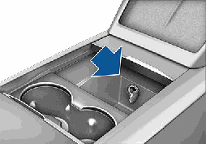

该电源插座适用于最高需要 12A 连续电流(峰值 16A)的配件。

**警告: 电源插座和附件连接器可能会变热。**

**警告: 为避免过度干扰车辆电子设备,Tesla 建议不要将**

任何非 Tesla 附件(包括逆变器)插入 低压 电源插座中。

但是,如果使用了非 Tesla 附件并发现任何故障或异常现象,例如指示灯亮起、警报消息或附件过热等,请立即将附件从 低压 电源插座中拔出。

**警告: 切勿尝试使用 低压 电源插座对 Model 3 进行跳线**

跨接启动。否则会造成损坏。

**40 MODEL 3 车主手册**

### **车辆状态**

##### **指示灯**

以下指示灯点亮,提醒或警告用户注意特定状态或情况。

除了在首次启动 Model 3 时短暂显示外,如果触摸屏在其他任何时间显示该红色制动指示灯,说明检测到制动系统故障或制动液液位低。请立即联系 Tesla。施加稳定的压力并牢牢踩住制动踏板,以便在安全的情况下停车。

如果检测到制动助力器故障,触摸屏将显示此琥珀色驻车指示灯。施加稳定的压力并牢牢踩住制动踏板,以便在安全的情况下停车。液压助力补偿将处于激活状态(请参阅制动和停止 页码67)。

首次启动 Model 3 时,触摸屏上的 ABS 指示灯将呈琥珀色短暂闪烁。如果此指示灯在其他任何时候亮起,表明 ABS 发生故障且 ABS 未在工作。

联系 Tesla。此时制动系统全部功能仍然正常,并不受 ABS 故障的影响。但是,制动距离可能会增加。小心驾驶,避免急刹车。

使用触摸屏手动施加驻车制动时,触摸屏上的红色驻车制动指示灯亮起。

如果驻车制动器遇到电气问题,琥珀色驻车制动指示灯将亮起,并在触摸屏上显示一条故障消息。

胎压报警(指示灯为琥珀色)。某个轮胎压力超出范围。如果检测到胎压监控系统(TPMS) 故障,相应的指示灯将闪烁。出现TPMS 故障时,请联系 Tesla。请参阅轮胎养护 页码 148。

乘客座椅安全带未系好。(指示灯为红色)请参阅座椅安全带 页码 17。

气囊安全(指示灯为红色)。在 Model 3 准备行驶时,如果该指示灯未短暂闪烁或者始终点亮,请立即联系 Tesla。请参阅气囊警报页码 31。

每当后雾灯亮起时,触摸屏上会显示后雾灯指示符(如果配备)。

驻车灯亮起(示廓灯、尾灯和车牌灯)(指示灯为绿色)。请参阅车灯 页码 63。

#### **概述**

触摸屏始终显示 Model 3 的状态。看到的内容取决于车辆处于以下哪种状态:

• 已驻车(如下图所示)。

• 正在行驶(请参阅行驶状态 页码 42)。

• 正在充电(请参阅充电状态 页码 139)。

当 Model 3 处于驻车状态时,状态区域会显示行驶模式、估计里程和车辆俯视图,以及一些按钮,您可以点击这些按钮来打开行李箱和充电接口盖板。踩下制动踏板时,Model 3 通电启动,指示灯短暂闪烁。除非指示灯适用于当前情况(例如,座椅安全带未系好),否则灯应该会熄灭。如果指示灯无法亮起或熄灭,请与 Tesla 联系。

**注: 下图仅作示范。根据车辆选装件、软件版本和市场区域,**

显示的信息可能会略有不同。

##### **卡**

车辆状态显示界面底部还会显示快捷方式“卡”,用于快速访问媒体、轮胎压力数据和行程信息等内容。向左或向右滑动这些卡可自定义卡快捷方式。

**概述 41**

### **车辆状态**

近光大灯亮起(指示灯为绿色)。

远光大灯亮起且自适应大灯被禁用或当前不

可用(指示灯为蓝色)。

**自适应大灯已启用且远光灯打开。 Model 3**

在探测到光线时随时准备关闭远光灯(指示

灯为蓝色)。请参阅远光大灯 页码 63。

**自适应大灯**

由于 Model 3 探测到前方有光

线,因此启用,但远光灯未亮起(指示灯为

灰色)。未再检测到光线时,远光灯自动恢

复为开启。请参阅远光大灯 页码 63。

当电子稳定控制系统能通过控制制动压力和

电机功率而主动将车轮空转情况降至最低

时,该指示灯闪烁。请参阅牵引力控制 页码

73。如果该指示灯点亮,说明检测到故障,

应立即联系 Tesla。

电子稳定性控制系统不再最大程度减少车轮

空转(指示灯为琥珀色)。在后轮驱动车辆

上,牵引力控制系统已关闭;在全轮驱动车

辆上,脱困起步已启用。请参阅牵引力控制

页码 73。

车辆保持功能主动进行制动(指示灯为灰

色)。请参阅车辆保持 页码 72。 请参阅弹出消息和车辆警报 页码 37,了解有关车辆触摸屏上的警报弹出窗口的更多信息。

某个车门或行李箱打开(指示灯为红色)。

请参阅车门 页码 7、后备箱 页码 10或前备箱

页码 12。

行人警示系统已暂停(指示灯为灰色)。请

参阅行人警示系统 页码 83。

Model 3 准备就绪,可以行驶(指示灯为绿

色)。

当充电量不足(剩余电量 <20%)时,绿色电

池指示灯变为琥珀色。

#### **行驶状态**

Model 3 在行驶叶(或准备好行驶时),触摸屏会显示目前行驶状态,并显示辅助驾驶组件探测到的路况的实时画面(请参阅摄像头 页码 46)。可视化显示能够自动缩放,以便优化触摸屏空间的使用情况,在盲点区域探测到车辆时会发出提醒。

**注: 下图仅作示范。根据车辆选装件、软件版本和市场区域,**

显示的信息可能会略有不同。

出现蓝色雪花时表示寒冷天气导致电池中储备的部分电能无法使用。在此类寒冷天气状况下,充电速率也可能会受到限制。可以使用手机应用程序开启温度控制,对电池进行加热。当电池足够热时,雪花图标将消失。

能量回收制动受限时显示。请参阅能量回收制动 页码 67了解更多信息。

车辆功率目前受限,因为电池中的剩余电量较低,或者车辆系统正在加热或制冷,或者电机逆变器检测到错误(指示灯为琥珀色)。

电池正在充电(指示灯为红色)。行驶前,

应先拔下 Model 3 的插头。

车辆系统过热(指示灯为红色)。立即靠边

停车并让系统冷却(指示灯为红色)。

系统故障(指示灯为红色)。遵照所显示的相关信息中的提示。联系 Tesla。

**42 MODEL 3 车主手册**

**注: 与探测到的限速相关的图标会体现出您所在市场区域使**

用的限速标志的风格。

9 . 预计可行驶总距离(或电能)。点击显示的值可更改可用能量的显示方式。可以在行驶距离和电池剩余电量百分比之间切换。您还可以通过点击控制 > 显示 > 能量显示来更改能量的显示方式。

**注: 当评估需要何时充电时,预计里程数值仅供参考。**

1 0. 设定的巡航速度。当主动巡航控制可用但没有设定巡航速度时,数字为灰色(请参阅主动巡航控制 页码 86)。

**警告: 请注意触摸屏车辆状态区域底部显示的重要警报信**

息。无视这些消息可能会导致严重受伤或死亡。

**警告: 尽管触摸屏显示周围行驶车辆,但部分车辆可能未**

显示出来。切勿依靠触摸屏来确定是否有车辆(例如,在盲区时)。请务必查看后视镜并转头观察。

### **车辆状态**

**注: 要显示有关道路及其周围环境的更多详情(例如路标、停**

车灯以及垃圾桶和桩柱等物体),请点击智能辅助驾驶画面预览

(若配备)。

1 . 当智能辅助转向可用但未激活时,图标为灰色。当智能辅助

转向主动操控 Model 3 转向时,图标为蓝色(请参阅智能辅

助转向 页码 86)。

2 . 当前所选行驶模式:驻车挡、倒挡、空挡或前进挡。

3 . 行驶速度。

4 . 功率表会显示实时电力使用情况(请参阅能量回收制动 页码

67了解详情)。功率表可能会垂直显示在行驶状态屏幕顶

部,但功能一样。

5 . 道路上探测到的其他车辆(如适用)。

6 . 您的 Model 3。由于检测到物体(如其他驾车者、护栏

等),彩色线条从 Model 3 图像向四方延伸。线条的位置对

应探测到的物体的位置。线条的颜色(白、黄、橙或红)表

示物体与 Model 3 的接近度,白色表示离得最远,红色表示

非常近,需要立即引起注意。请参阅车道辅助 页码 103。

7 . 智能辅助转向激活并检测到行车道时,该行车道以蓝色标示

(请参阅智能辅助转向 页码 86)。

**注: 如果智能辅助导航驾驶激活,行车道将在 Model 3 前方**

显示为一个蓝色线条(请参阅智能辅助导航驾驶 页码

88)。

8 . 车速辅助目前探测到的速度限制(请参阅车速辅助 页码

108)。

**注: 限速图标周围可能出现蓝色轮廓,提醒您已超过限速。**

**概述 43**

### **语音命令**

**注: 为了方便您,Tesla 允许您从多种语言中选择用于语音命令**

的语言。要选择不同的语言,请点击控制 > 显示 > 语音识别语**言。**

使用语音命令可以轻松控制设置和偏好、提出问题,而无需使用触摸屏。语音命令用于理解自然请求。以下是您可以使用语音命令执行的操作的非详尽列表:

• 调整温度偏好

• 微调挡风玻璃雨刮器的速度和频率

• 控制车辆的各个方面

• 导航到某个地点

• 呼叫联系人

• 与应用程序和设置交互

• 查看天气、听诗歌、听笑话或了解其他信息。它可以成为您的百科全书

要启动语音命令, 上的右侧滚轮按钮,完全按下 方向盘 右侧的麦克风按钮 右侧的麦克风按钮。听到蜂鸣声后,可提出请求。

#### **语音命令示例**

下面是语音命令示例列表。这份列表并不详尽。Tesla 一直在努力改进语音命令。

**注: 车辆必须处于驻车挡才可以启用一些语音命令(例如哨兵**

模式、爱犬模式等)。

##### **温度控制**

调整您的温度偏好:

• “降低温度”

• “升高温度”

• “开启/关闭驾驶座加热器”

• “给副驾位降温”

• “让空气直吹到我脸上”

• “同步温度控制”

• “提高/降低风扇转速”

• “开启/关闭后除霜器”

• “设置温度/风扇...”

• “打开内循环”

##### **挡风玻璃雨刮器**

根据不断变化的道路和天气状况更新挡风玻璃雨刮器速度和频率:

• “加快雨刮器”

• “将挡风玻璃雨刮器速度增加/减少...”

• “开启/关闭雨刮器”

##### **车辆控制**

修改车辆中的各种控制:

• “哨兵模式打开/关闭”

• “保护我的车”

• “锁定/解锁车门”

• “启用爱犬模式”

• “折叠/展开后视镜”

• “打开/关闭充电接口”

• “开始/停止充电”

• “打开服务设置”

• “打开手套箱”

##### **导航**

搜索或导航到某个地点:

• “去[地点]”

• “开到[地点]”

• “导航到[地点]”

• “显示附近的超级充电站”

• “我饿了/我很幸运” (请参阅地图和导航 页码 126)。

• “停止导航”

• “语音导航静音”

如果您定义了回家和上班的导航地址,可以通过语音命令说出“导航回家”或“导航到公司”来导航到相应地点。

##### **媒体**

收听媒体和调整您的播放偏好:

• “听[歌曲名称]”

• “降低/提高音量”

• “跳到下一个”

**44 MODEL 3 车主手册**

### **语音命令**

• “暂停/播放歌曲”

• “将来源更改为[媒体源]”

为提高语音命令识别的准确性,请在您的命令中提供多个线索,例如艺术家和歌曲。

##### **应用程序和设置**

轻松浏览应用程序和设置:

• “打开[玩具箱/浏览器/剧场/手机]”

• “搜索...”

• “屏幕太亮”

• “显示车主手册”

您还可以说出 “报告”、“反馈”或“漏洞报告”来提交错误报告。

有关语音命令的详细信息,请转到https://www.tesla.cn/support/voice-commands。

**注: 为了不断提高质量,Tesla 会采集并处理语音命令转写文本**

(如“设置温度...”等)。我们不会收集录制的语音音频内容,这些转写内容也不会与您的 Tesla 账户或车辆识别码相关联。为了进一步保护您的隐私,我们不会采集包含个人数据的语音命令(如“导航到...”或“打电话给...”)。

**概述 45**

### **摄像头**

您的 Model 3 装配以下组件,能够主动监测周围区域:

• 后车牌的上方装有一个摄像头。

• 各门柱均装有一个摄像头。

• 后视镜上方的挡风玻璃上装有两个摄像头。

• 每块前翼子板上装有一个摄像头。

Model 3 还装配了高精度电子辅助制动和转向系统。

#### **驾驶室摄像头**

您的 Model 3 会在后视镜上方装配一个驾驶室摄像头。有关详细信息,请参阅驾驶室摄像头 页码 109。

#### **驾驶以校准摄像头**

Model 3 在使用 辅助驾驶 功能时必须保证操作精确。因此,在首次使用某些功能(例如车道偏离防避和自动紧急制动)之前或进行了某些类型的服务维修之后,摄像头必须完成自校准过程。

为方便起见,触摸屏会显示一个进度指示器。

完成校准后,即可使用 辅助驾驶 功能和主动安全功能。一般需要驾驶 32-40 km才能完成校准,具体距离取决于当时的路况和环境状况。例如,当车辆在具有多条车道且行车道和相邻车道的车道线均清晰可见的笔直道路(例如通行受控的道路)上行驶时,可以更快地完成校准。只有当 Model 3 在所述条件下行驶

160 公里后仍未完成校准过程时,才联系 Tesla。

如摄像头偏离其校准位置(例如更换了摄像头或挡风玻璃),您必须清除此校准。为此,请点击

**控制 > 服务 > 摄像头校准 > 清除**

**校准。清除校准后,Model 3 将重新执行校准过程。虽然许多情**

况下都可以通过此操作重新校准摄像头,但清除校准可能无法解决所有摄像头和传感器问题。

**注: 要完成摄像头校准,行车道和临近车道(车辆每一侧至少**

有两条车道)的车道线均需清晰可见。为获得最佳效果,请在多车道高速公路(最好至少为五车道)的中间车道上行驶,并且车道线清晰可见,车流量较小。

**注: 如果您尝试使用一种只有在校准过程完成后才能使用的功**

能,此功能会处于禁用状态,触摸屏上会显示一则消息。

**注: Model 3 必须在以下情况下重新执行校准过程:Tesla 完成**

了摄像头维修,并在某些情况下更新了软件。

#### **保持摄像头无遮挡物**

每次驾驶前和使用辅助驾驶功能前,确保所有摄像头清洁,无障碍物阻挡(请参阅清洁摄像头 页码 153)。摄像头和传感器(如果配备)脏污,以及下雨和车道线褪色等环境条件可能会影响辅助驾驶的性能。如果摄像头被遮挡或遮蔽,Model 3 会在 触摸屏上显示一则消息,辅助驾驶功能可能无法使用。

摄像头外壳内部可能形成冷凝,尤其在您将车停在寒冷、潮湿的室外环境中时。触摸屏可能会显示一则警报,指示摄像头被遮挡,在摄像头视野清晰之前,部分或全部 辅助驾驶 功能可能暂时受限。为主动干燥冷凝物,请通过以下方法预设驾驶室温度:

调高驾驶室温度、打开挡风玻璃除霜器以及将前通风口调至朝向车门柱吹风(请参阅手机应用程序 页码 47)。

**46 MODEL 3 车主手册**

### **手机应用程序**

• 查看车辆的充电信息。插入充电线时还将显示充电详细信息。

• 打开或关闭充电接口。

**注: 电池图标旁边扭曲的红色线条表示电池正在加热(包括**

在充电或准备充电期间)。

• 查看车辆所在位置。

• 查看车辆的预估续航里程。

• 打开前备箱。

• 查看车辆的里程表、车辆识别码和当前软件版本。

媒体设置会显示在手机应用程序上,可用于对车辆当前播放的媒体执行暂停、播放、倒回、快进和调节音量操作。可能需要点击**音频设置 > 选项 > 允许手机控制来启用媒体设置。**

对于支持的视频源,可通过手机应用程序分享相应链接来将视频发送到 Tesla 剧场。导航到要在手机上播放的电影、演出或视频,然后点击分享按钮。与 Tesla 应用程序分享视频,如果Model 3 处于驻车挡,该视频将显示在触摸屏上。

**警告: 如果要在 Model 3 内锁定车门,以使车门无法从车**

外打开,请关闭车门并使用触摸屏上的锁定图标。此操作会暂时忽略所有手机锁定设置,例如离车后自动上锁。否则,由于您的手机已作为钥匙启用,即使您按下手机应用程序上的锁定图标,拉动车门外把手时车门也会解锁。如果从车内打开车门,只要检测到手机钥匙,就可以再次从车外打开车门。(请参阅手机钥匙 页码 3了解更多信息)。

#### **设定**

在顶角的“设定”选项卡中,您可以:

• 切换到与您的 Tesla 账户关联的其他车辆(如果您可以访问多辆车)。

• 浏览 Tesla 商店。

• 管理账户信息并查看订单历史记录。

• 在“设置”选项卡下查看并自定义接收的通知,例如日历同步、触发安全警报的时间、充电更新和软件更新等。可以远程启动更新并查看其进度。

#### **控制**

通过“控制”选项卡,您可以:

• 打开前备箱或后备箱。

• 远程锁定或解锁 Model 3。

**注: 如果您通过手机应用程序解锁,车辆不会自动重新锁**

定。

• 打开或关闭充电接口。

• 通过闪烁车灯或鸣喇叭发现 Model 3 的停放地点。

• 启用无钥匙驾驶。

Tesla 手机应用程序允许使用 iPhone® 或 AndroidTM 手机与Model 3 进行远程通信。

**注: 以下信息可能未列出 Tesla 手机应用程序上的全部功能。为**

了能够使用新增和改进功能,请及时下载最新版手机应用程序。

#### **使用手机应用程序**

将 Tesla 手机应用程序设置为与 Model 3 通信:

1 . 将 Tesla 手机应用程序下载到手机上。

2 . 输入 Tesla 账户凭证以登录到 Tesla 手机应用程序。

3 . 点击控制 > 安全 > 允许手机访问启用 Model 3 的手机访问权限。

4 . 将手机蓝牙设置为开,同时确保在手机全局设置中对 Tesla手机应用程序开启蓝牙。例如,在您的手机上,导航到“设置”,选择 Tesla 手机应用程序,确保蓝牙设置已启用。

手机和车辆必须都主动连接到蜂窝网络服务或 Wi-Fi,以便手机应用程序与车辆通信。Tesla 建议始终携带功能正常的实体车钥匙,以防停车区域的蜂窝网络受限或根本没有网络,例如室内车库。

**注: 如因非质保问题而要求 Tesla 执行锁止协助,例如蜂窝网络**

连接受限,并且无备用钥匙,那么道路救援政策将不承保相关服务费用。

**注: Tesla 不支持使用第三方应用程序来与 Model 3 通信。**

##### **适用于 Apple 手表的手机应用程序**

您也可以在 Apple 手表上使用手机应用程序。

适用于 Apple 手表的 Tesla 手机应用程序需要:

• 配备 watchOS 11.0 或更高版本的 Apple Watch Series 6、Apple Watch SE 2、Apple Watch Ultra 1 或更高版本。

• 车辆固件 2024.44.25 或更高版本。

• Tesla 手机应用程序 4.39.5 或更高版本。

在 Apple 手表上使用 Tesla 手机应用程序之前,请确保您的iPhone 和 Apple 手表均已更新为最新可用软件版本。要将Tesla 手机应用程序添加到您的 Apple 手表中,请使用您的iPhone 上的手表应用程序。

您可以使用 Tesla Apple 手表应用程序锁定和解锁 Model 3、打开和关闭后备箱以及打开前备箱。

此外,您还可以像使用手机钥匙一样将 Apple 手表用作一把钥匙。有关详细信息,请参阅钥匙 页码 3。

#### **概述**

当手机和车辆都有互联网服务时,您可以利用 Tesla 手机应用程序的主屏幕执行以下操作:

• 锁定或解锁车辆。

• 启用或禁用暖气或空调并监控驾驶室温度。

**网络连接 47**

### **手机应用程序**

**注: 当您未携带车钥匙,或者因忘记行车密码或触摸屏无响**

应而无法使用密码时,可借助无钥匙驾驶功能(请参阅行车密码 页码 110)。

• 打开和关闭车库门(如果您的车辆已设置 HomeLink 连接(若可用))(请参阅智能车库 页码 53)。

• 车窗通风。

#### **温度**

驾驶前,您可以检查车内温度并加热或冷却驾驶室(即使在车库内)、控制座椅加热器并对挡风玻璃除霜:

• 启用或禁用为车辆除霜,此功能通过从屏幕底部向上滑动,帮助融化挡风玻璃、窗户和后视镜上的雪、冰和霜。

• 启用或禁用爱犬模式或露营模式。

• 启用驾驶室过热保护,此功能可防止驾驶室在炎热的环境条件下变得过热。您可以选择当驾驶室温度超过 40° C 或选定温度(如有)时是希望开启空调还是只希望开启风扇。请参阅操作温度控制 页码 116了解更多信息。

• 车窗通风或关闭车窗。

• 将驾驶室温度预设至所需温度,然后打开或关闭 方向盘 和座椅加热器(如果配备)。

使用手机应用程序预设 Model 3 温度也可以按需预热电池。车辆达到所需的预设温度后,手机应用程序会通知您。

**注: 在某些车辆中,根据车辆规格和生产日期,使用手机应用**

程序为 Model 3 除霜还可以融化充电接口闩锁上的结冰。在极端寒冷天气或结冰条件下,充电接口闩锁可能会被冻住而导致您无法摘下或插入充电电缆,此时,这项功能便可派上用场。

#### **位置**

定位 Model 3 方向或通过地图跟踪其活动。

#### **召唤功能**

您可以使用基础召唤或高级智能召唤 (ASS)(请参阅召唤功能 页码 97)操控 Model 3 驻车或找回车辆。

#### **预约**

启用定时充电或定时出发,然后预设车辆温度。请参阅定时预设温度和充电 页码 142了解更多信息。还可以根据首选位置保存定时充电或定时出发。

也可以预约在未来的某个时间播放灯光秀。有关灯光秀的更多信息,请参阅剧场、游戏厅和玩具箱 页码 133。

#### **安全**

通过“安全”选项卡,您可以:

• 将手机与车辆配对(请参阅手机钥匙 页码 3)。

• 启用或禁用哨兵模式(请参阅如何使用哨兵模式(使用 USB闪存盘) 页码 113)。

**48**

• 启用或禁用代客模式(请参阅代客模式 页码 79)。

• 启用或禁用速度限制模式,并在车辆行驶速度与所选最高车速相差大约 5 km/h 时收到通知提醒(请参阅速度限制模式页码 111)。

#### **升级**

查看并购买适用于您车辆的最新升级,例如智能辅助驾驶。

#### **维护**

有关如何通过手机应用程序预约服务的信息,请参阅预约服务页码 146。

#### **道路救援**

查看道路救援资源并请求道路救援(如果适用)。有关道路救援的更多信息,请参阅联系 Tesla 道路救援 页码 180。

#### **为另一位驾驶员授予访问权限**

通过 Tesla 手机应用程序为另一位驾驶员添加和移除访问权限。

**注: 需要 Tesla 手机应用程序 4.3.1 或更高版本。其他驾驶员可**

以使用先前注册的 Tesla 账户,也可以通过该应用程序创建一个新的 Tesla 账户。

要添加其他驾驶员,请在 Tesla 手机应用程序的车辆主屏幕上点击安全 > 添加驾驶员,然后按照屏幕上的说明进行操作。

**注: 其他驾驶员可以访问除购买升级之外的所有其他应用程序**

功能。

要移除访问权限,请在手机应用程序上点击安全 > 管理驾驶员,然后按照屏幕上的说明进行操作。

**MODEL 3 车主手册**

### **Wi-Fi**

Wi-Fi 可用作一种数据连接方法,通常比蜂窝数据网络要快些。

在蜂窝网络连接受到限制或没有网络连接时,Wi-Fi 连接尤为实用。为了能够快速而可靠地获得软件和地图更新,Tesla 建议尽可能让 Model 3 保持 Wi-Fi 网络连接(例如停放在家里时)。

连接 Wi-Fi 网络:

1 . 点击控制 > Wi-Fi。 Model 3 开始扫描并显示探测范围内发现的 Wi-Fi 网络。

**注: 如果某个已知 Wi-Fi 网络未出现在列表中,请将 Model**

3 靠近接入点,或者考虑使用增程器。

**注: 连接到 5GHz 网络(如果可用)时,请检查您所在地区**

支持哪些通道。

支持的 5GHz 网络通道

| 36 -48 | 52 -64 | 100 -140 | 149 -165 |
|:---:|:---:|:---:|:---:|
|  |  |  | ✓ |

2 . 在正在搜索 Wi-Fi 网络中找到并点击要使用的 Wi-Fi 网络,或者在添加 Wi-Fi 网络中手动添加该网络,输入密码(如果需要),然后点击确认。成功连接后,Wi-Fi 网络将显示在已知**Wi-Fi 网络中,并显示绿色复选标记。只要该网络在探测范围**

内,Model 3 就会自动与之连接。

**注: Model 3 目前不支持连接到强制性 Wi-Fi 网络(公共热**

点区域常用的强制性 Wi-Fi 要求您先访问自定义门户网站,并同意服务条款才允许您登录)。

**注: 如果有多个之前已连接过的网络有信号,Model 3 将连接到**

最近使用过的网络。

**注: 在 Tesla 服务中心,Model 3 会自动连接到 Tesla 服务中心**

Wi-Fi 网络。

#### **诊断**

**诊断会提供有关 Wi-Fi 连接的详细信息,以及一些连接改进提**

示。要访问此功能,请导航到 Wi-Fi > 诊断,或者可在软件更新下载或安装期间在进度条下看到此信息。

#### **热点**

除了 Wi-Fi 网络,您还可以使用移动热点(需向运营商付费并遵守其限制)。连接到热点后,如果您想在驾驶时保持连接处于活动状态,请选择行驶期间保持连接。

#### **故障排除提示**

如果您车辆的 Wi-Fi 连接速度较慢或无法连接,请尝试以下提示。

• 在触摸屏上,检查 Wi-Fi 图标信号条(信号强度)。如果信号条较低,可考虑在距离车辆更近的位置添加 Wi-Fi 接入点,以提高信号强度。

• 重新启动触摸屏(请参阅重新启动触摸屏 页码 37)。

• 删除 Wi-Fi 连接,然后重新连接。点击控制 > Wi-Fi,选择您的网络和删除网络,然后在已知网络

中点击您的网络以重新连接。

• 尝试其他 Wi-Fi 网络。

**网络连接 49**

### **蓝牙**

#### **蓝牙®兼容性**

可在 Model 3 内使用各种蓝牙设备,前提是该设备已配对并且位于操作范围内。例如,如果手机在操作范围内,则可以免提使用带蓝牙功能的手机。除手机以外,还可以将其他带蓝牙功能的设备与 Model 3 配对。例如,可配对 iPod Touch、iPad 或 Android 平板电脑播放音乐。

在将手机或其他蓝牙设备与 Model 3 一起使用前,必须对其进行配对。配对将 Model 3 设置为与带蓝牙功能的受支持设备通信。

最多可以配对 10 部蓝牙手机。除非您已指定特定手机作为优先**设备或指定为优先设备的手机未在操作范围内,否则 Model 3 将**

始终连接最后一次使用的手机(假设该手机处于操作范围内)。

如需连接其他手机,请参阅在配对的设备之间切换 页码 50。

**注: 对手机进行认证以用作钥匙(请参阅钥匙 页码 3)并不会**

允许免提使用手机、播放来自手机的媒体等。还必须按下文所述对其进行配对。

**注: 对于许多手机,如果手机电池电量低,蓝牙会关闭。**

**注: 虽然蓝牙通常支持高达约 9 米的无线通信距离,但其性能**

会因所使用手机或其他设备的不同而有所不同。

**注: Model 3 一次最多可以配对 20 个蓝牙设备,但仅允许两个**

设备同时连接到每个前后触摸屏(如果配备)(例如一部手机和一个控制器或两个控制器)。

**警告: 请勿将配对的手机留在车内(例如徒步旅行或在海**

滩停留时)。如果必须将手机留在车内,请禁用蓝牙和/或关闭手机。

#### **配对手机或蓝牙设备**

通过配对,可以免提使用具有蓝牙功能的手机、拨打和接听电话、访问联系人列表和最近通话等。还可以播放来自手机的媒体文件。一旦手机配对成功,只要手机在有效范围内,Model 3 就能与之建立连接。

1 . 要配对手机或蓝牙设备,请坐在 Model 3 中并确保触摸屏处于打开状态。

2 . 解锁手机并启用蓝牙(通常在手机的“设置”中)。

**注: 在某些手机上,这可能需要用户转到“蓝牙设置”,完**

成该程序的其余部分。

3 . 在触摸屏上,点击控制 > 蓝牙,以便自动开始为新设备进行蓝牙扫描。

4 . 等待列出手机,然后点击连接。

5 . 检查确认您手机上显示的号码与触摸屏上的号码相匹配。然后,在您的手机上,确认您希望配对。

6 . 手机出现提示时,指定是否允许 Model 3 访问您的个人信息,例如日历、联系人信息和媒体文件(请参阅导入联系人信息和最近通话记录 页码 50)。配对后,Model 3 将在控**制 > 蓝牙 > 配对的设备下方列出您的手机。**

要更改已配对设备的设置,请前往控制 > 蓝牙 > 配对的设备

,然后展开设备名称旁边的下拉菜单。

如果您在导入或连接到蓝牙时遇到问题,请参阅蓝牙故障排除页码 50了解更多信息。

**通话期间降低风扇转速,这样,当您通话时,风扇转速**

会自动降低。必须在温度控制中启用自动(请参阅操作温度控制页码 116)。

#### **导入联系人信息和最近通话记录**

配对完手机后,前往控制 > 蓝牙 > 配对的设备,然后展开设备名称旁边的下拉菜单,以指定是否允许访问您手机的联系人、最近通话记录和短信。如允许访问,则可使用手机应用程序向联系人列表和最近通话记录中的人员拨打电话或发送消息(请参阅电话、日历和 Web 会议 页码 52)。在导入联系人之前,您可能需要将手机设置为允许同步,或对您手机上的一个弹出窗口作出回应,确认您想同步联系人。根据您正在使用手机类型的不同也会有变化。有关详细信息,请参阅手机随附的文件。

如果您在导入联系人或与蓝牙配对时遇到困难,请参阅蓝牙故障排除 页码 50了解更多信息。

#### **断开蓝牙设备连接或取消蓝牙设备配对**

如果要断开手机或蓝牙设备的连接,但保持配对状态,请在触摸屏上点击手机“蓝牙设置”下拉菜单中的断开连接(控制 > 蓝牙> 配对的设备 > 您的手机)。如果不再需要使用设备操控 Model3,请点击忽略此设备,然后按照说明执行操作。忽略某个设备后,如需再次使用该设备操控 Model 3,必须再次进行配对(请参阅配对手机或蓝牙设备 页码 50)。

**注: 离开 Model 3 时,手机会自动断开连接。**

**注: 取消手机配对不影响将手机用作钥匙。要忽略认证的手**

机,请参阅管理钥匙 页码 4。

#### **在配对的设备之间切换**

Model 3 自动连接到您指定为优先设备的手机。如果未将某部手机设置为优先设备,Model 3 会连接到最后连接的手机,前提是该手机在工作范围内并且蓝牙已打开。如果最近连接过的手机不在范围内,将会连接到下一部配对手机。

要连接其他手机,请点击控制 > 蓝牙 > 配对的设备。选择要连接到的手机,然后点击连接。如果想与之连接的手机不在列表中,则必须对手机进行配对。请参阅配对手机或蓝牙设备 页码 50。

连接后,蓝牙设置屏幕会在手机名称旁边显示蓝牙图标,表示Model 3 已连接该手机。

#### **蓝牙故障排除**

您的车辆使用蓝牙和 BLE(低能耗蓝牙)将智能手机无缝连接到Model 3。受几个潜在因素的影响,蓝牙或 BLE 有时可能会断开连接或在配对过程中遇到问题。通过连接到蓝牙,您的车辆可以使用音频、手机通话、日历、短信等手机功能。

BLE 用于手机钥匙等被动功能。

**注: 如果附近没有处于工作状态的卡片钥匙,请勿取消车辆与**

手机之间的配对或将其作为手机钥匙移除。

从您的智能手机开始,尝试以下操作来进行蓝牙故障排除。

可以切换

**50 MODEL 3 车主手册**

### **蓝牙**

##### **智能手机故障排除**

蓝牙可能会由于智能手机上的设置和更新而无法连接:

• 在手机上启用蓝牙。如果已启用,请禁用蓝牙并重新启用。

• 确保飞行模式已关闭。

• 为手机充电;如果手机电池电量过低,则可能不支持蓝牙功能。

• 正确配对您的设备。如果已配对,请尝试取消配对,然后重新配对。

• 将手机更新至制造商提供的最新软件。

• 检查您车辆的音响系统是否被选为音频输出源。

• 确保您的手机设置支持蓝牙(例如:数据已打开或已连接到Wi-Fi)。

• 关闭手机,然后再打开。

• 确保手机应用程序的位置权限设置为“始终开启”。

##### **Tesla 手机应用程序故障排除**

检查 Tesla 手机应用程序:

• 确认 Tesla 手机应用程序的软件是最新的。

• 使用手机钥匙验证您是否已登录到 Tesla 手机应用程序。

• 确保 Tesla 应用程序在后台运行。

• 仔细检查您是否已在手机应用程序中完全设置了个人资料并正确配置了设置。

##### **车辆故障排除**

您的车辆设置可能会影响其与智能手机配对的能力:

• 为 Model 3 充电:如果车辆电池电量过低,蓝牙功能可能会无法使用。

• 更新车辆软件并确保它始终是最新的。导航到控制 > 软件,检查是否有新软件更新。

• 重新启动触摸屏。请参阅重新启动触摸屏 页码 37。

• 重新启动车辆。

如果蓝牙仍然无法正常工作,请从您的车辆和智能手机上取消配对。然后再次尝试重新配对这两项。

对于 BLE 手机钥匙问题,在车辆中,导航到控制 > 车锁,然后作为“手机即钥匙”移出手机。然后重新对其进行设置。但是,仅当您在车辆中并且有可靠的备用钥匙(如卡片钥匙)时才能这样做。

**网络连接 51**

### **电话、日历和 Web 会议**

#### **使用手机应用程序**

手机通过蓝牙连接 Model 3(请参阅蓝牙 页码50)后,如果您允许访问手机上的信息(请参阅导入联系人信息和最近通话记录 页码 50),则可以使用手机应用程序显示手机上的联系人列表,并向手机上的联系人拨打免提电话。

• 通话:按时间顺序显示通话记录,首先列出最近的通话。

• 消息:按时间顺序显示消息记录,首先列出最近的消息。您可查看、发送和接收文字消息。除了输入文字消息之外,还可点击方向盘右侧的麦克风按钮,用语音输入文字。

**警告: 为尽可能地减少分心,确保乘员以及其他道路**

使用者的安全,切勿在车辆行进过程中查看或发送文本消息。在驾驶期间,请时刻注意路况信息。

• 联系人:联系人按字母顺序列出,可以按名或姓来排序。也可以选择列表右侧的一个字母,以快速滚动到以选定字符开头的姓名。点击联系人列表上的一个姓名时,该联系人的可用电话号码显示在右窗格,连同其他可用信息(如地址)。

点击该联系人的号码可以拨打电话。

• 收藏夹:显示您在手机中指定为“收藏夹”的联系人信息。

• 日历:显示手机中的日历条目(请参阅日历 页码 52)。如果某个条目包含电话号码或地址,可点击此日历条目中的相应信息拨打电话或导航前往某一目的地。

#### **进行电话呼叫**

您可以通过以下方式进行电话呼叫:

• 说出一个语音命令(请参阅语音命令 页码 44)。语音命令是一种方便的免提方式,可以给联系人打电话或发短信。

• 点击手机应用程序中某个列表(联系人、通话或日历)内的某个电话号码。

• 使用手机应用程序中的 Model 3 屏幕拨号键盘。

**注: 在安全合法的情况下,您也可以直接从手机拨打号码或选**

择联系人进行通话。

**注: 点击地图上的图钉并在弹出屏幕中选择电话号码(若**

有),也可以拨打电话。

#### **接听来电**

当手机收到来电时,仪表板和触摸屏显示主叫方的号码或姓名(如果主叫方在手机的联系人列表中且 Model 3 具有访问联系人的权限)。

点击触摸屏上的一个选项可接听或拒绝通话。根据所使用的手机和用于最近通话的扬声器,手机可能会提醒选择用于呼入通话的扬声器。

**警告: 驾驶过程中,务必随时关注路面状况。即使在启用**

蓝牙的情况下,驾驶期间使用手机或进行手机编程也可能造成严重的人身伤害或死亡。

**警告: 请遵循有关开车时使用手机的所有适用法律,包括**

但不限于始终禁止发短信和需要进行免提操作的法律。

**52**

#### **通话选项**

通话过程中,触摸屏会显示此次通话。要调整通话音量,可在通话期间滚动左滚轮按钮。将左滚轮按钮向左拨可静音/取消静音,向右拨可结束通话。

#### **日历**

日历会显示手机(iPhone® 或 AndroidTM)日历中当天和第二天的活动安排。日历会与手机应用程序轻松集成,从而使您可从日历条目拨入会议。

同时,它还会与导航系统相集成,帮助您导航到活动地点。

1 . 确保您的手机已与 Model 3 配对。

2 . 确保您已登录到 Tesla 手机应用程序。

3 . 在 Tesla 手机应用程序中,点击设定 > 设置 > 日历同步。

**注: 为保证您可以访问全部日历功能,建议您使用最新版本**

的手机应用程序。

4 . 在您的手机上,前往设置,然后授予/提供相应访问权限以与Tesla 手机应用程序共享您的日历。然后,手机应用程序便可定期(自动)将手机的日历数据发送到 Model 3。

如果日历事件包括地址,则会显示一个导航箭头,表示点击该地址可以导航前往该事件地点。

如果为某个事件指定了唯一地址,而该事件距您上车准备驾驶不到 2 个小时,则 Model 3 会自动为您规划前往事件现场的路线(请参阅智能导航 页码 128)。

点击活动信息图标可显示与之相关的所有备注。如果备注中包含一条或多条电话号码,信息图标会显示电话图标,日历会显示已发现的第一条电话号码。点击即可拨打电话。点击活动备注弹出屏幕中的号码即可拨出电话(特别适用于电话会议)。如果备注含有网络链接,可以点击该链接,在网络浏览器中将其打开。

**MODEL 3 车主手册**

### **智能车库**

**回车或添加**

5 . 在 HomeLink 屏幕上,输入设备名称,然后点击**新 HomeLink。**

6 . 选择要使用的模式(标准、D 模式或 UR 模式),然后点击设**置模式。**

7 . 点击开始,然后遵照屏幕上的说明操作。

**注: 如果在设置设备时出现名为“Train the receiver”的屏**

幕,请注意,此步骤具有时效性。按下设备遥控器上的Learn/Program/Smart 按钮后,您只有大约 30 秒的时间回到车内,按 Continue,然后按两下已完成训练的HomeLink 设备名称。考虑请助手帮忙,确保在 30 秒内完成此步骤。

8 . 完成设备设置后,请点击保存来完成设置。

9 . 确保 HomeLink 工作正常。在某些情况下,可能需要多次重复设置过程才能成功。

一旦设置,您就可以通过点击触摸屏上的相应 HomeLink 图标来操作该设备了。HomeLink 会记住已设置设备的位置。靠近某个已知位置时,触摸屏上会自动显示其 HomeLink 控制。驾驶离开后,它将消失。

**注: 当 Model 3 在探测范围内发现已设置的 HomeLink 设备且**

触摸屏尚未显示 HomeLink 屏幕或弹出窗口时,触摸屏顶部会显示 HomeLink 图标。

**注: 如需其他协助或有兼容性问题,请联系 HomeLink**

(www.homelink.com)。

#### **自动打开和关闭**

要在不使用触摸屏的情况下操控 HomeLink 设备,可启用自动功能,使设备在您靠近或驶离时自动开启或关闭:

1 . 点击控制屏幕顶部的 HomeLink 图标,点击 HomeLink 设**置,然后选择要自动运行的设备。**

2 . 根据需要调整该设备的 HomeLink 设置:

◦ 如果想让设备在您靠近时打开,请选中到达时自动打开复选框。

◦ 点击箭头,指定 Model 3 触发设备开启的距离。

◦ 如果想让设备在您驶离时关闭,请选中离开时自动关闭复选框。

◦ 如果您希望后视镜在您到达 HomeLink 位置时折叠,请选中自动折叠后视镜复选框。此功能对于狭窄车库非常有用。

◦ 如果您希望 Model 3 在发出打开或关闭设备的信号时发出蜂鸣声,请选中自动打开和自动关闭的蜂鸣复选框。

HomeLink 记住配对时车辆的 GPS 位置,然后利用该位置确定车辆相对于 HomeLink 设备的位置。HomeLink 无法检测并区分打开和关闭状态(例如,如果自动打开被触发且车库门已打开,车库门将关闭),但通常会根据以下情况确定是自动打开还是自动关闭:

**自动打开:Model 3 在指定距离内接近车库门(或其他**

HomeLink 设备)时进行检测。只要接近的车辆处于前进挡并且HomeLink 已启用,自动打开功能就会启用。当车辆已处于该区域时,HomeLink 不会触发。

#### **HomeLink 通用收发器**

如果车辆配备 HomeLink® 通用收发器,则可以操作包括车库门、大门、灯和安全系统在内的多达三个射频 (RF) 设备。

**注: 根据生产日期、市场区域以及购买时的选装配置,一些车**

辆未配备 HomeLink 通用收发器。

**警告: 请勿将 HomeLink 通用收发器与不具备安全停止**

和回收功能的设备一起使用。使用不具备这些安全功能的设备将增加受伤或死亡的风险。

#### **支持的模式**

HomeLink 支持三种不同的传输模式,满足车辆与射频器件的通信需求。可按照射频器件的兼容性选择一种传输模式:

• 标准模式:如果射频设备配有遥控器,并且必须使用遥控器操控此设备(例如:遥控车库门),请使用“标准模式”。

此模式是 HomeLink 设备最常用的传输模式。

• D 模式或 UR 模式:如果射频设备没有遥控器,而接收器设有“Learn”按钮(也可能称为“Program”或

“Smart”),请使用“D 模式”或“UR 模式”。D 模式和UR 模式的工作方式类似,在这两种模式下,Model 3 都会直接与此设备的接收器进行通信,而不是使用遥控器。

**注: “D 模式”主要适用于北美,而“UR 模式”在欧洲、中**

东和亚洲比较常用。要确定与您的设备兼容的模式,请访问www.homelink.com 联系 HomeLink。

不同设备可能设置为不同的模式。例如,车库门可设置为“标准模式”,前门可设置为“D 模式”等。要更改传输模式,请点击**控制屏幕顶部的 HomeLink 图标,然后选择要更改的设备。接**

着点击程序,为设备选择所需的模式。点击设置模式,然后依照屏幕指示操作即可完成确认。

对于早前车辆,更改某个设备的模式将更改所有设备的模式,因此,请谨慎变更传输模式。与所选模式不兼容的设备可能无法正常工作。点击触摸屏顶部的 HomeLink 图标,然后点击更改传**输模式。**

**注: 查看 HomeLink 设备的产品信息,确定哪种模式与您的设**

备兼容。

#### **HomeLink 设置**

设置 HomeLink®:

1 . 停稳 Model 3,使前保险杠位于想要设置的设备的前方。

**警告: 在设置过程中,设备可能会打开或关闭。因**

此,请在设置前确保该设备远离任何人员或物体。

2 . 检查设备遥控器的电池是否工作正常。Tesla 建议在设置HomeLink 前更换设备遥控器的电池。

3 . 点击控制屏幕顶部的 HomeLink 图标。

4 . 点击创建 HomeLink

。

**网络连接 53**

### **智能车库**

**自动关闭:HomeLink 在 Model 3 从驻车挡换入倒挡并倒车至少**

7 米时触发。

**注: 在指定距离内多次换挡可能会妨碍自动关闭功能。**

如果您不希望设备自动打开或关闭,请在显示倒计时消息的任何时间点击跳过自动打开或跳过自动关闭。

**注: 切勿依赖 Homelink 确保设备完全关闭。**

#### **重置 HomeLink 设备的位置**

有时,在您驶近 HomeLink 设备时,设备未开启,或者在您靠近已设置的设备时,触摸屏未显示通知,如果遇到这种情况,可能需要重置该设备的位置。要执行此操作,请尽可能靠近HomeLink 设备(车库门、大门等)驻车,并点击控制屏幕顶部的 HomeLink 图标来显示 HomeLink 设置页面。点击要重置的设备名称,然后点击重置位置。

#### **删除设备**

如需删除某个 HomeLink 设备,请点击控制屏幕顶部的

HomeLink 图标,然后点击 HomeLink 设置。点击要删除设备的名称,然后点击删除。

**注: 还可以执行出厂重置,将 HomeLink 设置连同所有其他个**

人数据(保存的地址、音乐收藏夹、导入的联系人等)一起删除。请参阅通过出厂重置擦除个人数据 页码 38。

**注: 为安全起见,如果出售 Model 3,请删除您的 HomeLink**

设备。

#### **HomeLink 故障排除**

##### **标准模式**

在标准模式下,Model 3 会记录 HomeLink 设备的遥控器发出的射频信号。触摸屏会提示您站在车辆的前面,将设备的遥控器指向前保险杠,长按按钮不放,直到大灯闪烁。大灯闪烁即表明Model 3 已完成遥控器学习,此时可在触摸屏上点击继续。如果大灯不闪烁:

• 检查遥控器的电池。最好是在开始设置前更换遥控器的电池。

• 务必站在 Model 3 前方,使设备遥控器位于距 Tesla 徽标 5厘米范围内。

• 长按设备遥控器上的按钮,直到大灯闪烁。某些情况下,您需要长按遥控器上的按钮并保持长达三分钟的时间。

**注: 有些 HomeLink 遥控器需要多次短按(每次大约按 1**

秒),而不是一次长按。如果多次长按后仍不成功,请尝试连续多次短按,每次按 1 秒钟。

##### **默认模式和通用接收器模式**

默认模式和通用接收器模式下,设备接收器会学习 Model 3。触摸屏会指示您按下设备接收器上的 “Learn” 按钮(也称为“Program” 或 “Smart”)。如果不工作,请参考以下指南:

• 停稳 Model 3,保险杠尽可能靠近要编程的车库门、大门等。

• 确保按下接收器的 Learn/Program/Smart 按钮。有关如何启用接收器的学习模式,请参阅所要编程的射频器件附带的产品详情。

• 如果在给设备编程时出现名为“训练接收器”的屏幕,请记住这是一个有时效性的步骤。按下设备遥控器或接收器上的Learn/Program/Smart 按钮后,您只有大约 30 秒的时间回到车内,按

**Continue,然后按两下已完成训练的**

HomeLink 设备名称。可考虑请求他人协助完成本步骤。

• 大多数设备处于学习模式的时间只有三至五分钟。按下设备的 Learn/Program/Smart 按钮后,立即按照车辆触摸屏上显示的说明操作。

如需其他协助或有兼容性问题,请联系 HomeLink(www.homelink.com)。

**54 MODEL 3 车主手册**

### **启动和关闭电源**

请务必随身携带手机钥匙或卡片钥匙。行程结束后,需使用钥匙重新启动 Model 3。离开车辆时,您必须随身携带钥匙,以便手动或自动锁闭 Model 3。

#### **电源关闭**

在完成驾驶并换入驻车挡时,您可以直接下车。当携带手机钥匙和遥控钥匙离开 Model 3 时,电源会自动关闭,进而关闭触摸屏。

Model 3 即使是坐在驾驶座上,也会在车辆置于驻车挡 30 分钟后自动断电。

尽管通常情况下不需要,但当坐在驾驶座上时,仍可关闭 Model

3 电源,前提是车辆并未处于行驶状态。点击控制 > 安全 > 关闭**电源。 Model 3 会在踩下制动踏板或点击触摸屏的短时间后自动**

重新开启电源。

**注: Model 3 会在确定您离开车辆后自动换入驻车挡(例如,驾**

驶位座椅安全带解开且车辆几乎处于静止状态)。如果换入空挡,则在您打开车门下车后,您的车辆将换入驻车挡。 如需将您的车辆保持在空挡,则需要激活牵引模式(请参阅运输说明页码 177)。

#### **循环通断车辆**

如果 Model 3 表现异常或显示无描述警报,可对其执行循环通断操作。

**注: 如果触摸屏无响应或出现异常,请先进行重启,然后再循**

环通断车辆电源(请参阅重新启动触摸屏 页码 37)。

1 . 换入驻车挡。

2 . 在触摸屏上点击控制 > 安全 > 关闭电源。

3 . 等待至少两分钟,期间不与车辆交互。不要打开车门、触碰制动踏板、点击触摸屏等。

4 . 两分钟后,踩下制动踏板或打开车门以唤醒车辆。

#### **启动**

打开车门进入 Model 3 后,触摸屏会通电,此时您可以操作所有控制。要为 Model 3 换挡,请踩下制动踏板并在触摸屏的行驶模式条上向上滑动(换入前进挡)或向下滑动(换入倒挡)(请参阅换挡 页码 61)。

如果启用了自动换出驻车挡,Model 3 会根据检测到的周边环境自动选择前进挡或倒挡。踩下制动踏板可将车辆换入触摸屏的行驶模式条上显示的选定行驶模式(前提是驾驶位车门已关闭且驾驶位座椅安全带已扣好),踩下加速踏板可使车辆沿该方向行驶。

**注: 要打开或关闭自动换出驻车挡,请点击控制 > 动态 > 自动**

**换出驻车挡。**

启用自动换出驻车挡后,请在加速之前查看触摸屏,以确保Model 3 已换入所需的行驶模式(前进挡或倒挡)。如果选择不正确,或者未启用自动换出驻车挡,请在触摸屏的行驶模式条上向上滑动(换入前进挡)或向下滑动(换入倒挡),以选择新的行驶模式。请参阅换挡 页码 61。

**注: 如果启用了行车密码(请参阅行车密码 页码 110),则在**

驾驶 Model 3 前必须在触摸屏上输入有效的行车密码。

驾驶 Model 3 时,您需要知道的所有信息均显示在触摸屏上。

##### **禁止驾驶 - 需要认证**

踩下制动器后,如果 Model 3 未检测到车钥匙(未检测到手机钥匙,或者自上次使用卡片钥匙后已过去 2 分钟),触摸屏会显示一则消息,提示需要认证才能驾驶。

看到此消息后,请将卡片钥匙放在任一手机底座中,以便 RFID收发器进行读取。此时,2 分钟认证时间将重新开始计算,您可以踩下制动踏板启动 Model 3。

许多因素都会影响 Model 3 能否检测到手机钥匙(例如,设备电池没电或电量低且无法再使用蓝牙进行通信)。

**驾驶 55**

### **方向盘**

#### **调整 方向盘 位置**

如需调整 方向盘,请点击控制,然后点击转向图标。

使用 方向盘 上的左滚轮按钮将 方向盘 移至所需位置:

• 要调整 方向盘 的高度/倾斜度,请上下滚动左滚轮按钮。

• 要拉近或远离 方向盘,请向左或向右按左滚轮按钮。

**警告: 请勿在行驶期间调整 方向盘。**

#### **调节转向力度**

您可以根据个人喜好调整转向系统的触感和灵敏度:

1 . 在触摸屏上,点击控制 > 动态 > 转向力度。

2 . 选择转向选项:

◦ 轻 - 降低转动 方向盘 所需力度。在城市中,Model 3 更容易驾驶和驻车。

◦ 标准 - Tesla 认为此设置可在大多数情况下提供最佳操控和响应能力。

◦ 重 - 增加转动 方向盘 所需力度。当以更高速度驾驶时,Model 3 的响应能力更强。

**56 MODEL 3 车主手册**

### **方向盘**

#### **方向盘概述**

您的 Model 3 采用无换挡杆设计。行驶期间所需的所有控制都可通过 方向盘 完成。

方向盘的设计可能有所不同,但功能相同。

1 . 左侧转向信号灯(请参阅转向信号灯 页码 64)

2 . 右侧转向信号灯(请参阅转向信号灯 页码 64)

3 . 远光大灯(请参阅远光大灯 页码 63)

4 . 多功能灯(不工作)

5 . 巡航控制灯(不工作)

6 . 后向摄像头按钮

7 . 雨刮器(请参阅雨刮器和清洗器 页码 66)

8 . 语音命令(请参阅语音命令 页码 44)

9 . 右滚轮(请参阅右滚轮 (辅助驾驶) 页码 58)

1 0. 喇叭(请参阅喇叭 页码 59)

1 1. 左滚轮(请参阅左滚轮(多功能) 页码 58)

**注: 方向盘 上的一些控件是电容按钮,这意味着其没有物理开关,但可以对触碰做出响应并提供触觉反馈(作为振动)。除非有意**

为之,否则不要将手指放在这些按钮上。无意间触碰这些按钮可能会启用或禁用它们。如果错误地启用了某个按钮,请将手指从开关上移开几秒钟,以恢复正常操作。

**驾驶 57**

### **方向盘**

#### **滚轮**

方向盘左侧的滚轮控制后视镜调节、音量控制和雨刮器速度等功能。右滚轮控制辅助驾驶功能,如智能辅助转向启动和最大速度限制。

##### **左滚轮(多功能)**

| 模式 | 操作 | 功能 | 更多信息 |
|:---:|:---:|:---:|:---:|
| 正常 | 按下 | 播放/暂停媒体 | 媒体 页码 131 |
|  | 左/右倾斜 | 下一首/上一首曲目 |  |
|  | 向上/向下滚动 | 调节音量 |  |
| 雨刮器* | 按下 | 确认速度 | 雨刮器和清洗器 页码 66 |
|  | 滚动 | 选择雨刮器速度 |  |
| 多功能 | 长按 | 激活/设置功能 | 左滚轮自定义 页码 58 |
|  | 左/右倾斜 | 导航列表 |  |
|  | 滚动 | 选择功能 |  |
| 电话通话 | 左/右倾斜 | 接听/拒绝来电 | 使用手机应用程序 页码 52 |
|  | 在通话中,左倾斜 | 静音/取消静音 |  |
|  | 通话中,右倾斜 | 结束通话 |  |

* 首先按下方向盘上的雨刮器按钮以激活。

**左滚轮自定义**

从列表中选择,点击控制 > 显示 > 滚轮功能以创建对功能的快速访问。除非选择每次都询问,否则长按左滚动按钮时,选择功能会设置默认操作。

##### **右滚轮 (辅助驾驶)**

| 模式 | 操作 | 功能 | 更多信息 |
|:---:|:---:|:---:|:---:|
| 单击* | 按下 | 激活 智能辅助转向 | 辅助驾驶 设置 页码 86 |
|  | 左/右倾斜 | 调整跟车距离 |  |
|  | 向上/向下滚动 | 调整最大速度 |  |
| 双击* | 按下 | 激活 主动巡航控制 |  |
|  | 按两下 | 激活 智能辅助转向 |  |
|  | 左/右倾斜 | 调整跟车距离 |  |
|  | 滚动 | 调整最大速度 |  |
| 智能辅助驾驶 ** | 按下* | 激活 智能辅助驾驶 | 智能辅助驾驶 (如配备) 页码 92 |

* 点击控制 > 辅助驾驶 > 辅助驾驶激活,选择您希望启用的辅助驾驶功能。

** 点击控制 > 辅助驾驶 > 智能辅助驾驶以首先启用智能辅助驾驶。

##### **两个滚轮**

| 模式 | 操作 | 功能 | 更多信息 |
|:---:|:---:|:---:|:---:|
|  | 短暂按下两个滚轮 | 激活备用行驶模式换挡面板(P、R、N、D) | 使用车顶控制台换挡 页码 61 |

**58 MODEL 3 车主手册**

### **方向盘**

| 模式 | 操作 | 功能 | 更多信息 |
|:---:|:---:|:---:|:---:|
|  | 按住两个滚轮 | 重新启动触摸屏 | 重新启动触摸屏 页码 37 |

#### **方向盘加热**

要加热方向盘,请点击触摸屏上的风扇图标以显示温度控制(请

参阅调整温度控制设置 页码 116),然后点击方向盘图标。开启

后,辐射的热量会使方向盘保持一个舒适的温度。

#### **喇叭**

要鸣响喇叭,请长按方向盘上的中间垫板。

**网络连接 59**

### **后视镜**

#### **调节外部后视镜**

点击控制 > 后视镜可调节车外后视镜。按方向盘上的左滚轮按钮,选择是调节左后视镜还是调节右后视镜。然后,使用左滚轮按钮将选定后视镜调至所需位置:

• 如欲向上/下移动后视镜,可向上/下滚动左滚轮按钮。

• 如欲向内侧/外侧移动后视镜,可向左/右按下左滚轮按钮。

当车辆换入倒挡时,两个车外后视镜均可向下倾斜。如需开启或关闭此功能,请点击控制 > 后视镜 > 后视镜自动倾斜。要调整自动倾斜位置,请点击调整倾斜位置,然后根据需要进行后视镜调整。调整好倾斜位置并点击保存后,只要您换入倒挡,后视镜就会自动倾斜到配置的位置。当您换出倒挡时,倾斜的后视镜会恢复至正常(向上)位置。必须启用后视镜自动倾斜才能调整倾斜位置。

为了减少夜间行驶时的炫光,后视镜和车外后视镜会自动变暗。

要启用或禁用此功能,请点击控制 > 后视镜 > 后视镜自动调暗。

是否可以使用后视镜自动调暗功能取决于配置、市场区域和生产日期。

**注: 两个车外后视镜都配有加热器,这些加热器会随后窗除霜**

器一起打开和关闭。

#### **折叠后视镜**

要手动折叠和展开车外后视镜(例如在狭窄车库、狭小停车位等位置驻车),请点击控制 > 折叠/展开后视镜。也可以使用左滚轮按钮上的“多功能”功能折叠和展开后视镜(请参阅左滚轮自定义 页码 58)。

手动折叠后视镜时,后视镜会一直保持折叠状态,直到行驶速度达到 50 km/h(或点击控制 > 展开后视镜手动展开后视镜)。

**注:**

行驶速度超过 50 km/h 时无法折叠后视镜。

要将后视镜设置为在您离开并锁定 Model 3 时自动折叠,请点击**控制 > 后视镜 > 后视镜自动折叠。解锁 Model 3 时,后视镜会自**

动展开。

您还可以将后视镜设置为到达特定地点时自动折叠,这样就不需要在每次到达某个常去的地方时都手动折叠后视镜了。要进行此项设置,请将车辆停在您希望保存的地点(或以低于 6 km/h 的速度行驶),然后折叠后视镜。当保存地点短暂显示在折叠后视**镜控制上时,点击此项。**

如果您不想让后视镜再自动折叠,请在后视镜在保存的地点折叠时点击控制 > 展开后视镜,然后点击删除地点。

离开保存的地点后,当行驶速度达到 6 km/h 或您点击控制 > 展**开后视镜时,后视镜会展开。**

**注: 如果返回已保存地点时的行驶速度小于 50 km/h,后视镜**

会自动折叠。

**注: 您可以随时朝远离自己的方向推后视镜总成将其展开或朝**

自己拉该总成将其折叠来忽略后视镜自动折叠/展开设置(例如Model 3 电量耗尽时)。

**注: 如果预计 Model 3 在驻车时会结冰,请关闭后视镜自动折**

**叠。结冰可能会妨碍车外后视镜折叠或展开。有关如何确保后视**

镜在寒冷天气下正常工作的信息,请参阅寒冷天气最佳实践 页码 122。

您可以将自动折叠后视镜功能与 HomeLink 结合使用(请参阅智能车库 页码 53)。若要启用,请转到 HomeLink > 靠近时自**动折叠后视镜。**

#### **车内后视镜**

##### **后视镜**

手动调节后视镜。换入前进挡或空挡后,后视镜会根据时段在暗光环境下自动变暗(例如:夜间行驶时)。

##### **化妆镜**

如需展开并照亮化妆镜,可向下折叠遮阳板,然后使用卡舌下拉化妆镜盖板。闭合化妆镜盖板后,照明灯会关闭。

**60 MODEL 3 车主手册**

#### **自动换出驻车挡**

**自动换出驻车挡默认处于禁用状态。如果处于禁用状态,请使用**

触摸屏或车顶控制台手动换挡。要启用自动换出驻车挡,请点击**控制 > 动态 > 自动换出驻车挡。**

如果启用了自动换出驻车挡,Model 3 会自动选择前进挡或倒挡。当驾驶位车门关闭并系好座椅安全带后,触摸屏将显示所选行驶模式。

要忽略该选择,请踩下制动踏板并使用触摸屏上的行驶模式条换入所需行驶模式(前进挡、倒挡、驻车挡;请参阅使用触摸屏换挡 页码 61)。

踩下加速踏板前,请确认所选行驶模式并按触摸屏上的说明操作。

**警告: 像往常一样,驾驶前请注意您的车辆和周围环境。**

切勿依赖 Model 3 自动选择合适的行驶模式,而不在开始驾车前确认所选模式。

如果自动换出驻车挡不可用,触摸屏会显示一则消息。

Model 3 将在以下情况下自动选择行驶模式:

• 已启用自动换出驻车挡。

• Model 3 处于驻车挡。

• 驾驶位座椅安全带系紧。

• 已踩下制动踏板。

• 所有车门和行李箱均已关闭。

• 车顶控制台上的行驶模式换挡面板未激活(请参阅使用车顶控制台换挡 页码 61)。

**注: Model 3 在代客模式下不会自动选择行驶模式。**

#### **使用车顶控制台换挡**

除了在触摸屏上手动换挡之外,您可以按下车顶控制台上的 P、R、N 或 D 来换挡。大多数情况下,只有在您踩下制动器并按下其中一个按钮进行激活之后,该按钮才可用。激活后,与相应按钮关联的 LED 指示灯会亮起,当您选择 P、R、N 或 D 后,此关联 LED 将呈琥珀色亮起。

如果无法使用触摸屏(例如,遇到技术问题),或者 Model 3 处于代客模式或牵引模式,车顶控制台上的行驶模式换挡面板无需点击即会自动激活。

**注: 此外,也可以通过同时短暂按下 方向盘 上的两个滚轮按钮**

来激活车顶控制台上的行驶模式换挡面板。但是,如果您同时长按这两个按钮,行驶模式换挡面板将激活,并且触摸屏会重启(请参阅重新启动触摸屏 页码 37)。

**注: 必须关闭前备箱才能使用车顶控制台换挡。**

### **换挡**

#### **使用触摸屏换挡**

如果您在驻车状态下踩下制动踏板,触摸屏的一侧会显示行驶模式条。使用此行驶模式条可以为 Model 3 换挡:向上滑动换入前进挡、向下滑动换入倒挡、按下行驶模式条换入驻车挡。只要换挡就会发出蜂鸣声。

要换入空挡,请点击控制,然后长按空挡图标,直至 Model 3 启用空挡。

触摸屏会始终显示 Model 3 目前所处的挡位,但高速行驶时行驶模式条会隐藏。要在任何时候显示行驶模式条,请从触摸屏边缘朝乘客方向滑动。

**注: 要从前进挡换入倒挡或从倒挡换入前进挡,行驶速度必须**

低于 8 km/h。

触摸屏的行驶模式条始终会显示驻车挡。要在行驶速度低于 8km/h 时换入驻车挡,只需踩下制动踏板并点击行驶模式条上的按钮即可。在行驶速度高于 8 km/h 的紧急情况下,长按驻车按钮可慢慢地将车辆停下。

触摸屏是手动换挡的首选方法。但是,在极特殊情况下,如果无法使用触摸屏,车顶控制台上的行驶模式换挡面板将自动激活,您必须使用此换挡面板来换挡(请参阅使用车顶控制台换挡 页码 61)。

如果在当前行驶速度不允许的情况下尝试换挡,触摸屏上会显示一条警报,并会响起蜂鸣声,行驶模式将保持不变。

**驾驶 61**

### **换挡**

1 . 驻车挡

2 . 倒挡

3 . 空挡

4 . 前进挡

**注: 在可以使用触摸屏换挡的情况下,如果您手动激活了车顶**

控制台上的行驶模式换挡面板,但未在 1 分钟内换挡,车顶控制台将自动停用。

#### **驻车挡**

要手动换入驻车挡,请踩下制动踏板并点击触摸屏行驶模式条上的驻车按钮。如果无法使用触摸屏,请按下车顶控制台行驶模式换挡面板上的驻车挡。

Model 3 会自动换入驻车挡,以防止低速行驶时发生侧翻。只要在处于前进挡、倒挡或空挡的情况下连接充电电缆、解开安全带或打开车门,就会发生这种情况。换出驻车档前,请确保充电电缆已拆下,系好安全带,并关上车门。

尝试在行驶速度高于 8 km/h 的情况下接合驻车制动器将导致紧急制动(请参阅制动和停止 页码 67)。

**注: 在紧急情况下,如果制动功能不正常,您可以长按触摸屏**

行驶模式条上的驻车按钮以使 Model 3 停下。除非绝对必要,请勿使用此方法停车。

**注: 必须踩下制动踏板才能换出驻车挡。**

**警告: Model 3 在已插入充电电缆或充电接口无法判断是**

否已插入充电电缆的情况下不会换出驻车挡。如果 Model

3 未换出驻车挡,请查看触摸屏,了解相关操作说明。

**警告: 驾驶员有责任在下车前确保车辆挂驻车挡。切勿依**

靠 Model 3 自动为您换入驻车挡。

#### **前进挡**

要手动换入前进挡,请在触摸屏的行驶模式条上向上滑动,如果无法使用触摸屏,请按下车顶控制台行驶模式换挡面板上的 D。

当 Model 3 已经停下或在倒挡时移动速度低于 8 km/h 时,可以换入前进挡。

#### **倒挡**

要手动换入倒挡,请在触摸屏的行驶模式条上向下滑动,如果无法使用触摸屏,请按下车顶控制台行驶模式换挡面板上的 R。如果 Model 3 已经停下或在前进挡下行驶速度低于 8 km/h,则可以换入倒挡。您可以点击触摸屏顶角的 X 手动关闭“驻车辅助”视图。

**注: 换入倒挡时,音频音量可能会暂时降低。**

#### **空挡**

挂空挡后,不踩制动踏板,Model 3 可自由滑行。要换入空挡,请执行以下任一操作:

• 点击控制,然后长按空挡图标,直至 Model 3 启用空挡。

• 通过车顶控制台上的行驶模式换挡面板选择空挡。

**注: 如果 Model 3 的行驶速度低于约 8 km/h,必须踩下制动踏**

板才能换出空挡。

Model 3 会在您打开驾驶位车门下车后自动换入驻车挡,除非车辆处于牵引模式或洗车模式等模式,此类模式会在您下车后仍将车辆保持在空挡。

#### **将车辆保持在空挡 (牵引模式)**

要在您下车后让 Model 3 保持空挡,以使其能够自由滑行(例如,拉到平板拖车上),您必须激活牵引模式:

1 . 换入驻车挡。

2 . 踩下制动踏板。

3 . 点击控制 > 维护 > 牵引。触摸屏会显示一则消息,提醒如何正确运输 Model 3。

4 . 点击进入牵引模式。 Model 3 正处于自由滑行状态,可缓慢(不超过步行速度)滑行一小段距离或通过绞盘移动(例如,拉上平板拖车)。

有关牵引模式的更多信息,请参阅激活 牵引模式 页码 177。

**注: 在牵引模式下,Model 3 不会换入某种行驶模式。您必须先**

通过点击退出牵引模式来取消牵引模式。 牵引模式 还会在您使用触摸屏换入驻车挡时取消。

**62 MODEL 3 车主手册**

### **车灯**

**氛围灯带**

启用或禁用氛围灯,并根据您的喜好自定义亮度和颜色。如果设置为仅夜间,当检测到车外光线昏暗或自动照明亮起时,氛围灯将自动点亮。您也可以打开或关闭脚部空间照明灯。

**大灯延时照明**

停止驾驶并将 Model 3 停在照明较差的环境中时,外部车灯会短暂亮起。它们会在一分钟后或您锁闭 Model 3 时(以较早者为准)自动关闭。

**注: 当您使用 Tesla 手机应用程序锁定 Model 3 时,大灯将立即**

熄灭。但是,如果车辆因启用了“离车后自动上锁”功能而锁定(请参阅离车后自动上锁 页码 7),则大灯将在一分钟后自动熄灭。

要打开或关闭此功能,请点击控制 > 车灯 > 大灯延时照明。关闭**大灯延时照明后,当换入驻车挡并打开车门时,大灯会立即熄**

灭。

#### **远光大灯**

使用 方向盘 左侧的远光大灯按钮可控制大灯:

• 按下并快速松开可使远光大灯闪烁。

• 长按可点亮远光大灯 - 触摸屏会显示一个短暂计时器,您必须在该计时器持续时间内按住该按钮才能使远光大灯保持点亮状态。大灯点亮后,再按一次该按钮可将其熄灭。

#### **控制车灯**

点击控制 > 车灯可控制车灯。

**注: 此外,驾驶时点击 方向盘 上的“远光灯”按钮可访问简写**

式车灯菜单。触摸屏上会显示一个车灯菜单,借此可以快速访问大灯控制。

除了通过触摸屏控制的车灯外,Model 3 还配备了便利照明系统,可根据您的行为自动亮起或关闭。例如,当您解锁 Model

3、打开车门和换入驻车挡时,内部车灯、示廓灯、尾灯和地面照明灯会亮起。车灯会在一分钟或两分钟后或者您换挡或锁定Model 3 后自动关闭。

**外部车灯**

每次启动 Model 3 时,外部车灯(大灯、尾灯、示廓灯、驻车灯和牌照灯)都会设置为自动。

设置为自动时,当在光照较差的环境下行驶时,外部车灯会自动开启。当环境照明低于特定水平,并且雨刮器处于活动状态时,外部车灯也会开启。如果您改为其他设置,在下次行驶时,车灯会恢复为自动。

点击以下选项之一可更改并保留外部车灯设置,直至再次调整或下一次驾驶:

关 外部车灯关闭。根据不同市场区域的法规,驾驶期间,日间行车灯可能会一直亮起。

驻车灯、示宽灯、尾灯和车牌灯亮起。

近光灯、示宽灯、驻车灯、尾灯和车牌灯亮起。

**警告: 确保大灯与后灯在能见度较低时(例如,在昏暗、**

起雾、下雪或路面潮湿等情况下)会亮起。日间行车灯亮起时,后尾灯熄灭。否则可能会导致损坏或严重伤害。

**顶灯**

打开或关闭车内顶灯(地图灯)。如果设置为自动,则在解锁Model 3、打开车门下车或换入驻车挡时,车内所有顶灯都会亮起。

您也可以通过点击相应顶灯按钮手动打开或关闭相应顶灯。如果手动开启顶灯,则它会在 Model 3 关闭电源时熄灭。如果手动开启此车灯时,Model 3 的电源已经关闭,则它将在 60 分钟后熄灭。

**驾驶 63**

### **车灯**

在触摸屏上可以看到以下指示灯,以显示大灯的状态:

近光大灯已开启。

亮起条件:远光灯亮起,但 自适应大灯 设置关闭,或者 自适应大灯 设置开启,但暂时不可用。

远光灯目前已打开,且 自适应大灯 功能已准备好在检测到 Model 3 前方有光线时关闭远光灯。

由于已启用 自适应大灯,但不满足激活远光灯所需的氛围灯或其他路况条件,远光灯暂时关闭。

###### **自适应大灯**

**注: 根据市场区域、车辆配置、购买的选装件和软件版本,您**

的车辆可能未配备自适应大灯,或者此功能的表现与说明有所不同。

**自适应大灯**

启用时,大灯的光束会自动调节以改善您的驾驶视野。例如,当有车辆驶近 Model 3 且远光灯开启时,远光灯的各个像素会变暗以减少炫光。

同样,当近光灯开启且您是在公路上行驶时,大灯会调节以扩大道路照明范围。

大灯还可以根据前方道路的弯道进行调整,以在夜间增加能见度。

要控制此功能,请点击

**控制 > 车灯 > 自适应大灯,或者使用在按**

下方向盘左侧的远光大灯按钮时触摸屏上显示的车灯弹出窗口。

**警告: 自适应大灯只是一项便利功能,具有一些限制。驾**

驶员有责任根据天气情况和驾驶环境随时对大灯做出相应调整。

#### **大灯调整**

要调整大灯的角度,请点击控制 > 维护 > 调整大灯,然后按照屏幕上的说明操作。通过在触摸屏上选择,可以选择想要调整的大灯。

**注: 暂时驶入交通指示信号不同的地区时,无需调节大灯(例**

如,在右侧行驶地区行驶,然后驶入左侧行驶地区)。

**警告: 调整大灯时应谨慎操作。Tesla 已仔细将大灯位置**

校准到适合大多数驾驶情形的最佳位置。Tesla 建议不要调整大灯,除非很熟悉大灯的调整方式。调整后,将无法自动恢复到最初校准的位置。调整大灯时,请联系 Tesla提供帮助。

#### **转向信号灯**

要开启转向信号灯,请按下 方向盘 左侧的相应箭头按钮。转向信号灯会根据 方向盘 的角度取消(例如,完成转弯后)。您也可以再按一次转向信号灯按钮来取消转向信号灯。

如果控制 > 车灯 > 自动转向信号灯设置为自动结束,则在 Model

3 探测到并线、变道或驶入岔路等操作完成时,转向信号灯会自动关闭。您可以随时忽略自动取消设置(例如,您要进行多次变道,希望转向信号灯始终保持亮起)。要忽略此设置,请在启用转向信号灯时按下并短暂按住(而不是仅仅按下)转向信号灯按钮。之后,当第一项操作完成后,转向信号灯仍会保持亮起。如果自动转向信号灯设置为关,您必须在并线、变道或驶入岔路等操作完成后按下转向信号灯按钮来手动取消转向信号灯。

**64 MODEL 3 车主手册**

### **车灯**

当某个转向信号灯工作时,触摸屏上会亮起相应的指示灯,您可以听到连续的滴答声。

#### **危险报警闪光灯**

要开启危险报警闪光灯,请按下车顶中部行驶模式换挡面板上的相应按钮。所有转向信号灯即会同时闪烁。再次按下可关闭。

**注: 即使临近位置没有车钥匙,危险报警闪光灯也能亮起。**

#### **大灯或尾灯中的冷凝**

由于天气变化、湿度水平或最近接触到水(例如洗车),车辆的大灯或尾灯中可能偶尔会出现冷凝积聚的情况。这是正常现象,随着天气变暖和湿度下降,冷凝通常会自行消失。如果您注意到外部灯罩内有积水,或者冷凝影响到外部车灯的能见度,请联系Tesla 服务中心。

**驾驶 65**

### **雨刮器和清洗器**

#### **雨刮器和清洗器**

点击 方向盘 上的雨刮器按钮可访问雨刮器设置。

• 按下雨刮器按钮可刮扫挡风玻璃。如果雨刮器已经按某种雨刮器设置运行且未被设置为自动,则按雨刮器按钮可在各个速度之间循环。雨刮器速度循环如下:I > II > III > IIII > III >**II > I。**

• 长按雨刮器按钮,可向挡风玻璃喷射清洗液。松开按钮后,雨刮器会继续刮动两次,然后根据车辆和环境条件,几秒钟后会刮动第三次。您也可以长按雨刮器按钮来连续喷射清洗液 - 释放按钮后,雨刮器将执行刮扫。

点击控制 > 雨刮器也可以访问雨刮器设置。

只要按下方向盘上的雨刮器按钮,触摸屏就会显示雨刮器菜单,您可以通过该菜单调整雨刮器设置。向上或向下滚动 方向盘 上的左滚轮按钮,选择所需设置。

1 . 关闭雨刮器。

2 . 选择所需的雨刮器工作方式:

◦ IIII - 连续,快速。

◦ III

- 连续,慢速。

**II - 间歇,快速。**

◦ I - 间歇,慢速。

◦ 自动 - Model 3 检测降雨量并调整刮扫速度和强度。在雨刮器设为自动时按下雨刮器按钮可暂时提高雨刮器的敏感度。

**注: 启用智能辅助转向时,会将雨刮器设置为自动。虽**

然可以在使用智能辅助转向时将雨刮器设置从自动改为其他设置,但在下次启用智能辅助转向时,雨刮器将再次默认为自动。

**注: 自动设置目前处于测试阶段。如对测试版阶段使用**

自动设置心存疑虑,Tesla 建议按需手动操作雨刮器。

◦

**注: 您还可以使用语音命令调整挡风玻璃雨刮器的速度和频率**

(请参阅语音命令 页码 44)。

定期检查并清理雨刮器片边缘。如果雨刮器片已损坏,请立即更换。关于检查和更换雨刮器片的详细信息,请参阅挡风玻璃雨刮器片、喷头和清洗液 页码 156。

**警告: 为避免损坏前备箱盖,请先确保前备箱盖已完全关**

闭,再启动挡风玻璃雨刮器。

**警告: 开启雨刮器前,请清理挡风玻璃上的冰层。冰的边**

缘非常锋利,可能会损坏雨刮器片上的橡胶。

**警告: 在恶劣天气条件下,确保雨刮器片未冻结或粘附在**

挡风玻璃上。

**66 MODEL 3 车主手册**

**警告: 在紧急情况下,如果制动功能不正常,请长按车顶**

控制台或触摸屏上的“驻车”按钮以使 Model 3 停下。除非绝对必要,请勿使用此方法停车。

##### **动态制动灯(如果配备)**

如果在行驶车速超过 50 km/h 时实施紧急制动(或自动紧急制动),制动灯将会快速闪烁,以警示其他驾驶员,Model 3 正在紧急降速。如果 Model 3 完全停稳,危险报警闪光灯将会闪烁。

持续闪烁,直至您踩下加速踏板或手动按下危险报警闪光灯按钮将其关闭为止(请参阅危险报警闪光灯 页码 65)。

**注: 牵引拖车(若适用)时,即使拖车未装配单独的制动系**

统,拖车制动灯也会按如上所示的方式工作。

**警告: 牵引拖车时(若适用),请务必增加以下距离。紧**

急制动可能导致车辆滑行或折合现象,进而丧失控制。

##### **制动盘擦拭**

为确保制动器在寒冷或潮湿天气下仍能保持制动响应,Model 3配备了制动盘擦拭功能。探测到寒冷或潮湿天气时,此功能会反复施加一定量的制动力,以便去除制动盘表面形成的水膜。

##### **液压衰减补偿**

Model 3 配备液压衰减补偿功能。此功能可辅助监控制动系统压力和 ABS 活动,确定制动性能是否降低。如果探测到制动性能降低(例如,因为制动效果下降或湿冷天气等),您可能会听到声音,感觉到制动踏板脱脚,并注意到制动压力明显升高。正常制动并持续踩下制动踏板,而不松开或“点踩”制动器。

**警告: 在紧急情况下,如果制动功能不正常,请长按车顶**

控制台或触摸屏上的“驻车”按钮以使 Model 3 停下。除非绝对必要,请勿使用此方法停车。

**警告: 务必与前车保持安全行驶距离,如遇险情,务必谨**

慎驾驶。制动盘擦拭或液压衰减补偿无法代替稳妥制动。

##### **液压助力补偿**

Model 3 标配制动助力器,可在踩下制动踏板时激活制动器。液压助力补偿可在制动助力器发生故障时提供机械辅助。如果检测到制动助力器故障,制动踏板踩下去会比较僵硬,踩制动踏板时可能会听到声音。小心驾驶并与其他道路使用者保持安全距离— 制动踏板响应能力和制动性能可能会下降。制动距离可能会增加。

#### **能量回收制动**

只要 Model 3 处于行驶状态,并且您松开加速踏板,能量回收制动就会降低车速,并将剩余电力输送回电池。如果能够预测到将要停车,并通过部分或完全松开加速踏板来降低车速,您就可以利用能量回收制动来增加行驶里程。

通过能量回收制动获得的车辆减速量可能取决于电池的当前状态。例如,电池温度较低或已充满电时,能量回收制动可能受限。

### **制动和停止**

#### **制动系统**

**警告: 制动系统运转正常对确保安全至关重要。如果制动**

踏板、制动钳或 Model 3 制动系统中的任何部件出现问题,请立即联系 Tesla。

Model 3 装配防抱死制动系统 (ABS),可在您施加最大制动力时,防止车轮抱死。在大多数路况下,可改善紧急制动情况下车辆的转向控制性能。

在紧急制动情况下,ABS 持续监视每个车轮的速度,并根据抱紧状态调节制动压力。

制动压力变化可以通过制动踏板反馈的震动信号进行感知。这表明 ABS 正在工作,无需特别关注。当感知到震动时,请持续给制动踏板施加稳定压力。

首次启动 Model 3 时,触摸屏上的防抱死制动系统指示灯会呈琥珀色短暂闪烁。如果此指示灯在其他任何时候亮起,表明 ABS 发生故障且 ABS未在工作。联系 Tesla。此时制动系统全部功能仍然正常,并不受 ABS 故障的影响。但是,制动距离可能会增加。小心驾驶,避免急刹车。

除了在首次启动 Model 3 时短暂显示外,如果触摸屏在其他任何时间显示该红色制动指示灯,说明检测到制动系统故障或制动液液位低。请立即联系 Tesla。请在确保安全的情况下,踩住制动以停稳车辆。

如果检测到制动助力器故障或能量回收制动不可用,触摸屏上将显示此琥珀色制动指示灯(请参阅能量回收制动 页码 67)。请在确保安全的情况下,踩住制动以停稳车辆。液压助力补偿可能处于激活状态(请参阅液压助力补偿 页码67)。

##### **紧急制动**

在紧急情况下,完全踩下制动踏板,并保持稳定压力,即使是在低牵引力路面上。ABS 根据可用的牵引力大小改变施加在每个车轮上的制动压力。这可以防止车轮抱死,并确保您尽可能安全停下。

如果需要其他方法来使车辆停下,长按触摸屏行驶模式条上的“驻车”按钮以实施制动,并在按住此按钮时切断驱动扭矩。从触摸屏的边缘朝乘客方向滑动,以调出行驶模式条。

**警告: 不要踩下后立刻释放制动踏板。这样会中断 ABS**

的运作过程并会增加制动距离。

**警告: 始终保持与前方车辆的安全距离并掌握驾驶时的危**

险情况。尽管 ABS 可以改善制动距离,它也无法超越物理定律,也不能防止轮胎打滑导致的危险(在路面和轮胎之间有水层阻止轮胎直接接触路面时)。

**警告: 自动紧急制动可以在即将发生碰撞的情况下自动制**

动(请参阅防撞辅助 页码 105)。自动紧急制动的设计目的并非防止碰撞。它最多只能通过尝试降低行驶速度来最大限度减少正面碰撞的冲击。依赖自动紧急制动来避免碰撞可能会造成严重人身伤害或死亡。

**驾驶 67**

### **制动和停止**

要确保每次松开加速踏板时都获得相同的减速量,而不管电池状态如何,您可以选择在能量回收制动受限时自动启用常规制动系统。点击控制 > 动态 > 能量回收制动受限时实施制动.

**警告: 如果制动器非常热,能量回收制动受限时实施制动**

可能无法正常工作。

**注: 启用能量回收制动受限时实施制动后,在实施制动时,制**

动踏板可能会移动,并在踩下时可能会比较费力。这是正常现象,不会影响您对 Model 3 减速。

功率表(即触摸屏车辆状态区域内的一条细线)会显示实时电力使用情况:

1 . 表示电池当前输出的电力,例如用于增加车速的电力。踩下加速踏板时,功率表的上半部分会填充黑色(如果显示屏为黑色则填充白色)。

2 . 表示能量回收制动产生的电力或通过降低车速获得的电力。

输送回电池的电力显示为绿色,常规制动系统使用的电力显示为灰色。

**注: 如果安装的是冬季轮胎,并且其合成材料和胎纹设计复**

杂,可能会临时降低能量回收制动力。但车辆可持续进行自我校准。更换轮胎后,经过数次直线加速,车辆会逐渐恢复能量回收制动力。对于大多数驾驶员来说,在短时间正常驾驶后会出现此情况。但是,在进行重新校准期间,习惯和缓加速的驾驶员可能需要进行较为猛烈的加速。点击服务 > 轮毂和轮胎 > 轮胎选择冬季轮胎并加快这一过程。

**注: 如果能量回收制动大幅降低 Model 3 的行驶速度(比如在**

高速行驶时,驾驶员的脚完全离开加速踏板),制动灯便会亮起,以便警示周围车辆注意车速变化。

**68**

**注: 由于 Model 3 使用能量回收制动,刹车片的使用频率通常**

低于传统制动系统中的制动片。尽管制动盘擦拭功能(请参阅制动盘擦拭 页码 67)会反复施加一定量的制动力,以便去除制动盘表面形成的水膜,但仍可能积聚锈斑和腐蚀痕迹(尤其是在冬季使用路盐的地区)。可定期使用制动踏板或根据需要打磨制动器(请参阅 DIY 操作指南中的“打磨制动器”)来避免此类积聚。

**警告: 如遇路面积雪或结冰,Model 3 可能会在进行能量**

回收制动时失去牵引力,。

#### **设置能量回收制动级别**

您可以使用触摸屏更改能量回收制动的级别:

1 . 点击 控制 > 动态 > 能量回收制动。

2 . 从以下两个级别中选择:

◦ 标准:提供最大限度的能量回收制动。当您松开加速踏板时,Model 3会减速。

◦ 低:限制能量回收制动。当您松开加速踏板时,与“标准”设置相比,Model 3需要更长的时间来减速,并且滑行得更远。

#### **停止模式**

只要在行驶期间松开加速踏板,能量回收制动就会为 Model 3 减速。您可以根据需要选择在行驶速度已降至非常低(几乎停止)并且加速踏板和制动踏板均已松开之后,Model 3 进入哪种模式。处于驻车挡时,点击控制 > 动态 > 停止模式,并从以下选项中选择:

• 缓行:当选择缓行时(或在完全停止的状态下),电机会继续施加扭矩,驱动 Model 3 缓慢地向前(挂前进挡)或向后(挂倒挡)移动,这与装配自动变速箱的传统车辆类似。某些情况下(如在较陡的山坡或车道上),您可能需要踩下加速踏板以驱动 Model 3 继续行进或防止其向相反的方向移动。

**警告: 切勿依靠缓行施加足够的扭矩,以防车辆发生**

坡道溜车。务必通过踩制动踏板保持车辆的停止状态,或通过踩加速踏板驱动车辆上坡。否则,可能会造成财产损失和/或碰撞。

• 保持:当速度低于“缓行”设置对应的速度时继续提供能量回收制动,从而最大限度增加里程并减轻制动器磨损。当Model 3 停止时,即使您未将脚放在制动踏板上也会自动实施制动。无论是停在平整表面上还是坡道上,如果您的脚未踩在加速踏板或制动踏板上,车辆保持功能会始终保持制动状态。请参阅车辆保持 页码 72。

**警告: 切勿依靠保持进行充分的减速或停车。可能导**

致停车距离过长的因素有很多,包括下坡以及能量回收制动效果下降或受限(请参阅能量回收制动 页码67)。务必做好使用制动踏板充分减速或停车的准备。

**注: 您的首选“停止模式”设置已同步到您的驾驶员设定。**

**警告: 如果 Model 3 在不安全的情况下移动,请踩下制动**

踏板。驾驶员有责任时刻保持警惕,并掌控车辆。否则可能造成严重的车辆损坏或人员伤亡。

**MODEL 3 车主手册**

**警告: 如不更换磨损的刹车片,会损坏制动系统,导致出**

现制动故障。

### **制动和停止**

**警告: 请勿依靠能量回收制动或选择的停止模式保证您和**

车辆的安全。车辆行驶时负载过重、在陡坡上行驶或者在潮湿或结冰道路上行驶等各种因素都可能影响 Model 3 的减速度和停车距离。请专心驾驶,并始终做好根据交通和道路状况适时使用制动踏板停车的准备。

**警告: 当行驶速度非常低时,前撞预警和自动紧急制动不**

工作(请参阅防撞辅助 页码 105)。切勿依靠上述功能向您发出警告,也不要依靠上述功能防止碰撞或降低碰撞的影响。

#### **驻车制动器**

要启用驻车制动器,请点击控制 > 安全,踩下制动踏板,然后点击驻车制动。

启用驻车制动器后,红色驻车制动器指示灯将在触摸屏上亮起。

当车辆换到另一个档位时,将释放驻车制动器。

您也可以通过点击并按住触摸屏驾驶模式条上的驻车按钮来启用驻车制动器。

如果驻车制动器遇到电气问题,琥珀色驻车制动指示灯将亮起,并在触摸屏上显示一条故障消息。

**注: 驻车制动器仅会施加在后轮上,它独立于踏板制动系统。**

**警告: 如果 Model 3 发生罕见的断电情况,您将无法访问**

触摸屏,从而无法释放驻车制动器,除非先借助应急电源启动 (请参阅跳线跨接启动 页码 184)。

**警告: 遇到风雪或霜冻天气时,尤其在未装配冬季轮胎的**

情况下,由于后轮牵引力不足,Model 3 可能会发生溜坡现象。因此,在霜冻或风雪天气条件下,应避免停靠在有坡度的道路上。您需始终承担安全泊车的责任。

**警告: 如果路面太陡而不能安全停驻车辆,或者驻车制动**

器不能正确启用,Model 3 可能会显示警报。此类警报仅起指导作用,不可代替驾驶员对安全泊车条件的判断,包括特定路况或天气因素。在任何地点,均不得依赖此类警报来判断是否能够安全泊车。您需始终承担安全泊车的责任。

#### **制动器磨损**

Model 3 刹车片装配磨损指示器。磨损指示器是一个连接在刹车片上的薄金属板,当刹车片磨损后它会摩擦到转子上并发出尖锐声音。这种尖叫声表示刹车片已达到其使用寿命并且需要更换。

要更换刹车片,请联系 Tesla 服务中心。

必须定期拆下轮胎和轮毂对制动器进行目视检查。关于转子和刹车片的详细规格和使用限制,请参阅子系统 页码 169。此外,对于在冬季使用路盐的地区,Tesla 建议每年或每 20,000 公里清洁和润滑制动钳一次。

**驾驶 69**

### **驻车辅助**

对于大约 2023 年 9 月及之后生产车辆,此功能可能会暂时受限或处于非激活状态,直至通过未来软件更新启用。

Model 3 用于探测是否存在障碍物。当车辆缓慢行驶时(例如驻车时),如果检测到 Model 3 附近有物体,车辆便会发出提醒。

如果在前进时检测到 Model 3 前部有物体,或者在倒车时检测到Model 3 后部有物体,车辆便会发出提醒。

**警告: 如果 Model 3 在相反方向上自由滑行,将不会发出**

提醒(例如,如果 Model 3 在挂前进挡时沿下坡滑行,驻车辅助系统不会显示提醒)。

**警告: 不要完全依赖驻车辅助系统来判断正在接近的区域**

是否有物体和/或行人。一些外部因素可导致驻车辅助系统性能降低,没有读取或读取错误(请参阅限制和虚假警报 页码 70)。因此,仅依靠驻车辅助系统来确定 Model

3 是否正在接近障碍物,可能会对车辆和/或物体造成损坏,并导致严重伤害。请务必通过目视观察这些区域。倒车时,转头向后看并使用所有的后视镜。驻车辅助系统无法检测到儿童、行人、骑自行车者、动物或移动的物体、突出物、远高于或低于摄像头的物体,或距离摄像头太近或太远的物体。驻车辅助系统仅供参考,不可取代直接目视检查。请务必小心驾驶。

#### **Tesla Vision 驻车辅助**

**注: 根据市场区域、车辆配置、购买的选装件和软件版本,您**

的车辆可能未配备 Tesla Vision 驻车辅助。

车辆会通过安装在 Model 3 前部、后部和侧面的摄像头,在 触摸屏 上再现周围物体的高保真画面。

画面上的颜色与 Model 3 和所示物体之间的距离相对应。红色表示距离 Model 3 较近,黄色表示距离 Model 3 较远。

#### **图像和声音反馈**

换入倒挡时,触摸屏上会显示驻车辅助视图,其中会显示靠近Model 3 前后的物体。换入前进挡会关闭该视图,但检测到Model 3 前部周围有障碍物时例外,这种情况下,当您开始以高于驻车辅助系统工作时的车速驾驶车辆时,驻车辅助视图将自动关闭。倒车时,触摸屏上也会显示图像反馈(请参阅后置摄像头页码 82)。您可以在触摸屏上点击 X 手动关闭“驻车辅助”视图。

低速驾驶时,如果触摸屏上显示有摄像头应用程序,您可以点击摄像头应用程序屏幕左上角的按钮切换到驻车辅助视图。如果您在平行泊车时需要协助,这将非常有用。

如果蜂鸣功能均已打开(请参阅控制声音反馈 页码 70),当接近物体时会发出蜂鸣声。

**注: 如果驻车辅助系统无法提供反馈,触摸屏将显示一条警报**

信息。

**警告: 保持摄像头清洁,无灰尘、碎屑、雪和冰。请勿对**

摄像头使用高压清洗器,也不要使用尖锐或磨蚀性物品清洁摄像头,以免划伤或损坏其表面。

**警告: 请勿在摄像头上或其周围安装配件或贴纸。**

#### **控制声音反馈**

您可以在使用驻车辅助系统时打开或关闭声音反馈。要打开或关闭蜂鸣,可点击控制 > 安全 > 驻车辅助蜂鸣。

#### **限制和虚假警报**

在以下情况下,驻车辅助系统可能无法正常工作:

• 一个或多个传感器(如果配备)或摄像头污损或受到阻挡(如被污泥或冰雪污损;或受到车辆前唇、多余的车漆或覆盖物、贴纸、涂胶等粘合剂产品阻挡)。

• 物体位于底部约 20 厘米处(如路缘石或低矮障碍物)。

**警告: 检测到的低矮物体(如路缘或低矮障碍物)可**

能会进入盲点。 Model 3 无法针对处于盲点的物体发出提醒。

• 天气状况(大雨、大雪或浓雾)

• 物体较薄(如标记牌)。

• 已超出驻车辅助系统的工作范围。

• 物体较软或有吸音功能(如粉状的积雪)。

• 物体处于倾斜状态(如倾斜的路堤)。

• Model 3 在极热或极冷的环境下驻车或行驶。

• 物体离保险杠过近。

• 保险杠未对正或受损。

• 安装在 Model 3 上的物体对驻车辅助系统造成干扰和/或阻碍(如自行车架或保险杠贴纸)。

• Model 3 在所选挡位的相反方向上自由滑行(例如,如果Model 3 在挂前进挡时沿下坡滑行,驻车辅助系统不会显示提醒)。

**70 MODEL 3 车主手册**

### **驻车辅助**

#### **其他驻车辅助功能**

除驻车辅助外,当换入倒挡时,倒车摄像头还会显示 Model 3 后方区域的视图(请参阅后置摄像头 页码 82)。

**驾驶 71**

### **车辆保持**

Model 3 停稳后,即便脚从制动踏板上挪开,“车辆保持”还将继续进行制动。

• 保持:一旦车辆完全停稳,车辆保持功能就会自动启用。

• 缓行:当车辆处于静止状态并将制动器踩到底时,车辆保持功能会自动启用。

只要“车辆保持”主动制动 Model 3,触摸屏就会显示该指示灯。

若要停用车辆保持,请踩下加速踏板或踩下制动踏板然后再松开。

**注: 切换至空挡,也可取消“车辆保持”。**

**注: 主动制动 Model 3 约 10 分钟后,Model 3 会换入驻车挡,**

并取消“车辆保持”。 Model 3 在检测到驾驶员已离开车辆时,将换入驻车挡。

**72 MODEL 3 车主手册**

### **牵引力控制**

#### **简介**

牵引力控制系统持续监测前后车轮的转速。如果 Model 3 失去牵引力,该系统可以通过控制制动压力和电机功率以最大程度地减少车轮空转。默认情况下,牵引力控制系统处于开启状态。一般情况下,应保持开启以保障最大的安全性。

当牵引力控制系统主动控制制动压力和电机功率以减少车轮空转时,触摸屏上的黄色指示灯将闪烁。倘若指示灯持续亮起,则表明牵引力控制系统出现故障。请联系 Tesla 服务中心。

**警告: 牵引力控制并不能阻止危险驾驶或高速紧急转向所**

导致的碰撞。

##### **允许车轮滑转**

为让车轮以限定速度空转,可启用脱困起步。虽然可在任何车速下启用脱困起步,但在车速较高时,其效果会降低。

正常情况下,不应启用脱困起步。只有在您主观上希望车轮空转时,才可启用,例如:

• 从松动表面上,如砂砾或雪地起步。

• 车辆行驶在深雪、沙子或泥土中。

• 爬出坑洞或深沟时。

要让车轮空转,请点击控制 > 动态 > 脱困起步。

启用脱困起步后,触摸屏会显示一则警报消息。

尽管脱困起步会在下次启动 Model 3 时自动禁用,我们仍强烈建议您在驶离需要开启此功能的环境后,立即将其禁用。

**注: 使用巡航控制时,无法启用脱困起步。**

**驾驶 73**

点击控制 > 动态 > 加速模式,调整驾驶 Model 3 时的加速量:

• 舒适:限制加速,让行驶更平稳舒缓。

**注: 选择舒适时,舒适会显示在触摸屏行驶速度的上方。**

• 标准:(非 Performance 版车辆)提供正常水平的加速度。

• 疯狂:(高性能版车辆)提供立即可用的最大水平加速度。

**注: 通过疯狂模式获得更高扭矩和动力会减少行驶里程,降**

低效率。

**注: 疯狂模式会尽力将电池保持在最佳温度范围内。除加热**

电池外,这些设置还会在必要时冷却电池(例如高速驾驶、迅速加速或长时间驾驶等情况)。

您可以通过降低所选加速模式来提高驾驶室加热的效率。这样可以使加热泵系统从电池中吸收更多热量来高效地加热驾驶室,而不是一直让电池提供最高加速性能。此功能有助于最大程度地提高寒冷天气下的驾驶效率。请注意,当随后升高加速模式时,电池需要一定时间预热,升高的加速级别才能起作用。

### **加速模式**

**74 MODEL 3 车主手册**

### **悬架**

仅限 Performance 版车辆,点击控制 > 动感 > 驾驶和操控可设置为悬架系统提供实时调整,以优化驾驶和操控。从以下选项中选择:

• 标准 - 适应一系列路面和驾驶习惯,进而提供流畅却又控制良好的平衡驾驶。

• 运动 - 动力更强劲,更具操控感,可提供“人车合一”的驾驶感受。

**注: 赛道模式(若配备)启用后,驾驶和操控设置会被禁用。**

**赛道模式可自动优化自适应减震设置,以便在封闭驾驶线路上进**

行高强度驾驶(请参阅赛道模式 页码 76)。

**驾驶 75**

### **赛道模式**

根据设计,赛道模式仅适用于高性能版 Model 3 车辆,当车辆行驶在封闭式路段时,该模式能够调整车辆的稳定性控制、牵引控制、能量回收制动以及冷却系统,进而提升驾驶性能和操控表现。赛道模式通过智能控制电机、能量回收制动以及传统制动系统,提升弯道性能。启用该模式后,冷却系统会在高强度驾驶前中后期高速运转,协助车辆系统应对多余热量。

**注: 赛道模式专用于装配高性能制动器和轮胎的高性能版**

Model 3,并针对此版本进行了校准。未装配高性能制动器和轮胎的车辆性能和耐久性相对较差。

**警告: 赛道模式专为封闭式驾驶线路而设计。驾驶员有责**

任安全驾驶并确保不危及他人。

**警告: 赛道模式为有经验的赛车手而设计,用于在熟悉的**

赛道驾驶。切勿用于公路驾驶。驾驶员有责任始终保持对车辆的控制,包括在赛道上。由于使用赛道模式期间的车辆表现(包括牵引力和稳定性控制表现)有所不同,请务必谨慎驾驶。

#### **使用赛道模式**

启动 Model 3 时,赛道模式始终处于禁用状态。如欲在当前驾驶环境中启用“赛道模式”,请换入驻车挡并按以下步骤操作:

1 . 点击控制 > 动态 > 赛道模式。

启用后,赛道会显示在触摸屏上驾驶速度的上方,地图上会显示一个“赛道模式”弹出窗口。触摸屏的车辆状态区域显示一个用不同颜色标注的 Model 3 图像,在该图像上,有关电池、电机、轮胎和制动器的重要状态信息一目了然。请参阅监控车况 页码 77。

2 . 如果需要,请点击“赛道模式”弹出窗口上的赛道模式设**置,以自定义“赛道模式”设置(请参阅自定义赛道模式 页**

码 76)。此外,可点击控制 > 动态,然后点击赛道模式设置旁边的自定义来访问“赛道模式”设置。

**注: 为了获得最佳性能,如果突出显示为黄色或红色,请等**

待电池和电机温度降低。

3 . 如果要使用单圈计时器,请按屏幕上的说明在地图上放置图钉,进而定义赛道的起点/终点位置。然后,您需要在单圈计时器上按下开始,开始驾驶活动。开始后,当您驾驶 Model

3 通过赛道的起点/终点位置(放置图钉的位置)时,单圈计时器开始计数。请参阅使用单圈计时器 页码 77。

4 . 换挡和出发!

启动单圈计时器后,每次通过起点/终点位置时,单圈计时器会针对下一圈进行重置。请参阅使用单圈计时器 页码 77。

还可以通过切换触摸屏的“卡片”区域查看实时加速计(加速度计)。请参阅加速度计 页码 77。

赛道模式开启时:

◦ 辅助驾驶 功能不可用。

◦ 脱困起步设置被限制。

◦ 能耗升高。

◦ 无法使用娱乐功能。

随时使用触摸屏设置关闭赛道模式。为 Model 3 断电也可关闭赛道模式(尽管在驾驶后冷却的过程中,此模式仍显示在触摸屏上)。关闭赛道模式后,所有设置都将恢复至先前状态,所有功能都将恢复至正常的工作状态。

**警告: 辅助驾驶功能在赛道模式开启时自动禁用。驾**

驶员有责任安全地驾驶,时刻掌控车辆。辅助驾驶功能会在赛道模式关闭后自动重新启用。

#### **自定义赛道模式**

要自定义赛道模式,请点击“赛道模式”弹出窗口上的赛道模式**设置,当启用赛道模式时,该窗口显示在地图上。此外,可点击**

**控制 > 动态,然后点击赛道模式设置旁边的自定义来访问“赛道**

模式”设置。从 Tesla 提供的预定义设定列表中选择现有赛道模式设置。也可以创建新设置设定(点击添加新设置,为设置设定输入名称,然后根据您的首选项或驾驶情形调节这些设置)或针对特定赛道进行自定义:

• 处理平衡 - 拖动滑块,依次自定义 Model 3 的平衡。可通过重新分布前后轴之间的扭矩来自定义平衡。如果 Model 3 过松,您可以选择前偏转向不足设置。难以通过转弯控制车辆?请尝试后偏设置以增加旋转。可以选择 -10(过弯时增加前轴扭矩 - 用于转向不足)到 +10(过弯时增加后轴扭矩 - 用于转向过度)之间的任意值。对处理平衡的更改不会影响直线加速。

• 稳定辅助 - 选择稳定控制系统协助控制车辆的水平。稳定辅助会修改电机扭矩并有选择地对每个车轮实施制动,使车辆更稳定并帮助驾驶员保持对车辆的控制力。

**警告: 自定义稳定辅助时,请小心驾驶。如果失去对**

Model 3的控制,稳定控制干预水平会减少,车辆可能无法保持自身稳定。请仅在您拥有超出抓地力限制的熟练驾驶经验时才使用。

◦ 减少:在赛道模式下提供最大稳定控制干预水平。与公路模式相比,稳定控制水平较小。

◦ 最小:提供最小稳定控制干预水平。

◦ 关:转向过度支持被完全禁用,牵引力控制受到限制,仅允许车轮空转。

• 动力总成耐用性 - 您可以对赛道模式进行配置,使其在速度增加时降低驾驶功率输出,从而提升车辆长距离行驶时的温度管理效果。降低功率输出可以提升温度管理效果,从而有助于降低电池和电机过热的速率。降低功率输出会减慢圈速,但会让多圈驾驶的性能和圈速更稳定。

**注: 动力总成耐用性不会主动防止电池和电机过热。**

◦ 标准:赛道模式下的标准功率输出水平,功率输出不受限。可使最初圈速最快,但性能可能会因温度更快地受到限制,从而可能导致多圈驾驶的圈速不稳定。

◦ 较高:随着速度增加,功率输出轻微下降。可使多圈驾驶的性能更稳定,适合中等驾驶距离。

◦ 最高:降低最初圈速,但会使多圈驾驶的功率输出和性能保持稳定。

• 能量回收制动 - 拖动滑块,选择能量回收制动的可用量。可以选择 0 至 100% 之间的任何值,增量为 5%。Tesla 建议采用 100% 设置,以防止制动器过热。

**76 MODEL 3 车主手册**

**警告: 使用赛道模式导致的任何车辆损坏或伤害均由驾驶**

员负责。过度使用车辆组件导致的损坏不在车辆质保范围内。比赛、竞赛或赛车竞技也不在质保范围内。

#### **加速度计**

赛道模式下,触摸屏上会显示一个实时加速度计。加速度计以圆形仪表的方式呈现最高横向速度、加速度和减速度值图形。驾驶历史记录在阴影区域中呈现。加速度计在开始每次驾驶时重置。

**注: 滑动加速度计卡可以显示其他卡。但是,只要您启用赛道**

模式,加速度计就会显示为默认卡。

### **赛道模式**

• 驾驶后冷却 - 如果希望冷却系统即使在您离开车辆后仍继续冷却车辆的组件,则启用。组件充分冷却后,或者在您关闭Model 3 电源后又打开时,冷却自动停止。如果要在各赛段之间快速冷却组件,驾驶后冷却很有用。如果“驾驶后冷却”设为“关”,组件最终会冷却下来,但耗时较长。

• 保存行车记录仪中的跑圈视频 - 如果希望在使用单圈计时器时将视频和数据保存在 USB 闪存盘中,则启用。必须按照说明设置和插入 USB 闪存盘(请参阅视频记录对 USB 设备的要求 页码 115)。USB 闪存盘必须包含一个名为

**TeslaTrackMode 的文件夹。启用后,赛道模式会存储每一**

圈的视频和相关数据。此外,赛道模式还会存储车辆状态和遥测数据,以及车辆位置、速度、加速度、加速踏板使用情况等相关详情。您可以随后查看视频录像并分析该数据,以确定在什么位置落后或在什么位置领先,该数据会以 .CSV 文件的形式保存在 USB 闪存盘中。

**注: 对于 2021 年 11 月 1 日左右之后生产的部分车辆,中控**

台 USB 接口仅支持充电设备。请使用手套箱中的 USB 接口来完成所有其他功能。

可通过赛道模式保存多达 20 项设置设定。要删除所选设定,请在设置屏幕底部点击删除。

**注: 不能更改或删除 Tesla 提供的预定义设定。**

#### **使用单圈计时器**

启用赛道模式后,地图上会显示一个单圈计时器。按屏幕上的说明在地图上放置起点/终点图钉。放置图钉后,按下开始可启动(绕行)赛段。当驾驶 Model 3 通过起点/终点位置时,单圈计时器自动开始计算绕行一圈的持续时间,只要您通过起点/终点位置就会重置计时器,还会显示当前单圈与目前为止整个驾驶活动中的最快单圈之间的差值。地图以蓝色突出显示赛道。

完成每圈时,单圈计时器显示该圈的持续时间。它还将显示与上一圈和最佳驾驶圈次关联的时间。

如果保存行车记录仪中的跑圈视频开启(请参阅自定义赛道模式页码 76),并且某个前部 USB 端口中插有正确格式化的 USB 闪存盘,赛道模式会保存赛段视频(由前置摄像头记录)以及一个包含单圈相关详情的 .CSV 文件。

**注: 要在赛段结束时停止计时器,请点击单圈计时器弹出窗口**

上的停止。

#### **监控车况**

使用赛道模式时,只需看一下触摸屏的车辆状态区域即可轻松监控 Model 3 的状况。颜色指示各个组件的状态,借此您可以确定当前工作状态并相应地制定决策。在理想温度范围内工作的组件以绿色显示。颜色变化如下所示:

• 电池在温度低时显示蓝色,温度高时则显示红色。

• 制动器在温度低时显示蓝色,温度高时则显示红色(制动器过热早期警报)。

• 电机在温度低时显示蓝色,温度高时显示红色。

• 触摸屏上会显示胎压的动态读数。轮胎在未充分使用时显示蓝色,在超出抓地力峰值时显示红色。

**注: 组件显示为红色可能表示需要停止驾驶,等待组件冷却。**

**驾驶 77**

### **驾驶员设定**

首次调整驾驶位座椅、方向盘 位置或车外后视镜时,触摸屏会提示您创建驾驶员设定以保存所做的调整。您的设定中还保存了自定义 Model 3 期间进行的各种偏好设置。

要将您的设定设置保存到云端并在多台 Tesla 车辆中访问它们,请设置一个 Tesla 设定(请参阅使用 Tesla 设定 页码 78)。

要添加新的驾驶员设定,请点击触摸屏顶部的驾驶员设定图标。然后,点击 驾驶员设定设置 > 添**加新驾驶员,在输入驾驶员姓名后,点击 创建驾**

**驶员设定。遵照屏幕上的说明将后视镜和方向盘**

位置保存到驾驶员设定中。

选中使用便利进出复选框以保存(或使用现有的)便利进出设置来自动调整驾驶位座椅和 方向盘,以便于进出 Model 3。

如果在保存或选择驾驶员设定后要更改驾驶位座椅、方向盘 或车外后视镜的位置,触摸屏会提示您保存新位置或恢复先前保存的位置(其他设置会自动保存)。要更改某个设置而不保存或恢复,只需忽略提示即可。

要删除驾驶员设定,请点击触摸屏顶部的驾驶员设定图标,点击**驾驶员设定设置,然后选择要删除的驾驶员设定。选择后,删除**

该驾驶员设定。

**注: 代客模式是一种内置的驾驶员设定,可限制车速并限制使**

用部分 Model 3 功能(请参阅代客模式 页码 79)。

**注: 如需停止根据驾驶员设定进行自动调整,请点击“驾驶员**

设定”下拉菜单中的停止。通过手动调整座椅、后视镜或 方向盘 也可取消上述自动调整设置。

#### **切换驾驶员设定**

要根据驾驶员设定调整 Model 3,请点击控制屏幕顶部的驾驶员设定图标。然后选择驾驶员,Model 3 将根据已保存到所选驾驶员设定的设置进行调整。请参阅使用 Tesla 设定 页码 78,详细了解如何将设定设置保存到云端,以便跨多台Tesla 车辆进行轻松访问。

**注: 您的首选“停止模式”设置未同步到您的驾驶员设定。有**

关详细信息,请参阅制动和停止 页码 67。

#### **使用 Tesla 设定**

(如果配备)驾驶员设定设置(例如座椅调整、温度偏好、“最近”和“收藏夹”导航记录、和数据分享偏好)可以保存到Tesla 设定中,该设定会同步到 Tesla 账户下的所有受支持车辆。这提供了一种跨所有 Tesla 支持的车辆访问设定设置和偏好的便捷方式。

要设置 Tesla 设定,请导航至 驾驶员设定设置,然后选择 Tesla账户名称。可以选择将其设置为“新设定”或从之前使用的现有驾驶员设定中复制设置。

要为其他驾驶员设置 Tesla 设定,请通过手机应用程序与他们共享您的车辆,然后导航至安全与驾驶员 > 管理驾驶员 > 添加驾驶**员**

。在接受相应驾驶员的 Tesla 账户发来的邀请后,他们的Tesla 设定将出现在驾驶员设定设置中。如果您删除他们对车辆的访问权限,也将删除他们的 Tesla 设定。有关授予手机应用程

序访问权限的更多信息,请参阅为另一位驾驶员授予访问权限页码 48。此外,您还可以通过 Tesla 手机应用程序更改您的设定头像。

**注: 某些车辆设置只能在类似车型之间同步。如果座椅、方向**

盘和后视镜位置未按预期恢复,在受影响车辆上点击控制 > 维护> 驾驶位座椅、方向盘和后视镜校准。如果辅助驾驶激活的设置未按预期恢复,请点击控制 > 辅助驾驶 > 辅助驾驶激活(请参阅辅助驾驶 设置 页码 86)。

要从一台车辆中删除您的 Tesla 设定,请从您的 Tesla 账户中删除该车辆:

1 . 在 Tesla 手机应用程序中,点击右上角的设定图标。

2 . 点击添加/删除产品。

3 . 点击删除。

4 . 选择要删除的车辆。

#### **保存的设置**

为自定义 Model 3 而选择的一组设置会自动保存到驾驶员设定中。保存后,触摸屏上驾驶员设定图标旁边会显示一个绿色勾号。自动保存的驾驶员设定设置示例如下:

• 导航、温度、车灯和显示设置。

• 辅助驾驶 以及驾驶偏好。

#### **将驾驶员设定与车钥匙关联**

可将驾驶员设定链接到车钥匙(一把或多把),以便 Model 3 在靠近车辆并打开驾驶位车门时能够探测到已链接的车钥匙,并能够自动选择正确的驾驶员设定。要将驾驶员设定关联到钥匙,首先应确保您使用的是自己所需的驾驶员设定,然后点击控制 > 车**锁 > 钥匙。可以切换驾驶员图标将钥匙关联到所需的驾驶员设定**

或从该设定删除该钥匙。驾驶员设定的名称将显示在钥匙的下方,表示该钥匙已关联。

**注: Model 3 最多支持 10 个驾驶员设定。您可以将多把钥匙链**

接到一个驾驶员设定,但不能将多个驾驶员设定链接到一把钥匙。

#### **便利进出**

您可以定义便利进出设置,将 方向盘 和驾驶位座椅置于便于进出 Model 3 的位置。任何驾驶员都可以通过将便利进出设置与其驾驶员设定相关联来使用此设置。将便利进出设置与驾驶员设定关联后,当处于驻车挡且驾驶位座椅安全带解开后,方向盘 和驾驶位座椅将自动调整,以方便从 Model 3 上下来(和下次进入其中)。回到车上,踩下制动踏板后,设置将自动调回到最新驾驶员设定所使用的设置(如果车钥匙与驾驶员设定链接,则按钥匙操作执行)。

如需通过驾驶员设定使用便利进出,请务必选中使用便利进出复选框。

**警告: 如果驾驶员座椅后方的后排座椅安装有儿童安全座**

椅,那么切勿使用便利进出将驾驶员座椅移至最后端。座椅移动使间隙缩小,可能会冲击儿童腿部,造成损伤或座椅移位。

**78 MODEL 3 车主手册**

**注: 无需在手机应用程序中输入 PIN 来取消代客模式。**

### **驾驶员设定**

#### **代客模式**

Model 3 处于代客模式时,存在以下限制:

• 必须使用钥匙卡才能进入并驾驶 Model 3。

• 车速限制在 113 km/h。

• 最大加速和功率已受限。

• 前备箱和手套箱已锁定。

• 导航系统中不提供“住宅”和“公司”的位置。

• 语音命令已禁用。

• 未显示短信。

• 辅助驾驶 便利功能已禁用。

• 无法更改“允许手机访问”设置。

• HomeLink(如果您所在市场区域提供)无法访问。

• 驾驶员设定无法访问。

• 一些应用程序无法访问,例如玩具箱和剧场。

• 触摸屏不显示可以访问 Model 3 的钥匙的列表(请参阅管理钥匙 页码 4)。

• Wi-Fi 和蓝牙已禁用。当 Model 3 处于代客模式时,将无法配对新的蓝牙设备,或者查看或删除现有已配对设备。但是,如果在探测范围内发现以蓝牙方式配对的设备或已知 Wi-Fi网络,Model 3 将与之连接。

##### **启动代客模式**

在 Model 3 挂入驻车挡的情况下,点击控制 > 安全 > 代客模式,或点击控制屏幕顶部的驾驶员设定图标,然后点击代客模式。

首次进入代客模式时,触摸屏会提示您创建一个 4 位数的密码,用于取消代客模式。

激活代客模式后,触摸屏上会出现代客字样,此时,驾驶员设定会在触摸屏上改为代客模式。

还可以用手机应用程序启动和取消代客模式(Model 3 须处于驻车状态)。使用手机应用程序时,由于已要求您使用自己的Tesla 账户凭证登录应用程序,因此不需要再输入个人识别码。

**注: 如果已启用行车密码(请参阅行车密码 页码 110),则必**

须先输入行车密码,然后才能定义或输入代客行车密码。进入代客模式后,无需输入行车密码即可驾驶 Model 3。

**注: 代客模式处于激活状态时,行车密码设置不可用。**

如果忘记自己的代客行车密码,可在 Model 3 内部进行重置,方法是输入 Tesla 账户凭证(这也会取消代客模式)。可以使用手机应用程序重置个人识别码。

##### **取消代客模式**

在 Model 3 处于驻车挡的情况下,点击控制屏幕顶部的代客模式驾驶员设定图标,然后输入您的 4 位密码。

取消代客模式后,与最近使用的驾驶员设定和温度控制设置相关的所有设置都将被恢复,所有功能均可使用。

**驾驶 79**

### **主动防护前罩**

#### **主动防护前罩工作原理**

Model 3配备行人保护系统和主动防护前罩,旨在降低在前侧碰撞中对行人和骑手头部造成的伤害。根据设计,当 Model 3 的行驶速度介于大约 30 和 52 km/h 之间时,车辆前部的多个传感器可以探测到与行人的碰撞,并会自动将防护前罩的后部升起大约

80 mm,从而增加防护前罩与其下方组件之间的间隙,降低人员受伤的风险。

**注: 行人保护系统依赖于多个经过校准的传感器以及算法,以**

便能够断定主动防护前罩的弹出时间。因此,并非所有行人碰撞都会触发弹出。同理,Model 3 碰撞到动物、车辆或其他物体,也可能弹出主动防护前罩。

主动防护前罩弹开后,触摸屏会显示一则警报,并伴随蜂鸣。立即驾驶 Model 3 到最近的 Tesla 服务中心或 Tesla 授权的钣喷中心。弹出主动防护前罩后,请务必检修与主动防护前罩相关的传感器和执行机构。

**警告: 弹出主动防护前罩后,升高的防护前罩可能会遮挡**

驾驶员的部分视野,导致碰撞风险升高。倘若不影响安全驾驶,可将 Model 3 行驶至距离最近的 Tesla 服务中心或Tesla 批准的钣喷中心。如若无法安全驾驶(即无法越过升高的防护前罩看清前方道路,或防护前罩闩锁受损等),请务必拖运您的车辆。

**警告: 如果在主动防护前罩未展开的情况下,触摸屏显示**

警报,指示其已展开,请立即驾驶 Model 3 到最近的Tesla 服务中心。

**注: 如果前保险杠出现损坏,请联系经 Tesla 批准的当地钣喷中**

心,以便检查传感器的受损情况。

**80 MODEL 3 车主手册**

### **行程信息**

#### **显示行程信息**

在您点击控制 > 行程时,行程信息会显示在触摸屏上车辆状态显示界面的卡区域中。可显示当前行程的距离、时长和平均能耗。

还可显示距离、上次充电后所产生的总能耗、平均能耗,以及其他旅程。

若对行程进行命名或重新命名,请点击行程名称,输入新名称,然后按保存。若要重置特定里程表,请点击相关重置按钮。

#### **里程表**

要显示里程表和查看车辆里程,请执行以下任一操作:

• 点击控制 > 软件。

• 点击控制 > 旅程。

• 打开手机应用程序并向下滚动至主屏幕底部。

**驾驶 81**

### **后置摄像头**

#### **摄像头位置**

Model 3 在后车牌上方配备一个后视摄像头。

无论何时换入倒挡,触摸屏都会显示来自摄像头的图像。指示线会根据 方向盘 的位置显示您的行驶路线。当移动 方向盘 时,这些指示线会进行调整。

如果 Model 3 检测到物体(例如其他车辆或行人)即将从车辆后方通过,后视摄像头视频上方会显示一个红色竖条。有关详细信息,请参阅后方交叉通行警报 页码 106。

Model 3 还将显示侧方摄像头(如果配备)的图像。只需向上或向下滑动即可显示或隐藏侧方摄像头视图。

**注: 驻车辅助系统发来的视觉反馈将显示在触摸屏上(请参阅**

驻车辅助 页码 70)。

可随时显示后视摄像头影像,只需打开应用程序启动器并点击摄像头应用程序即可。

如果倒车时触摸屏上显示黑屏而非后视摄像头馈送信号,请使用后视镜确保周围环境安全后再倒车。如果后视摄像头一直不正常,请使用手机应用程序预约服务。

**警告: 切勿依靠摄像头来确定后部区域是否有障碍物和/**

或行人。摄像头有时可能无法检测到会导致损坏或人身伤害的物体或障碍。此外,一些外部因素也会降低摄像头的性能,包括镜头脏污或受阻。因此,依靠摄像头来判断Model 3 是否在接近障碍物可能造成车辆和/或物体损坏,并可能导致严重伤害。请务必通过目视观察这些区域。倒车时,转头向后看并使用所有的后视镜。摄像头成像仅供参考,不可取代直接目视检查,请务必小心驾驶。

必须保持摄像头镜头清洁且无障碍物阻挡才可以确保图像清晰。

请参阅清洁 页码 153。

**82 MODEL 3 车主手册**

### **行人警示系统**

当行驶速度低于大约 40 km/h 或正在倒车时,Model 3 的行人警示系统会发出警示音。电动车相对安静,此声音可以提醒行人注意迎面驶来的车辆。只要 Model 3 换出驻车挡就会激活此警示音,并且此声音会随着车速提高变得更响亮。

**警告: 如果不能听到警示音,行人可能无法意识到迎面驶**

来的车辆,从而增加导致发生碰撞的可能性,造成人员严重受伤或死亡。切勿依靠行人警示系统来确保行人注意到您的车辆。 请勿在可能有行人的区域暂停行人警示系统的功能(如果配备)。如果行人警示系统不工作,请预约服务。

**驾驶 83**

### **关于 辅助驾驶**

辅助驾驶 是指一套旨在提升驾驶安全性、减轻驾驶员负担的高级辅助驾驶功能。这些功能都无法实现 Model 3 自动驾驶或取代您的驾驶员身份。 辅助驾驶 是所有 Tesla 新车标配的功能。

**注: 根据市场区域、车辆配置、购买的选配和软件版本,您的**

车辆可能未配备以下功能,或者某个功能的表现与说明有所不同。

辅助驾驶 包括 主动巡航控制 和 智能辅助转向。

• 主动巡航控制:保持车速以及与前方车辆(若有)之间的可调节跟车距离(请参阅主动巡航控制 页码 86)。

• 智能辅助转向:保持车速以及与前方车辆之间的距离,同时智能地将 Model 3 保持在车道内(请参阅智能辅助转向 页码86)。

**警告: 辅助驾驶 是一种需要驾驶员参与驾驶的功能。始**

终把手放在 方向盘 上,并注意路况、周围行驶车辆和其他道路使用者(例如行人和骑自行车者)。务必随时准备迅速采取措施。不遵守这些说明可能导致财产损坏、严重的人员伤害或死亡。

辅助驾驶 和 增强辅助驾驶 的区别在于其功能范围不同。 增强辅助驾驶 包括一些附加功能。 增强辅助驾驶 功能可进一步减少驾驶员的工作量,并简化变道或驻车等常见操作。

• 智能辅助变道:开启转向信号灯且智能辅助转向处于激活状态时,将 Model 3 驶入相邻车道(请参阅智能辅助变道 页码87)。

• 智能辅助导航驾驶:从驶入高速公路开始对 Model 3 进行主动引导,直至驶出高速公路,包括进行变道、交叉路口导航、开启转向信号灯和驶向正确的出口(请参阅智能辅助导航驾驶 页码 88)。

• 智能泊车:将 Model 3 平行或垂直停车(请参阅智能泊车 页码 95)。

• 高级智能召唤 将 Model 3 驶离停车位,穿过较为复杂的环境,绕过障碍物和其他车辆,前往您所在位置或预先确定的目标位置(请参阅召唤功能 页码 97)。

**警告: 增强辅助驾驶 是一种需要驾驶员参与驾驶的功**

能。始终把手放在方向盘上,并注意路况、周围行驶车辆和其他道路使用者(例如行人和骑自行车者)。务必随时准备迅速采取措施。不遵守这些说明可能导致财产损坏、严重的人员伤害或死亡。

智能辅助驾驶 包括:

• 智能辅助驾驶:尝试沿着道路上的弯道行驶到目的地;在交叉路口、停车标志和环岛处先停车再通行;左转弯和右转弯;以及驶入/驶出高速公路(请参阅智能辅助驾驶 (如配备) 页码 92)。

**警告: 智能辅助驾驶 是一种需要驾驶员参与驾驶的功**

能。始终把手放在方向盘上,并注意路况、周围行驶车辆和其他道路使用者(例如行人和骑自行车者)。务必随时准备迅速采取措施。不遵守这些说明可能导致财产损坏、严重的人员伤害或死亡。

#### **工作原理**

辅助驾驶 使用 Model 3 上的摄像头监控周围区域,并检测其他车辆、行人、路标以及路障和路缘等障碍物。Model 3 的前后左右都装有摄像头(请参阅摄像头 页码 46)。

启用辅助驾驶后,Model 3会显示一系列不断升级的警告,提醒您手握方向盘并注意路况。如果没有响应,辅助驾驶将停用,不再适用于剩余驾驶时间。

**警告: 辅助驾驶 为实现驾驶舒适性和便利性而设计,不**

属于碰撞警告或规避系统。驾驶员有责任时刻保持警惕,安全驾驶,并掌控车辆。切勿依靠辅助驾驶来充分降低Model 3 车速。务必观察前方路况并准备随时采取纠正措施。否则可导致严重伤害或死亡。

您有责任熟悉辅助驾驶的各项限制,并随时做好干预驾驶的准备。有关更多限制、注意事项和警告,请参阅限制和警告 页码100。

**84 MODEL 3 车主手册**

### **关于 辅助驾驶**

#### **辅助驾驶 条件**

每次驾驶前和使用辅助驾驶功能前,确保所有摄像头清洁,无障碍物阻挡(请参阅清洁摄像头 页码 153)。摄像头和传感器(如果配备)脏污,以及下雨和车道线褪色等环境条件可能会影响辅助驾驶的性能。如果摄像头被遮挡或遮蔽,Model 3 会在 触摸屏 上显示一则消息,辅助驾驶功能可能无法使用。

在使用辅助驾驶功能之前,以及一些服务到访之后,必须行驶一小段距离来校准摄像头。有关详细信息,请参阅驾驶以校准摄像头页码 46。

此外,在以下情况下,这些功能可能无法按预期工作:

• 道路有急转弯或显著高度变化。

• 道路标志和信号不清晰、模糊不清或维护不善。

• 能见度差(因大雨、大雪、浓雾等或夜间道路照明较差造成)

• 您在隧道中或高速公路隔离带旁行驶,这会妨碍摄像头视野

• 强光(比如迎面而来的大灯灯光或直射的阳光)妨碍摄像头视野。

上述举例未尽述影响辅助驾驶功能正常工作的全部情形。有关更多信息,请参阅限制和警告 页码 100。

**注: 根据市场区域、车辆配置、购买的选配和软件版本,您的车辆可能未配备以下功能,或者某个功能的表现与说明有所不同。**

| 辅助驾 驶 功能 | 在以下情况下可以使用 |
|:---:|:---:|
| 主动巡 航控制 | • 行驶速度介于 30 km/h 和 140 km/h 之间 注: 如果检测到 Model 3 前方至少 1.5 米处有车辆,则可以在车速较低的情况下启用主动巡航控制。 |
| 智能辅 助转向 | • 行驶速度介于 30 km/h 和 140 km/h 之间 注: 如果检测到 Model 3 前方至少 1.5 米处有车辆,则可以在车速较低的情况下启用智能辅助转向。 注: 在住宅区道路、没有中央隔离带的道路或通行不受控的道路上,允许的最大巡航速度是受限的,并且触摸屏上 会显示一条消息。受限速度为道路速度限制加 10 km/h。 • 大灯设置为开或自动。尽管白天和低光照条件下(黄昏或黑暗)都可以使用辅助驾驶,但如果大灯设置为关,智能辅 助转向将停止运行或无法使用。智能辅助转向启用后,自适应大灯 会自动启用(请参阅远光大灯 页码 63),雨刮器 会设置为自动。 |
| 智能辅 助导航 驾驶 | • 行驶速度介于 30 km/h 和 140 km/h 之间。 注: 如果检测到 Model 3 前方至少 1.5 米处有车辆,则可以在车速较低的情况下启用智能辅助导航驾驶。 • 您在通行受控的高速公路上行驶。当您驶离受控道路时,智能辅助导航驾驶会恢复到智能辅助转向。 |
| 智能辅 助驾驶 | • 您的行驶速度低于 140 km/h。 注: 无论是否在 Model 3 前方检测到车辆,都可以在较低的速度下启用 智能辅助驾驶,其中包括 Model 3 停驶时。 • 大灯设置为开或自动。尽管白天和低光照条件下(黄昏或黑暗)都可以使用 智能辅助驾驶,但如果将大灯设置为 关,此功能会停止运行或无法使用。智能辅助驾驶启用后,自动远光灯会启用(请参阅远光大灯 页码 63),雨刮器 会设置为自动。 |

**辅助驾驶 85**

### **辅助驾驶 功能**

本主题介绍如何启用和使用以下辅助驾驶功能。

**注: 根据市场区域、车辆配置、购买的选配和软件版本,您的**

车辆可能未配备以下功能,或者某个功能的表现与说明有所不同。

• 主动巡航控制:与传统巡航控制相同,主动巡航控制将维持设定的行驶速度。但是,主动巡航控制还可以根据需要为Model 3 减速或加速,进而保持与前方车辆之间的跟车距离。启用主动巡航控制后,您仍需负责操控 Model 3 进行转向(请参阅主动巡航控制 页码 86)。

• 智能辅助转向:与主动巡航控制相同,智能辅助转向将维持设定速度(如果前方没有车辆)或设定的跟车距离(如果前方有车辆)。此外,智能辅助转向会探测车道线、道路边缘,以及是否存在车辆和物体,进而智能地将 Model 3 保持在其行驶车道内(请参阅智能辅助转向 页码 86)。

• 智能辅助变道:如果您在智能辅助转向处于激活状态时启用转向信号灯,智能辅助变道将按转向信号灯指示的方向将Model 3 驶入相邻车道(请参阅智能辅助变道 页码 87)。

• 智能辅助导航驾驶:智能辅助导航驾驶基于主动巡航控制和智能辅助转向功能构建。当智能辅助转向处于激活状态时,智能辅助导航驾驶 允许Model 3提供建议,并且会自动变道(如果配置此功能)来超过其他车辆并按导航路线行驶(请参阅智能辅助导航驾驶 页码 88)。

这些功能使用 Model 3 上的摄像头提供的信息探测车道线、道路边缘以及 Model 3 周围的其他车辆和道路使用者。

**警告: 每次驾驶前和使用辅助驾驶功能前,确保所有摄像**

头清洁,无障碍物阻挡(请参阅清洁摄像头 页码 153)。

摄像头和传感器(如果配备)脏污,以及下雨和车道线褪色等环境条件可能会影响辅助驾驶的性能。如果摄像头被遮挡或遮蔽,Model 3 会在 触摸屏 上显示一则消息,辅助驾驶功能可能无法使用。

**警告: 您有责任熟悉辅助驾驶的各项限制,以及可能需要**

驾驶员干预驾驶的情况。有关详细信息,请参阅限制和警告 页码 100。

#### **辅助驾驶 设置**

在使用辅助驾驶功能之前,点击控制 > 辅助驾驶来自定义这些功能的工作方式。

• 设定速度:选择是以当前探测到的限速还是以当前行驶速度启用辅助驾驶。点击 控制 > 辅助驾驶 并选择速度限制或当前**速度。**

• 偏移:如果选择速度限制,您可以点击设定速度偏离值来指定偏离值。您可以选择固定(按照适用于所有道路的特定数量调整巡航速度),也可以选择百分比(按照探测到的道路限速的百分比调整巡航速度)。

• 辅助驾驶激活:选择如何激活辅助驾驶。如果设置为单击,则按一下右滚轮按钮可同时启用主动巡航控制和智能辅助转向。如果设置为双击,则必须按两下右滚轮按钮才能启用智能辅助转向。

**注: 辅助驾驶激活 必须设置为双击**

才能在不启用智能辅助转向的情况下单独启用主动巡航控制。

**绿色交通信号灯蜂鸣:如果开启,等候中的红色交通信号灯**

变绿时,本车便会发出蜂鸣声。如果您未主动使用主动巡航控制,并且等红灯时前方还有一辆车,当前方车辆前进时,本车会发出蜂鸣声。

#### **主动巡航控制**

要启用主动巡航控制,请点击控制 > 辅助驾驶 > 主动巡航控制。

或者,选择智能辅助转向并确保辅助驾驶激活设置为双击。

**注: 主动巡航控制 在启用智能辅助转向且辅助驾驶激活设置为**

**单击后无法使用。主动巡航控制在启用智能辅助驾驶后也无法使**

用(请参阅智能辅助驾驶 (如配备) 页码 92)。

要使用主动巡航控制:

1 . 按下右滚轮按钮,然后松开加速踏板,使主动巡航控制能够保持巡航速度。发出蜂鸣音,表示主动巡航控制现已启用。

2 . 要更改设定速度,可向上滚动右滚轮(提高速度)或向下滚动右滚轮(降低速度)。您可以随时踩下加速踏板以暂时忽略设定的巡航速度。有关详细信息,请参阅使用时 辅助驾驶页码 89。

3 . 要取消主动巡航控制,请按下右滚轮按钮或踩下制动踏板。

有关详细信息,请参阅取消操作 辅助驾驶 页码 88。

如果主动巡航控制可用但未启用,触摸屏会以灰色显示巡航速度。显示的数字表示在启用主动巡航控制后会设置的速度。

•

当主动巡航控制以设定速度进行主动巡航时,速度会以蓝色字样突出显示。

**警告: 主动巡航控制 为实现驾驶舒适性和便利性而设**

计,不属于碰撞警告或规避系统。驾驶员有责任时刻保持警惕,安全驾驶,并掌控车辆。切勿依靠主动巡航控制来充分降低 Model 3 车速。务必观察前方路况并准备随时采取纠正措施。否则可导致严重伤害或死亡。有关详细信息,请参阅限制和警告 页码 100。

#### **智能辅助转向**

**注: 根据市场区域、车辆配置、购买的选配和软件版本,您的**

车辆可能未配备智能辅助转向,或者此功能的表现与说明有所不同。

要启用智能辅助转向:

1 . 点击控制 > 辅助驾驶 > 智能辅助转向。

2 . 仔细阅读并理解弹出窗口中的内容,然后点击是。

要使用智能辅助转向:

1 . 按下右滚轮按钮。

**86 MODEL 3 车主手册**

**警告: 智能辅助转向 是一种需要动手操作的辅助功能。**

请始终将双手放在 方向盘 上,留意道路及周围交通情况,务必随时准备迅速采取措施。不遵守这些说明可能导致财产损坏、严重的人员伤害或死亡。您有责任熟悉 智能辅助转向的各项限制,以及此功能可能不会按预期工作的情况。有关详细信息,请参阅限制和警告 页码 100。

#### **智能辅助变道**

**注: 根据市场区域、车辆配置、购买的选装件和软件版本,您**

的车辆可能未配备智能辅助变道,或者此功能的表现与说明有所不同。

如果在智能辅助转向处于激活状态时开启转向信号灯,且以下条件得到满足,Model 3将按转向信号灯指示的方向驶入相邻车道:

• 转向指示灯已启用。

• 车道线指示允许变道。

• 变道过程中,Model 3 必须能够探测到目标车道的外侧车道线。如果未检测到此车道线,变道将中止且 Model 3 将回到原行车道。

• 摄像头的视野未被阻挡。

• Model 3 未探测到盲区内有车辆,或者目标车道的中间位置有车辆或障碍物。如果检测到目标车道中有车辆或其他障碍物,该物体将以红色显示在 触摸屏 的视觉画面中,在可以安全变道之前 Model 3 不会完成变道。

**警告: 尽管辅助驾驶用于探测相邻车道上的车辆和障碍**

物,但您有责任始终进行目视检查,确保驶入目标车道安全且恰当。如果辅助驾驶由于数据不足而无法变道,触摸屏将显示一系列警告。因此,在使用智能辅助变道时,务必注意触摸屏并准备好手动操控Model 3。

辅助驾驶进行变道的最低速度可能会因地区、相邻车道速度等因素而异。请随时准备在需要时手动操控转向并变换车道。在变道过程中,超车加速将激活,从而使 Model 3 能够加速到更接近前方车辆的速度(请参阅超车加速 页码 90)。

开启转向信号灯时,辅助驾驶一次操控Model 3变更一条车道。

再次变换车道需要在完成第一次变道后,再次启用转弯指示灯。

在 Model 3 变道时,务必留意前方行驶路线及周围区域,观察变道性能。随时准备干预并控制车辆。跨入相邻车道时,触摸屏会显示 Model 3 正在驶入的车道位置。

### **辅助驾驶 功能**

**注: 如果辅助驾驶激活的设置设为双击,则必须按两下右滚**

轮按钮才能启用智能辅助转向(请参阅辅助驾驶 设置 页码86)。

2 . 要更改设定速度,可向上滚动右滚轮(提高速度)或向下滚动右滚轮(降低速度)。有关详细信息,请参阅使用时 辅助驾驶 页码 89。

3 . 要取消智能辅助转向,请按下右滚轮按钮或踩下制动踏板。

有关详细信息,请参阅取消操作 辅助驾驶 页码 88。

启用智能辅助转向后,Model 3 会发出一声蜂鸣声来确认激活,并会在触摸屏上简要显示一则消息,提示注意路况,并准备随时干预驾驶。

为了指示智能辅助转向可用(但并未主动操控Model 3),触摸屏顶角会在行驶挡旁边显示一个灰色智能辅助转向图标。如果智能辅助转向暂时不可用,智能辅助转向图标将消失。(例如,行驶速度不在启动智能辅助转向所需的速度范围之内。)

为了指示智能辅助转向处于激活状态,触摸屏会以蓝色显示智能辅助转向图标。

智能辅助转向能够探测到车道线时,它会在触摸屏上以蓝色显示行车道的边缘。

每当智能辅助转向处于激活状态,主动巡航控制也处于激活状态。

如果出现智能辅助转向已启用却探测不到限速的情况,智能辅助转向会降低行驶车速并将设定巡航速度限制在 70 km/h。尽管您可以手动加速来超过限制速度,但只要踩下加速踏板,Model 3就不会因检测到障碍物而制动。 智能辅助转向 在您松开加速踏板后会降至限速。驶离道路或使用方向盘禁用智能辅助转向后,可以根据需要再次提升设定速度。

**辅助驾驶 87**

### **辅助驾驶 功能**

#### **智能辅助导航驾驶**

**注: 根据市场区域、车辆配置、购买的选装件和软件版本,您**

的车辆可能未配备智能辅助导航驾驶,或者此功能的表现与说明有所不同。

要启用智能辅助导航驾驶,请点击控制 > 辅助驾驶 > 智能辅助导**航驾驶。接下来,如欲自定义智能辅助导航驾驶的工作方式,请**

点击自定义智能辅助导航驾驶:

• 启动车辆即启用:选择是否为每条导航路线自动启用智能辅助导航驾驶。启用后,每次行程开始时,路线指引列表中的智能辅助导航驾驶按钮将处于已启用状态。

• 根据速度变道: 智能辅助导航驾驶 设计用于执行根据路线和速度的变道操作。根据速度变道为可选功能。可利用这项设置禁用“根据速度变道”,或指定智能辅助导航驾驶执行变道的迅捷程度,以达到设定的巡航速度(柔和、普通或极**速)。**

• 驶出超车道:当导航到某一目的地时,选择是否希望智能辅助导航驾驶操控车辆驶出超车道。除了根据路线和速度进行的变道之外,智能辅助导航驾驶还会发出变道驶出超车道的请求,提醒您在不超车时行驶在慢速车道上。选择否禁用此功能,并保持 Model 3 在超车道上行驶,需要按照导航路线行驶的情况除外。

• 要求变道确认:(如果配备)默认情况下,智能辅助导航驾驶需要获得您的确认才会实施变道(亮起相应转向信号灯)。倘若未在 3 秒钟内确认变道,则会响起蜂鸣声,提示智能辅助导航驾驶需要您确认变道操作。

• 变道提醒:可指定是否接收变道通知以及具体接收方式(关、蜂鸣、振动或同时)。

如果启动车辆即启用开启,智能辅助导航驾驶在以下情况时将自动启用:

• 智能辅助转向 处于激活状态。

• 您正导航到目的地。

• 您位于通行受控的高速公路上。

启用后,每当激活导航路线并且路线至少包含一处通行受控道路时,地图的路线指引列表上就会显示智能辅助导航驾驶按钮。

如果启动车辆即启用关闭,请点击路线指引上方的智能辅助导航**驾驶按钮启用此功能。选择智能辅助导航驾驶后,只要启用智能**

辅助转向就会启用此功能。

导航到目的地时,智能辅助导航驾驶图标会显示在路线指引列表中,此时,智能辅助导航驾驶可用但未激活。

如果智能辅助导航驾驶处于激活状态,则图标为蓝色。如果启动车辆即启用

开启,只要开始导航,智能辅助导航驾驶图标就会被选中。点击该图标以取消智能辅助导航驾驶并恢复至智能辅助转向。

只要智能辅助导航驾驶处于激活状态,智能辅助导航驾驶按钮就以蓝色显示,并且触摸屏会将Model 3前方的行车道显示为一条蓝色线条。

**88**

路线指引会在智能辅助导航驾驶要执行的操作(例如驶离匝道)旁边显示智能辅助转向图标。

在智能辅助导航驾驶启用的情况下,Model 3会自动同时执行根据速度和根据路线的变道。

•

**根据速度变道: 智能辅助导航驾驶 变道以减少到达目的地的**

行驶时间。例如,如果Model 3前方车辆的行驶速度低于设定的巡航速度,智能辅助导航驾驶将进入超车道超车。根据速度变道为可选功能。

• 根据路线变道: 智能辅助导航驾驶 变道以规划前往目的地的路线。例如,在Model 3接近导航路线指定的匝道出口时,智能辅助导航驾驶会进入出口车道。

如果忽略基于路线的变道建议(例如,在快要到公路右侧匝道出口时正行驶在左车道),智能辅助导航驾驶便无法操控车辆驶入匝道出口,而是重新规划前往目的地的路线。

**警告: 智能辅助导航驾驶 有时可能不会驶出匝道出口或**

变道,即便该出口由导航路线所决定。请保持警觉,随时准备手动转入匝道出口或变换车道,以便进入或驶离匝道出口或交叉口。

智能辅助导航驾驶 根据所行驶道路的类型激活和停用。激活智能辅助导航驾驶后,当靠近导航路线中的一处匝道出口或交叉口时,相应的转向信号灯会亮起,智能辅助转向会将 Model 3 驶入匝道出口或交叉口。

当您驶离通行受控的高速公路时,智能辅助导航驾驶将恢复至智能辅助转向。届时,会发出蜂鸣声,并且触摸屏会将行进车道显示为蓝色(不再只是Model 3前方的一条蓝色线条)。智能辅助导航驾驶停用时,智能辅助转向始终处于激活状态。务必随时准备迅速采取措施。

**注: 智能辅助导航驾驶 是一种需要驾驶员参与驾驶的功能。请**

始终将双手放在方向盘上,留意道路及周围交通情况,务必随时准备迅速采取措施。不遵守这些说明可能导致财产损坏、严重的人员伤害或死亡。您有责任熟悉 智能辅助导航驾驶的各项限制,以及此功能可能不会按预期工作的情况。有关详细信息,请参阅限制和警告 页码 100。

#### **取消操作 辅助驾驶**

主动巡航控制 在以下情况时会取消:

**MODEL 3 车主手册**

### **辅助驾驶 功能**

如果无法探测到车道线,智能辅助转向可根据前方车辆确定行车道。大多数情况下,智能辅助转向会尝试使 Model 3 保持在行驶车道的中间。但有时,智能辅助转向 可能会沿着与车道中部偏离的行驶路线行驶(例如在探测到护栏的情况下)。

###### **保持设定速度**

辅助驾驶处于激活状态时,只要未探测到前方有车辆,Model 3就会保持设定的巡航速度。当跟在车辆后面巡航时,Model 3 会根据需要加速和减速,以在设定速度之下保持选择的跟车距离(请参阅调整跟车距离 页码 89)。

随时可以踩下加速踏板进行加速,但当松开踏板时,Model 3 将继续以设定速度巡航。

Model 3 在驶入和驶出弯道时也会调整巡航速度。

当 Model 3 主动减速以便与前车保持选定距离时,制动灯亮起。

您可能会发现制动踏板有轻微移动。但是,当 Model 3 加速时,加速踏板不会移动。

###### **更改设定速度**

向上滚动右滚轮可提高设定速度,向下滚动则可降低设定速度。

要将巡航速度更改为当前限速(包括您指定的任何偏移),请按下触摸屏上的速度限制标志。

Model 3 可能需要几秒钟时间才能达到新的巡航速度。

###### **调整跟车距离**

要调整希望 Model 3 与前方车辆保持的跟车距离,请向左或向右按方向盘的右滚轮按钮。

**注: 如果 智能辅助驾驶 处于激活状态,向左或向右按方向盘的**

右滚轮按钮可更改 智能辅助驾驶 设定(请参阅智能辅助驾驶(如配备) 页码 92)。

最小跟车距离为 2。

• 您可以按下 方向盘 上的右滚轮按钮。

• 踩下制动踏板。

• 速度超过 140 km/h。

• 换入倒挡、驻车挡或空挡。

• 有车门打开。

• 发生自动紧急制动(请参阅防撞辅助 页码 105)。

• 驾驶员的座椅安全带松开,和/或驾驶员离开座位。

主动巡航控制取消时,触摸屏上的巡航速度图标将变成灰色,表示主动巡航控制不再有效。

智能辅助转向 会在采取上述任何操作时取消。此外,智能辅助转向会在出现以下情况时取消:

• 速度超过 140 km/h。

• 您干预转向。

**警告: 如果辅助驾驶激活设置为双击,并且智能辅助**

转向因为您开始手动操控而取消,主动巡航控制将保持激活状态。如果辅助驾驶激活设置为单击,并且智能辅助转向因为您开始手动操控而取消,主动巡航控制也会取消。

• 您不响应建议您双手握住方向盘的重复提醒和 触摸屏 上的后续消息。

当智能辅助转向取消时,会发出蜂鸣声,智能辅助转向图标变为灰色,表示智能辅助转向不再处于激活状态,消失则表示目前无法使用。

智能辅助导航驾驶 会在智能辅助转向取消时取消,如上所述。

此外,智能辅助导航驾驶会在出现以下情况时取消:

• 点击地图路线指引列表上的智能辅助导航驾驶按钮。在这种情况下,智能辅助转向仍处于激活状态。

• 您离开通行受控的高速公路。这种情况发生时,智能辅助转向仍处于激活状态。

当智能辅助导航驾驶取消但智能辅助转向仍处于激活状态时,会发出蜂鸣音,显示从行车道上的一条蓝色线条变为车道两侧的两条蓝色线条。

主动巡航控制 或智能辅助转向取消时,Model 3不会滑行。相反,能量回收制动会使 Model 3 减速,减速方式与无主动巡航控制时把脚从加速踏板上移开来降低车速相同(请参阅能量回收制动 页码 67)。

#### **使用时 辅助驾驶**

当主动巡航控制处于激活状态并且辅助驾驶保持设定速度时,速度将在触摸屏上以蓝色字样突出显示。

当智能辅助转向处于激活状态时,方向盘图标为蓝色,车道线将在视觉画面上以蓝色突出显示。如果智能辅助导航驾驶也处于激活状态,智能辅助导航驾驶按钮将以蓝色显示,并且触摸屏会将Model 3 前方的行车道显示为一条蓝色线条。

要显示有关道路及其周围环境的更多详情(例如路标、停车灯以及垃圾桶和桩柱等物体),请点击智能辅助驾驶画面扩展

。

**辅助驾驶 89**

### **辅助驾驶 功能**

**注: 方向盘的设计可能有所不同,但功能相同。**

每种设置对应一个基于时间的距离,表示 Model 3 从当前位置到达前车后保险杠位置所需的时间。 辅助驾驶 会保留您的设置,直至您再次对其进行更改。

随着跟车距离的调整,触摸屏将显示当前设置。

###### **停车和减速**

如果您的车速明显高于相邻车道的车辆,Model 3 会自动降低行驶速度。该功能尤其适用于拥堵路段,或车辆需要不断变换车道的情况。如果 Model 3 探测到其他车辆的行驶速度明显较慢,触摸屏 将用箭头标示临近车道,并以灰色突出显示探测到的车辆,Model 3 将适当减慢行驶速度。要暂时忽略此功能,请踩下加速踏板。

**90**

跟车时,辅助驾驶在低速行驶时保持可用,即使 Model 3 完全停下来也是如此。例如,即使 Model 3 在高速公路上车流量大、交通拥堵的状况下减速至完全或接近完全停下来,辅助驾驶将保持可用。当车流移动速度开始加快时,辅助驾驶会再次加速至设定速度。

有时,当 Model 3 完全停下来时,辅助驾驶将进入“保持”状态。如果出现这种情况,短踩加速踏板可恢复巡航。

当“保持”状态激活时,触摸屏 会显示“保持”图标和一则表示需要继续进行巡航控制的消息。

Model 3 如果辅助驾驶在以下情况下激活,则会进入“保持”状态:

• Model 3 停驶时间达到 5 分钟。

• Model 3 探测到附近有行人(不再探测到行人时,“保持”状态会解除)。

• Model 3 突然看不到前方车辆。

• 探测到 Model 3 前方有障碍物。

###### **在出口或附近巡航**

在通行受控道路的出口附近巡航以及向匝道出口打转向信号灯时,辅助驾驶认为您要驶离并开始降低 Model 3 的速度。如果您没有驶上匝道出口,辅助驾驶将继续以设定速度巡航。

在右侧行驶地区,只有在最右侧车道行驶且在距离出口 50 米以内打开右转向信号灯时,才会出现这种情况。在左侧行驶地区,在最左侧车道上行驶且在距离出口 50 米内打开左转向信号灯时,会出现这种情况。

**注: 如果智能辅助导航驾驶处于激活状态,Model 3将根据路线**

变道以进入出口车道,并根据需要驶出匝道,以按照导航路线行驶。

巡航到通行受控道路的匝道入口上时,辅助驾驶会自动调整设定的巡航速度,使其等于高速路段限速加指定的任何偏离值。如果已启用智能辅助导航驾驶,此功能将在驶离通行受控道路时禁用(请参阅取消操作 辅助驾驶 页码 88)。在这种情况下,智能辅助转向仍处于激活状态。

###### **超车加速**

短暂地开启转向信号灯,使 Model 3 加速超车。短暂地按住转向信号灯,可以在不踩加速踏板的情况下迅速加速到设定速度,但前提是:

• 主动巡航控制 正在运行且检测到前方有车辆。

• 检测到目标车道内无障碍物或车辆。

• Model 3 以低于设定速度但高于 72 km/h 的速度行驶。

**注: 如果智能辅助转向处于激活状态并且完全开启转向信号**

灯,Model 3会自动变道(请参阅智能辅助变道 页码 87)。

**MODEL 3 车主手册**

**警告: 使用能够躲避驾驶员注意力检测的欺骗系统设备违**

反 辅助驾驶的使用条款,可能会导致该功能在您的车辆上被永久禁用,并禁止未来使用该功能。

#### **辅助驾驶 暂停**

如果检测到使用不当,辅助驾驶功能的使用将被暂停。

如果您或您车辆的其他驾驶员收到五次 辅助驾驶“禁用”消息,智能辅助转向和智能辅助驾驶的使用将被暂停一周。禁用是指在驾驶员因注意力不集中而收到多次声音和图像警告后,辅助驾驶系统会在剩余里程内被禁用。

点击控制 > 辅助驾驶可查看再禁用多少次之后会暂停辅助驾驶的访问权限。

只要您未在 7 天内收到其他禁用消息,该时间过后,禁用将被解除。

**注: 如果您被暂停使用智能辅助转向 和 智能辅助驾驶,您也将**

同时失去智能泊车的访问权限。但是,您仍可以使用主动巡航控制,并且所有主动安全功能仍处于启用状态。

有时可能需要驾驶员的干预,您必须立即干预并操控车辆以保持安全驾驶。如果驾驶员主动停用功能,则不视为使用不当,它是驾驶员预期的行为。

### **辅助驾驶 功能**

Model 3 如果变道时间过长或 Model 3 离前方车辆太近,当达到设定的巡航速度时停止加速。 Model 3 关闭转向信号灯时也会停止加速。

#### **立即干预**

辅助驾驶无法操控 Model 3 时,会听到一声警告蜂鸣音,并且触摸屏 会显示以下消息。

**立即干预**

看到此消息后,请立即干预并控制车辆操控。

#### **驾驶员是否注意力集中**

辅助驾驶 功能要求驾驶员注意路面情况及其周围环境和其他道路使用者。

辅助驾驶 启用时,驾驶室摄像头会监控驾驶员是否持续保持注意力集中。此系统无法被禁用。驾驶室摄像头无需完全看到驾驶员的眼睛,即可监控其是否注意力集中。例如,如果驾驶员戴着太阳镜,系统仍处于激活状态。

请注意路况

如果驾驶室摄像头无法清楚地看到驾驶员手和胳膊的位置,触摸屏 会定期显示一则消息,提醒驾驶员向 方向盘 上施加轻微的力。

当驾驶室摄像头主动监控驾驶员是否注意力集中时,状态栏上会出现一个绿色指示灯。

如果驾驶员反复将目光从道路上移开,触摸屏 会显示警告。驾驶员重新开始注意道路后,警告会解除。

如果驾驶员多次忽略向方向盘上施加轻微的力或集中注意力的提示,辅助驾驶 会显示一系列不断升级的警告,如果这些警告被忽略,将在驾驶的剩余时间禁用此功能,并显示以下消息。

**辅助驾驶 在此次驾驶过程中不可用。 辅助驾驶**

**禁用 - 注意力警告被忽略。**

如果驾驶员不恢复手动操控,Model 3 便会发出连续蜂鸣声,开启警告灯并降低车速,直至车辆完全停止。

**警告: 使用辅助驾驶功能时,请勿使用手持设备。如果驾**

驶室摄像头在启用 辅助驾驶 的情况下检测到手持设备,触摸屏 会显示一条消息,提醒您注意路况并双手握住方向盘。

**辅助驾驶 91**

### **智能辅助驾驶 (如配备)**

**注: 根据市场区域、车辆配置、购买的选装件和软件版本,您**

的车辆可能未配备智能辅助驾驶,或者此功能的表现与说明有所不同。

开启 智能辅助驾驶 后,Model 3 会尝试通过以下方式导航到您的目的地:沿着道路上的弯道行驶、在交叉路口先停车再通行、进行左右转弯、导航经过环岛路口、驶入/驶出高速公路等。

与为了在车道线清晰的多车道道路上行驶而设计的主动巡航控制、智能辅助转向和智能辅助导航驾驶不同,智能辅助驾驶适用于各种驾驶场景。您可以在任何类型的道路上使用 智能辅助驾驶,包括住宅区街道和城市街道。

**警告: 某些情况下可能需要驾驶员干预驾驶,例如在狭窄**

道路上遇到对向来车、在施工区或通过复杂的交叉路口时。有关可能需要驾驶员干预驾驶的场景的更多示例,请参阅限制和警告 页码 100。

智能辅助驾驶 使用 Model 3 前部、后部、左侧和右侧所安装摄像头的输入信号,构建 Model 3 周围区域的模型(请参阅摄像头页码 46)。Model 3上安装的智能辅助驾驶电脑使用这些输入信号,快速处理神经网络,并做出安全引导您前往目的地的决定。

**注: 随着 Tesla 智能辅助驾驶 的进步,Model 3 将通过 OTA 空**

中升级进行软件更新。请及时下载可用更新。

与其他辅助驾驶功能相同,智能辅助驾驶需要驾驶员专心驾驶车辆,还会显示一系列不断升级的警告,要求驾驶员做出反应。开**启 智能辅助驾驶后,您必须始终用双手握住方向盘。智能辅助**

驾驶启用后,驾驶室摄像头会监控驾驶员是否注意力集中(请参阅驾驶员是否注意力集中 页码 93)。

**警告: 智能辅助驾驶 是一项需要驾驶员参与车辆操控的**

功能,需要您随时注意路况。请始终将双手放在方向盘上,留意道路及周围交通情况,注意行人和骑自行车者,并随时准备立即采取行动(尤其是在弯道盲区、交叉路口和狭窄路况条件下驾驶时)。不遵守这些说明可能导致财产损坏、严重的人员伤害或死亡。您有责任熟悉 智能辅助驾驶的各项限制,以及此功能可能不会按预期工作的情况。有关详细信息,请参阅限制和警告 页码 100。

**警告: 如果检测到使用不当,智能辅助驾驶使用将被暂**

停。有关详细信息,请参阅辅助驾驶暂停 页码 94。

**警告: 随着 智能辅助驾驶 、部署规模的扩大,Tesla 将逐**

步向美国和加拿大以外的部分国家/地区符合条件的客户提供此项功能。由于每个国家/地区具有独特的基础设施、不同的驾驶习惯以及多样的交通模式,智能辅助驾驶必须逐渐适应这些新的环境,因此在符合条件的新增国家/地区使用 智能辅助驾驶的驾驶员务必精力高度集中,并谨慎驾驶。您必须随时准备安全干预并控制车辆。

#### **使用须知: 智能辅助驾驶**

1. 启用 智能辅助驾驶。点 控制 > 辅助驾驶 > 智能辅助驾驶击,仔细阅读并理解弹出窗口中的内容,然后点击是。

2. (可选)自定义 智能辅助驾驶设置。

◦ 智能辅助驾驶 设定:如果需要,可将设置从默认的标准改为轻松或迅捷。轻松可通过尽量减少变道使驾驶更轻松,迅捷

可以使驾驶更有紧迫感。启用 智能辅助驾驶后,左右拨动右侧滚轮可更改 智能辅助驾驶设定。

**最高车速偏离值:如果需要以高于限速的车速行驶来跟上**

车流,请设置 智能辅助驾驶 在行驶时可以超出当前探测到的限速的偏离百分比。

**警告: 无论是否启用了辅助驾驶,您都应始终对车**

辆的速度负责。

**注: 智能辅助驾驶启用后,辅助驾驶激活的设置将设为单**

**击,并且无法使用主动巡航控制和智能辅助转向。**

3 . 确保 Model 3 上的摄像头视野清晰并已完成校准(请参阅摄像头 页码 46)。 智能辅助驾驶 需要借助摄像头功能来探测交通信号灯、停车标志和路标。

4 . 确保 Model 3 已下载最新版地图(请参阅地图更新 页码130)。虽然 智能辅助驾驶 所依据的主要是来自车辆摄像头的可视数据,但也会借助最新版地图数据来提升准确度。

#### **要使用 智能辅助驾驶**

只要智能辅助驾驶已启用且可用,并且车速低于 140 km/h(包括在 Model 3 静止时),您就可以通过以下方式激活此功能:按右滚轮按钮。

如果未选择目的地,Model 3 将选择最可能的行驶路线或根据您的驾驶情况建议一个目的地。

为表示 智能辅助驾驶可用但未开启,触摸屏的上角将在行驶档旁边显示一个灰色 方向盘 图标。

◦

开启 智能辅助驾驶后,方向盘图标、最高车速和智能辅助驾驶设定将以蓝色显示(请参阅更改最高车速 页码 93)。

开启 智能辅助驾驶后,触摸屏上将显示 Model 3 周围环境的画面,其中包括道路以及车辆、行人、路缘、骑自行车者等探测到的物体。画面上突出显示的物体指示 智能辅助驾驶在给定时刻所控制的优先级。

**注: 智能辅助驾驶画面可能无法全面展现 智能辅助驾驶在尝试**

驶向目的地时需要考虑的物体、路标、道路信号和其他可变因素。启用 智能辅助驾驶后,它会使用可能未在此画面中出现的Model 3 摄像头数据(请参阅摄像头 页码 46)。

**92 MODEL 3 车主手册**

### **智能辅助驾驶 (如配备)**

与智能辅助导航驾驶不同,智能辅助驾驶在变道前不需要确认。

要取消变道或转弯,请取消转向信号灯,或者通过执行方向盘操作或其他车辆控制干预驾驶。

#### **抵达目的地**

抵达目的地后,智能辅助驾驶会将 Model 3 停下来并显示一条消息,指示导航完成。

#### **取消操作 智能辅助驾驶**

要停用 智能辅助驾驶,请执行以下任一操作:

• 踩下制动踏板。

• 按下 方向盘上的右滚轮。

• 干预并手动操控。

此外,如果出现以下任何情况,智能辅助驾驶将被停用:

• 换出前进档。

• 某个车门或前后备箱打开。

• 自动紧急制动被激活(请参阅防撞辅助 页码 105)。

• 驾驶员的座椅安全带解开,和/或驾驶员离开座位。

• 您未响应建议您双手握住方向盘的持续声音警报和触摸屏上显示的消息。

• 智能辅助驾驶 变为不可用。发生这种情况的原因有很多(例如,摄像头被遮挡)。如果 智能辅助驾驶被停用,触摸屏 上会显示一则警报来通知您,并且会发出蜂鸣声。如果出现这种情况,请立即控制方向盘。

当需要驾驶员干预驾驶时,最好尽快安全停用智能辅助驾驶。建议在没有其他道路使用者的安全环境中练习停用 智能辅助驾驶,以便您熟悉该过程。

#### **驾驶员是否注意力集中**

辅助驾驶 功能要求驾驶员注意路面情况及其周围环境和其他道路使用者。

辅助驾驶 启用时,驾驶室摄像头会监控驾驶员是否持续保持注意力集中。此系统无法被禁用。驾驶室摄像头无需完全看到驾驶员的眼睛,即可监控其是否注意力集中。例如,如果驾驶员戴着太阳镜,系统仍处于激活状态。

请注意路况

如果驾驶室摄像头无法清楚地看到驾驶员手和胳膊的位置,触摸屏 会定期显示一则消息,提醒驾驶员向 方向盘 上施加轻微的力。

当驾驶室摄像头主动监控驾驶员是否注意力集中时,状态栏上会出现一个绿色指示灯。

您可以将驾驶视觉显示区域扩大到全屏。启用该设置,方法是点击控制 > 辅助驾驶,然后点击智能辅助驾驶画面扩展。然后您可以在触摸屏上滑动视觉窗口边框部分,扩大驾驶视觉显示至整个屏幕。

**注: 如果您对智能辅助驾驶的预期操作感到不满意或不确定,**

可以无视 智能辅助驾驶。您作为 Model 3 的驾驶员,可以随时干预并控制车辆。

#### **使用 智能辅助驾驶**

智能辅助驾驶 可以变道,左转和右转,沿着匝道入口和出口行驶,并在必要时走岔路口到达目的地。

**警告: 切勿假设和预测 智能辅助驾驶将要停车或驶过交**

叉路口或路标的时间和地点。从驾驶员的角度来看,智能辅助驾驶的驾驶行为可能会表现不一致。务必注意路况,随时准备采取应急措施。途经路口时,驾驶员需负责判断是停车还是驶过。切勿依赖 智能辅助驾驶来判定路口停车或驶过的安全性和/或适宜性。

与智能辅助转向和主动巡航控制相同,智能辅助驾驶会保持您的车速以及与 Model 3 前方车辆(如果有)之间的跟车距离。 智能辅助驾驶 还可根据需要减速并在交通信号灯和停车标志处停车,并对道路上的行人、骑自行车者和其他车辆做出反应。

例如,如果您在住宅区街道上行驶,而一辆车从 Model 3 前面的车道倒车,则 智能辅助驾驶 会酌情减速或停车。如果这辆车在部分占据行车道的情况下停止倒车,则 智能辅助驾驶 会减速,并在剩余车道宽度允许的情况下绕过该车辆。

当前方车辆减速时,智能辅助驾驶 会在本行车道中显示蓝色箭头,并减速以便与前方车辆保持适当的跟车距离。当您在高速公路上行驶时,智能辅助驾驶 会在 触摸屏 上显示一条消息,通知您车辆正在执行驾驶动作(如变道)。

**警告: 在极少数情况下,智能辅助驾驶 可能无法适当减**

速、停车或恢复对停车标志或交通信号灯的控制。您可以通过轻踩加速踏板来帮助系统,也可以随时无视 智能辅助驾驶。

#### **更改最高车速**

触摸屏会以蓝色显示最高车速。启用智能辅助驾驶后,辅助驾驶会根据当前探测到的限速、智能辅助驾驶设定等因素(例如周围行驶车辆的速度)设定最高车速。

向上滚动右滚轮可提高最高车速,向下滚动则可降低最高车速。

最高车速可限制启动 智能辅助驾驶时 Model 3 的行驶速度上限,但不会决定 智能辅助驾驶实际驾驶车辆的行驶速度。要让智能辅助驾驶驾驶 Model 3 时更为迅捷,可向左或向右拨动右滚轮,以更改 智能辅助驾驶设定。也可以踩下加速踏板,帮助提高车速。

#### **变道**

在多车道道路上行驶时,要指示 智能辅助驾驶变道,请开启左侧或右侧转向灯。在城市或住宅区街道上,开启左侧或右侧转向灯即可指示 智能辅助驾驶执行左侧或右侧变道。

**辅助驾驶 93**

### **智能辅助驾驶 (如配备)**

如果驾驶员反复将目光从道路上移开,触摸屏 会显示警告。驾驶员重新开始注意道路后,警告会解除。

如果驾驶员多次忽略向方向盘上施加轻微的力或集中注意力的提示,辅助驾驶 会显示一系列不断升级的警告,如果这些警告被忽略,将在驾驶的剩余时间禁用此功能,并显示以下消息。

**辅助驾驶 在此次驾驶过程中不可用。 辅助驾驶**

**禁用 - 注意力警告被忽略。**

如果驾驶员不恢复手动操控,Model 3 便会发出连续蜂鸣声,开启警告灯并降低车速,直至车辆完全停止。

**警告: 使用辅助驾驶功能时,请勿使用手持设备。如果驾**

驶室摄像头在启用 辅助驾驶 的情况下检测到手持设备,触摸屏 会显示一条消息,提醒您注意路况并双手握住方向盘。

**警告: 使用能够躲避驾驶员注意力检测的欺骗系统设备违**

反 辅助驾驶的使用条款,可能会导致该功能在您的车辆上被永久禁用,并禁止未来使用该功能。

#### **辅助驾驶 暂停**

如果检测到使用不当,辅助驾驶功能的使用将被暂停。

如果您或您车辆的其他驾驶员收到五次 辅助驾驶“禁用”消息,智能辅助转向和智能辅助驾驶的使用将被暂停一周。禁用是指在驾驶员因注意力不集中而收到多次声音和图像警告后,辅助驾驶系统会在剩余里程内被禁用。

点击控制 > 辅助驾驶可查看再禁用多少次之后会暂停辅助驾驶的访问权限。

只要您未在 7 天内收到其他禁用消息,该时间过后,禁用将被解除。

**注: 如果您被暂停使用智能辅助转向 和 智能辅助驾驶,您也将**

同时失去智能泊车的访问权限。但是,您仍可以使用主动巡航控制,并且所有主动安全功能仍处于启用状态。

有时可能需要驾驶员的干预,您必须立即干预并操控车辆以保持安全驾驶。如果驾驶员主动停用功能,则不视为使用不当,它是驾驶员预期的行为。

#### **立即干预**

辅助驾驶无法操控 Model 3 时,会听到一声警告蜂鸣音,并且触摸屏 会显示以下消息。

**立即干预**

看到此消息后,请立即干预并控制车辆操控。

**94 MODEL 3 车主手册**

### **智能泊车**

**注: 只有车辆的位置和/或周围环境允许智能泊车确定适宜的**

行驶路线时,检测到的停车位才会出现。如果智能泊车无法确定适宜的路线(例如,当行驶在狭窄街道上时,驶入停车位会导致车辆前部进入相邻车道),您可以重新定位车辆、寻找其他停车位或手动驻车。

2 . 选择一个停车位,然后松开 方向盘 并在触摸屏上点击开始。

3 . 智能泊车 会在泊车完成时显示一则消息。

如果在智能泊车主动停驻 Model 3 时踩下制动踏板,泊车过程将取消。

**警告: Model 3 不会制动(如果您选择在智能泊车处于激**

活状态的情况下踩下加速踏板来忽略当前车速)。在这种情况下,如果车速超过 10 km/h,智能泊车将取消。

**警告: 切勿依靠智能泊车寻找合法、合适和安全的停车**

位。 智能泊车 并非总能检测到停车位上的物体。务必目视检查,确认停车位合适且安全。

**警告: 当智能泊车在主动操控 Model 3:**

• 请勿妨碍 方向盘 移动。否则会取消智能泊车。

• 持续查看周围环境。随时准备刹车以避让车辆、行人或物体。

• 请留意触摸屏,确保注意到智能泊车提供的指示信息。

**注: 根据市场区域、车辆配置、购买的选装件和软件版本,您**

的车辆可能未配备智能泊车。

智能泊车 使用数据,通过操控 Model 3 进入平行和垂直停车位来简化公共道路泊车。

**注: 智能泊车 在 主动巡航控制 启用的情况下无法使用。要使用**

智能泊车,请点击 控制 > 辅助驾驶 以启用 智能辅助转向 或 智能辅助驾驶。

如果您被暂停使用智能辅助转向和智能辅助驾驶,您也将同时失去智能泊车的访问权限。有关详细信息,请参阅辅助驾驶暂停页码 91。

**警告: 您有责任熟悉 智能泊车的各项限制,以及此功能**

可能不会按预期工作的情况。有关详细信息,请参阅限制和警告 页码 100。

**警告: 如果牵引挂钩连接有球形挂钩、停车架或拖车等物**

体,请勿使用智能泊车。 智能泊车 在其他车辆之间或前方时停放时,可能无法挂车。

**警告: 智能泊车的性能取决于摄像头确定车辆与路缘、物**

体及其他车辆的接近程度的能力。 每次驾驶前和使用辅助驾驶功能前,确保所有摄像头清洁,无障碍物阻挡(请参阅清洁摄像头 页码 153)。摄像头和传感器(如果配备)脏污,以及下雨和车道线褪色等环境条件可能会影响辅助驾驶的性能。如果摄像头被遮挡或遮蔽,Model 3 会在 触摸屏 上显示一则消息,辅助驾驶功能可能无法使用。

#### **参数**

智能泊车 根据以下参数探测可能的停车位:

**垂直泊车**

• 行驶速度必须低于 13 km/h。如果行驶速度过快,智能泊车可能无法准确地探测到所需的停车位。

• 停车位宽度至少要和您车辆的宽度一样。

• 停车位必须至少有三条可见的线(例如停车线、路标或明显的路缘),以使车辆可以停进去。 智能泊车 可能不适用于车库,例如没有三条可见停车线的车库。

• 智能泊车 在某些地面(如鹅卵石和砖地)上或停车位有障碍物(如地锁)时可能无法按预期工作。

**平行泊车**

• 行驶速度必须低于 13 km/h。如果行驶速度过快,智能泊车可能无法准确地探测到所需的停车位。

• 要停入的停车位前面或后面必须有车辆。

**注: 智能泊车 对于斜角停车位不起作用。**

#### **要使用 智能泊车**

驾驶时,按以下步骤操作,以便智能泊车操控 Model 3 泊入停车位。

1 . 低速驾驶时,在确保安全的情况下监控 触摸屏,以查看辅助驾驶探测到的停车位。

#### **取消泊车**

智能泊车 在以下情况时会取消泊车过程:

**辅助驾驶 95**

• 手动操控 方向盘 行驶。

• 换挡。

• 踩下制动踏板。

• 按下 方向盘 上的右滚轮按钮。

• 泊车过程超过 7 个动作。

##### **立即干预**

智能泊车无法操控 Model 3 时,智能泊车会发出警告蜂鸣声,并显示立即干预消息。

出现这种情况的原因如下:

• Model 3 探测到车门打开或驾驶员正要离开车辆。

• 一个或多个摄像头损坏、脏污、被遮挡(如被污泥、冰雪或覆盖物、贴纸等粘合剂产品遮挡)或能见度较差(出现大雨、大雪、冰雹等状况或照明不佳)。

• 车速超过 10 km/h。

• 发生自动紧急制动事件(请参阅防撞辅助 页码 105)。

看到此消息后,请立即干预。

### **智能泊车**

**96 MODEL 3 车主手册**

### **召唤功能**

5 . 确保:

◦ 您的手机已连接到 Model 3 且您位于大约 85 米的范围内(请参阅工作范围 页码 97)。

◦ 您在自家停车位上。 召唤功能 仅限在熟知且可预测周围环境的私家宅院的停车场或车道使用。

◦ 已完全校准车辆的摄像头(请参阅驾驶以校准摄像头 页码 46)。

◦ 可以清晰地看到 Model 3。

◦ Model 3 挂驻车挡,未充电,所有车门和行李箱均处于闭合状态。

◦ 按照胎压监控系统 (TPMS) 的报告,全部四个轮胎的胎压均大于或等于 34 PSI。有关检查和保持胎压的详细信息,请参阅轮胎养护 页码 148。

**注: 根据市场区域、车辆配置、购买的选装件和软件版本,您**

的车辆可能未配备 高级智能召唤 和 基础召唤,或者此功能的表现与说明有所不同。

召唤功能 借助此功能,您可以使用 Tesla 手机应用程序,从车外对 Model 3 执行泊车和找回操作。

召唤功能 同时包括 基础召唤 和 高级智能召唤 (ASS):

• 基础召唤 可操控 Model 3 向前驶入、向后倒入或驶出停车位。

• 高级智能召唤 可操控 Model 3 前往您所在位置(使用手机GPS 作为目的地)或所选位置,并根据需要绕开障碍物或在障碍物处停下。

在召唤功能处于激活状态期间,建议确保您一直可以清晰地看到Model 3。时刻密切监测车辆及其周围情况,并熟悉 限制和警告页码 98。

#### **使用须知 召唤功能**

1 . 点击控制 > 辅助驾驶 > ASS(高级智能召唤),启用 基础召唤 和 高级智能召唤。仔细阅读并理解弹出窗口中的内容,然后点击是。

2 . (可选)自定义 召唤功能设置。

◦ 完成声音:选择要在 Model 3 到达目的地时对外播放的声音。需要行人警示系统(请参阅行人警示系统 页码83)。

◦ 中止时的排放:启用后,如果召唤功能会话中止,Model3将执行排放系统测试。需要行人警示系统(请参阅行人警示系统 页码 83)。

◦ 前保险杠净空(仅限基础召唤):设置需要 基础召唤 在探测到物体时停车的距离。请注意,此距离仅适用于基础召唤在 Model 3 正前方(前行时)或 Model 3 正后方(倒车时)探测的物体。

◦ 指定长按启用(仅限基础召唤):要求按住手机应用程序上的按钮才能继续移动 Model 3。 Model 3 松开按钮后停止。

**注: 指定长按启用始终处于启用状态。**

3 . (可选)启用待机模式:为了让 Model 3 做好随时进行召唤的准备,减少预热时间,请启用待机模式。激活待机模式后,可能会消耗额外的电池功率。启用待机模式后,可在以下位置禁用待机模式,以便减少对电池的消耗(请参阅住宅、公司和收藏夹目的地 页码 128):

◦ 住宅除外 - 在“收藏夹”列表中设置为“住宅”的位置禁用待机模式。

◦ 公司除外 - 在“收藏夹”列表中设置为“公司”的位置禁用待机模式。

◦ 收藏夹除外 - 在“收藏夹”列表中的所有位置禁用待机模式。

为节省电能,召唤功能 会在午夜 12 点至凌晨 6 点之间退出待机模式。在上述时间里,启动召唤功能时会出现延迟。

4 . 下载最新版本的 Tesla 手机应用程序。 召唤功能 要求使用Tesla 手机应用程序 4.38.0 或更高版本。

#### **工作范围**

要使用召唤功能,手机必须连接到Model 3并位于车辆大约 8 5米的范围内。

在召唤功能处于激活状态时,如果召唤功能将Model 3移动到距离已连接手机 85 米以外的位置,车速将被限制在 5 km/h。

如果Model 3位于距离已连接手机 100 米以外的位置,召唤功能将暂停,如果Model 3位于 105 米以外的位置,召唤功能将停止并完成。

在上述任何情况下,Tesla 手机应用程序都会提供触觉反馈,并显示一则消息,通知您 Model 3 已接近或超过了此功能的工作范围。如果将车辆朝远离您的目的地移动,您可能需要跟随车辆一起移动以保持工作距离。

**注: 如果召唤功能持续工作 7.5 分钟以上,召唤功能将中止并且**

Model 3 将换入驻车挡。

#### **使用 召唤功能**

按照以下步骤操作使用召唤功能来停放或取回 Model 3。以下步骤介绍如何操作 基础召唤( 操控 Model 3 直行进出停车位)和高级智能召唤(允许 Model 3 绕过障碍物前往您所在位置或您选择的位置)。

1 . (仅限基础召唤功能)将 Model 3 与停车位对齐,使 Model

3 能够挂前进挡或倒挡直行进出停车位。

2 . 打开 Tesla 手机应用程序,然后点击 召唤功能。

3 . (仅限高级智能召唤)来找我:将自己定位在蓝圈范围内的任意位置,确保可以清晰看到 Model 3。

点击可选择来找我模式。选择后,此图标将变为蓝色。

4 . (仅限高级智能召唤)前往目的地:点击十字图标,然后拖动地图以将图钉定位在所选目的地。如果随后想要更改该位置,请抬起手指,重新定位地图,然后再次长按前往目的**地。**

**辅助驾驶 97**

### **召唤功能**

点击可选择前往目的地模式。选择后,此图标将变为蓝色。

5 . 通过长按以下按钮来启动召唤功能:

◦ 向前或向后 (基础召唤)。

◦ 来找我 (高级智能召唤)。

◦ 前往目的地 (高级智能召唤)。

6 . Model 3 换入前进挡或倒挡,然后缓慢地向前直行驶入或向后倒入(如果使用的是 基础召唤)您所在位置(来找我)或所选位置(前往目的地)。此外,大灯(以及顶灯和雾灯 [如果配备])将设置为开,雨刮器将设置为自动。

如果使用的是来找我或前往目的地,Model 3 会根据需要绕过障碍物。如果使用的是 基础召唤,则在尽可能靠近原路径行驶的同时,Model 3 会尝试避开障碍物。 基础召唤 无法绕过严重阻挡其行驶路线的障碍物。如果 Model 3 无法绕过障碍物,基础召唤 将停止并完成。

建议您在召唤期间能够清晰地看到车辆。

7 . 随时可以将 Model 3 停下来,只需松开向前、向后、来找我或前往目的地按钮即可。

要恢复 基础召唤,再次按住 Tesla 手机应用程序中的向前或**向后按钮。同样,要恢复 高级智能召唤 会话,只需再次按下**

**来找我或前往目的地按钮即可。**

8 . (仅限基础召唤)当 Model 3 处于所需位置时,松开向前或**向后按钮。松开按钮后,Model 3 会立即停止移动并在几秒**

后换入驻车挡。

9 . (仅限高级智能召唤)当 Model 3 到达您所在位置(在来找**我模式下)或所选位置(在前往目的地模式下)后,危险报**

警闪光灯会闪烁几秒,Model 3 会换入驻车挡,手机应用程序会显示一则指示召唤功能已完成的消息。

**警告: 当您松开按钮以停止 Model 3 时,停车之前会**

出现短暂延迟。因此,请务必随时关注车辆的行驶路线,并主动预测车辆可能无法探测到的障碍物。

召唤功能 会在以下情况下取消,并且需要您手动重启:

• 车门把手处于拉动状态或车门处于打开状态。

• 您可以操控 方向盘、制动踏板、加速踏板或换挡。

• 行驶路线受阻。

• Model 3 自召唤功能会话开始以来已行驶 475 米的最大距离,或者行驶时间已超过 7.5 分钟。

**注: 如果 召唤功能 将 Model 3 向前移动 2 米,然后向后移**

动1 米,则被视为行驶了 3 米。

• 您的手机进入休眠模式或与 Model 3 的连接断开。

• Model 3 探测到安全风险。

#### **限制和警告**

召唤功能 在以下情况时会被禁用:

• Model 3 处于代客模式(请参阅代客模式 页码 79)。

• Model 3 处于爱犬模式(请参阅保持温度控制、爱犬模式和露营模式 页码 118)。

• Model 3 处于赛道模式或直线竞速模式(如果配备)(请参阅赛道模式 页码 76)。

此外,高级智能召唤 在公共道路上会被禁用。 高级智能召唤 仅限在熟知且可预测周围环境的私家宅院的停车场或车道使用。

**警告: 仍然可以在公共道路上使用 基础召唤。在公共道**

路上使用 基础召唤 时请格外小心。不要使用 基础召唤 进入车道。

召唤功能性能取决于摄像头确定车辆与物体、人、动物及其他车辆的接近程度的能力。 召唤功能 以下几种情况时不大可能按照预期运行,并且/或者可能会中止:

• 有车顶行李架、拖车挂钩、车身套件等附件安装或以其他方式固定到 Model 3 上。当召唤功能操控 Model 3 避开探测到的障碍物时,它不会考虑超出 Model 3 的附件。

• 探测到突出的路缘。 召唤功能 无法操控 Model 3 在陡峭的路缘上行驶。

• 天气条件(如雨雪、浓雾、酷热或极寒温度)干扰摄像头工作。

• Model 3 处于拖车模式或挂有附件。

• GPS 数据不可用或蜂窝网络信号较弱。

• 在未铺设的路面上行驶。

• 行驶路径的坡度大于 20%。 召唤功能 仅可用于平坦或坡度较缓的路面(最大坡度 20%)。当召唤功能操控 Model 3 在坡度大于 10% 的路面上行驶时,车速将限制在 5 km/h。 召唤功能 在路况不佳时可能无法用于坡度大于 10% 的路面。

**警告: 上述举例未尽述可能干扰召唤功能正常工作的全部**

情形。驾驶员有责任始终控制 Model 3。只要召唤功能正在操控 Model 3,就应保持警惕,时刻准备立即采取措施。否则可能造成严重财产损坏、人员伤害或死亡。

**注: 每次驾驶前和使用辅助驾驶功能前,确保所有摄像头清**

洁,无障碍物阻挡(请参阅清洁摄像头 页码 153)。摄像头和传感器(如果配备)脏污,以及下雨和车道线褪色等环境条件可能会影响辅助驾驶的性能。如果摄像头被遮挡或遮蔽,Model 3 会在 触摸屏 上显示一则消息,辅助驾驶功能可能无法使用。

**警告: 召唤功能 是一种需要驾驶员监管的功能。您必须**

持续监测车辆和周围环境,并随时做好立即采取行动的准备。驾驶员有责任安全负责地按要求使用 高级智能召唤和 基础召唤。 召唤功能 仅限在熟知且可预测周围环境的私家宅院的停车场或车道使用。请勿在公共道路上使用 高级智能召唤,请仅在公共道路上使用 基础召唤 且要格外小心。您有责任熟悉召唤功能的各项限制(请参阅限制和警告 页码 98)。

**警告: 高级智能召唤 可随时中止。如果 高级智能召唤 出**

于安全相关原因而中止,Model 3可能会在没有任何警告的情况下突然停止。

**98 MODEL 3 车主手册**

### **召唤功能**

**警告: 不间断地预测需要停驻 Model 3 的时间。根据手机**

与 Model 3 之间的连接质量,松开按钮与车辆停止之间可能存在些许延迟。

**警告: 如果障碍物可能发生不可预知的移动,在相应情况**

下使用召唤功能时请慎之又慎。例如,有行人、儿童或动物存在时。

**警告: 高级智能召唤 无法在遇到所有物体(尤其是像路**

缘等非常低矮的物体或架子等非常高大的物体)时都把车停下来,并且无法对所有对面或侧面车流都做出反应。

Model 3 无法探测到位于车辆前翼子板附近摄像头盲点内的障碍物。请保持警惕,随时准备松开手机应用程序上的按钮以停止 Model 3。

**警告: 召唤功能 在有车顶行李架、拖车挂钩、车身套件**

等附件安装或以其他方式固定到 Model 3 时可能无法按预期工作。当召唤功能操控 Model 3 避开探测到的障碍物时,它不会考虑超出 Model 3 的附件。请保持警惕,随时准备松开手机应用程序上的按钮以停止 Model 3。

**警告: Model 3 无法探测到位于车辆前翼子板附近摄像头**

盲点内的、非常狭窄的或悬空的障碍物(例如自行车)。

此外,许多不可预见的情况都可能会影响召唤功能泊入或驶离停车位的能力,并可能导致召唤功能无法适当移动Model 3。因此,您必须持续监控车辆的移动情况和周围环境,并准备随时对 Model 3 进行制动。

**辅助驾驶 99**

### **限制和警告**

本主题包括与以下辅助驾驶功能相关的警告、注意事项和限制。

• 主动巡航控制 页码 86

• 智能辅助转向 页码 86

• 智能辅助导航驾驶 页码 101

• 智能辅助驾驶 页码 101

• 智能泊车 页码 102

**注: 根据市场区域、车辆配置、购买的选装件和软件版本,您**

的车辆可能未配备上面列出的所有功能,或者某项功能的表现与说明有所不同。

**警告: 在使用辅助驾驶之前,请仔细阅读以下警告和限**

制。未能遵守所有警告和说明会导致财产损坏或严重人员伤亡。

**注: 每次驾驶前和使用辅助驾驶功能前,确保所有摄像头清**

洁,无障碍物阻挡(请参阅清洁摄像头 页码 153)。摄像头和传感器(如果配备)脏污,以及下雨和车道线褪色等环境条件可能会影响辅助驾驶的性能。如果摄像头被遮挡或遮蔽,Model 3 会在 触摸屏 上显示一则消息,辅助驾驶功能可能无法使用。

#### **主动巡航控制**

在使用主动巡航控制时,驾驶员有责任时刻保持警觉,安全驾**驶,并掌控车辆。行驶时务必观察路况,并准备根据需要采取正**

确措施。

此外,驾驶员有责任根据道路状况和适用的速度限制,以安全的速度巡航并保持安全的跟车距离。当主动巡航控制处于激活状态时,请注意以下限制。

• 可能会存在巡航速度不随速度限制的变化而改变的情况。

• 主动巡航控制 无法根据路况和驾驶条件调整行驶速度。在有急弯的曲折道路上、结冰或湿滑路面上或天气条件(如大雨、大雪、浓雾等天气)不宜匀速行驶时,请勿使用主动巡航控制。

• 切勿依赖主动巡航控制来保持准确或适合的跟车距离。

• 主动巡航控制 可能由于制动能力有限和处于上坡而无法提供足够的速度控制。还可能会误判与前车之间距离。下坡时会增加行驶速度,从而导致 Model 3 超过设定速度(也可能是道路限速)。

• 主动巡航控制 偶尔会在不需要制动时或您未打算制动时发生Model 3 制动。这可能是因为与前车距离过近、检测到相邻车道(特别是在弯道上)有车辆或物体等。

• 由于车载全球定位系统的固有限制,可能会出现 Model 3 降低车速的情况,特别是在出口或匝道出口附近探测到弯道时,和/或启动目的地导航时未遵行指定路线时。

• 在某些情况下(如数据不足),主动巡航控制可能不会在公路交叉道口或匝道出口处降低设定速度。

• 主动巡航控制 可能无法探测到所有物体,尤其在巡航速度高于 80 km/h 的情况下,如果车辆或物体仅部分处于行驶车道,或前车驶出您所在的车道后,车辆前方出现一个静止或移动缓慢的车辆或物体,则可能不会实施制动/减速。

• 主动巡航控制 可能会对不存在或不在所行驶车道上的车辆或物体做出反应,造成 Model 3 不必要或不正确地减速。

**警告: 主动巡航控制在以下情况下尤其可能无法正常工**

作:

• 道路有急转弯或显著高度变化。

• 道路标志和信号不清晰、模糊不清或维护不善。

• 能见度差(因大雨、大雪、浓雾等或夜间道路照明较差造成)

• 您在隧道中或高速公路隔离带旁行驶,这会妨碍摄像头视野

• 强光(比如迎面而来的大灯灯光或直射的阳光)妨碍摄像头视野。

**警告: 上述举例未尽述可能干扰主动巡航控制正常工作的**

全部情形。 主动巡航控制 可能会因未知原因随时意外取消。务必观察前方路况并准备采取适当的措施。驾驶员有责任始终控制 Model 3。

**警告: 主动巡航控制是为了驾驶舒适性和便利性而设计,**

不属于碰撞警告或规避系统。切勿依靠主动巡航控制来充分降低 Model 3 车速。务必观察前方路况并准备随时采取纠正措施。否则可导致严重伤害或死亡。

**警告: 尽管主动巡航控制可以检测行人和骑车人,但切勿**

过度依靠主动巡航控制充分降低Model 3车速。否则可导致严重伤害或死亡。

#### **智能辅助转向**

**警告: 智能辅助转向 是一种需要驾驶员参与驾驶的功**

能。请始终将双手放在方向盘上,留意道路及周围交通情况,务必随时准备迅速采取措施。不遵守这些说明可能导致财产损坏、严重的人员伤害或死亡。

**警告: 智能辅助转向 适合在通行受控道路上使用,期间**

驾驶员需专心驾驶车辆。请勿在施工区域或可能有骑车人或行人的路段使用智能辅助转向。

**警告: 切勿依赖智能辅助转向来确定适宜的行驶路线。**

**100 MODEL 3 车主手册**

### **限制和警告**

**警告: 使用智能辅助变道时要注意以下限制。**

• 切勿依赖智能辅助变道来确定适宜的行驶路线。注意观察前方道路和交通状况,留意周围区域,查看触摸屏上是否有警告,专心驾驶。务必随时准备迅速采取措施。

• 请勿在交通状况不断变化的道路以及有自行车和行人的道路上使用智能辅助变道。

• 智能辅助变道的性能取决于摄像头对车道线的识别能力。

• 在有急弯的曲折道路上、结冰或湿滑路面上或天气条件(如大雨、大雪、浓雾等)可能遮挡摄像头或传感器(如果配备)的视野时,请勿使用智能辅助变道。

• 除以上列举的原因外(例如,缺少 GPS 数据),超车加速还会因许多不可预见的原因而取消。应保持警惕,切勿依赖超车加速提高行驶速度。

• 只要开启相应转向信号灯,超车加速便会提高行驶速度,使 Model 3 加速,靠近前方车辆。尽管主动巡航控制会持续保持与前车的距离,但请务必注意,当超车加速模式处于激活状态时,特别是您可能无意超过前车的情况下,您选择的跟车距离会缩短。

**警告: 智能辅助转向 及其相关功能在以下情况下尤其可**

能无法正常工作:

• 智能辅助转向 无法准确判断车道线。例如,车道线过度磨损、新旧标线重叠、因道路施工临时调整、变化迅速(车道分叉、横穿或合并)、物体或风景在车道线上留下很深的阴影或者道路表面存在路面接缝或其他高对比度线条。

• 能见度差(大雨、大雪、浓雾等),或者天气情况妨碍传感器工作。

• 摄像头或传感器受阻、被覆盖或受损。

• 在坡道上行驶。

• 接近收费站。

• 在有急转弯或崎岖不平的道路上行驶。

• 强光(如阳光直射)妨碍摄像头视野。

• 传感器(如果配备)受其他可产生超声波的电气设备或装置的影响。

• 开启转向信号灯后,探测到盲区有车辆出现。

• Model 3 过于靠近前方车辆行驶,会阻挡摄像头视野。

**警告: 许多不可预见的情况可能会影响智能辅助转向正常**

工作。务必牢记这一点,并记住智能辅助转向可能因此无法正确操控Model 3。务必专心驾驶,随时准备迅速采取措施。

**警告: 智能辅助转向 不能也不会操控 Model 3 绕过部分**

挡住行车道的物体,在某些情况下,遇到完全挡住行车道的物体时,可能不会停车。请务必观察前方路况并随时准备采取应急措施。驾驶员有责任始终控制 Model 3。

###### **智能辅助变道**

**警告: 使用智能辅助变道进行变道时,驾驶员有责任确定**

变道是否安全适宜。因此,在开始变道前,务必检查盲区、车道线和周围路面,确认驶入目标车道安全且适宜。

#### **智能辅助导航驾驶**

**警告: 切勿依赖智能辅助导航驾驶来判定匝道出口处的合**

适车道。应保持警觉,目测路况,确保安全驶入正确的车道。

**警告: 如果关闭要求变道确认,智能辅助导航驾驶会提醒**

您前方有变道和匝道出口,但您仍有责任时刻注意周围环境并保持对 Model 3 的控制。变道可能以极快的速度突然发生。请始终握住方向盘并注视前方道路。

**警告: 辅助驾驶导航驾驶并非自主驾驶。您必须全程注意**

路况,双手需始终放在方向盘上,并留意导航路线。

**警告: 与正常驾驶时一样,应格外注意盲区弯道、交叉口**

以及匝道入口和匝道出口,障碍物可能会随时以极快的速度出现。

**警告: 辅助驾驶导航驾驶可能无法识别或探测到迎面驶来**

的车辆、静止的物体以及(供自行车、拼车、紧急服务车辆等使用的)专用车道。因此,应时刻保持警觉,并准备好立即采取措施。否则,可能会导致车辆损坏或人员伤亡。

#### **智能辅助驾驶**

**警告: 请牢记,智能辅助驾驶并不能实现Model 3自主**

**驾驶,需要驾驶员专心驾驶车辆,随时准备采取相关措**

**施。**

**警告: 智能辅助驾驶 是一种需要驾驶员参与驾驶的功**

能。请始终将双手放在方向盘上,留意道路及周围交通情况,务必随时准备迅速采取措施。不遵守这些说明可能导致财产损坏、严重的人员伤害或死亡。您有责任熟悉 智能辅助驾驶 的各项限制,以及此功能可能不会按预期工作的情况。

**警告: 未能遵守所有警告和说明会导致严重财产损坏和人**

员伤亡。

**辅助驾驶 101**

### **限制和警告**

**警告: 智能辅助驾驶 及其相关功能可能无法按预期工**

作,很多情况下可能需要驾驶员干预驾驶。其示例包括(但不限于):

• 遇到行人、骑自行车者和其他道路使用者。

• 在无交通信号标志控制的路口转弯。

• 多车道转弯。

• 与周围车辆同时变道。

• 在狭窄道路上遇到对向来车或并排停放的车辆。

• 从车辆伸出非常见物体,例如拖车、活动梯、货物、打开的车门等。

• 并入或驶离快速路。

• 道路上有碎石。

• 施工区域。

• 弯曲度高的道路,尤其在高速行驶时。

• 交通信号灯、交通标志和标线。

• 转弯待行区、公交专用车道、潮汐车道等特殊车道。

• 有碎石或未铺设的道路。

• 收费站。

能见度对于 智能辅助驾驶 能正常运行至关重要。低光照或恶劣天气条件(雨、雪、阳光直射、雾)等能见度较低的情况可能会导致性能显著下降。

**警告: Model 3 可能会以极快的速度突然做出意外动作或**

错误,此时需要驾驶员立即采取措施。

上面的列表仅展示了可能导致 智能辅助驾驶做出突然动作和意外行为的一小部分情况。实际上,即使在看起来很正常的行驶条件下直线行驶时,Model 3 也可能会突然转向。请保持警惕,时刻关注道路情况,以便确定是否需要尽早采取纠正措施。请谨记,此功能只是一项早期用户体验功能,使用时须格外小心。

**警告: 随着 智能辅助驾驶部署规模的扩大,Tesla 将逐步**

向美国以外的部分国家/地区符合条件的客户提供此项功能。由于每个国家/地区具有独特的基础设施、不同的驾驶习惯以及多样的交通模式,智能辅助驾驶 必须逐渐适应这些新的环境,因此在符合条件的新增国家/地区使用 智能辅助驾驶 的驾驶员务必精力高度集中,并谨慎驾驶。您必须随时准备安全干预并操控车辆。

#### **智能泊车**

**警告: 智能泊车的性能取决于摄像头和传感器(如果配**

备)确定车辆与路缘、物体和其他车辆之间接近程度的能力。在使用智能泊车之前和期间,应注意以下警告:

• 如果牵引挂钩连接有球形挂钩、停车架或拖车等物体,请勿使用智能泊车。 智能泊车 在其他车辆之间或前方时停放时,可能无法挂车。

• 切勿依靠智能泊车寻找合法、合适和安全的停车位。

智能泊车 并非总能检测到停车位上的物体。务必目视检查,确认停车位合适且安全。

• 当智能泊车主动操控 Model 3 转向时,方向盘将根据智能泊车的调整情况移动。请勿妨碍方向盘移动。否则会取消智能泊车。

• 泊车期间,继续留意周围的环境。随时准备刹车以避让车辆、行人或物体。

• 智能泊车处于激活状态时,请留意触摸屏,确保注意到智能泊车提供的指示。

**警告:**

智能泊车 在以下情况下尤其可能无法正常工作:

• 道路为坡道。 智能泊车 仅适用于平坦路面。

• 能见度差(因大雨、大雪、浓雾等造成)。

• 路缘的材质不是石头,或者无法检测到路缘。

• 目标停车位紧邻着墙壁或柱子(例如,地下停车场中一排的最后一个停车位)。

• 一个或多个传感器(如果配备)或摄像头污损或受到阻挡(如被污泥或冰雪污损;或受到车辆前唇、多余的车漆或覆盖物、贴纸、涂胶等粘合剂产品阻挡)。

• 天气条件(如雨雪、浓雾、酷热或极寒温度)干扰传感器(如果配备)工作。

• 传感器(如果配备)受其他电气设备或电气干扰的影响。

**警告: 许多不可预见的情况都会影响智能泊车停放 Model**

3 的能力。请牢记这一点,并记住智能泊车可能因此无法正确操控Model 3。停放 Model 3 时应留意,并随时准备立即干预并控制车辆。

**102 MODEL 3 车主手册**

**警告: 转向干预操作会尽可能少,并非用来将 Model 3 移**

出其行车道。请勿依赖转向干预功能来避免侧面碰撞。

#### **紧急车道偏离防避**

紧急车道偏离防避自动实施转向以避免出现下列情况时可能发生的碰撞:

• Model 3 偏离车道时可能与相邻车道上同向行驶的车辆发生碰撞(与转向信号灯状态无关)。

• Model 3 偏离车道进入对向车道,转向信号灯未亮起,并且检测到对向车辆。

• Model 3 偏离道路,并且转向信号灯未亮起(例如,非常接近道路边缘并且可能发生碰撞)。

每次开始驾驶时,紧急车道偏离防避自动启用。针对当前行驶关闭此功能的唯一方式是点击控制 > 辅助驾驶,然后点击紧急车道**偏离防避。**

当紧急车道偏离防避实施转向时,您将听到蜂鸣声,触摸屏将显示一条警告并以红色标示车道线。

当 Model 3 以 64 至 145 km/h的速度行驶在车道线、路缘等物体清晰可见的公路上时,紧急车道偏离防避功能才起作用。

**警告: 紧急车道偏离防避不能代替审慎驾驶和准确判断。**

驾驶时务必观察路况,切勿依赖紧急车道偏离防避防止碰撞。许多因素都会降低或影响性能。依靠紧急车道偏离防避防止潜在碰撞可能会造成严重人身伤害或死亡。

#### **盲点辅助**

##### **盲点摄像头**

在触摸屏上点击控制 > 安全盲点摄像头可打开/关闭此功能。

启用后,如果转向信号灯处于亮起状态,触摸屏会显示相应侧转向摄像头的图像。如果在相邻车道的盲区内探测到车辆,图像上会显示一个垂直的红色条来警告您。例如,如果在左转向信号灯亮起的情况下探测到车辆,图像左侧会显示一个垂直的红色条。

可将图像移到触摸屏上的其他位置。要执行此操作,请点击图像并将其拖到新位置(有效位置由点击并按住图像时显示的阴影区域来表示)。

**警告: 盲点摄像头 仍需谨慎驾驶,变道时要自行转头观**

察。

##### **盲点碰撞警报蜂鸣**

如果想在车辆处于盲区并探测到可能发生碰撞时听到蜂鸣警报音,请点击控制 > 安全 > 盲点碰撞警报蜂鸣。

**警告: 盲点摄像头 仍需谨慎驾驶,变道时要自行转头观**

察。

**警告: 盲点碰撞警报蜂鸣无法探测到所有碰撞情况。驾驶**

员有责任保持警觉,并在变道时适当转头观察。

### **车道辅助**

Model 3 监测当前行车道上的标志,并监测周围区域是否有车辆或其他物体。

**警告: 每次驾驶前和使用辅助驾驶功能前,确保所有摄像**

头清洁,无障碍物阻挡(请参阅清洁摄像头 页码 153)。

摄像头和传感器(如果配备)脏污,以及下雨和车道线褪色等环境条件可能会影响辅助驾驶的性能。如果摄像头被遮挡或遮蔽,Model 3 会在 触摸屏 上显示一则消息,辅助驾驶功能可能无法使用。

**警告: 车道辅助功能仅供参考,不可取代直接目视观察。**

变道前,务必通过后视镜观察相关区域,并适当转头观察,确认变道安全、恰当。

**警告: 切勿依靠车道辅助来提醒自己意外驶出行车道,或**

提醒自己有车辆出现在侧方或盲区内。许多外部因素都会降低车道辅助的性能(请参阅限制和错误 页码 104)。驾驶员有责任保持警惕,注意行驶车道和其他道路使用者。

否则可导致严重伤害或死亡。

#### **转向干预**

如果在 Model 3 并入(或靠近)的临近车道中探测到障碍物(如车辆),那么车道辅助会执行转向干预。此类情况下,Model 3会自动转向行驶到行车道上一个更安全的位置。这种转向操作只有在 Model 3 以 48 至 140 km/h的速度行驶在车道线清晰、路况良好的主要公路上时才会实施。进行转向干预时,触摸屏短暂地显示一条警报消息。

#### **车道偏离防避**

车道偏离防避的设计是为了在 Model 3 偏离行车道或接近车道线时发出警报。

当车辆以 64 至 145 km/h 的速度行驶在车道线清晰、路况良好的公路上时,车道偏离防避能正常工作。可以选择是否希望启用车道偏离警报以及希望车道偏离警报如何工作,方法是点击控制> 辅助驾驶,然后点击车道偏离防避并选择以下任一选项:

• 关:在车道偏离或与相邻车道上的车辆可能发生碰撞时,车辆不会发出警告。

• 警告:如果某前轮压过车道线, 方向盘 将震动。(对于配备智能辅助驾驶 的车辆:如果某前轮压过车道线,方向盘 将震动。)

• 辅助:如果 Model 3 驶入临近车道或接近道路边缘,该功能会实施校正转向使 Model 3 回归安全行驶位置。

在已启用车道偏离防避且主动巡航控制处于激活状态的情况下,如果 Model 3 在相应转向信号灯熄灭时偏离行车道,车道辅助还会检查您的双手是否正在操控 方向盘。如果未探测到您的双手,触摸屏会显示一系列与使用智能辅助转向驾驶时所用警报类似的警报。如果重复多次未探测到手,Model 3 会逐渐将车速降至低于探测到的限速 25 km/h,或低于设定的巡航速度,危险报警闪光灯开始闪烁。

**注: 相关转向信号灯开启表示故意变道,此时车道偏离防避不**

会向您发送车道偏离警报,也不会提供转向干预。

**警告: 车道偏离防避旨在辅助安全驾驶,但不是在每种情**

况下均有效,不能取代驾驶员专注操控。

**警告: 请始终将双手放在 方向盘 上并专心驾驶。**

**主动安全功能 103**

### **车道辅助**

##### **盲点警报灯**

两个前车门柱均配备盲点警报灯,位于上部扬声器格栅中。可通过点击控制 > 安全 > 盲点警报灯启用或禁用该指示灯。如果探测到邻近车道的盲点区有物体,上部扬声器格栅中会显示一个红色指示灯。

• 红灯常亮表示在盲点区探测到物体。

• 红灯闪烁表示盲点区有物体,而此时转向信号灯指示您要朝该方向转向。

• 红灯快速闪烁表示探测到物体,需立即采取纠正措施以避免碰撞。

如果您尝试在探测到盲点区有物体不断靠近的情况下打开车门(例如,如果 Model 3 处于驻车状态,而一名骑自行车者正在从后方不断靠近),盲点警报指示灯会闪烁,触摸屏上会显示一则警报,并且在首次按下按钮时车门不会打开。如果仍探测到物体,稍等片刻后再次按下按钮可忽略该警报。

**警告: 不要依赖盲点警报灯来探测盲点区的物体。在**

Model 3 处于驻车挡时,切勿在探测到盲点区有物体不断靠近的情况下假定车门会锁止。请务必目测确认车道内没有障碍物、车辆和行人,然后再离开您的车道或打开车门。

#### **限制和错误**

车道辅助功能无法时刻探测到车道线。以下情况时,您可能会收到无用或无效警告:

• 能见度较差,车道线模糊(由于大雨、雪、雾等原因)。

• 强光(比如迎面而来的前照灯灯光或直射的阳光)妨碍摄像头视野。

• Model 3前方车辆阻挡了摄像头的视野。

• 挡风玻璃阻挡摄像头的视野(水雾、尘土或贴纸遮挡等)。

• 车道线过度磨损,新旧标线重叠,因道路施工临时调整或变化迅速(例如,车道分叉、横穿或合并)。

• 道路狭窄或曲折蜿蜒。

• 物体或景观特征投射到车道上形成大面积阴影。

当出现以下情况时,车道辅助可能会遗漏警告或发出错误警告:

• 一个或多个传感器(如果配备)或摄像头污损或受到阻挡(被污泥或冰雪污损;或受到车辆前唇、多余的车漆或覆盖物、贴纸、涂胶等粘合剂产品阻挡)。

• 天气条件(如雨雪、浓雾、酷热或极寒温度)干扰传感器工作。

• 传感器(如果配备)受其他可产生超声波的电气设备或装置的影响。

• 安装在 Model 3 上的物体对传感器造成妨碍和/或阻挡(如自行车架或保险杠贴纸)。

此外,如遇以下情况,车道辅助可能不会让 Model 3 避让邻近车辆,或者执行不必要或不适当的转向操作:

• 以相对较高的速度驾驶 Model 3 通过急转弯或弯道。

• 强光(比如迎面而来的前照灯灯光或直射的阳光)妨碍摄像头视野。

• 您正驶入另一条车道但并不存在障碍物(如车辆)。

• 另一条车道上的车辆突然插到您前面或驶入您所在的行车道。

• Model 3 的行驶速度不在车道辅助可以正常工作的速度范围内。

• 一个或多个传感器(如果配备)污损或受到阻挡(如被污泥或冰雪污损;或受到车辆前唇、多余的车漆或覆盖物、贴纸、涂胶等粘合剂产品阻挡)。

• 天气条件(如雨雪、浓雾、酷热或极寒温度)干扰传感器工作。

• 传感器(如果配备)受其他可产生超声波的电气设备或装置的影响。

• 安装在 Model 3 上的物体(如自行车架或车尾贴)妨碍或阻挡传感器。

• 能见度较差,车道线模糊(由于大雨、雪、雾等原因)。

• 车道线过度磨损,新旧标线重叠,因道路施工临时调整或变化迅速(例如,车道分叉、横穿或合并)。

**警告: 辅助驾驶功能会在赛道模式开启后自动禁用。驾驶**

员有责任时刻安全驾驶并掌控车辆,包括在赛道上。辅助驾驶功能会在赛道模式关闭后自动重新启用。

**警告: 上述列表并未尽述所有可能干扰车道辅助功能的情**

况。导致车道辅助不按预期工作的原因多种多样。为避免碰撞,须保持警惕,时刻关注道路情况,以便预测是否需要尽早采取纠正措施。

**104 MODEL 3 车主手册**

### **防撞辅助**

在碰撞风险降低后,图像和声音(在某些区域,会有触觉反馈)预警自动取消(例如,Model 3 已减速或已停车,或车辆前方物体已离开车辆所在车道)。

如果在 Model 3 发出前撞预警时未立即采取措施,在碰撞即将发生的情况下,自动紧急制动系统(如果已启用)可能会自动进行制动(请参阅自动紧急制动 页码 105)。

默认情况下,前撞预警处于开启状态。要关闭或调节灵敏度,请点击控制 > 辅助驾驶,然后选择前撞预警。除默认预警级别中以外,您还可以将警告设置为关,或选择较晚或较早预警。

**注: 如果手动关闭此功能,前撞预警会在每次开始驾驶时自动**

重置为适中。

**警告: 前撞预警系统关联的摄像头和传感器(如果配备)**

用来监测行驶车道内大约 160 米(最大)的区域。路况和天气状况可能会对前撞预警所能监控的区域造成不利影响。务必谨慎驾驶。

**警告: 前撞预警仅用于提供图像和声音警报。系统并不会**

尝试施用制动器或对 Model 3 进行减速。看到和/或听到警告时,驾驶员有责任立即采取纠正措施。

**警告: 前撞预警可能会在不存在碰撞风险的情况下发出警**

报。保持警觉,并时刻关注 Model 3 前方的区域,以便预测是否需要采取任何措施。

只有当行驶速度大致介于 5 km/h 和 200 km/h 之间时,前撞预警才起作用。

**警告: 当驾驶员已经在进行制动时,前撞预警不发出警**

报。

#### **自动紧急制动**

Model 3 用于确定与检测到的物体之间的距离。如果确定碰撞不可避免,自动紧急制动功能会进行制动,以降低车辆速度,从而减轻冲击的严重程度。降低多少车速取决于诸多因素,包括行驶速度和环境状况。

在自动紧急制动功能进行制动时,触摸屏会显示图像警告,同时您还会听到蜂鸣声。您还会发现制动踏板突然向下移动。制动灯会亮起,提醒其他道路使用者车辆正在减速。

正在进行紧急制动

只有当行驶速度大致介于 8 km/h 和 120 km/h 之间时,自动紧急制动才起作用。

在以下情况下,自动紧急制动不会实施制动或停止实施制动:

• 您急打 方向盘。

• 您在自动紧急制动实施制动时踩下制动踏板后松开。

• 在自动紧急制动实施制动时猛烈加速。

• 在车辆的前面或后面探测不到车辆、摩托车、自行车或行人。

以下防撞功能旨在提升您和乘客的安全:

• 前撞预警 - 在 Model 3 检测到存在高风险正面碰撞的情况下,同时发出图像和声音(在某些区域,会有触觉反馈)预警(请参阅前撞预警 页码 105)。

• 自动紧急制动 - 自动进行制动,以减轻碰撞的冲击(请参阅自动紧急制动 页码 105)。

• 障碍物感应限速 - 在 Model 3检测到前方行驶路径上有物体时减少加速度(请参阅障碍物感应限速 页码 106)。

**警告: 每次驾驶前和使用辅助驾驶功能前,确保所有摄像**

头清洁,无障碍物阻挡(请参阅清洁摄像头 页码 153)。

摄像头和传感器(如果配备)脏污,以及下雨和车道线褪色等环境条件可能会影响辅助驾驶的性能。如果摄像头被遮挡或遮蔽,Model 3 会在 触摸屏 上显示一则消息,辅助驾驶功能可能无法使用。

**警告: 前撞预警仅提供指导,不能代替专注驾驶和准确判**

断。驾驶时务必观察路况,切勿依赖前撞预警对可能发生的碰撞进行预警。许多因素都会降低或影响性能,导致产生不必要、无效或不准确的警告或遗漏警告。依赖前撞预警对潜在碰撞进行警告可能会造成严重人身伤害或死亡。

**警告: 自动紧急制动的设计目的并非防止一切碰撞。在某**

些情况下,它只能通过尝试降低行驶速度来最大限度减少碰撞的冲击。依赖自动紧急制动来避免碰撞可能会造成严重人身伤害或死亡。

**警告: 障碍物感应限速的设计目的并非防止碰撞。在某些**

情况下,它只能尽量减轻碰撞的冲击。依赖障碍物感应限速避免碰撞可能会造成严重人身伤害或死亡。

#### **前撞预警**

Model 3 可监测前方区域是否有车辆、摩托车、自行车或行人等物体。在不立即采取纠正措施,就很可能发生碰撞的情况下,前撞预警用来发出蜂鸣音并在触摸屏上以红色标示前方车辆。如果出现此情况,请立即采取补救措施!

**主动安全功能 105**

### **防撞辅助**

自动紧急制动在启动 Model 3 时始终启用。要针对当次驾驶禁用此功能,请换入驻车挡,点击控制 > 辅助驾驶,然后点击自动紧**急制动。即使您禁用了自动紧急制动,您的车辆仍可在检测到第**

一次碰撞之后实施制动,以减少后续碰撞的冲击力(请参阅多碰撞制动 页码 106)。禁用后,触摸屏会显示一条视觉消息。

自动紧急制动已禁用

**警告: 强烈建议不要禁用自动紧急制动功能。如果自动紧**

急制动被禁用,Model 3 将无法在确定碰撞很可能发生时自动进行制动。

**注: 自动紧急制动用于减少前方和后方碰撞的冲击力,倒车时**

功能有限。

如果自动紧急制动不可用,触摸屏将显示一条视觉警报。

自动紧急制动不可用

**警告: 自动紧急制动用来减轻冲击的严重程度。它不能用**

来避免碰撞。

**警告: 自动紧急制动的性能受若干因素影响,会导致制动**

未启用、失当或不及时,例如当车辆部分处于行驶路径上或路上有碎片时。驾驶员有责任时刻安全驾驶并掌控车辆。切勿依赖自动紧急制动避免碰撞或减弱碰撞影响。

**警告: 自动紧急制动不能代替与前方车辆之间保持安全行**

车距离。

**警告: 发生自动制动时,制动踏板会自行迅速向下移动。**

务必确保制动踏板可自由移动。不要在驾驶员脚垫之下或之上放置物品(包括叠加脚垫),务必确保驾驶员脚垫妥当固定。否则会影响制动踏板自由移动的能力。

#### **多碰撞制动**

除了自动紧急制动之外,如果检测到气囊展开,Model 3 还可以在发生第一次碰撞之后实施制动以防止或缓解后续碰撞的冲击力。无论行驶速度如何,均可实施制动。

#### **后方交叉通行警报**

当 Model 3 处于倒挡且触摸屏上显示后视摄像头视频时,如果Model 3 检测到物体(例如其他车辆或行人)即将从 Model 3 后方通过,则会显示一个红色竖条。

例如,如果您正在从停车位倒出,此时另一辆车从左侧向您靠近,摄像头视图的左侧就会显示一个红色条。如果有物体从Model 3 的两侧靠近,摄像头的两侧都会显示红色条。

如果想在 Model 3 倒车期间后方交叉通行警报探测到有物体不断靠近时听到蜂鸣声,请点击控制 > 安全 > 后方交叉交通蜂鸣。

启用后方交叉交通蜂鸣

后,只有在满足下列所有条件时才会发出蜂鸣声:

• Model 3 处于倒车挡。

• Model 3 正在以任意速度行驶。

• Model 3 探测到交叉通行物体。

当 Model 3 处于倒车挡但处于静止状态时,即使探测到交叉通行物体,也不会发出蜂鸣声。

如果在 Model 3 正在倒车时检测到交叉通行,自动紧急制动或障碍物感应限速可能会实施制动,以尝试避免碰撞。请勿依靠自动紧急制动或障碍物感应限速来避免碰撞。有关详细信息,请参阅自动紧急制动 页码 105和障碍物感应限速 页码 106。

**警告: 切勿依靠后方交叉通行警报来确定车辆周围区域是**

否有障碍物和/或行人。摄像头有时可能无法检测到会导致损坏或人身伤害的物体或障碍,尤其是距离地面非常近的物体。此外,一些外部因素也会降低摄像头的性能,包括镜头脏污或受阻。请务必通过目视观察这些区域。倒车时,转头向后看并使用所有的后视镜。摄像头成像仅供参考,后方交叉通行警报不可取代直接目视检查,请务必小心驾驶。

#### **障碍物感应限速**

障碍物感应限速的设计目的是在 Model 3 检测到行驶路径上有物体时,通过降低电机扭矩以及在某些情况下施用制动器来减轻碰撞的冲击。自动实施制动时,触摸屏会显示图像警报,同时您还会听到蜂鸣声。例如,在挂前进挡的情况下停在关闭的车库门前时,Model 3 会检测到您已猛踩加速踏板。尽管 Model 3 仍会加速并撞到车库门,但扭矩降低使得损害减轻。

障碍物感应限速仅在同时满足以下所有条件时才起作用:

• 已换入前进挡或倒挡。

• Model 3 停下来或车速低于 16 km/h。

• Model 3 检测到前方行驶路径上有物体。

要禁用障碍物感应限速功能,请点击控制 > 辅助驾驶,然后点击**障碍物感应限速。**

**警告: 障碍物感应限速用来减轻冲击的严重程度。它不能**

用来避免碰撞。

**警告: 障碍物感应限速并非在所有情况下都能限制扭矩,**

急转弯泊入停车位就是一种例外情况。环境条件、与障碍物的距离以及驾驶员的操作等许多因素都可能限制、延迟或抑制障碍物感应限速。

**警告: 请勿依赖障碍物感应限速来控制加速或者避免或限**

制碰撞严重程度,切勿对障碍物感应限速进行测试。否则可能造成严重财产损坏、人员伤害或死亡。

**警告: 多种因素会影响障碍物感应限速的性能,导致电机**

扭矩降低不恰当或不及时。驾驶员有责任时刻安全驾驶并掌控 Model 3。

#### **限制和错误**

防撞辅助功能并非总能检测到各种物体、车辆、自行车或行人,多种原因都可能会导致发生不必要、不准确或无效的警告或遗漏警告,尤其是在下列情况时:

• 道路有急转弯。

• 能见度差(因大雨、大雪、浓雾等造成)。

• 强光(比如迎面而来的前照灯灯光或直射的阳光)妨碍摄像头视野。

**106 MODEL 3 车主手册**

### **防撞辅助**

• 摄像头或传感器被挡住(有灰尘、被遮盖、有浓雾、被贴标等)。

• 一个或多个传感器(如果配备)污损或受到阻挡(如被污泥或冰雪污损;或受到车辆前唇、多余的车漆或覆盖物、贴纸、涂胶等粘合剂产品阻挡)。

• 天气条件(如雨雪、浓雾、酷热或极寒温度)干扰传感器工作。

• 传感器(如果配备)受其他可产生超声波的电气设备或装置的影响。

**警告: 如果防撞辅助功能发生故障,Model 3 将显示提**

醒。请联系 Tesla 服务中心。

**警告: 辅助驾驶功能会在赛道模式开启后自动禁用。驾驶**

员有责任时刻安全驾驶并掌控车辆,包括在赛道上。辅助驾驶功能会在赛道模式关闭后自动重新启用。

**警告: 前述限制并未尽述可能妨碍防撞辅助功能正常运行**

的全部情形。这些功能还可能会因许多其他原因而无法带来预期作用。驾驶员有责任通过保持警惕、集中注意力及尽早采取纠正措施来避免碰撞。

**主动安全功能 107**

### **车速辅助**

#### **车速辅助工作原理**

Model 3 在触摸屏上显示限速,您可以选择在超出限速时是否报警以及报警方式。此外,限速图标周围可能出现蓝色轮廓,提醒您已超过限速。

您可以不使用检测到的限速,而是将报警条件设定为手动输入的任意限速。

**注: 在使用主动巡航控制时,您可以点击此限速标志,将设定**

的巡航速度变为检测到的限速(包括已设置的任何偏差)。

如果 Model 3 无法确定限速,或者车速辅助不确定获取的限速是否准确,触摸屏可能就不会显示限速标志,也不会启动报警功能。

**注: 速度限制警报会在 10 秒后或在 Model 3 减速到规定的限值**

以下时消失。

**警告: 切勿依靠车速辅助来确定适宜的限制车速或行驶车**

速。应根据交通和道路状况,始终在安全车速范围内驾驶。

#### **操控车速辅助**

如需调整“速度限制警报”设置,请点击控制 > 辅助驾驶速度限**制警报,然后选择其中一个选项:**

• 关 - 不显示限速警告,不发出蜂鸣。

• 显示 - 限速警告会显示在触摸屏上,超出判断的限速后,该警告标志的尺寸会变大。

• 蜂鸣 - 当超出已确定的速度限制时,除看到图标警示外,还能听到蜂鸣。

您还可以指定确定速度限制的方式:

• 相对 - 如果希望只在偏移车速超限达到指定值时提醒自己,您可以设定速度限制偏移量(+ 或 -)。例如,如果您只希望在超出车速限制 10 km/h 时收到警告,可将偏移量增加至+10 km/h。

• 绝对 - 手动指定任何速度限制,范围在 30 至 240 km/h 之间。

**注: 车速辅助并非始终准确。某些情况下,道路位置可能会误**

判,车速辅助可能会显示紧邻道路的车速,而该道路可能具有不同速度限制。例如,车速辅助可能认为 Model 3 在通行受控道路上行驶,而车辆实际上在旁边的辅路上行驶,反之亦然。

**注: 所选设置会予以保留,除非手动更改。**

#### **限制和错误**

车速辅助在这些情况下可能无法完全发挥功能,或可能会提供不准确的信息:

• 能见度很差,限速标志看不清楚(大雨、雪、雾等原因)。

• 强光(比如迎面而来的前照灯灯光或直射的阳光)妨碍摄像头视野。

• Model 3 过于靠近前方车辆行驶,会阻挡摄像头视野。

• 挡风玻璃阻挡摄像头的视野(水雾、尘土或贴纸遮挡等)。

• 限速标志被物体遮挡。

• 地图数据库中存储的车速限制不正确或过期。

• Model 3 驶入的区域无法使用 GPS 或地图数据,或无法探测到限速标志。

• 不符合标准可识别格式的交通标志,例如数字或临时速度标志。

• 道路或车速限制近期发生更改。

**警告: 上述举例未尽述影响车速辅助正常运作的全部情**

形。许多其他原因可能会导致车速辅助无法发出警报。

**108 MODEL 3 车主手册**

### **驾驶室摄像头**

您的 Model 3 会在后视镜上方装配一个驾驶室摄像头。

驾驶室摄像头可以判断驾驶员注意力是否不集中,并会发出警报声,提醒您在启用辅助驾驶后应随时注意观察路面情况。

摄像头采集的图像和视频不会离开车辆本身,也不会传输给任何人(包括 Tesla)。驾驶室摄像头不会执行面部识别或以任何其他方式进行身份验证。

**注: 请保持摄像头镜头清洁,无遮盖物。定期使用干净的布擦**

拭摄像头镜头处积聚的灰尘。

**警告: 请勿使用化学性或研磨性清洁剂。否则会损坏摄像**

头镜头表面。

**主动安全功能 109**

### **安全&保障设置**

#### **关于安全系统**

如果 Model 3 未检测到经过认证的手机或钥匙,而一扇锁着的车门或行李箱被打开,警报声便会响起。大灯和转向信号灯也会闪烁。要取消警报,需按下手机应用程序上的任意按钮,或者将卡片钥匙放置在驾驶侧车门柱辅助驾驶摄像头下方的读卡器上。

要手动启用或禁用警报系统,可点击控制 > 安全 > 安全警报。启用后,Model 3 将在车主下车 1 分钟后激活警报,车门锁闭,并且不再探测经识别的钥匙。

如果处于锁定状态的车门或行李箱被打开,并且 Model 3 未在附近探测到钥匙,电池供电的警报器(如果配备)会发出警报声。

如果您还希望该警报器在车辆探测到驾驶室内有动静时鸣响,请启用倾斜/侵入(请参阅倾斜/侵入(如果配备): 页码 110)。

**注: 如果 Model 3 处于哨兵模式(请参阅如何使用哨兵模式**

(使用 USB 闪存盘) 页码 113),安全警报设置将不可用。

#### **倾斜/侵入(如果配备):**

根据配置、市场区域和生产日期,您的车辆可能未配备此功能。

**安全警报必须开启才能启用倾斜/侵入。**

如果 Model 3 探测到驾驶室内有动静,或者车辆移动或倾斜(例如,使用拖车或千斤顶时),倾斜/侵入会鸣响车内警报。要启用此功能,请点击控制 > 安全 > 倾斜/侵入。

在您下车后,如果温度控制系统保持运转,则会自动禁用入侵传感器。要解除此功能,可在选择“保持温度控制”、“爱犬模式”或“露营模式”后,手动重新启用“倾斜/侵入传感器”。

倾斜/侵入传感器在每个驾驶循环开始时自动重新启用。

**注: 必须关闭倾斜/侵入警报才能使用驾驶室过热保护(请参阅**

驾驶室过热保护 页码 118)。

**注: 如果打算将能够移动的东西放在已锁闭的车辆中,请关闭**

**倾斜/侵入。开启该设置后,探测到 Model 3 内部有任何动静都**

会激活侵入警报。

**注: 如果 Model 3 处于哨兵模式(请参阅如何使用哨兵模式**

(使用 USB 闪存盘) 页码 113),倾斜/侵入设置将不可用。

#### **家长控制**

借助家长控制,您可以限制 Model 3 的功能,并确保安全设置已启用且无法更改。

**注: 您也可以通过 Tesla 手机应用程序(需要 v4.34.5 或更高版**

本)访问家长控制。

**注: 如果已启用速度限制模式,您将无法启用家长控制。**

启用需要安全功能后,Model 3 会启用或配置以下车辆设置:

**注: 根据市场区域、车辆配置、购买的选装件和软件版本,您**

的车辆可能未配备所列功能。

• 自动紧急制动

• 障碍物感应限速

• 盲点摄像头

• 盲点碰撞警报蜂鸣

**110**

• 紧急呼叫

• 允许手机访问

• 驻车辅助蜂鸣

• 车道偏离防避:设置为辅助。

• 速度限制警报:设置为蜂鸣。

◦ 速度限制:设置为相对。

◦ 偏移:设置为 +8 km/h。

• 前撞预警:设置为较早。

如果要启用家长控制:

1 . 在车辆处于驻车挡的情况下,点击触摸屏上的控制 > 安全 >**家长控制。**

2 . 启用或配置要使用的家长控制:

◦ 限制车速:设定 Model 3 的行驶速度上限。

◦ 降低加速度:将车辆加速模式限制为舒适。

◦ 需要安全功能:启用车辆的各项安全功能(如果配备)。

家长控制处于激活状态时,驾驶员无法更改这些设置。

◦ 发送宵禁通知:从晚上 11 点到凌晨 4 点开启宵禁通知。

如果某人在宵禁开始后将车辆换入前进挡,系统会通过Tesla 手机应用程序向与车辆配对的所有手机钥匙发送一则通知,通知用户 Model 3 正在使用中。

3 . 点击确认。

4 . 输入 PIN 码。

如果要禁用家长控制:

1 . 在车辆处于驻车模式的情况下,点击触摸屏上的控制 > 安**全。**

2 . 导航到家长控制。

3 . 点击关。

4 . 重新输入您在启用家长控制时创建的 PIN 码。

**注: 如果您忘记了家长控制 PIN 码或希望更改此 PIN 码,请**

点击车辆触摸屏上的输入您的 Tesla 账户凭证链接,然后按照说明操作。您无法通过移动设备禁用家长控制。

#### **行车密码**

为了进一步增强安全性,需先输入 4 位 PIN 码(个人识别码)才能驾驶 Model 3。要启用此设置,请点击控制 > 安全 > 行车密**码,然后按照屏幕上的提示创建行车密码。**

启用后,除了输入 4 位行车密码才能驾驶之外,首次进入代客模式时也必须使用该密码,并且创建用于进入和退出代客模式的 4位代客密码。代客模式下,泊车员可以驾驶 Model 3,不必输入行车密码。只要代客模式处于活动状态,行车密码设置便会被禁用。

如果忘记了行车密码,请点击相应链接在“行车密码”弹出窗口中输入 Tesla 登录凭据,然后按照触摸屏上的说明进行操作。

**MODEL 3 车主手册**

### **安全&保障设置**

**注: 触摸屏无响应时(罕见),可能无法输入密码。这种情况**

下,应首先尝试重启触摸屏(请参阅重新启动触摸屏 页码37)。如果触摸屏仍无响应,可通过在 Tesla 手机应用程序上开启无钥匙驾驶来绕过行车密码。

#### **手套箱 PIN 码**

使用 4 位 PIN 码(与行车密码无关)保护手套箱内的物品。如需启用,请点击控制 > 安全 > 手套箱 PIN 码,然后按照触摸屏上的说明进行操作。启用此设置后,系统会提示您输入 PIN 码以打开手套箱。选择此切换开关可禁用此设置,然后输入 PIN 码以取消此额外安全保护。

如果忘记手套箱 PIN 码,可对其进行重置,方法是输入 Tesla 登录凭据,然后按照触摸屏上的说明进行操作。

**注: 使用手套箱 PIN 码可打开手套箱,即使 Model 3 处于代客**

模式也不例外。

#### **速度限制模式**

通过速度限制模式,您可以将加速度和最高行驶速度限制为介于

80 和 193 km/h 之间的一个选定值。首次使用此功能时,您必须创建一个 4 位密码,必须使用该密码启用和禁用速度限制模式。

启用后,当行驶速度与最高速度相差约 5 km/h 时,将发出蜂鸣声,触摸屏会显示一则消息,Model 3 会向手机应用程序发送一条通知。也可以从 Tesla 手机应用程序点击安全 > 速度限制模式来启用此功能。启用速度限制模式:

1 . 请确保 Model 3 挂驻车挡。

2 . 在触摸屏上点击控制 > 安全 > 速度限制模式。

3 . 选择最大行驶速度。

4 . 拖动滑块至开位。

5 . 输入要用于启用和禁用速度限制模式的 4 位密码。

**注: 如果忘记此 PIN,可输入 Tesla 账户登录凭证来禁用速**

度限制模式。

**注: 启用速度限制模式后,加速设置会自动设置为轻松。**

**警告: 下坡行驶会提升行驶车速,导致 Model 3 超出所选**

的最高车速。

**警告: 速度限制模式并不能取代驾驶员准确的判断和驾驶**

训练,它还需要驾驶员格外注意限速和行驶条件。在任何速度下都会发生事故,因此,您有责任进行安全驾驶。

#### **清除浏览器数据**

您可以清除车辆的浏览器数据(就像在计算机或智能手机上那样),方法是导航到控制 > 服务 > 清除浏览器数据。这在许多情况下都很有用,例如擦除另一位驾驶员的设置或搜索。

选中触摸屏弹出窗口上的复选框可排除书签和/或历史记录,以方便您使用。

**行车记录仪、哨兵模式和安全 111**

### **行车记录仪**

**注: 根据市场区域、车辆配置、购买的选装件和软件版本,您**

的车辆可能未配备行车记录仪,或者此功能的表现与说明有所不同。您有责任查阅并遵守与使用摄像头相关的所有当地法规和所**有权约束规定。**

驾驶时,行车记录仪会记录车辆周边的视频片段。使用行车记录仪可记录行驶事件或其他值得注意的事件,类似于使用其他车辆的外部行车记录仪。

行车记录仪图标位于应用程序启动器中。为方便使用,您可以将行车记录仪应用程序添加到底栏(请参阅自定义我的应用程序页码 36)。当 Model 3 处于驻车模式时,点击行车记录仪图标可显示查看器(请参阅查看视频录像 页码 115)。

为了保护您的隐私,视频录像保存在本地格式化 USB 闪存盘的车载内存中。这些录像不会发送到 Tesla。 Model 3 不会在行车记录仪处于关闭状态时录制视频。

#### **如何使用行车记录仪**

1 . 格式化 USB 闪存盘。要使用行车记录仪存储和检索视频片段,需要在您车辆的 USB 接口插入已正确格式化的 USB 设备。大约 2020 年或之后生产的车辆在手套箱中配备了一个预先格式化的 USB 闪存盘。如果需要,可通过以下两种方法格式化此闪存盘:

◦ 通过 Model 3 格式化闪存盘。将闪存盘插入 USB 接口,然后前往控制 > 安全 > 格式化 USB 设备。

◦ 在电脑上格式化闪存盘。请参阅视频记录对 USB 设备的要求 页码 115了解更多信息。

2 . 将 USB 闪存盘插入车辆的 USB 接口,最好是手套箱中的USB 接口(如果配备)。

**注: 对于 2021 年 11 月 1 日左右之后生产的部分车辆,中控**

台 USB 接口仅支持充电设备。请使用手套箱中的 USB 接口来完成所有其他功能。

3 . 点击控制 > 安全 > 行车记录仪以启用行车记录仪。可以利用行车记录仪选择保存视频片段的方式和时间。可以选择:

◦ 自动:如果 Model 3 探测到碰撞或气囊展开等严重安全事件,行车记录仪会自动将一段录像保存到 USB 设备中。

如果选择自动,探测功能可能会因车辆的功率、休眠和辅助驾驶状态而有所不同。

**注: 行车记录仪是否会自动保存严重安全事件录像取决**

于几个因素(例如力的大小、气囊是否展开等)。切勿依赖行车记录仪能够自动记录所有严重安全事件。

◦ 手动:必须手动点击行车记录仪图标才能保存一段最近十分钟的视频片段录像。

◦ 鸣笛:按喇叭时,行车记录仪会保存一段最近十分钟的视频片段录像。您可以将此功能与自动或手动一起启用。

4 . 启用后,行车记录仪图标会指示保存视频片段的时间。也可以在控制

中查看行车记录仪图标的状态。

图标变为显示行车记录仪的状态:

**正在录像:行车记录仪正在录像。要保存视频**

片段,请点击该图标。要暂停录像,请长按该图标。

**可用:行车记录仪可用,但目前未在录制视**

频。点击行车记录仪图标即可开始录制视频片段。

**已暂停:行车记录仪已暂停。要恢复录像,请**

点击该图标。要避免丢失视频片段,请在取出闪存盘前暂停行车记录仪。

**繁忙:行车记录仪正在加载、保存或覆盖视频**

片段。当行车记录仪处于繁忙状态时,无法拍摄和录制视频片段。

**已保存:已保存视频片段。还可以在驾驶期间**

点击应用程序启动器中的行车记录仪图标来保存行车记录仪短片。

5 . 保存所需视频片段后,可在触摸屏或电脑上查看相应短片:

◦ 触摸屏:确保 Model 3 处于驻车模式并点击应用程序启动器中的行车记录仪图标。视频按时间戳排列。请参阅查看视频录像 页码 115了解更多信息。

◦ 电脑:将 USB 闪存盘插入电脑,然后导航到 TeslaCam文件夹。视频按时间戳排列。请参阅查看视频录像 页码115了解更多信息。

6 . 要关闭行车记录仪,请导航到控制 > 安全 > 行车记录仪 > 关**闭。如果设置为自动、手动或鸣笛时,则在您每次开始驾驶**

时,行车记录仪都会自动启用(但可能不会主动保存视频片段,具体取决于您的偏好)。

**112 MODEL 3 车主手册**

### **哨兵模式**

**控制 > 安全 > 行车记录仪以启**

用行车记录仪(必须启用行车记录仪,哨兵模式才能正常工作)。

4 . 点击控制 > 哨兵模式 > 开。启用后,控制中的哨兵模式图标将变为红色。

3 . 当车辆处于驻车挡时,导航到

**注: 后摄像头录像仅适用于大约 2018 年 2 月之后生产的车**

辆。

启用后,哨兵模式处于空闲状态,随时准备发出警报并在触发安全事件时保存相关录像。 请参阅查看视频录像 页码 115了解有关查看视频片段的信息。

5 . 要手动启用/禁用哨兵模式,直至下次驾驶,请点击此哨兵模式图标。当该图标不再呈现红色时,哨兵模式关闭。

通过控制 > 安全 > 哨兵模式关闭哨兵模式可在多个驾驶过程中禁用此功能。

#### **如何使用哨兵模式(不使用 USB 闪存****盘)**

启用哨兵模式后,如果检测到安全事件,但未将 USB 设备插入USB 接口,则车辆会通过手机应用程序提醒您,而不会录制任何摄像头视频录像。

#### **哨兵模式设置**

• 排除特定位置

在控制 > 安全 > 哨兵模式下,您可以确定是否希望哨兵模式在某些位置不启用(请参阅住宅、公司和收藏夹目的地 页码128了解更多信息):

◦ 住宅除外:当位于您收藏夹列表中设为“住宅”的位置附近时,哨兵模式不会自动启用。

◦ 公司除外:当位于您收藏夹列表中设为“公司”的位置附近时,哨兵模式不会自动启用。

◦ 收藏夹除外:当位于您收藏夹列表中的任意位置附近时,哨兵模式不会自动启用。

**注: 为了能够识别列为“住宅”、“公司”或“收藏**

夹”的位置,Model 3 必须停在距离保存的位置大约 5 00米范围内。

要设置住宅或公司位置,请点击导航 > 设置为住宅/设置为公**司。要设置收藏夹,请在地图上查看地址时点击星标。使用**

触摸屏或手机应用程序手动启用或禁用哨兵模式将覆盖“住宅”、“公司”和“收藏夹”除外首选项,直至下次驾驶。

**注: 根据市场区域、车辆配置、购买的选装件和软件版本,您**

的车辆可能未装配哨兵模式或者相关功能的表现与说明有所不同。您有责任查阅并遵守与使用摄像头相关的所有当地法规和所**有权约束规定。**

启用后,当 Model 3 上锁并挂驻车挡时,车辆的摄像头和传感器(如果配备)将保持开启,可随时记录车辆周围的可疑活动。将哨兵模式视为一种智能车辆安全系统,当检测到附近可能存在的威胁时,该系统会向您发出警报。

如果检测到威胁,或者车辆传感器确定有大量颠簸运动(例如被牵引或摇晃),哨兵模式:

• 闪烁大灯。

• 鸣响警报。

• 在触摸屏上显示一条消息,指出摄像头可能正在进行录制,以通知车外的个人。

• 在手机应用程序上提醒您注意警报。

• 将事件的视频片段保存到 USB 驱动器(如果已安装)。

哨兵模式默认处于禁用状态。可以使用语音命令或 Tesla 手机应用程序轻松地启用或禁用哨兵模式。要使用语音指令启用哨兵模式,请说出“保护特斯拉”、“保护我的车”、“哨兵开”或“启用哨兵”(请参阅语音命令 页码 44)。

**注: 对于 2021 年 11 月 1 日左右之后生产的部分车辆,中控台**

USB 接口仅支持充电设备。请使用手套箱中的 USB 接口来完成所有其他功能。

哨兵模式要求电池电量必须大于或等于 20%。如果电量降至20% 以下,哨兵模式将关闭,同时,手机应用程序将发送一则通知。哨兵模式处于活动状态时,功耗可能会升高。

**注: 启用哨兵模式后,“安全警报”设置(控制 > 安全 > 安全**

**警报)不可用。**

**警告: 请勿只依靠哨兵模式抵御 Model 3 可能遇到的各种**

安全威胁。哨兵模式会根据多种因素确定是否激活安全警报。可能检测不到所有碰撞,并且可能无法在所有情况下都激活警报。虽然该功能有助于应对某些威胁,但任何一个安全系统均无法抵御所有攻击。

**注: 只有在触发警报、有人试图打开车门或行李箱或者车辆检**

测到突然发生的急促动作时,哨兵模式才会向手机应用程序发送通知。如果哨兵模式不认为事件是明显的威胁,车辆会录制视频片段,但不会触发警报。

#### **如何使用哨兵模式(使用 USB 闪存盘)**

1 . 要使用哨兵模式,需要在车辆的 USB 接口中插入已正确格式化的 USB 设备。 大约 2020 年或之后生产的车辆在手套箱中配备了一个预先格式化的 USB 闪存盘。可通过以下两种方式格式化 USB 设备:

◦ 将 USB 设备插入 USB 接口,然后前往控制 > 格式化 USB**设备**

。您的车辆会自动为您格式化 USB 设备。

◦ 在电脑上格式化 USB 设备。请参阅视频记录对 USB 设备的要求 页码 115了解更多信息。

2 . 将 USB 设备插入车辆的 USB 接口,最好是手套箱中的 USB接口(如果配备)。

**行车记录仪、哨兵模式和安全 113**

### **哨兵模式**

• 设置摄像头识别

启用摄像头识别后,除车辆传感器外,哨兵模式还会使用车辆的外部摄像头识别驻车期间的安全事件。如果禁用,车辆只有在识别到实际威胁时才会在 USB 设备中保存视频短片。

要进行调整,请点击控制 > 安全 > 哨兵模式 > 摄像头识别。

请参阅查看视频录像 页码 115,了解有关查看哨兵模式视频片段的更多信息。

**注: 内部存储容量全满后,新录像会覆盖旧录像。**

**114 MODEL 3 车主手册**

### **视频记录对 USB 设备的要求**

一些功能(例如行车记录仪、哨兵模式和赛道模式 [如果配备])

需要使用符合以下要求的 USB 设备:

• 存储空间大于或等于 64 GB。尽量使用可用存储空间较大的

USB 设备。视频片段可能会占用大量空间。

• 持续写入速度至少达到 4 MB/s。请注意,持续写入速度与峰

值写入速度不同。

• 兼容 USB 2.0。如果使用的是 USB 3.0 设备,也必须支持

USB 2.0。

• 已正确格式化(自动或手动 页码 115)。

**注: 中控台和后部触摸屏下方的 USB-C 接口不支持格式化、保**

存和观看视频片段的功能。对于其中任一功能,使用手套箱中的

USB-A 接口(请参阅车内电子设备 页码 39)。

**注: 在某些市场区域,您可以通过 http://www.tesla.com 购买**

建议的 USB 设备。

#### **自动格式化 USB 设备**

将 USB 设备插入到支持格式化、保存和查看视频片段的前 USB

接口中(请参阅车内电子设备 页码 39)。然后,点击控制 > 安

**全 > 格式化 USB 设备。这样可自动将该 USB 设备格式化为**

exFAT 并创建 TeslaCam 和 TeslaTrackMode(如果配备)文件

夹。此时,USB 设备就可以记录并保存视频片段了。

只有在将 USB 设备(分区数量小于或等于一)插入前部 USB 接

口之后,才会显示格式化 USB 设备。选择格式化 USB 设备将擦

除该 USB 设备上的所有现有内容。使用此功能前,请将要保留

的任何内容移至其他设备上。

#### **手动格式化 USB 设备**

如果 Model 3 无法格式化 USB 设备,请使用电脑格式化。

1 . 将 USB 设备格式化为 exFAT、MS-DOS FAT(对于 Mac)、

ext3 或 ext4(目前不支持 NTFS)。

2 . 创建一个名为 TeslaCam 的根文件夹。对于赛道模式(如果

配备),创建一个名为 TeslaTrackMode 的根文件夹。 可以

使用一个 USB 设备来存储行车记录仪、哨兵模式、赛道模式

(如果配备)和音频文件,但必须在 exFAT USB 设备上创建

单独的分区或文件夹。

3 . 格式化后,将 USB 设备插入手套箱 USB 接口(如果配

备),否则使用中控台中的前 USB 接口。切勿使用后部 USB

接口,因为这些接口只能用于为设备充电。Model 3 可能需

要几秒钟才能识别 USB 设备。

4 . 识别成功后,请确保您点击控制时显示行车记录仪和哨兵模

式图标。 Model 3 现在可以录制视频。

**注: 您可能需要先点击控制 > 哨兵来启用哨兵模式(如果配**

备)。

启用后,行车记录仪和哨兵模式会循环录制视频片段。视频片段会不断被覆盖,除非您予以保存。您必须保存需要的视频片段以供查看,否则它将被擦除并覆盖。请参阅哨兵模式 页码 113和行车记录仪 页码 112了解有关保存视频片段的信息。每个保存的短片会记录四段视频,分别来自每个摄像头(前、后、左、右)。

**注: 后摄像头录像仅适用于大约 2018 年 2 月之后生产的车辆。**

##### **在触摸屏上查看**

当 Model 3 处于驻车挡时,您可以在触摸屏上查看录制的视频片段。点击应用程序启动器中的行车记录仪图标。此选项卡将显示一个包含所有视频短片的列表,这些视频短片按位置和时间戳排列。可根据需要暂停、倒回、快进和删除短片。向右滑动或长按可快速删除某些短片。

前往控制 > 安全 > 删除行车记录仪短片可删除所有行车记录仪和哨兵模式视频片段。

**注: 启动查看器后,行车记录仪录像将暂停。**

##### **在电脑上查看**

将 USB 设备插入电脑,然后导航到 TeslaCam 或

TeslaTrackMode(如果配备)文件夹。

TeslaCam 文件夹包含以下子文件夹:

• RecentClips:包含最长 60 分钟的录制内容。

• SavedClips:包含从 RecentClips 文件夹保存和重命名的所有录像。

• SentryClips:包含所有哨兵模式安全事件的录像。如果USB 设备上的存储空间变少,最早的哨兵模式短片将被删除,以便为新的短片留出空间。视频短片一经删除便无法找回。

#### **查看视频录像**

如果保存了视频片段,则可以在触摸屏或电脑上观看视频短片。

USB 设备存储空间用尽后,您将无法再保存视频片段。为防止

USB 设备空间变满,请定期将保存的视频移至其他设备,然后将

其从此 USB 设备中删除。

**行车记录仪、哨兵模式和安全 115**

### **操作温度控制**

#### **温度控制概述**

在触摸屏的底部可以进行温度控制。默认情况下,温度控制设置为自动,这样在极端恶劣天气条件以外的天气条件下均可保持最佳舒适度。在自动设置下调节驾驶室温度时,系统会自动调节加热、空调、风量分配和风扇转速,保持驾驶室处于选定的温度。

点击触摸屏底部显示的温度可访问主温度控制屏幕,您可以在此屏幕中调整温度偏好。您可以随时点击自动恢复为“自动”。点击主温度控制屏幕上的电源按钮可开启或关闭此功能。要快速访问常用控制,请点击 < 或 > 显示温度弹出窗口。

驾驶室升温或降温期间,风扇转速可能会下降。达到您的首选温度期间,触摸屏会显示正在升温或正在冷却。

**注: 温度控制系统由高压电池供电。因此,长时间使用会减少行驶里程。**

**警告: 为避免长时间使用导致烫伤,患有末梢神经疾病或因糖尿病、年龄、神经损伤或其他情况造成疼痛感知能力受限的人**

士,应小心使用温度控制系统和座椅加热器。

#### **调整温度控制设置**

**注: 使用语音命令可轻松调整温度偏好,例如打开座椅加热器或改变驾驶室温度,无需手动操作(请参阅语音命令 页码 44)。**

**注: 要一键访问座椅加热器和除霜器,您可以将这些控制添加到“我的应用程序”中。请参阅自定义我的应用程序 页码 36。**

1 . 点击可开启或关闭温度控制系统。

2 . 点击驾驶位座椅图标可调整驾驶位座椅加热器。座椅按三个级别工作,从 3(最高)到 1(最低)。座椅图标会显示扭曲的线条,线条会根据设定级别变为红色(加热)或蓝色(制冷)。自动:根据驾驶室温度对前排座椅进行加热或制冷。要一键访问座椅加热器,您可以将其添加到触摸屏的底部栏中(请参阅自定义我的应用程序 页码 36)。

3 . 点击可开启雨刮器除霜器(如果配备)。雨刮器除霜 30 分钟,然后自动关闭。

4 . 点击可控制 方向盘 加热功能(如果配备)。该图标会根据设定级别显示扭曲的红色线条。如果设置为自动,则在温度控制系统设置为自动的情况下,方向盘会根据驾驶室温度按需进行加热。要一键访问此功能,您可以将此控制添加到触摸屏的底部栏中(请参阅自定义我的应用程序 页码 36)。

5 . 挡风玻璃除霜器会将气流导向挡风玻璃。点击一次可为挡风玻璃除雾(图标变为琥珀色)。再点击一次可为挡风玻璃除霜。点击第三次可将其关闭并将风量分配、暖风和风扇恢复到之前的设置。

6 . 点击可加热后挡风玻璃。15 分钟后,后窗除霜器自动关闭。只要后窗除霜器工作,便会加热车外后视镜和充电接口。有关准备应对寒冷天气的详细信息,请参阅寒冷天气最佳实践 页码 122。

7 . 使用滑块调节风扇转速。处于自动模式时,风扇速度级别变为低/ 适中/ 高。

**116 MODEL 3 车主手册**

**注: 调整风扇转速可能会改变选定的空气吸入 Model 3 的方式设置,进而增加或减少气流。**

8 . 点击以控制驾驶室内的气流。空气可从外部吸入 Model 3,也可在驾驶室内部循环。

9 . 点击副驾位座椅图标可调整前排乘客的座椅加热器。座椅按三个级别工作,从 3(最高)到 1(最低)。座椅图标会显示扭曲的线条,线条会根据设定级别变为红色(加热)或蓝色(制冷)。自动:根据驾驶室温度对前排座椅进行加热或制冷。

1 0. 点击可调节前通风口的送风方式。当温度控制系统正在运行时,可以点击并按住触摸屏上的副驾位气流,然后按照说明操作,以便独立于驾驶位通风口关闭乘客前部通风口。 请参阅调节前后通风口 页码 120。

1 1. 在 Model 3 换入驻车挡的情况下,点击预约可设置一个每天重复的时间,即您希望 Model 3 通过预设电池和驾驶室温度和/或非高峰时段充电做好行驶准备的时间(请参阅定时预设温度和充电 页码 142)。

1 2. 点击可调整前或后驾驶室的温度设置。如果后驾驶室已启用自动并检测到乘客,将为后驾驶室保持设定温度(请参阅调节前后通风口 页码 120)。

1 3. 在驻车状态下,您可以使用这些设置让温度控制系统一直工作,即使离开 Model 3 也不例外(请参阅保持温度控制、爱犬模式和露营模式 页码 118)。

**注: 要将其开启,电池电量必须至少剩余 20%。**

1 4. 选择空气进入前驾驶室的位置(挡风玻璃、面部或脚部通风口)。您可以选择一个或多个通风口。

1 5. 点击以打开或关闭空调系统。将其关闭会降低制冷效果,但可以节能。

**注: 因为 Model 3 比汽油动力车辆运行时更为安静,因此可能会注意到空调压缩机运转时发出的声音。要最大程度地降低噪音,**

可降低风扇转速。

1 6. 点击自动可打开或关闭“自动”设置。

**注: 启用通话期间降低风扇转速并选择自动后,风扇转速会在通话期间自动下降以减少环境噪声。有关详细信息,请参阅蓝牙 页**

码 50。

### **操作温度控制**

**温度控制 117**

### **操作温度控制**

#### **温度弹出窗口**

点击触摸屏底部的温度箭头可显示一个弹出窗口,借助该窗口可以轻松访问一些最常见的温度控制:

**注: 要一键访问座椅加热器和除霜器,您可以将这些控制添加**

到“我的应用程序”中。请参阅自定义我的应用程序 页码 36。

1 . 点击可访问主温度控制屏幕。

2 . 启用或禁用前排座椅加热或前排座椅冷却。

3 . 启用或禁用前挡风玻璃或后挡风玻璃除霜器。如果启用了后部除霜,车外后视镜也会加热。根据环境温度,车外后视镜加热会自动关闭。

4 . 通过拖动滑块来修改驾驶室温度。还可以启用温度分区功能,驾驶员和前排乘客可以利用此功能自定义其温度偏好。

前排乘客可以点击触摸屏或主温度控制屏幕底部的温度图标进行调节。再次点击分区可禁用温度分离功能。

#### **保持温度控制、爱犬模式和露营模式**

驻车后,保持温度控制、爱犬和露营模式设置能够保持温度控制系统继续运行,离开 Model 3 或留在车内均不受影响。上述设置可保持车内温度,轻松应对炎热或寒冷气候。例如,在炎炎夏日将食品杂物等放在 Model 3 中,便可以使用“保持温度控制”防止物品腐坏。

爱犬模式可以为您的宠物保持舒适的驾驶室温度,而您可以使用手机应用程序主动、频繁地监控这一温度(您的手机和车辆需有蜂窝网络连接)。当处于爱犬模式时,触摸屏上会显示当前的驾驶室温度,让路过的人知道您的宠物很安全。此设置不是为人设计的,只有在您位于附近时才应短时间使用,如果无法继续保持此温度,您需要返回车辆。

**注: 为避免意外按下车窗开关(例如您的爱犬踩到它),启用**

爱犬模式后车窗将无法摇下。

露营模式不仅可以保持驾驶室温度,还可通过 USB 接口和 低压插座为电子产品充电。触摸屏保持显示,方便播放音乐、浏览网络、玩游戏厅中的游戏或观看 Tesla 剧场中的演出。同时,还可通过已配对的手机控制媒体和温度设置。露营模式特别适合人员留在车内的情况,例如宿营或陪伴孩子等。启用该模式后,哨兵模式和车辆警报系统将被禁用。“离车后自动上锁”未激活。

使用“保持温度控制”、“爱犬模式”或“露营模式”:

1 . 确保电池电量不低于 20%。

2 . 换入驻车挡。只有 Model 3 挂驻车挡时,才可以使用保持温**度控制、爱犬和露营模式**

设置。

3 . 必要时,可调节温度设置。

4 . 在温度控制屏幕上,点击

**保持温度控制、爱犬或露营。**

**注: 还可以通过手机应用程序控制爱犬模式和露营模式,方**

法是从“温度”屏幕上的灰色栏向上滑动。

温度控制系统会尝试保持此温度设置,直到您换出驻车挡或手动将其关闭。请勿在电池电量较低时使用“保持温度控制”、“爱犬模式”或“露营模式”。

如果驾驶室温度太高或车辆检测到温度控制系统存在问题,则无法启用爱犬模式。在启用爱犬模式之前,请确保驾驶室温度处于安全舒适的水平。

如果保持温度控制、爱犬模式或露营模式处于启用状态,则在以下情况下,Tesla 手机应用程序将尝试反复向您发送通知,提醒您检查 Model 3 内的遗留物品:

• 电池充电量降至 20% 以下。

• 车辆检测到温度控制系统存在问题。

• 驾驶室温度与最初为爱犬模式设置的温度水平相比变化很大。

**注: 启用“保持温度控制”、“爱犬模式”或“露营模式”**

后,软件更新将无法执行。

**警告: 因此,切勿将儿童单独留在车内。**

**警告: 请留意当地法律有关将宠物单独留在车内的要求。**

**警告: 您要对自己的爱犬或宠物的安全负责。切勿长时间**

将其留在 Model 3 内。请持续监控车辆温度和它们的健康状况。确保您的手机信号良好,并在需要时有充足的时间返回车辆。

**警告: 如果温度控制系统需要维修或工作异常(尽管很少**

发生),请勿使用“保持温度控制”、“爱犬模式”和“露营模式”。切勿依靠车辆来保护不可替代的物品。

**警告: 可使用手机应用程序远程调节并监控温度控制系**

统。不过,如果使用手机应用程序关闭温度控制系统,那么“保持温度控制”、“爱犬模式”和“露营模式”也会停止运行。

#### **驾驶室过热保护**

驾驶室过热保护可防止驾驶室在炎热的环境条件下变得过热。虽然无需在您离开 Model 3 时激活,但温度控制系统可以降低车辆驾驶室的温度并保持该温度。这可以防止在阳光下停车之后驾驶室变得过热,使您返回车内时感觉更舒适。您离开车辆后,驾驶室过热保护可能需要 15 分钟才能启用。此功能用于提升乘客的舒适度,对车辆组件的可靠性没有影响。

若要开启,请点击控制 > 安全 > 驾驶室过热保护并选择:

• 开:驾驶室温度超过 40° C 或者触摸屏或手机应用程序上的选定温度(如有)时,空调系统开始运行。自定义温度可能需要使用最新版本的手机应用程序。

• 无 A/C:只有风扇运行以防止触摸表面过热。

• 关:禁用驾驶室过热保护。

**118 MODEL 3 车主手册**

### **操作温度控制**

也可以点击温度控制,通过手机应用程序远程启用驾驶室过热保护。在底部菜单上向上滑动,选择驾驶室过热保护下的一项设置(请参阅手机应用程序 页码 47)。

在您离开 Model 3 12 小时内或电池电量降到 20% 以下之前(以较早者为准),驾驶室过热保护会一直工作。使用驾驶室过热保护需要消耗电池电量,这可能会降低续航里程。

**警告: 由于自动关闭、极端外部条件或可能无法保持选定**

温度的其他情况,即使启用了驾驶室过热保护,车辆内部也可能出现危险性高温。如果您反复遇到超过选定温度的情况,请联系 Tesla 服务中心。

**警告: 切勿将儿童或宠物独自留在车内。由于自动关闭和**

极端外部条件,即使启用了驾驶室过热保护,车辆内部也可能出现危险性高温。

#### **温度控制工作提示**

• 如果使用手机应用程序启动温度控制系统,两小时之后或电池电量降至 20% 时,该系统会自动关闭。如需长时间为驾驶室降温或加热,请为车辆充电或通过手机应用程序重新启用您的温度控制偏好。

• 您可以通过降低所选加速模式来提高驾驶室加热的效率(请参阅加速模式 页码 74)。这样可以使加热泵系统从电池中吸收更多热量来高效地加热驾驶室,而不是一直让电池提供最高加速性能。此功能有助于最大程度地提高寒冷天气下的驾驶效率。请注意,当随后升高加速模式时,电池需要一定时间预热,升高的加速级别才能起作用。

• 如果温度控制系统工作声音过大,可手动降低风扇转速。

• 除了冷却内部,空调压缩机也可冷却电池。因此,在炎热天气里,即使将其关闭,空调压缩机也可能打开。这是正常现象,因为系统优先冷却电池,以确保它保持在一个最佳温度范围,以保障较长的使用寿命和最佳的性能。

• 即使在不使用时,也可能听到 Model 3 发出呜呜声或水循环的声音。当开启内部冷却系统以支持各种车辆功能(例如维护 低压 电池和平衡高压电池温度)时会发出这些声音,属正常现象。

• 为保证温度控制系统的运行效率,请关闭所有车窗并确保挡风玻璃前面的外部格栅上没有冰、雪、树叶和其他碎屑。

• 在非常潮湿的环境下,当您第一次打开空调时,挡风玻璃稍微产生雾气属正常情况。

• 驻车后,Model 3 下方形成一小滩水属正常情况。除湿过程产生的多余水份会排放到下面。

• Model 3 可自动实现效率最大化;因此,即使车辆加热或超级充电时的外部温度很低,空调压缩机和外部风扇也可能运行并发出噪声。

• 要在炎热的天气状况下降低驾驶舱内温度,需在车辆停靠时启动风扇,以便排出驾驶舱内空气。只有当电池的电量高于20% 时,才会出现这种情况。

**温度控制 119**

### **调节前后通风口**

Model 3 具有一个唯一的水平面部通风口,宽度覆盖整个仪表台。其后驾驶室中控台背面也有通风口。

1 . 驾驶位通风口

2 . 驾驶位控制

3 . 副驾位控制

4 . 副驾位通风口

5 . 后排通风口

6 . 后排控制

**120 MODEL 3 车主手册**

### **调节前后通风口**

加热或冷却驾驶室时,可以用触摸屏将来自此通风口的空气精确地引向所需的位置。当面部通风打开时,可以调整每个通风口的气流方向。要调整气流方向,请在触摸屏上点击并拖动相应通风口的辐射空气波。气流居中时以单气流形式流动,从通风口中心朝外或朝内流动时会分成镜像气流。

**注: 将通风口分隔为两个单独气流时,每个方向上的气流不如全部空气按一个方向流动时那样强。**

**注: 外部空气通过挡风玻璃前的格栅被吸入到 Model 3。保持格栅清洁无杂物,比如树叶和雪。**

#### **座舱空调滤清器**

Model 3 装配一个或多个空气滤清器,可防止花粉、工业尘埃、道路灰尘和其他微粒通过通风口进入车内。

**注: 座舱空调滤清器需要定期更换。请参阅维修保养周期 页码 146。**

**温度控制 121**

### **寒冷天气最佳实践**

为确保 Model 3 在严寒天气条件下可以为您提供尽可能理想的车主体验,请遵循以下最佳实践。

#### **驾驶前**

当车上积雪或结冰时,车门把手、车窗、后视镜和雨刮器等活动零件可能会被冻住。为获得最长续航里程和最佳性能,在驾驶前加热驾驶室和电池会很有用。可通过以下几种方式执行该操作:

• 点击控制 > 预约(充电和温度控制屏幕上也有这项设置),设定希望车辆做好行驶准备的时间(请参阅定时预设温度和充电 页码 142)。

• 在手机应用程序上,导航到温度控制以自定义需要加热驾驶室时的温度。此功能还可以根据需要对高压电池加热。

• 在手机应用程序上,导航到温度控制 > 为车辆除霜,以融化挡风玻璃、充电接口、车窗和后视镜上的雪、冰和霜。此功能还可以根据需要对高压电池加热。

**注: Tesla 建议在出发前至少 30-45 分钟激活温度设置(请**

参阅操作温度控制 页码 116)。温度预设时间取决于外部温度和其他因素。车辆达到所需的预设温度后,手机应用程序会通知您。

##### **充电接口**

如果充电接口闩锁被冻住,并且充电电缆卡在充电接口中,请点击控制 > 维护 > 入口加热器。如果几分钟后该操作不起作用,则尝试手动松开充电电缆。请参阅手动释放充电电缆 页码 140。

在极端寒冷天气或结冰条件下,充电接口闩锁可能会被冻住。在此类天气条件下,您可以融化充电接口闩锁上的冰,以便摘下或插入充电电缆。为此,请使用手机应用程序启用为车辆除霜。

您还可以使用预约设置来防止充电接口闩锁被冻住的情况出现(请参阅定时预设温度和充电 页码 142)。

**注: 如果充电接口闩锁被冻住,则可能无法将插入的充电电缆**

锁定到位,但即使在闩锁未接合的情况下,它仍能以较低的速率进行交流充电。

##### **充电**

如使用行程规划(如提供)导航到 Tesla 充电地点,Model 3 会对高压电池进行预热,以确保在到达充电站时,电池温度处于最佳状态,已准备好进行充电。这样可以缩短充电时间。请参阅(请参阅行程规划 页码 130)。

**注: Tesla 建议在到达充电地点前至少 30-45 分钟使用行程规划**

进行导航,以确保最佳电池温度和充电条件。如果驾驶到充电地点的时间不足 30-45 分钟,请考虑在驾驶前预设电池温度(请参阅驾驶前 页码 122)。

**注: 对于配备加热泵的车辆,温度系统可能会在某些条件下产**

生蒸汽(要确定车辆是否配备加热泵,请点击控制 > 软件 > 额外**车辆信息)。例如,寒冷天气下在超级充电站充电时,车辆前部**

可能会排出无气味的蒸汽。这是正常现象,无需特别关注。

##### **车窗**

在手机应用程序上,前往温度控制,然后选择为车辆除霜,从而帮助融化挡风玻璃、车窗和后视镜上的雪、冰和霜。

在寒冷天气下,Model 3 会自动微调车窗位置,以便更轻松地打开车门。

**注: 当车辆电量耗尽后,请务必在打开车门前连接到外部 低压**

电源,以避免破坏车窗。

使用手机应用程序预约服务,让 Tesla 对侧车窗和后车窗(非前挡风玻璃)涂抹疏水涂层并象征性地收取一定费用。

##### **车门**

在冬季严寒条件下,积冰可能增加打开车门的难度。在这种情况下,您可以使用手机应用程序弹开驾驶位车门。

1 . 在手机应用程序中,长按四个快速控制按钮中的任何一个,然后遵照说明自定义解锁车门的快速控制。

2 . 靠近车辆时,点击解锁车门即可弹开驾驶位车门。

**清除车门把手上的冰**

在冬季严寒条件下,车门把手内结冰可能导致车门把手无法打开。Model 3 车门把手的除冰流程与其他部件略有不同。

**注: 事先向车门把手枢轴销上涂抹 WD-40 可防止车门把手内部**

结冰。

**警告: 请勿尝试使用工具或用大力将车门把手从积冰中释**

放出来。

**如果您车辆的车门把手是黑色的:执行以下操作,为车门把手除**

冰:

1 . 用力按车门把手最前部。该部分会向内摆动以帮助破冰。

2 . 按车门把手最后部,尝试像往常一样打开它。

3 . 车门把手可以活动后,再开合几次把手,去除残冰。进入车辆前,确保车门把手已完全按下(缩回),并在驾车离开前检查车门是否已完全关闭。

**如果您车辆的车门把手是银色的:通常用拳头底部用力敲几下车**

门把手即可除冰。执行以下操作,为车门把手除冰:

**122 MODEL 3 车主手册**

### **寒冷天气最佳实践**

环境温度低时,车辆的胎压会下降。如果亮起 TPMS 指示灯,请为轮胎充气后再驾驶。车外温度每降低 6° C,胎压将下降 1 PSI(请参阅轮胎养护 页码 148)。合适的胎压有助于防止轮胎受到坑洼的影响,充气得当还可以增加续航里程。

#### **驾驶期间**

寒冷天气可能会导致能耗增加,因为驾车行驶以及驾驶室和电池加热需要更高功率。请遵循以下建议降低能耗:

• 使用座椅加热器保暖。座椅加热器比驾驶室加热器耗能低。

降低驾驶室温度并使用座椅加热器可减少能耗(请参阅操作温度控制 页码 116)。

• 降低车速,避免频繁、剧烈加速。

##### **能量回收制动**

如果电池温度过低,能量回收制动可能受限。随着您继续驾驶,电池温度升高,动能回收能量增加(恢复)(请参阅能量回收制动 页码 67)。

**注: 如果在出发时间之前留出足够的时间来预设车辆温度或使**

用预约对 Model 3 进行温度预设,则可以避免能量回收制动受限(请参阅定时预设温度和充电 页码 142)。

**注: 安装冬季轮胎可能导致能量回收制动力临时降低,但驾驶**

一小段时间后,Model 3 会进行重新校准来进行纠正。点击服务> 轮毂和轮胎 > 轮胎选择冬季轮胎并加快这一过程。

##### **电池温度低**

当电池中的部分储存能量因电池温度低而无法使用时,触摸屏上会显示一个蓝色雪花图标。这一部分不可用能量在电池安时计上以蓝色显示。能量回收制动、加速性能和充电率可能会受到限制。当电池足够热时,雪花图标将消失。

#### **驾驶后**

不使用时,使 Model 3 保持电源接通状态。此情况下将使用充电系统(而非电池本身)保持电池温度(请参阅高压电池信息 页码 137)。

##### **定时预设温度**

在驻车状态下,使用控制 > 预约设置(充电和温度控制屏幕上均有此项设置)来设置希望预设 Model 3 温度的时间(请参阅定时预设温度和充电 页码 142)。还可以使用预约来防止充电接口闩锁冻住。您的车辆确定适合开始温度预设的时间,确保在计划的出发时间之前预热好驾驶室和电池。

Tesla 建议您同时预约充电和预设温度,以确保您的车辆有足够的能量来完成行程。如果 Model 3 未接通电源,温度预设功能仅在电池电量高于 20% 时才会工作。

**警告: 执行该程序之前,请摘下可能损坏漆面的任何首饰**

或物品,请勿尝试使用工具或用力过大。

1 . 用力按车门把手最后部,尝试打开车门把手。

2 . 沿着车门把手的四周,以拳头底部稍微用力击打车门把手,以震碎积冰。

3 . 对准车门把手较宽部分的最后端,以拳头底部稍微用力击打车门把手。重复第 1 步至第 3 步,根据需要增加击打的强度,直至除冰完毕,并且可以转动车门把手打开车门。

**警告: 击打车辆的力量切勿过大,以免造成凹陷;用**

力大小与敲邻居家前门类似即可。

4 . 车门把手可以活动后,再开合几次把手,去除残冰。进入车辆前,确保车门把手已完全按下(缩回),并在驾车离开前检查车门是否已完全关闭。

##### **后视镜**

如果预计驻车时会结冰,请关闭自动折叠后视镜。点击控制 > 自**动折叠。冰可能会妨碍车外后视镜折叠或展开。**

**注: 在预设温度期间或打开后除霜器之后,侧方后视镜可根据**

需要自动加热。

##### **雨刮器**

如果预期驻车期间会积雪或结冰,请点击控制 > 维护 > 雨刮器维**护模式。此操作可使雨刮器贴着挡风玻璃升起,使其随挡风玻璃**

一起进行除霜(请参阅雨刮器和清洗器 页码 66)。您也可以开启雨刮器除霜器(如果配备)。请参阅操作温度控制 页码 116。

##### **轮胎和轮胎防滑链**

冬季轮胎可提高冰雪路况下的牵引力。可在 Tesla 商店购买冬季轮胎(请参阅季节性轮胎类型 页码 151)。

当在冰雪路况下行驶时,轮胎防滑链可提供额外的牵引力。请查看当地规定,确定是否建议或要求在冬季使用轮胎防滑链。请参阅使用防滑链 页码 152了解更多信息。

**温度控制 123**

#### **存放**

如果 Model 3 长时间停放,请使用充电器为车辆充电,以防正常续航里程损失并将电池保持在最佳温度。车辆接通充电器没有时间限制,不存在危险。

不使用时,Model 3 进入休眠模式以节省电能。减少通过手机应用程序检查车辆状态的次数,因为这会自动唤醒车辆并开始正常能耗。

### **寒冷天气最佳实践**

**124 MODEL 3 车主手册**

### **炎热天气最佳实践**

如果可能,即使在温暖的天气下,不使用时也要将车辆插入到充电器中,尤其是在使用温度预设或驾驶室过热保护的情况下。

#### **存放**

如果 Model 3 长时间停放,请使用充电器为车辆充电,以防正常续航里程损失并将电池保持在最佳温度。车辆接通充电器没有时间限制,不存在危险。

不使用时,Model 3 进入休眠模式以节省电能。减少通过手机应用程序检查车辆状态的次数,因为这会自动唤醒车辆并开始正常能耗。

为确保 Model 3 在环境温度很高的情况下可以为您提供尽可能理想的车主体验,请遵循以下最佳实践。

#### **驾驶前**

可通过以下几种方法为车辆做好驾驶准备,避免一上车就很热的情况出现:

• 通过改变通风口的气流方向预设驾驶室温度,然后打开或关闭座椅加热器。在手机应用程序上,导航到温度控制以自定义需要冷却驾驶室时的温度。

• 点击预约(充电和温度控制屏幕上都有这项设置),设定希望车辆做好行驶准备的时间(请参阅定时预设温度和充电 页码 142)。

• 启用驾驶室过热保护,此功能可防止驾驶室在炎热的环境条件下变得过热。您可以选择当驾驶室内温度超过 105° F ( 40°C) 或选定温度(如有)时是希望开启空调还是只希望开启风扇。

• 在手机应用程序上,导航到控制以进行车窗通风。

**注: Tesla 建议在出发前至少 30-45 分钟激活温度设置(请参阅**

操作温度控制 页码 116)。温度预设时间取决于外部温度和其他因素。车辆达到所需的预设温度后,手机应用程序会通知您。

#### **驾驶后**

在不使用时,特别是使用温度预设或驾驶室过热保护时,将Model 3 保持在电源接通状态。此时会使用充电系统(而非电池本身)保持舒适的温度(请参阅高压电池信息 页码 137)。此外,可通过以下几种方法最大限度地减少驾驶室过热的情况:

• 如果车内有宠物或易腐物品,在离开车辆(例如外出办事)之前,请使用“爱犬模式”保持驾驶室凉爽。请参阅保持温度控制、爱犬模式和露营模式 页码 118了解更多信息。

• Tesla 建议在按下“驻车”前约 30 秒关闭空调,以减少车辆下方的积水。

• 将车停在阴凉处,以帮助降低耗电量并保持较低的驾驶室温度。

• 如果必须将车停在外面的阳光下,请使用遮阳物(可在 Tesla商店购买)。

• 停好车辆后,为 Model 3 接通电源并预约充电。您的车辆确定了开始充电的适当时间,以便在非高峰时段完成充电。驾驶室和电池也应按照您设定的出发时间做好准备。有关详细信息,请参阅定时预设温度和充电 页码 142。

#### **充电**

使用行程规划或导航至超级充电站时,车辆会自动为电池做好最高效充电的准备。在极端高温下,导航至超级充电站时,您可能看不到车辆正在对电池进行温度预设的消息,但它仍在为电池充电做准备。

**注:**

Tesla 建议在到达充电地点前至少 30-45 分钟使用行程规划进行导航,以确保最佳电池温度和充电条件。如果驾驶到充电地点的时间不足 30-45 分钟,请考虑在驾驶前预设电池温度(请参阅驾驶前 页码 122)。

**温度控制 125**

### **地图和导航**

#### **地图概述**

触摸屏始终显示地图(Model 3 换入倒挡时除外)。

用手指与地图交互:

• 用单个手指按住拖拽,即可向任意方向移动地图。

• 用两个手指按住转动,即可向任意方向转动地图。

• 要放大或缩小地图,分别张开或捏合两根手指。

**注: 如果转动或移动地图,将不再追踪当前位置。此时在地图**

指向图标旁会短暂显示“追踪已禁用”消息,随后图标变成灰色。如需再次启用追踪,请点击地图方位图标并选择“北向上”或“车头向上”。

**注: 导航路线激活时,地图自动放大和缩小。**

要更改地图的方向,请选择以下选项:

**北向上:北始终在屏幕顶部。**

**车头向上:行驶方向始终在屏幕顶部。地图随**

着行驶方向的改变而转动。该图标具有集成指南针,可指出目前的行驶方向。

**注: 导航到某个目的地过程中点击此图标可显**

示路线概览。

导航到某个目的地时会显示路线概览,展开路线指引列表(通过向下滑动)时也会显示。当您通过向上滑动收起路线指引列表时,地图会显示您之前选择的方位。

#### **地图显示**

当 Model 3 处于驻车模式时,地图上会显示以下图标,可通过这些图标自定义地图显示的信息类型。要在驾驶时访问这些图标,请点击地图上的任一位置(这些图标会在几秒钟后消失)。

卫星图像(如果配备高级车载娱乐服务)。

交通状况(如果配备高级车载娱乐服务)。

地图详细信息(例如兴趣点)。

用手指按住所需位置,从而将图钉放在地图上任何位置。放置图钉或点击现有图钉后,所选位置将在地图上居中显示,并会有弹出屏幕显示有关该位置的信息。借助该弹出窗口,可导航前往该地点,并在收藏目的地列表中添加或删除该地点(请参阅住宅、公司和收藏夹目的地 页码 128)。

充电地点。在地图上显示包含相应充电站城市信息和大致距离的弹出窗口列表。充电地点包括Tesla 超级充电站、目的地充电站、第三方快速充电站以及您曾经使用过的公共充电站。请参阅充电地点 页码 128。点击弹出窗口列表中的闪电图标可根据充电站类型按最大供电能力进行筛选。

**注: 在某些市场区域,当显示充电站时,第三方**

快速充电站也会以深灰色图钉的形式显示在地图上。

使用道路导航图标调整地图方向,以准确反映您行驶的路段。

**注: 如果启用了 辅助驾驶,则这些图标不起作用。**

将导航切换至高架公路。

将导航切换至地面公路。

将导航切换至辅路。

将导航切换至主路。

#### **导航设置**

**注: 可用导航设置可能会因所在地区和车辆配置而有所差异。**

开始导航前往某个目的地后,导航设置图标会在您点击 ... 时显示。

**注: 点击控制 > 导航也可查看导航设置。**

点击导航设置图标可根据您的偏好自定义导航系统(可用设置会因市场区域和车辆配置而异):

• 导航指引:点击语音可启用音频版导航指令。

• 点击 - 或 + 可升高或降低语音导航指令的音量。降至最左侧或点击扬声器图标,使导航指令静音。点击扬声器图标也可以使导航指令静音/取消静音。该音量设置仅适用于导航系统的语音指令。媒体播放器和手机音量将保持不变。

**注: 可以根据行驶速度和温度设置自动调节音量。**

**注: 当配对手机正在通话时,导航指令将静音。**

**126 MODEL 3 车主手册**

### **地图和导航**

**默**

**认使用智能路线规划实现行程效率最大化。还可以选择时间优**

**先、避开拥堵、高速公路优先和避开收费站。这些设置还将显示**

在控制 > 导航 > 路线偏好中。

在路线指引列表下方,进度条显示距离目的地或下一站还有多远。如果启用了在线路线规划,进度条还会显示路线上的实时交通状况(请参阅在线路线规划 页码 129)。

要停止导航,请点击位于路线指引列表下角的取消。向右滑动建议的地点或长按该地点可快速删除某些最近的导航搜索。

**注: 如果数据连接不可用,车载地图同样能够导航前往任何目**

的地,但必须手动输入完整、准确的地址信息。

启用智能辅助导航驾驶(如果您所在市场区域支持)后,可点击路线指引列表中的智能辅助导航**驾驶来为导航路线启用此功能(启用此功能后,**

其图标为蓝色)。智能辅助导航驾驶 可变道并操控 Model 3 沿着导航路线在受管制路段(例如快速路和高速公路)上行驶。有关详细信息,请参阅智能辅助导航驾驶 页码 88。

##### **选择可选路线**

根据市场区域和车辆配置,您的车辆可能不具有此功能。您的车辆必须配备高级车载娱乐服务。

输入只有一个停靠点的目的地后,地图上会显示多达三条可选路线。这样方便您比较每条路线的总行驶时长和路况信息。如果您未在超时之前选择首选路线,系统将自动选择最快的路线。

##### **向路线中添加站点**

输入目的地后,通过添加或删除站点或者对站点重新排序来编辑路线。点击路线指引列表底部的三个点可查看用于编辑路线的选项。

使用添加站点,您可以通过搜索地点或添加“住宅”、“近期使用”或“收藏夹”目的地来添加站点。当您进行搜索时,系统会显示您的路线附近的地点以及绕行到达这些地点的时间。此外,还可以通过点击地图上的任何图钉并从弹出窗口中选择添加来添加经停点。

使用编辑站点,您可以通过添加或删除路线上的站点来设置复杂的行程。点击等号拖放站点,可对行程进行重新排序。

触摸屏上会显示一个下拉列表,您可以借此自定义路线偏好。

在线路线规划 页码 129 启用后,导航期间触摸屏上会显示附近的休息区信息。只需点击所需的休息区即可添加到您的路线中。

还可以使用 Tesla 手机应用程序来编辑路线(如果您所在区域提供)。在 Tesla 手机应用程序中,转到地点 > 导航并输入目的地,点击编辑行程 > 添加经停点以编辑路线,然后点击发送到车**辆与车辆分享行程。**

**注: 要求使用 4.27.5 或更高版本的 Tesla 手机应用程序。**

• 如果您希望 Model 3 在您上车后启动导航目的地,请启用智

能导航。系统会根据常行驶的路线、时段和日历条目预测目

的地(请参阅智能导航 页码 128)。

• 启用行程规划(如您所在市场区域提供),以便根据需要添

加超级充电站停靠点。超级充电站会添加到导航路线中,以

便尽可能地减少驾驶和充电的时间(请参阅行程规划 页码

130)。

• 启用在线路线规划可自动规划路线以规避拥堵路段并获得导

航路线沿途的实时交通状况(如果您所在区域提供)(请参

阅在线路线规划 页码 129)。

• 点击避开收费站可自动规划路线以规避收费站(如果可

能)。

#### **导航到目的地**

要导航到某个地点,请点击地图角落的搜索栏并输入目的地,通

过手机发送目的地,或使用语音命令(请参阅语音命令 页码

44)输入地址、地标、企业等。如果您选择的目的地中有其他目

的地(如机场航站楼),您也可以选择次级目的地。

点击搜索栏查看不同选项:

• 进行缩放或拖到地图的不同区域时,根据提示点击搜索此区

**域可刷新搜索(如果您所在区域提供此功能)。**

• 选择保存的住宅或公司地点(请参阅住宅、公司和收藏夹目

的地 页码 128)。

• 选择充电目的地(请参阅充电地点 页码 128)。

• 从近期使用目的地(最近使用的目的地列在顶部)中选择。

• 选择已标记为收藏夹的目的地(请参阅住宅、公司和收藏夹

目的地 页码 128)。

**注: 授予 Tesla 手机应用程序访问权限后,可以开始通过 IOS®**

或 AndroidTM 设备进行遥控导航(使用设备上的“分享”功

能)。

指定一个地点后,触摸屏将缩小以提供所需行驶路线的概览并显

示路线指引列表。预计到达时间、驾驶时间以及里程会显示在路

线指引列表底部。注意以下有关路线指引列表的信息:

• 路线指引列表上的电池图标可直观地显示抵达目的地时的估

计剩余电量,以及返回当前位置时的估计剩余电量。请参阅

预估能耗 页码 129。

• 如果途中需要充电,并且行程规划已启用(且您所在市场区

域支持),导航路线将自动涵盖超级充电站(请参阅行程规

划 页码 130)。

• 倘若电量不足以抵达目的地,并且途中没有超级充电站,那

么系统会发出警报,提醒需要充电才能抵达目的地。

• 每次转弯前都会有操作距离提醒。

• 如需查看列表底部信息,需向上拉动列表。

• 点击列表顶部可将其最小化。

设置目的地之后,搜索栏上会显示沿途搜索

选项,用于添加经停

点(请参阅向路线中添加站点 页码 127)。

导航期间,地图会追踪您所在位置,并显示当前的行驶路线。可

随时显示整个路线图,方法是向下滑动展开路线指引列表或点击

路线概览图标。

**导航和娱乐 127**

### **地图和导航**

##### **车牌限行**

Model 3 可依据车牌限行情况判定最佳导航路线。如欲输入车牌号,请点击控制 > 软件 > 输入车牌号。输入后,点击控制 > 导航> 车牌限行即可基于车牌号启用或禁用路线。

##### **智能导航**

**注: 智能导航 可能并不适用于所有市场区域和所有车辆配置。**

智能导航 会在您上车后为您预判一个目的地。手机日历与Model 3 同步后,如果在您上车驾驶后两小时内日历中有活动开始,那么智能导航会给出活动地点建议(假设此活动有相关的有效地址)。

不仅如此,如果您在工作日(星期一至星期五)上午 5 点至 1 1点从家中开车出行,智能导航将规划前往指定工作地点的路线(请参阅住宅、公司和收藏夹目的地 页码 128)。同理,如果工作日下午 3:00 至晚上 11:00 在工作地点上车,那么智能导航会为您规划前往指定住宅地点的路线。

要启用智能导航,请点击控制 > 导航,然后选择智能导航。您必须已将手机日历与 Model 3 同步,并且此活动必须具有一个指定的唯一有效地址(请参阅电话、日历和 Web 会议 页码 52)。滑动建议地点的名称可删除此地点。

**注: 手动输入或发送到 Model 3 的导航指令将优先于智能导航**

建议的路线。

#### **住宅、公司和收藏夹目的地**

如果您经常驾车前往某一目的地,可将其加入“收藏夹”中,省去每次都要输入地点名称或地址的麻烦。将目的地添加到收藏夹后,您可以轻松导航到该目的地,方法是点击导航搜索栏,点击**收藏夹,然后从收藏夹目的地列表中选择该目的地。**

如需将某一目的地添加至收藏夹列表中,请在地图中点击其图钉,然后在弹出屏幕中点击星形图标。请输入名称(或使用默认名称),然后点击**添加到收藏夹。此时星形图标变成实色,表明该**

目的地已收录在您的收藏夹列表中。

要删除“近期使用”或“收藏夹”目的地,请在目的地列表中点击并短暂按住该目的地,直至显示 X。然后,点击 X,将其从列表中删除。

**住宅和公司地点也会显示在导航搜索栏下方。点击可将地址设置**

为相应的地点。输入地址后,请点击保存为住宅地址或保存为办**公地址。此后,只需点击上述快捷键,即可随时导航至住宅或办**

公地点。

要更改或删除相应地址,请长按住宅或公司图标。您可以在弹出窗口中输入新地址,并保存为住宅地址或保存为办公地址。保存“住宅”或“公司”地址后,Model 3 将会在清晨提示您导航至办公地址,夜晚时则会提示导航至住宅地址,并且还会根据当前路况提供预计驾驶时间。请参阅智能导航 页码 128。点击清除住**宅地址或清除办公地址**

可完全删除关联地址。Model 3 可能会根据您的使用方式提示您将某地点保存为“住宅”或“公司”。

出于安全考虑,在出售、转移所有权或允许其他人驾驶 Model 3前,建议您删除自己的“住宅”和“公司”地址。可逐一删除,也可执行恢复出厂设置以删除全部个人数据(点击**控制 > 维护 >**

**恢复出厂设置)。**

#### **充电地点**

要在地图上显示充电地点,请点击地图的搜索栏,然后点击充**电。充电地点会显示在列表中(最近的充电地点显示在列表最上**

方),并在地图上用相应图钉表示。点击某图钉可显示更多信息、导航到此处或将其标记为收藏夹项目。

点击闪电图标,指定希望在地图中显示的充电地点类型(默认情况下,地图只显示超级充电站):

点击可加入功率不超过 70 kW 的低功率充电站,例如目的地充电地点。

点击可加入功率高于 70 kW 的高功率充电站。

**注: 在某些市场区域,如果您选择显示所有充电站,第三方快**

速充电站也会显示为深灰色图钉。

可通过充电地点图钉的外观了解此地点的预计状态。点击图钉可显示详细信息。

超级充电站处于营业状态,图钉上的数字表示抵达时可用超级充电桩的预计数量。

**注: 处在当前导航路线中的超级充电站会变为黑**

色(如果触摸屏处于夜间模式则为白色)。

预计该超级充电站地点的充电用户较多。您可能需要排队等候充电。

该超级充电站可能处于供电能力下降状态。

该超级充电站可能处于关闭状态。

该超级充电站没有相关数据,但应该处于工作状态。

**128 MODEL 3 车主手册**

### **地图和导航**

• 如果到达目的地前的剩余电量过低,会显示黄色警报,要求您慢速驾驶以节省电量。关于节能技巧,请参阅获得最大续航里程 页码 143。

• 出现红色警告时,表明必须进行充电,才能抵达目的地。

要确定电量是否足够往返之用,请点击路线指引列表上的电池图标,以显示估算的往返电量使用情况。

#### **在线路线规划**

Model 3 探测实时交通状况,并自动调整预估的驾驶和到达时间。如遇交通状况可能会延迟预计抵达时间,并且存在备用路线,那么导航系统可能会重新规划通往目的地的路线。要接受替代路线,请点击触摸屏上的通知。重新规划路线之前,您还可以指定所要节省的最短时长。点击控制 > 导航 > 在线路线规划,开启或关闭此功能。

如果在线路线规划适用于您所在地区并且已启用,当探测到实时交通状况时,导航路线上会显示相应图标(需要高级车载娱乐服务)。

**注: 支持的交通图标因地区而异。**

不包括法国:探测到测速摄像头时显示。

随着您接近测速摄像头,Model 3 还可能会发出蜂鸣声。要启用此功能,请点击控制 >**导航 > 测速摄像头蜂鸣。**

仅限法国:可能有也可能没有一个或多个测速摄像头或一系列其他驾驶风险。随着您接近测速摄像头,Model 3 还可能会发出蜂鸣声。要启用此功能,请点击控制 > 导**航 > 测速摄像头蜂鸣。**

显示停车标志和交通信号灯。

提醒您在红绿灯变化之前预计会等待多长时间。

沿途有施工工地时显示。

表示道路已封闭。如果为了避开封闭的道路而更改了您的路线,触摸屏会向您显示通知。

该地点可能是目的地充电地点、第三方快速充电站或先前使用过的公共充电站。点击可显示更多信息,例如使用限制和可用充电电流。

**注: 如果将地图缩小显示,而某一区域存在多个**

目的地充电地点,则图钉会变圆,并显示充电站的数量。点击图钉可放大显示。然后,可点击单个图钉查看特定地点的详细信息。

点击某充电地点的图钉可显示一个弹出窗口,您可以在此:

• 确定此充电地点的准确位置以及与您当前位置的大致距离。

• 确定超级充电站地点是否适合拖车。适合拖车的超级充电站地点配有相应的超级充电桩,您可以将挂接拖车的车辆停靠于这些充电桩处进行充电。

**注: 如果 Model 3 处于拖车模式(如果配备),地图将在列**

表顶部显示适合拖车的超级充电站地点。

• 查看此充电地点开设的便利设施,例如洗手间、饭店、住宿、购物中心和 Wi-Fi 等。在超级充电站弹出窗口中,点击某便利设施图标可搜索周围区域内的相关便利设施。

• 点击箭头图标可导航到此充电地点。

**注: 导航前往超级充电站(在某些地区为第三方快速充电**

站)时,Model 3 会预设电池温度,以做好充电准备。这样可以确保到达时电池温度最佳,从而减少充电所需的时间。

在某些环境(如寒冷天气)下,电机和组件在产生热量预热电池期间会发出噪音,这是正常现象(请参阅充电 页码122)。

**注: 导航到超级充电站期间,您可以在靠近指定的充电点位**

时通过触摸屏解锁该点位。

• 查看某超级充电站通常情况下在一天内不同时段的繁忙程度,以及相应的充电费用和超时占用费(请参阅超级充电站费用 页码 140)。

#### **预估能耗**

导航至某一目的地时,Model 3 会计算抵达目的地后的剩余能量数,进而推算出具体的充电需求。导航期间,地图会在路线指引列表上的电池图标旁显示该计算值(请参阅导航到目的地 页码127)。如果路线指引列表处于折叠状态,点击列表顶部即可将其展开。

预测能源消耗的估算值系基于驾驶习惯(预计车速等)和环境因素(风速和风向、环境和预测温度、空气密度和湿度等)得出。

行驶时,Model 3 会不断计算能耗情况,从而随着时间的推移提高准确性。 Model 3 根据各车辆的驾驶习惯来预测能源使用情况。例如,如果您要在一段时间内高强度驾驶,预测的未来续航里程将假设能耗较高。一些对预测电量有影响的因素(例如预测温度和风速)只有在 Model 3 具备互联网连接时才会显示。

**注: 如果您购买的是 Tesla 二手车,建议您执行出厂重置(控制**

> 服务 > 恢复出厂设置

),以确保预测电量尽可能准确。

在整个行程中,Model 3 会全程监测电量使用情况,并在行程结束时更新估计剩余电量。在以下情况下,路线指引列表上会显示一条弹出警告:

**导航和娱乐 129**

#### **行程规划**

通过行程规划(如果您所在区域提供),您可以安心行驶更远的里程。如果需要充电才能到达目的地,行程规划的路线将经过位置合适的超级充电站。“行程规划”会选择一条路线,并提供充电次数,以便最大程度缩短路途和充电耗时。如需启用“行程规划”,请点击地图设置图标(请参阅导航设置 页码 126),然后点击行程规划。

启用“行程规划”后,如果途中需要充电,那么路线指引列表会包含超级充电站停靠点以及各个超级充电站的推荐充电时间,还有抵达超级充电站地点时的可用电量预估值。

要删除超级充电站而只显示路线指引,可点击位于路线指引列表底部的删除所有的充电地点。如果您删除充电地点,路线指引列表上会显示一则警告,提醒您需要充电才能抵达目的地。要将超级充电站重新添加到路线指引列表中,请点击添加充电地点。

在超级充电站进行充电时,充电屏幕会显示前往下一处超级充电站停靠点或目的地(如果不再需要充电)所需的最短剩余充电时间。根据充电时间的长短,后续超级充电站停靠点的充电时间会相应地调整。还可以使用手机应用程序监测所需的剩余充电时间。

**注: 使用行程规划导航前往超级充电站(在某些地区为第三方**

快速充电站)时,Model 3 可能会分配一些电量对电池进行预热,以便以最佳电池温度到达超级充电站或第三方快速充电站。

这可以缩短充电时间(请参阅充电 页码 122)。

如果“行程规划”预计剩余能量不足以实现返程,并且路途中没有可用超级充电站,那么“行程规划”会在路线指引列表顶部显示一则警告,提醒您需要充电才能抵达目的地。

**注: 如果导航路线中的超级充电站断电,行程规划会显示一则**

通知,并尝试重新规划路线前往其他超级充电站。

#### **地图更新**

地图有更新时,会通过 Wi-Fi 自动发送至 Model 3。为保证正常接收,请定期将 Model 3 连接至 Wi-Fi 网络(请参阅Wi-Fi 页码49)。安装新地图后,触摸屏会显示一则通知消息。

### **地图和导航**

**130 MODEL 3 车主手册**

### **媒体**

**注: 您可以使用语音命令调整媒体设置和首选项,例如音量控**

制、播放某些歌曲或切换媒体源(请参阅语音命令 页码 44)。

#### **音量控制**

可通过以下方式控制音量:

• 向上或向下滚动 方向盘 左侧的滚轮按钮可分别增大或减小音量。此功能可调节媒体、语音命令和电话通话的音量。

• 可以根据您的行驶速度和温度设置调节音量。

• 点击与触摸屏下角扬声器图标相关的 <> 箭头。

• 要使媒体静音,请按左侧滚轮按钮。再按一次可取消静音。

• 打电话时按左侧滚轮按钮会使音响和麦克风都静音。

**注: 换入倒挡时,音频音量可能会暂时降低。**

#### **媒体设置**

**注: 设置可用性因市场区域而异。此外,某项设置可能不适用**

于所有音频源。

按媒体播放器搜索栏中的设置图标可访问音频设置。

您可以调整这些设置:

• 音调:拖动滑块可调节重低音扬声器以及五种频段中的任何一种(低音、低音/中音、中音、中音/高音以及高音)。如果车辆配备高级音频,您可以根据自己的偏好拖动沉浸式音效滑块来调整沉浸式音效级别,让您的音乐更动听。

• 平衡:在 Model 3 中将中心圆拖至所需音效位置。

• 选项:设置可选功能的首选项。例如,您可以开启或关闭 DJ**评论、限制性内容和允许手机控制。**

• 来源:显示所有可用的媒体来源,并可选择显示还是隐藏各个来源。您可能希望将从不使用的媒体来源隐藏起来。隐藏后,该媒体来源便不会显示在媒体播放器的下拉列表中,也不会在您点击应用程序启动器时显示在应用程序托盘中。您可以随时返回此设置屏幕重新显示隐藏的媒体来源。

#### **搜索音频内容**

点击媒体播放器的放大镜图标可搜索特定歌曲、专辑、艺术家、播客或电台。还可以使用语音命令进行搜索(请参阅语音命令 页码 44)。

#### **概述**

**注: 媒体应用程序因市场区域、车辆配置、购买的选装件和软**

件版本而有所不同。下面介绍的一些应用程序可能不适用于您的市场区域,也可能被其他应用程序取代。

媒体播放器显示在触摸屏上,用于播放多种类型的媒体。向上拖动媒体播放器可将其展开进行浏览,向下拖动则可将其最小化,此时将只显示迷你播放器。迷你播放器十分方便,在触摸屏上占有的空间极小,可显示当前播放的内容,并提供与播放内容相关的基础功能。

如果您通过网络浏览器播放音频,随后将浏览器最小化,Model

3 会在后台继续播放浏览器音频。可通过媒体迷你播放器暂停或播放浏览器音频。如果在浏览器音频开始之前已有媒体正在播放,则在暂停或结束浏览器音频后,该媒体将继续播放。

只有在具有数据连接(例如 Wi-Fi 或高级车载娱乐服务)时才可以使用流媒体服务。对于某些媒体服务,您可以使用默认 Tesla账户。对于其他服务,则可能需要在首次使用时输入账户凭证。

**注: 可以通过从媒体播放器屏幕的下拉列表中选择媒体源来更**

改媒体源,而不是启动其他媒体应用程序。

**收音机:从可用电台列表中选择或点击数字键**

盘,将电台直接调至特定频率。点击下一个或上一个箭头可从一个频率转到下一个(或上一个)频率。

**蓝牙:播放已连接蓝牙的手机或 USB 设备中的音**

频(请参阅播放来自设备的媒体 页码 132)。

**卡拉 OK(如果配备):歌曲串烧(请参阅卡拉**

OK 页码 131)。

**注: 您可以显示或隐藏任何媒体应用程序/来源。请参阅媒体设**

置 页码 131。

Model 3 支持这些媒体应用程序(如果在您所在的地区可用):

• Amazon Music

• Apple音乐

• Apple播客

• 可听见

• LiveOne

• 网易云音乐

• Spotify

• TuneIn

收听互联网广播或通过车载流量播放网络音乐时,媒体播放器屏幕上的可用选项会有所不同,具体取决于所听内容。点击下一个(或上一个)箭头可播放下一个(某些情况下为上一个)可用电台、剧集或曲目。也可以使用方向盘上的左侧滚轮按钮播放下一个/上一个。

#### **卡拉 OK**

**注: 根据车辆配置和市场区域,您的车辆可能没有卡拉 OK 功**

能。

**导航和娱乐 131**

### **媒体**

导航至媒体播放器,然后选择相应下拉菜单将媒体源改为卡拉OK。或者,在应用程序启动器中将卡拉 OK 添加为一个应用程序。届时可在海量歌曲中选择想要演唱的歌曲。点击麦克风图标可启用或禁用歌曲的原唱声音。禁用麦克风后仅仅留下歌曲的乐器和背景声乐。点击“歌词”图标(位于麦克风图标旁边)可启用或禁用歌曲的歌词。

要打造装备齐全的卡拉 OK 工作室,可以在线购买麦克风,网址为 http://www.tesla.com。

**警告: 行驶期间,切勿查看卡拉 OK 的歌词。务必始终注**

意路况信息。驾驶期间,卡拉 OK 歌词仅限乘客使用。

#### **最近播放和收藏夹**

对于大多数来源内容,最近播放和收藏夹将显示在顶部,以方便访问。

若要将当前播放的电台、播客或音频文件添加至收藏夹列表,请点击媒体播放器上的收藏夹图标。

若要移除一个收藏的项目,请点击突出显示的收**藏夹图标。也可以通过扩展媒体播放器来显示所**

有适用来源内容类型的所有收藏项,从而移除多个收藏项。然后长按任何收藏项。所有收藏项都会显示 X,然后可以点击 X 将其从收藏夹中删除。

最近播放记录会持续更新,因此无需移除。

**注: FM(如果配备)电台中正在播放的所选内容不会收录在**

“最近播放”列表中。

#### **播放来自设备的媒体**

##### **USB 闪存盘**

将闪存盘插入前部 USB 接口(请参阅USB 接口 页码 39)。点击媒体播放器 > USB,然后点击所需文件夹的名称。如要通过USB 连接进行多媒体播放,Model 3 只识别闪存盘。要播放来自其他类型设备(例如 iPod)的媒体,您必须通过蓝牙(请参阅蓝牙设备 页码 132)连接设备。

**注: 媒体播放器支持 exFAT 格式的 USB 闪存盘(目前不支持**

NTFS 格式)。

**注: 使用位于中控台前部的 USB 接口。控制台后侧的 USB 接口**

仅用于充电。

**注: 对于 2021 年 11 月 1 日左右之后生产的部分车辆,中控台**

USB 接口仅支持充电设备。请使用手套箱中的 USB 接口来完成所有其他功能。

##### **蓝牙设备**

将支持蓝牙功能的设备与 Model 3 配对(请参阅蓝牙 页码50),以播放存储的音频文件。选择媒体播放器的电话来源,点击已连接蓝牙的设备的名称,然后点击连接。

**132 MODEL 3 车主手册**

### **剧场、游戏厅和玩具箱**

#### **概述**

**注: 根据市场区域、生产日期和车辆配置,娱乐选装件可能有所不同。**

**剧场:驻车时播放各种网络视频服务(例如 Netflix、YouTube、Hulu 等)。只有在 Model 3 连接到 WiFi 或配备高级**

车载娱乐服务且有蜂窝网络信号时才能使用此功能。

**游戏厅:想玩游戏?可能需要使用方向盘按钮、蓝牙或 USB 控制器玩游戏。请参阅游戏控制器 页码 134。**

**注: 对于大约 2021 年 11 月 1 日之后生产的部分车辆,中控台 USB 接口只能用于给设备充电。在这些车辆上,您必**

须使用手套箱中的 USB 接口。

**玩具箱:驻车期间在玩具箱中玩游戏。**

**警告: 请仅在 Model 3 驻车状态下使用这些功能。驾驶过程中,请务必注意道路和交通状况。驾驶过程中使用这些功能违法**

并且非常危险。

**注: 您还可以使用语音命令访问这些功能(请参阅语音命令 页码 44)。**

#### **玩具箱**

您车辆的玩具箱中提供了一些很有趣的功能。下面列举了玩具箱中可能提供的一些功能类型:

| 选择此选 项... | 执行此功能... |
|:---:|:---:|
| 喇叭 | 如果 Model 3 配备行人警示系统,可在驻车期间通过车辆的外置扬声器发出各种好听的声音。如需更多详情,请参 阅个性喇叭 页码 134。 注: 在公共区域使用个性喇叭前,请先了解一下当地法律规定。 |
| 排放 | 愉快气氛也可以从“整人”开始。选择中意的排气方式和目标座椅。准备好后,使用转向信号灯或按下左侧滚轮按 钮即可上演欢乐的“恶作剧”。更妙的是,将座椅变成整蛊坐垫。 对于配备行人警示系统的娱乐车辆,您可以选择 在驻车期间对外播放声音。不要着急 -- 乐趣不止于此!使用手机应用程序,通过以下方式进行远程排放测试:点击 并按住四个快速控制按钮中的任何一个并选择排气按钮。 |
| 灯光秀 | 将车停在户外,调高音量,摇下车窗,惬意看演出。您可以自定义歌曲,给您的家人送去惊喜,并可使用车辆触摸 屏或手机应用程序预约在未来的某个时间播放灯光秀。 注: 在公共道路之上或其附近驻车时不应使用灯光秀。这样做可能会分散其他道路使用者的注意力。激活前,驾驶 员须确保灯光秀的使用符合当地法律和法规。 注: 灯光秀支持从一个 USB 设备创建多个定制版灯光秀,供其他人欣赏并与之分享(请按照屏幕上的说明操作)。 |
| Mars | 在地图上,您的 Model 3 将变身火星漫游车,关于您的 Tesla 框显示 SpaceX 的行星际宇宙飞船。 |
| 彩虹充电接 口 | 当 Model 3 锁止充电时,连续按移动连接器上的按钮十次。很酷吧? |
| 彩虹之路 | 需要更多铃铛?在智能辅助转向启用的情况下,连续四次快速即可查看彩虹之路。 |
| 浪漫 | 虽然无法在车内点燃篝火,但我们推出的虚拟壁炉也可以烘托浪漫气氛。响起音乐,与爱人共度浪漫时光! |
| 画板 | 抒发深藏内心的创作灵感。展示您的作品!点击发布,将您的艺术创作提交至 Tesla 进行评判。 |
| TRAX | 想成为世界知名 DJ?您的机会来了!借助 TRAX,您可以将爱车打造成专属音乐工作室。换入驻车挡后,便可尽情 演奏各式乐器,用独特的声音写出爆红单曲。不含麦克风和耳机。 |

**导航和娱乐 133**

### **剧场、游戏厅和玩具箱**

| 解答生命、 宇宙和万物 的终极问题 | 将您的车辆重命名为 42(点击 控制 > 软件,然后点击车辆的名称)。注意新名称。 |
|:---:|:---:|
| 汽车着色器 | 在触摸屏上更改 Model 3 的颜色。点击车辆名称旁边的色板,自定义外表面颜色、色调等。 |

##### **个性喇叭**

**注: 个性喇叭仅适用于配备行人警示系统 (PWS) 的车辆。**

**注: 在公共场所使用个性喇叭前,请先了解一下当地法律规定。**

您可以通过个性喇叭在 Model 3 挂驻车挡时通过行人警示系统 (PWS) 扬声器对外播放声音。例如:

• 播放当前媒体。

• 使用扩音器投射经过调节的语音。

• 按下喇叭可播放来自兼容 USB 设备的任何声音的前五秒。

**注: 如果您在“温度控制”中启用了“露营模式”,则可以在离开车辆后使用 Tesla 应用程序来控制音量。**

**为个性喇叭准备 USB 设备**

按照以下步骤最多添加五个自定义个性喇叭声音:

1 . 在电脑上将 USB 设备格式化为 exFAT、MS-DOS FAT(对于 Mac)、ext3 或 ext4(目前不支持 NTFS)。

2 . 在 USB 设备上创建一个名为 Boombox 的文件夹。

**注: USB 设备只能包含一个文件夹。例如,不能与行车记录仪共享使用。**

3 . 将 .wav 和 .mp3 音频文件添加到此文件夹中。尽管您可以在 USB 设备容量允许的情况下添加任意数量的文件,但您只能按字母顺序从前五个文件中进行选择。任何长度的文件名都可以包含大写或小写字母字符 (a-z/A-Z)、数字 0-9、句点 (.)、破折号 (-) 和下划线 (_)。

4 . 将 USB 设备插入前部 USB 接口中。

**注: 对于大约 2021 年 11 月 1 日之后生产的部分车辆,中控台 USB 接口只能用于给设备充电。在这些车辆上,您必须使用手套**

箱中的 USB 接口。

5 . 通过从个性喇叭下拉菜单中选择来从 USB 设备中选择声音。

#### **卸载游戏**

如果您想释放车辆的车载存储空间,则可以卸载游戏。要卸载游戏,请导航到游戏厅,选择要卸载的游戏,然后点击卸载。一旦卸载了某款游戏,则需要下载才能再次玩这款游戏。

#### **游戏控制器**

您可以按照与手机配对相同的步骤将经典蓝牙游戏控制器与 Model 3 配对(请参阅电话、日历和 Web 会议 页码 52)。配对后,此控制器将自动连接到车辆。连接后,您便可使用此控制器玩所选游戏了。 Model 3 一次最多支持两个蓝牙设备(例如两个控制器,或者一部手机和一个控制器)。

对于大约 2021 年 11 月 1 日之前生产的车辆,您可以将 USB 兼容游戏手柄连接到车辆中控台的前部 USB 接口。对于大约 2021 年

11 月 1 日之后生产的车辆,必须使用手套箱 USB 接口。

**134 MODEL 3 车主手册**

### **车辆电气部件**

#### **高压部件**

1 . 热泵总成

2 . 前电机(仅限双电机车辆)

3 . 高压电池

4 . 高压组件(高压电池仓)的检修口盖板

5 . 后置电机

6 . 高压线

7 . 充电接口

**警告: 高压系统部件不供客户进行维修。切勿擅自拆解、移除或更换高压部件、电缆或连接器。高压电缆特别标记为橙色,**

易于识别。

**警告: 阅读并遵守 Model 3 上粘贴的标签给出的所有说明。这些标签是为了保护您的安全。**

**警告: 在意外发生火灾时,立即联系当地消防救援部门。**

**充电和能耗 135**

#### **充电设备**

Tesla 提供专门为 Model 3 充电设计的充电设备。

有关您所在地区可用充电设备的信息,请访问 http://

shop.tesla.com。

• 日常为车辆充电的最快方式是使用停车位安装的 WallConnector。

• 可以通过移动连接器插入常用电源插座。使用移动连接器时,先将智能适配器(如果配备)连接到移动连接器上,然后将其插入电源插座,最后再插入车辆。

### **车辆电气部件**

**136 MODEL 3 车主手册**

##### **浸水车辆**

与任何车辆一样,如果您的 Tesla 遭遇了洪水、极端天气事件或浸没在水中(尤其是盐水中),请将其视为发生了事故。请参阅浸水车辆指南 页码 186了解更多信息。

**注: 由水导致的损坏不在质保范围内。**

##### **关于电池的警告和注意事项**

**警告: 高压系统只能由经过培训的技术人员进行维修。在**

任何情况下,您都不应该打开或改装电池。切勿擅自拆解、移除或更换高压部件、电缆或连接器。高压电缆特别标记为橙色,易于识别。

**警告: 如果电池电量降至 0%,则必须为其充电。如果长**

时间将其置于未通电状态,则在不跳线跨接启动或更换 低压 电池的情况下,可能无法使用 Model 3 或为其充电。

Model 3 长时间不充电还可能导致电池永久性损坏。如果在尝试跳线跨接启动 低压 电池后无法为 Model 3 充电,请预约服务。

**警告: 电池不需要车主维护。切勿拆卸冷却液罐盖,切勿**

加液。如果触摸屏发出低液位警告,请使用手机应用程序预约服务。

**警告: 请勿将电池用作固定电源,否则会使保修无效。**

### **高压电池信息**

Model 3 的电池系统是全球最成熟的之一。要保护高压电池,最重要的方式是在不使用车辆时使车辆保持电源接通状态。特别是如果计划好几个星期都不驾驶 Model 3,这一点尤为重要。

**注: 当闲置且未插电时,车辆会定期使用电池电量用于系统测**

试,并在需要时为 低压 电池充电。

不要等到电池电量较低时再充电,那样并无益处。实际上,定期充电会使电池工作状态最佳。

**注: 如果让电池放电到 0%,则其他组件可能会损坏或需要更换**

(例如,低压 电池)。此类情况下,由您负责维修和/或运输费用。放电相关费用不在保修或道路救援政策范围内。

在频繁快速直流充电后(如超级充电器充电),电池的峰值充电率可能稍有下降。为确保最长行驶里程和最高程度的电池安全,当电池温度过低、电量接近充满以及电池的状况因使用和老化而发生变化时,电池的充电率将下降。电池出现这种变化与电池的物理性质有关,但可能会使超级充电器充电逐渐延长几分钟。您可以使用行程规划(如您所在市场区域提供)在开车前往超级充电站的过程中为电池加热,从而尽可能缩短充电时间。请参阅行程规划 页码 130了解更多信息。

#### **电池保养**

切勿让电池完全放电。

即使 Model 3 未行驶,电池也会非常缓慢地放电,为车载电子设备供电。电池可能会以每天约 1% 的速度放电,此放电速度可能因环境因素(例如寒冷天气)、车辆配置和您在触摸屏上所选设置的不同而存在差异。在某些情况下,Model 3 必须长时间处于不通电状态(例如,因旅行而停放在机场)。在这些情况下,记住这个 1%,以保证您停放时电池具有足够充电量。例如,两周(14 天)之后,电池会放电约 14%。

电池放电到 0% 可能导致车辆组件损坏。为防止完全放电,当显示的电量降至约 0% 时,Model 3 会进入低功耗模式。在此模式下,电池将不再支持车载电子装置和辅助 低压 电池。启用此低功耗模式后,应立即插上 Model 3 电源插头,以避免跳线跨接启动和更换 低压 电池。

**注: 如果 Model 3 没有反应,并且无法解锁、开门或充电,说**

明 低压 电池可能已耗尽电量。这种情况下,请尝试跳线跨接启动 低压 电池(请参阅跳线跨接启动 页码 184)。如果车辆仍没有反应,请使用手机应用程序预约服务。

##### **温度限制**

为了长期保持良好性能,请避免将 Model 3 持续暴露在高于 6 0°C 或低于 -30° C 的环境温度下超过 24 小时。

##### **节能功能**

Model 3 有一项节能功能,可在不使用 Model 3 时降低显示屏能耗。在新款车辆上,此功能将自动实现最佳节能水平。但在老款车辆上,需要通过点击控制 > 显示 > 节能来控制显示屏的能耗。

关于最大化行驶里程和节能的更多信息,请参阅获得最大续航里程 页码 143。

**充电和能耗 137**

### **充电说明**

#### **打开充电接口**

充电接口位于 Model 3 的左侧,后尾灯总成上的一个盖板后面。

将 Model 3 停放好,确保充电电缆可以轻松够到充电接口。

当 Model 3 处于驻车模式时,按下并释放 Tesla 充电电缆上的按钮可打开充电接口盖板。

您还可以通过下列任何方法打开充电接口盖板:

• 在触摸屏上,点击控制并点击“充电接口”图标(闪电)。

• 在触摸屏上,前往控制 > 充电 > 打开充电接口。

• 在 Model 3 解锁的情况下和附近有经过认证的手机时,按充电接口盖板的底部。

• 在遥控钥匙配件(单独购买)上,按下后备箱按钮 1-2 秒。

• 按下充电电缆上的按钮以打开充电接口盖板。

• 使用语音命令打开充电接口盖板(请参阅语音命令 页码44)。您还可以使用语音命令关闭充电接口盖板,然后开始或停止充电。

**注: 下图仅作示范。根据市场区域和生产日期的不同,您的充**

电接口可能略有差异。

**138**

**注: 当您打开充电接口盖板时,Tesla“T”指示灯会亮起。如果**

充电接口盖板打开后几分钟内未将充电电缆插入充电接口,充电接口盖板将会关闭。如果发生这种情况,请再次使用触摸屏打开充电接口盖板。

**注: 在极端寒冷天气或结冰条件下,充电接口闩锁可能会被冻**

住。部分车辆会配备充电接口入口加热器,当您在寒冷天气条件下打开后部除霜时,此加热器便会打开。您还可以使用手机应用程序启用温度预设,从而融化充电接口闩锁上的冰。要防止出现这种情况,请使用预约设置(充电和温度控制屏幕上也有这项设置),设定希望车辆做好行驶准备的时间(请参阅定时预设温度和充电 页码 142)。

**警告: 切勿强行打开充电接口盖板。**

#### **插上插头**

如果需要,可使用触摸屏更改充电限值和充电电流(请参阅充电设置 页码 140)。

如欲在公共充电站进行充电,请将适宜的适配器插入车辆的充电接口,然后将充电站的充电连接器连接到适配器。Tesla 提供了各市场区域最常用的适配器。根据您使用的充电设备,可能需要利用充电设备上的控制装置开始和停止充电。

如果使用的是移动连接器,请先接通电源插座,然后再接通Model 3。

将连接器对正充电接口并完全插入。当连接器正确插入后,Model 3 在满足如下情况时自动开始充电:

• 将连接器固定到位的闩锁已经闭合;

• 换入驻车挡(如果目前处于其他行驶模式);

• 如果需要,可加热或冷却电池。如果电池需要加热或冷却,可能会注意到充电开始之前有一个延迟时间。

**注: 当 Model 3 插入插头但未主动充电时,它会从充电设备获**

得能量,而不是使用电池内存储的能量。例如,当 Model 3 已驻车并插上插头时,如果坐在车内并使用触摸屏,这时,Model 3会使用来自充电设备而不是电池的能量。

但是,在某些情况下,当 Model 3 已插入插头但使用的能量很少时,它可能会直接使用来自电池的能量。例如,如果连续几天不使用 Model 3 但其一直插入插头,它可能会直接从电池逐渐获得少量能量来支持车辆系统。

电池释放足够的电量后,它将重新开始充电至此限值。根据检查的时间,电池可能还没有释放足够的电量以触发充电循环。因此,即使在长时间插入插头后,它也可能略低于充电限值。这是正常的,一旦释放足够的电量,Model 3 将再次开始充电。或者,要手动开始新的充电循环,请拔下插头,然后插入 Model 3的电源。

**警告: 如果充电电缆的连接器端掉落到 Model 3 上,可能**

会损坏车漆。

##### **充电接口指示灯**

将充电电缆插入 Model 3 后,等待几秒钟,确认充电接口指示灯开始呈绿色闪烁,并且您的车辆正在充电。如果指示灯为琥珀色或红色,请在离开前对问题进行故障排除,以确保充电会话成功。

**MODEL 3 车主手册**

**注: 充电期间听到声音属正常现象。特别是以高电流充电时,**

冷却压缩机和风扇会根据需要工作,以保持电池冷却。

**注: 空调性能通常不会受到充电的影响。但是,在某些情况下**

(例如,在非常热的天气下以高电流充电),通风口的空气可能不会像预期那样凉,触摸屏上会显示一则消息。这是正常的,它可确保充电时电池保持在最佳温度范围内,从而延长电池寿命并获得最佳性能。

**警告: 充电时,切勿将流速很快的液体(例如,高压清洗**

器)喷到充电接口上。这样做可能会造成严重人身伤害或导致车辆、充电设备或财产损坏。

#### **停止充电**

可以随时断开充电电缆或在触摸屏上轻按停止充电来停止充电。

**注: 为防止他人擅自拔下充电电缆,充电电缆的闩锁会一直保**

持锁定状态,并且必须先确认 Model 3 已解锁或能够识别钥匙,然后才能断开充电电缆。

断开充电电缆:

1 . 长按连接器上的按钮来解开闩锁。

2 . 从充电接口中拉出连接器。充电接口盖板会自动关闭。

如果充电电缆在插入状态下因冰冻低温而冻结,请点击控制 > 维**护 > 入口加热器。这样可以加热充电接口最多两小时,以解冻充**

电电缆。

**注: 您还可以通过下列任何方法关闭充电接口盖板:**

• 在触摸屏上,点击车辆状态概览中的充电接口图标(闪电)。

• 在触摸屏上,导航至控制 > 充电 > 关闭充电接口。

• 使用语音命令关闭充电接口盖板(请参阅语音命令 页码44)。

**警告: 切勿手动关闭充电接口盖板。否则可能会造成损**

坏。

在公共充电站使用适配器时断开充电电缆:

1 . 解锁 Model 3。

2 . 一只手握住公共充电把手,另一只手握住适配器,长按公共充电把手上的按钮并将二者向外拉,从而同时取下把手和适配器。

**注: 如果充电站把手与适配器分离,适配器留在 Model 3**

内,请使用触摸屏来解锁充电接口。

3 . 再次长按充电把手上的按钮,将适配器从公共充电把手上松开。

**注: 在将连接器从充电接口上拔下后大约 10 秒钟内,充电接口**

盖板会自动关闭。

### **充电说明**

• 白色(或浅蓝色):充电接口盖板打开。 Model 3 已准备就绪,可以充电,但未插入连接器;或者,充电接口闩锁已解锁,连接器准备就绪,可以拔下。

• 蓝色:充电器已连接,但 Model 3 未在充电(例如启用定时充电时)。

• 闪烁蓝色: Model 3 正在与充电器通信,但尚未开始充电(例如当您的车辆准备充电时)。

• 闪烁绿色:正在充电。当 Model 3 临近充满电时,闪烁频率降低。

• 稳定绿色:充电完成。

• 稳定琥珀色:连接器未完全插入。请将连接器重新对正充电接口并完全插入。

• 闪烁琥珀色: Model 3 正在通过降压后的电流充电(仅交流充电)。

• 红色:检测到故障并且充电已停止。检查触摸屏上是否有警报。

#### **充电状态**

当充电接口盖板打开时,充电状态会显示在车辆状态屏幕的顶部。

1 . 剩余时间:电量充至您设定的限值的估计剩余时间(请参阅充电设置 页码 140)。

**注: 充满电时(此时显示充电完成),车辆可能会以低功率**

继续充电。此行为是预料之中的。由于充满电后增加的电量很低,继续充电通常不会有什么益处。

2 . 充电中: 充电器的当前功率。

3 . 充电速率:所连接充电电缆的最大可用电流。

4 . 获得的里程:本次充电预估可增加的行驶距离。

5 . 行驶距离:根据您的显示设置,显示预估可达到的总行驶距离或电量百分比。

**注: 要更改能量单位的显示形式,请点击控制 > 显示 > 能量**

**显示。**

6 . 充电状态:此处显示充电状态消息(如超级充电、定时充电)(请参阅定时预设温度和充电 页码 142)。

#### **充电期间**

充电期间,充电接口指示灯(Tesla“T”徽标)会呈绿色闪烁,触摸屏会显示实时充电状态。当充电量接近全满时,绿色充电接口指示灯闪烁频率会变慢。当充电完成后,指示灯将停止闪烁并呈稳定绿色。

**注: 如果 Model 3 锁止,充电接口指示灯不会亮起。**

如果充电时充电接口指示灯变为红色,说明检测到故障。检查触摸屏上是否有描述此故障的警报。故障可能因为断电等原因而发生。如果电源出现故障,当电源恢复时将自动恢复充电。

**注: 对于配备加热泵的车辆,温度系统可能会在某些条件下产**

生蒸汽(要确定车辆是否配备加热泵,请点击控制 > 软件 > 额外**车辆信息)。例如,寒冷天气下在超级充电站充电时,车辆前部**

可能会排出无气味的蒸汽。这是正常现象,无需特别关注。

**充电和能耗 139**

### **充电说明**

**注: 您还可以通过下列任何方法关闭充电接口盖板:**

• 在触摸屏上,点击车辆状态概览中的充电接口图标(闪电)。

• 在触摸屏上,导航至控制 > 充电 > 关闭充电接口。

• 使用语音命令关闭充电接口盖板(请参阅语音命令 页码44)。

**警告: 切勿手动关闭充电接口盖板。否则可能会造成损**

坏。

**警告: Tesla 强烈建议在不使用时,将 Model 3 保持电源**

接通状态。这将保持电池的最佳充电量。

#### **充电设置**

在 Model 3 处于驻车挡时点击控制 > 充电来访问充电设置。也可以点击触摸屏上的电池图标来访问充电设置。

1 . 行驶距离:显示预估可达到的总行驶距离。

2 . 设置限制:将充电滑块调节至所需充电量。选择的设置适用于即时充电和定时充电。

**注: 请参阅车辆触摸屏(导航至控制 > 充电)或手机应用程**

序(点击充电图标)上的信息,了解建议的日常和行程充电限值。

**注: 电池图标的一部分可能会呈现蓝色。这表示由于电池温**

度过低,电池中储存的一小部分能量无法使用。这是正常现象,不必担心。当电池升温时,图标中的蓝色即会消失。

将充电限值滑过建议的每日充电限值时,将弹出一个可用于临时充电至每日建议限制之上的选项,但仅限临时充电一次。这对长途旅行很有帮助,如果选择该选项,请重置回之前的充电限值。

您可以进一步调整充电设置:

• 此地点的充电电流:电流自动设置为所连接充电电缆的最大可用电流,除非之前其已经被降低到较低水平。如有必要,可点击 - 或 + 更改电流(例如,如果担心家用线路在使用其他设备时会出现过载,则可能希望减小电流)。不得将充电电流的水平设为高于来自所连接充电电缆的最大可用电流。

更改电流时,Model 3 会记住该地点。如果在同一地点充电,无需再次更改。

当使用移动连接器和家用插座充电时,车辆可能会自动选择默认充电电流。可通过自定义此地点的充电电流

或通过手机应用程序将此默认电流改为更高的电流设置。

**打开充电接口、解锁充电接口和停止充电:不充电时,点击**

**打开充电接口或解锁充电接口可打开充电接口盖板或将充电**

电缆从充电接口解锁。您还可以点击车辆状态概览界面上充电接口附近的闪电图标。完成充电后,使用停止充电。

• 预约:显示预设温度和充电时间表。您可以为保存的“住宅”和“公司”地点或当前地点创建预设温度或充电时间表(请参阅定时预设温度和充电 页码 142)。

• 在此位置进行太阳能充电:如果您所在区域可用,请使用Tesla 手机应用程序,将装有 Tesla Powerwall 的车辆设置为通过多余的太阳能发电充电。当您的车辆在家中接通电源并启用太阳能充电时,该车辆将通过任何电源充电至最低充电限值,然后继续仅使用多余的太阳能充电至最高充电限值。

如果配置了定时充电或定时预设温度,您的车辆将使用任何多余的太阳能,并等待至指定时间再通过任何电源充电至最低充电限值。北美地区以外的系统要求:车辆软件 2 023.32或更高版本、Powerwall 软件 23.12.10 或更高版本以及Tesla 手机应用程序 4.30.5 或更高版本。

• 超级充电:显示超级充电站使用费、地点、充电开始时间以及本次充电的预估费用(请参阅超级充电站费用 页码140)。

#### **超级充电站费用**

在 Tesla 超级充电站充电时,充电屏幕底部会显示有关此充电会话的信息。其中包括地点、充电开始时间以及本次充电的预估费用。停止超级充电后,本次充电的预估费用会一直显示,直至开始新的超级充电会话。

**注: 预估费用反映的可能不是本次超级充电的最终费用。可在**

您的 Tesla 账户中查看超级充电的最终价格。

在 Tesla 超级充电站充电时,您要遵循有关超时占用费的规定。

占用费旨在鼓励驾驶员完成充电电后尽快驱车离开超级充电站。

只有在充电站内有半数或以上数量超级充电桩被占用时才会收取超时占用费。Tesla 手机应用程序将在充电即将完成时通知您,并在充电完成后再次向您发出通知。如果产生超时占用费,将额外发送通知。如果在充电完成后五分钟内将车辆开走,将免除超时占用费。

登录到您的 Tesla 账户可查看超级充电费用和详情,设置付款方式以及进行支付。保存付款方式后,将自动从您的账户付款。

#### **手动释放充电电缆**

如果通过常规方法(使用充电手柄释放按钮、触摸屏或手机应用程序)从充电接口释放充电电缆不起作用,请仔细按照以下步骤操作:

1 . 通过在触摸屏上显示充电屏幕,确保 Model 3 目前未执行充电。必要时,点击停止充电。

2 . 打开行李箱。

3 . 向下拉充电接口释放拉索以解锁充电电缆。

**警告: 拉动释放拉索期间,切勿同时尝试将充电电缆**

拔出充电接口。务必先拉动释放拉索,然后才能尝试拔出充电电缆。不遵守说明可能导致触电和严重伤害。

•

**140 MODEL 3 车主手册**

### **充电说明**

**注: 释放拉索可能嵌装在饰件的开口内。**

4 . 从充电接口拉出充电电缆。

**警告: 仅当通过常规方法无法释放充电线缆的情况下,才**

能使用释放拉索。持续使用会损坏释放拉索或充电设备。

**警告: 当车辆正在充电或任何橙色高压导线暴露出来时,**

请勿执行此程序。不遵守说明可能导致触电和严重伤害或

车辆损坏。如果对安全执行此程序有不确定之处,请联系

最近的服务中心。

#### **充电最佳实践**

• 避免电池电量过低(当电池剩余电量降至 20% 或以下时,电

池图标将变为黄色)。

• 请参阅车辆触摸屏(导航至控制 > 充电)或手机应用程序

(点击充电图标)上的信息,了解建议的日常和行程充电限

值。

• 插入您的车辆后,确认充电接口指示灯开始呈绿色闪烁(表

示 Model 3 正在充电),然后离开。如果几秒钟后 Model 3

没有开始充电,则连接器可能没有完全插入充电接口,或者

可能存在妨碍充电的问题。检查触摸屏上是否有包含更多信

息的警报。

**注: 如果充电接口指示灯开始呈琥珀色闪烁,则表示 Model**

3 正在以降低的电流充电。如果充电接口指示灯呈蓝色常

亮,则表示充电器已连接,但车辆未处于充电状态(例如已

预约充电时)。有关详细信息,请参阅充电接口指示灯 页码

138。

快速充电提示:

• 通过在导航搜索栏中筛选出三道闪电来查找快速充电站。

• 导航至快速充电站,并等待高压电池温度预设。最佳电池温

度有助于加快充电速度。

• 通常,较低的充电状态会使充电速度较快。

**注: 您有责任时刻关注车辆的充电情况。不要等到车辆放完**

电后再充电。务必确保有足够的电量可以安全地抵达充电

站。

• 在超级充电站,与其他车辆保持一定间距,因为相邻充电桩

可能会共享电源。

**充电和能耗 141**

### **定时预设温度和充电**

预约为 Model 3 预设温度和充电。您可以预约温度预设,以帮助提高车辆充电效率,或做好 Model 3 出发准备。

**注: 您还可以从“温度控制”屏幕、“充电”窗口和 Tesla 手机**

应用程序(需要 v4.34.5 或更高版本)访问预约。

Model 3 自动为要创建预约的每个位置保存预约。当您选择当前**位置时,仅当您返回到大致相同的物理位置时,才能使用配置的**

预约。

**注: 定时充电不能与快速充电器一起使用,包括 Tesla 超级充电**

桩。通过快速充电器充电时,您创建的充电时间表会被忽略。

#### **创建时间表**

创建预设温度和充电时间表,指定希望 Model 3 预设温度和充电的时间和日期。创建时间表:

1 . 点击控制 > 预约。

2 . 选择要配置时间表的位置。

◦ 当前位置:基于 GPS 坐标的车辆当前位置。

**注: 必须处于驻车状态才能针对当前位置创建时间表。**

◦ 住宅/公司:为您的住宅和工作场所保存的位置。如果您没有保存的住宅或公司,则无法选择这些选项(请参阅住宅、公司和收藏夹目的地 页码 128)。

3 . 点击预设温度,配置您希望车辆预设温度的时间和频率。

4 . 点击充电,配置您希望开始和停止充电的时间,以及希望的充电频率。

5 . 选择创建以创建时间表。

**注: 如果未切换每周重复,Model 3 将执行时间表一次。此后,**

车辆将禁用时间表,直到您手动重新启用时间表。

#### **使用定时充电**

当您创建或启用定时充电时,可以接通车辆电源进行充电。如果您预约了在当天晚些时候预设温度或充电,Model 3 会等待至该时间再预设温度或充电。

当时间表重叠时,车辆会根据需要使用最长的时间段进行充电。

例如:您预约 Model 3 于凌晨 2 点和 3 点开始充电,但要在凌晨2:30 和 5 点停止充电,车辆会将两个充电时间表合并为一个时间段,即从凌晨 2 点到 5 点。

当您指定结束时间,但未指定开始时间时,在接通电源进行定时充电时(可能会听到咔嗒声),车辆会短暂耗电,以计算满足充电电流极限值所需的开始时间。例如:您将结束时间配置为凌晨

2 点,并且车辆需要充电 2 小时才能达到充电电流极限值。如果您在晚上 9 点接通车辆电源,Model 3 会短暂耗电来计算开始时间,并在午夜 12 点开始充电。

如果指定了开始时间,而未指定结束时间,则车辆将在指定的时间开始充电,并持续至达到充电电流极限值。

在某些情况下,定时充电会立即开始。将充电插头插到 Model 3上时,可能发生以下情况:

• 定时充电期间。

• 如果未指定结束时间

,则在定时充电开始后最长 6 小时。

• 下次定时充电时间在 18 小时后,而不是当天。

• 您尚未配置

**开始时间,并且在结束时间之前没有足够的时间**

达到充电限值。

**注: Model 3 在定时充电结束时间过后 6 小时内给车辆接通电源**

时不会自动开始充电,除非已到另一个定时充电时间。

您可以将充电预约在计划出发时间完成,以降低能源成本,即使在不适用非高峰公用事业费率的市场地区也是如此。例如,如果接通电源就开始充电,完成充电所需的时间便可能大幅减少。这会造成电池冷却到环境温度,待您出发之时,还需要耗费能量重新加热电池。因此,即使非高峰公用事业费率不适用于您,Tesla 仍建议您充电至计划出发时间,以便通过将出发时间指定为计划结束时间来降低能耗。

#### **温度预设**

使用预设温度预约希望 Model 3 做好行驶准备的时间。 Model 3会自动计算需要开始预设温度的时间。这样可以确保在出发之前将驾驶室和电池预热到适当温度。

**预设温度可以通过对电池加热来提升性能并确保驾驶室在设定的**

出发时间保持适宜的温度。如果您未预约预设温度,则仅在电池温度过低而无法充电的情况下,Model 3 才会先加热电池再充电,并且不会准备驾驶室温度控制。

**注: 如果 Model 3 未接通电源,温度预设功能仅在电池电量高**

于 20% 时才会工作。

温度预设还有助于增加下次行程的续航里程,因为已预设温度的驾驶室和电池在您开始驾驶时消耗的能量更少。温度预设可降低驾驶加热泵款车辆时的能耗,因为电池中的热量可用于在驾驶期间为驾驶室加热。

**142 MODEL 3 车主手册**

### **获得最大续航里程**

• 安装轮毂盖(如果配备)以降低风阻(请参阅轮毂盖的拆卸与安装 页码 149)。

• 去掉任何不必要的货物,减轻负载。

• 完全升起所有车窗。

• 哨兵模式和驾驶室过热保护等功能可能会影响行驶里程。请禁用不需要的功能。

• 为防止车辆处于闲置状态时能耗过大,请在不使用车辆时接通车辆电源。

在开始的几个月中,预估续航里程会略微减少,之后趋于平稳,这是正常现象。您可能会发现在充满电的情况下续航里程会逐渐、自然地减少,这取决于电池的使用里程和使用时长等因素。

在极少数情况下,硬件问题会导致电池容量或续航里程大幅衰减,此时,您的 Model 3 会向您发出通知。

触摸屏上的功率表会反馈能量使用情况。

#### **里程保证**

Model 3 中显示的续航里程是预估电池剩余电量则基于 EPA 额定能耗。它不会考虑个人驾驶模式或外部条件。触摸屏上显示的续航里程可能会比实际行驶距离减少地更快。要根据最近的能耗了解预估行驶里程,请打开“能量”应用程序以显示能耗图表。

**注: 额定行驶里程基于美国 EPA 规定的能耗,不同于其他司法**

管辖区宣传和执行的测试。

您的车辆会持续监控其电量水平以及与已知充电地点的距离。

在导航搜索栏中点击充电站,在不同类型的充电站之间切换,其中包括超级充电站和目的地充电站。

在存在驶出已知充电位置所覆盖区域的风险时,触摸屏上将显示一则消息,提示您查看区域内的充电地点列表。从列表上选择某个充电地点时,Model 3 可提供导航指令,路线规划说明列表可显示预计到达充电目的地时的剩余电量。

行程规划(如您所在市场区域提供)可为您规划途经超级充电站的路线,以便最大限度地缩短行驶和充电的时间。要启用此功能,请点击控制 > 导航 > 行程规划。

#### **能量应用程序**

能量应用程序以可视的形式呈现车辆的实时和预计能量使用情况。

1 . 在底栏上的应用程序启动器(三个点)中找到能量应用程序。

2 . 点击可打开能量应用程序并从不同的选项卡中进行选择。能量图表上的彩色线表示实际行驶能耗,灰色线则表示预计用量。

**注: 您可以通过点击控制 > 显示 > 能量显示**

自定义图表值。

#### **影响能耗的因素**

**行驶过程中:**

• 提高驾驶速度。

• 环境条件,例如寒冷或炎热天气以及刮风。

• 使用温度控制来对驾驶室进行加热或制冷。

• 上坡:上坡行驶需要更多能量,耗尽续航里程的速度更快。

但是,下坡行驶时,车辆可以通过能量回收制动重新获得一部分消耗掉的能量(请参阅能量回收制动 页码 67)。

• 短行程或交通堵塞:启动车辆时,将驾驶室和电池加热到指定的温度需要一定电能。如果车辆行程非常短或遇到严重拥堵,平均能耗可能会比较高。

• 超重货物。

• 车窗降下。

• 轮毂和轮胎未维护。

• 自定义设置或第三方配件(车顶或行李箱行李架、第三方轮毂)。

**驻车状态且未插上充电器时:**

• 预设驾驶室温度或使用温度控制。

• 召唤功能。

• 车载信息娱乐及温度控制系统。

• 哨兵模式。

• Tesla 或第三方手机应用程序请求。

#### **行驶里程最大化的驾驶技巧**

您可以采取与驾驶汽油动力车辆时相同的省油习惯使行驶里程达到最优。实现最大续航里程:

• 降低车速,避免频繁、剧烈加速。考虑借助舒适模式(点击**控制 > 动态 > 加速模式)和车速辅助(请参阅 车速辅助 页码**

108)控制加速度和车速。

• 在保证安全的情况下,应通过调节加速踏板而不是使用制动踏板来逐渐减速。只要 Model 3 处于行驶状态,并且您未踩下加速踏板,能量回收制动就会降低车速,并将剩余能量输送回电池(请参阅能量回收制动 页码 67)。

• 节约能源,如暖气和空调。与使用温度控制为驾驶室加热相比,使用座椅和方向盘加热器(如果配备)加热的能效更高。

• 车辆通电后,请使用手机应用程序点击温度控制 > 开并根据个人偏好进行自定义来预设车辆温度,以确保驾驶室在行驶之前处于舒适温度且车窗已除霜(如果需要)(请参阅手机应用程序 页码 47)。

• 点击预约

(充电和温度控制屏幕上也有这项设置),设定希望车辆做好行驶准备的时间(请参阅定时预设温度和充电 页码 142)。

• 确保轮毂符合定位要求,轮胎达到建议的充气压力(请参阅轮胎养护 页码 148),必要时进行换位(请参阅保养服务间隔时间 页码 146)。

**充电和能耗 143**

• 驾驶:驾驶过程中监测电量消耗情况。您可以跟踪按类别划分的实时能耗,与不同的基线预测进行比较,查看为您的驾驶行程量身定制的里程提示,进而了解如何提高能源效率。

1 . 在导航到目的地时选择行程,将实际用量与估计的预测值进行比较。

2 . 选择额定,将实际能量或里程使用情况与估计的可用行驶距离(或能量)进行比较。

3 . 选择当前驾驶可以查看当前驾驶的数据,选择自上次充电**后则可以加入车辆上次充电以来的数据。**

4 . 查看里程提示可了解对电池能耗的影响以及最大限度增加里程和提升效率的建议。

• 驻车:在 Model 3 驻车期间监测电量损失情况。

1 . 选择自上次驾驶后或自上次充电后。

2 . 查看驻车期间的能耗以及降低能量损失的建议。

• 消耗:将最后 15、150 或 300 公里行驶距离内的车辆实际能耗与 Model 3 的额定能耗进行比较。请从触摸屏右上角选择一个距离。选择的距离越长,预计里程越稳定,并能捕获驾驶行为、环境和路线。能耗的测量单位为每英里瓦时 (Wh/mi)。值越低,里程越长;值越高,里程越短。

◦ 平均能耗是车辆每英里能耗的平均值,该值会因行驶路线、驾驶习惯和环境而有所不同。

◦ 额定能耗是根据 EPA 设定的标准驾驶条件得出的恒定值。

如果显示方式设为距离(控制 > 显示 > 能量显示),该值用于确定触摸屏上的电池剩余电量。

系统会使用电池剩余电量和平均能耗计算预计里程。可使用“驾驶”选项卡了解有关如何增加里程的更多信息。

### **获得最大续航里程**

**144 MODEL 3 车主手册**

**注: 软件更新屏幕会一直显示,直至安装更新为止。请尽快安**

装软件更新。因未能安装软件更新而导致的任何损失均不在车辆质保范围内。更新安装失败或拒绝安装更新可能会导致部分车辆功能不可用,或导致数字媒体设备不兼容。

**注: Tesla 可能会在 Tesla 服务中心正常诊断、修理和维护过程**

中更新或重新安装您车辆的软件。

**注: 无法恢复至任何先前的软件版本。**

#### **充电**

软件更新开始时,如果 Model 3 正在充电,充电将停止。软件更新完成时,充电自动恢复。

#### **查看发行说明**

软件更新完成后,请阅读触摸屏上显示的发行说明,了解相关变动或新功能。点击控制 > 软件 > 发行说明,即可随时查看有关当前车辆软件版本的发行说明。

Tesla 强烈建议您阅读所有发行说明。其中可能包含与 Model 3相关的重要安全信息或操作指南。

### **软件更新**

#### **加载新软件**

Tesla 可对车辆软件进行无线更新,从而不断推出新功能。Tesla建议您尽早在车辆上安装软件更新。为了确保快速、可靠地交付软件更新,请尽可能使 Wi-Fi 保持开启和连接状态。在大多数情况下,车辆必须连接到 Wi-Fi,才能下载软件更新(请参阅Wi-Fi页码 49)。

#### **下载与安装新软件**

接收新更新有两个步骤:下载软件(需要 Wi-Fi)和安装软件。

为便于您操作,您可以使用 Tesla 手机应用程序开始下载和安装。

**下载**

有软件更新可供下载时,下载将自动启动,并在触摸屏顶部显示一个绿色箭头。如果车辆未连接到 Wi-Fi,则会显示黄色下载图标。尽管在下载软件更新期间仍能驾驶车辆,但如果车辆失去Wi-Fi 连接,可能会中断下载。当软件更新下载完毕并准备安装时,触摸屏顶部会显示一个时钟图标。

**注: 为了确保以最快速度并最可靠地下载软件更新,请尽可能**

使 Wi-Fi 保持开启和连接状态(请参阅Wi-Fi 页码 49)。

**安装**

正在安装软件时不能驾驶。如果处于充电状态,您的车辆将停止充电,直至安装完成。要开始安装,请点击触摸屏顶部的黄色时钟图标。点击立即安装立即开始安装,或点击设置此时间选择其他开始时间。开始安装更新前,可随时点击该时钟图标重新安排时间。在计划的更新时间,如果正在驾驶 Model 3,更新将被取消,并且必须重新计划。也可以导航至控制 > 软件来查看、下载和安装软件更新。请连接到 Wi-FI(如果可用)下载更新。

保持温度控制、爱犬模式或露营模式等功能处于激活状态时,无法执行软件更新。

**注: 如果启用了保持、爱犬或露营模式,将无法安装软件更新**

(请参阅保持温度控制、爱犬模式和露营模式 页码 118)。

**注: Tesla 还会根据需要通过蜂窝网络连接发送软件更新。**

**注: 有些软件更新大约需要 30 分钟才能完成(有些可能需要更**

长时间)。 Model 3 更新软件时,必须处于“驻车”状态。

**警告: 请勿尝试在安装软件时使用车辆。安装期间,包括**

一些安全系统和打开或关闭车门或车窗在内的车辆功能可能受到限制或被禁用,此时使用车辆可能导致其损坏。

#### **软件更新偏好**

Tesla 根据每个发布版本特有的多种因素确定向车辆发送更新的方式、时间和地点。在控制 > 软件中,您可以选择接收为车辆准备的更新的速度。选择高级率先体验更新内容(版本较多),或者选择标准等到其他人安装完毕后再安装(版本较少)。选择高**级不会将您的车辆登记到 Tesla 早期用户体验计划中。**

Tesla 不会根据希望收到最新功能和改进的人的请求更新软件。

要快速收到最新软件更新,最好的方法是选择高级并始终连接到Wi-Fi(请参阅Wi-Fi 页码 49)。

如果触摸屏显示一条指出软件更新未成功完成的消息,请等待下次软件更新部署到您的车辆。

**维护 145**

### **保养服务间隔时间**

#### **维修保养周期**

Tesla 建议根据车辆使用情况使用以下保养项目和间隔周期,确保 Model 3 持久、高效工作。

有关车辆警报的更多信息,请参阅排除警报故障 页码 187。

• 每 4 年检查一次制动液状况(必要时更换)*。

• 每年更换一次座舱空调滤清器。

• 每年或每行驶 12,500 英里(20,000 公里)清洁和润滑一次制动钳(冬季使用路盐的地区)。

• 每行驶 10,000 公里或胎纹深度相差 1.5 毫米或更大时(以较早者为准)进行一次轮胎换位。

*如果因牵引、下坡或高性能驾驶(尤其对于湿热环境中的车辆)而大量使用制动器,可能需要更经常地检查和更换制动液。

**注: 擅自打开电池冷却液储液罐造成的任何损坏均不在保修范**

围之内。

**注: 上述间隔周期基于一般驾驶行为和情形。根据驾驶行为、**

使用情况、环境条件等各种因素,上述保养项目的执行频率可能比所述频率高或低。此外,上述清单并不全面,它不包括挡风玻璃雨刮器、制动片、低压电池、液体和制冷剂等耗材。

**注: 非 Tesla 认证技术人员进行检修或保养造成的损坏或故障均**

不属于保修范围。

如需详细了解 DIY 保养程序和信息,请https://www.tesla.com/support/do-it-yourself-guides(或https://www.tesla.cn/support/do-it-yourself-guides)。

#### **预约服务**

通过手机应用程序预约到访服务很简便。点击服务后,选择所需服务的类型并按手机应用程序上的说明操作。提供尽可能多的详情,以便更好地帮助服务团队确定问题的原因,例如:

• 照片、录音或视频。

• 问题出现的日期、时间和时区。

• 使用的国家/地区和地点。

• 车辆行驶的大约时速(如果适用)。

• 环境条件(雨、雪、寒冷等)。

• 道路名称和道路类型(如果适用)。

• 车道标线的质量(如果适用)。

• 适用的车辆设置。

• 可识别的问题现象。

有关预约服务的更多信息,请访问https://www.tesla.com/support/service-visits(或https://www.tesla.cn/support/service-visits)。

#### **日检**

• 检查显示在触摸屏或手机应用程序上的电池电量。

• 检查各轮胎的情况和胎压(请参阅轮胎养护 页码 148)。

**146**

• 检查所有外部车灯、喇叭、转向信号灯、雨刮器及挡风玻璃清洗器是否正常工作。

• 检查指示灯是否指示异常,或者触摸屏上有无车辆报警。

• 检查制动器操作,包括驻车制动。

**注: 由于 Model 3 使用能量回收制动(请参阅能量回收制动**

页码 67),制动片的使用频率通常低于传统制动系统中的制动片。为了避免锈蚀和腐蚀积聚,Tesla 建议经常踩下制动踏板,以应用机械制动器,这会使制动片和制动盘变干。

• 检查座椅安全带操作(请参阅座椅安全带 页码 17)。

• 检查 Model 3 的下方是否有可能表示泄漏的异常积液。有一小滩水属于正常情况(由空调系统除湿过程所致)。

• 环顾 Model 3 四周,立即清除任何腐蚀性物质(例如鸟粪、树脂、沥青斑、昆虫、工业粉尘等),以防损伤外表面(请参阅清洁 页码 153)。

#### **每周检查**

• 在潮湿天气环境下,每周清洁一次辅助驾驶摄像头(请参阅清洁摄像头 页码 153)。而在干燥天气环境下,每月清洁一次。

#### **月检**

• 检查挡风玻璃雨刮器清洗液液位,如有必要,可将其加满(请参阅加注挡风玻璃清洗液 页码 156)。

• 检查空调系统是否正常工作(请参阅操作温度控制 页码116)。

**注: 除了冷却内部,空调压缩机也可冷却电池。因此,在炎热**

天气里,即使将其关闭,空调压缩机也可能打开。这是正常现象,因为系统优先冷却电池,以确保它保持在一个最佳温度范围,以保障较长的使用寿命和最佳的性能。此外,即使在不使用时,也可能听到 Model 3 发出呜呜声或水循环的声音。当开启内部冷却系统以支持各种车辆功能(例如维护 低压 电池和平衡高压电池温度)时会发出这些声音,属正常现象。

#### **定期检查**

根据需要执行以下检查:

• 在多尘或污染环境下行驶时,车辆的散热器可能会逐渐堵塞。这可能会影响气流以及加热/空调性能。使用手机应用程序预约服务。

• 必须定期清洁摄像头外壳内的挡风玻璃内侧(请参阅摄像头页码 46),以保持清晰视野和最佳摄像头功能。要查看是否需要进行清洁,请点击控制 > 服务 > 保养,查看车辆的保养摘要。如果需要,请使用手机应用程序预约服务。

#### **加液周期**

电池冷却液和制动液液位只能由Tesla 或专业汽车维修店进行检查。具体的维修保养信息可在维修手册中找到。

• 电池冷却液:大多数情况下,在车辆寿命期内不需更换电池冷却液。

**MODEL 3 车主手册**

### **保养服务间隔时间**

**注: 擅自打开电池冷却液储液罐造成的任何损坏均不在保修**

范围之内。

• 制动液:切勿加满制动液。

#### **软件**

更新软件对于确保车辆组件正常运行和寿命非常重要。必须尽早安装软件更新。请参阅软件更新 页码 145。

Tesla 可能会在维修期间正常诊断、修理和维护过程中更新或重新安装车辆的软件。

#### **高压安全**

在 Model 3 的设计和构造中,始终将安全作为一项重点。但是,要注意这些预防措施,以保护自己免遭所有高压系统固有的损伤风险:

• 阅读并遵守 Model 3 上粘贴的标签给出的所有说明。这些标签是为了保护您的安全。

• 高压系统部件不供用户自行维修。切勿擅自拆解、移除或更换高压部件、电缆或连接器。高压电缆标记为橙色,易于识别。

• 如果发生碰撞,请勿碰触任何高压接线或已连接的任何连接器或组件。

• 在意外发生火灾时,立即联系当地消防救援部门。

**警告: 在 Model 3 下方作业之前,务必确保断开充电电**

缆,即使未在充电。

**警告: 双手和衣物须远离冷却风扇。即使 Model 3 断电,**

有些风扇仍会运行。

**警告: 电动汽车使用的一些液体(电池酸液、电池组冷却**

液、制动液、挡风玻璃清洗器添加剂等)属有毒液体,应避免吸入、吞入或触及裸露的伤口。为安全起见,请阅读并遵循印在储液罐上的说明。

**维护 147**

### **轮胎养护**

#### **显示胎压**

胎压显示在触摸屏上,位于车辆状态显示界面的卡区域中,或可通过点击控制 > 服务显示。每个轮胎的压力都会显示在 Model 3的画面中,该画面中还将显示上次测量轮胎压力的时间。触摸屏还显示车辆的推荐冷胎压力,以便轻松确定轮胎的充气量。您可以通过点击控制 > 显示 > 胎压选择希望以巴还是 PSI 显示胎压。

您还可以在 Tesla 手机应用程序中查看胎压。

**注: 您可能需要行驶一小段距离,才能在此画面中显示胎压**

值。

#### **保持胎压**

将轮胎充气至轮胎信息标签上标示的压力,即使该压力与轮胎上刻印的轮胎压力不同。轮胎和负载信息标签位于中门柱上,副驾位车门打开时可清楚看到。

**注: 如果 Model 3 配有 Tesla 辅助轮毂或轮胎,则有些信息可能**

与车辆标签不同。

触摸屏上的轮胎压力指示灯会发出警报,提示有一个或多个轮胎充气不足或充气过度。

调节轮胎压力时,轮胎压力指示灯不会立即熄灭。将轮胎充气至建议压力后,必须以高于 25 km/h 的车速行驶一小段时间,以激活胎压检测系统 (TPMS),从而关闭胎压指示灯。

如果每次开启 Model 3 电源时,指示灯都会闪烁一分钟,说明检测到 TPMS 存在故障(请参阅TPMS 故障 页码 151)。使用手机应用程序预约服务。

**注: 环境温度低时,车辆的胎压会下降。如果亮起 TPMS 指示**

灯,请为轮胎充气后再驾驶。车外温度每降低 6° C,胎压大约将下降 1 PSI。合适的胎压有助于防止轮胎受到坑洼的影响,充气得当还可以增加续航里程。

**警告: 充气不足是轮胎故障最常见的原因,可能会导致轮**

胎过热,从而造成严重轮胎开裂、胎面分层或轮胎爆裂,进而导致意外车辆失控,增加受伤风险。充气不足也会缩短车辆行驶里程以及轮胎胎面寿命。

**148**

**警告: 轮胎冷却后,使用精确的压力计检查胎压。需行驶**

约 1.6 公里方可彻底热胎,进而影响胎压。车辆停放在阳光直射处或在炎热天气时,也可能对轮胎压力造成影响。

如果必须检查热胎,预计压力会升高。请勿释放热胎中的空气,以便与推荐冷胎压力匹配。热胎处于或低于推荐冷胎充气压力时,热胎充气会严重不足。

##### **检查并调节轮胎压力**

轮胎冷却且 Model 3 已静置超过三小时后,请按以下步骤操作:

1 . 请参阅位于驾驶位中门立柱上的轮胎信息标签,了解目标胎压。

2 . 拆下气门帽。

3 . 用力将精确的轮胎压力计按到气门上,测量压力。

4 . 必要时加气或排气,直至达到推荐压力值。

**注: 您可以按住气门中心的金属杆放气。**

5 . 用准确的轮胎压力计重新检查胎压。

6 . 根据需要重复第 3 和 4 步,直至胎压正确。

7 . 重新装上气门帽,以防灰尘进入。定期检查气门是否存在损坏和泄漏。

#### **检查和保养轮胎**

定期检查胎面和胎壁是否存在任何变形(鼓起)、异物、切口或磨损迹象。

**警告: 如果轮胎损坏、过度磨损或充气压力不正确,请勿**

驾驶 Model 3。定期检查轮胎的磨损情况,确保没有切口、鼓起或露出胶合板/帘子线结构。此外,请注意轮胎内侧胎肩的磨损情况。

##### **轮胎磨损**

足够的胎纹深度对轮胎性能至关重要。胎纹深度低于 3 毫米的轮胎在湿滑路况下更易打滑,不宜使用。胎纹深度低于 4 毫米的轮胎在雪泥路况上行驶时性能不佳,冬季行车时不宜使用。

Model 3 的原装轮胎有磨损指示器,该指示器模压在胎纹上。胎面已经磨损到 3 毫米时,胎纹表面就会开始出现一些表征,产生一圈连续的、与胎面宽度相当的胎面胶。为保持最佳性能和安全性,Tesla 建议在出现磨损表征前更换轮胎。

为了提高车辆操控性并在湿滑路况下尽量减少打滑,请将胎纹最多的轮胎放在汽车后部。

##### **轮胎换位、左右平衡及车轮定位**

Tesla 建议每 10,000 公里或胎纹深度相差 1.5 毫米或更大时(以较早者为准),执行一次轮胎换位。

轮胎换位是轮胎保养的重要环节。这有助于保持胎纹均匀,可提高轮胎的整体耐磨性、降低道路噪音并最大限度延长轮胎寿命。

采用交错花纹轮毂和非定向型轮胎的车辆可以左右换位,但无法前后换位,因为前后轮胎尺寸不同。通过改变每个轮胎的转动方向和平衡胎肩磨损,轮胎左右换位可以延长胎面寿命。

**MODEL 3 车主手册**

### **轮胎养护**

轮胎的驾驶体验。在更换或修复轮胎之后,可能需要最多 24 小时的时间,轮胎润滑剂才能彻底干燥,轮胎才能最大限度地贴附在轮辋上。在此期间避免猛烈加速,以避免轮胎在轮辋上打滑。

**注: 无论更换几个轮胎,都建议使用一套完整的配套轮胎以获**

得最佳性能。

如果使用指定轮胎以外的轮胎,应确保轮胎上标明的负载和车速等级(请参阅了解轮胎标记 页码 175)达到或超出原有规格。

关于 Model 3 上安装的原装轮毂和轮胎的规格,请参阅轮毂和轮胎 页码 173。

如果更换一个轮毂,则需重置 TPMS(胎压监控系统)传感器,以保证在轮胎充气不足或充气过量时提供准确的报警(请参阅自动重置胎压监测系统传感器 页码 151)。

**注: 如果安装的是冬季轮胎,并且其合成材料和胎纹设计复**

杂,可能会临时降低能量回收制动力。然而,车辆会持续进行自我校准。更换轮胎后,经过数次中等扭矩、直线加速,车辆将逐渐恢复能量回收制动力。对于大多数驾驶员来说,在短时间正常驾驶后会出现此情况。但是,在进行重新校准期间,习惯和缓加速的驾驶员可能需要进行较为猛烈的加速。转到维护 > 轮毂和轮**胎 > 轮胎选择冬季轮胎并加快这一过程。**

**警告: 为了您的安全,只能使用与原规格匹配的轮胎和轮**

毂。轮胎若与原规格不匹配,可能会影响 TPMS 工作。

**警告: 切勿超过车辆轮胎的车速等级。车速等级显示在轮**

胎的胎壁上(请参阅了解轮胎标记 页码 175)。

##### **非对称轮胎**

一些 Model 3 轮胎是不对称的,因此必须正确安装在轮毂上,胎侧朝外。轮胎胎侧标有字词 OUTSIDE。安装新轮胎时,确保轮胎正确安装在轮毂上。

**警告: 如果轮胎未能正确安装,车辆行驶性能会严重受**

损。

##### **轮毂盖的拆卸与安装**

如果 Model 3 装有轮毂盖,则必须将其拆下,才能操作轮毂螺母。

拆下轮毂盖:

1 . 双手用力抓住轮毂盖。

2 . 将轮毂盖朝自己拉,以松开固定夹。

不平衡的轮毂(有时会随着 方向盘的抖动愈加明显)会影响车辆操纵和轮胎寿命。即使在正常使用情况下,车轮也可能会失去平衡。因此,应该按照要求平衡车轮。

如果轮胎磨损不均匀(仅轮胎的一侧)或异常过度磨损,请检查车轮定位。如果需要维修轮胎,例如换位或更换,请重置轮胎配置(请参阅轮胎配置 页码 151)以提升您的驾驶体验。

##### **刺破的轮胎**

轮胎刺破最终会导致轮胎损失压力,因此,经常检查胎压至关重要。尽快永久性地修复、更换刺破或损坏的轮胎。

只要尖硬物仍扎在轮胎上,无内胎轮胎就不会漏气。但是,如果行车途中感觉突然抖动或乘坐颠簸,或者怀疑轮胎损坏,立即降低车速。缓慢驾驶,同时避免大力制动或骤然转向,确认安全后停车。安排将 Model 3 运到 Tesla 服务中心或附近的轮胎维修中心。

**注: 某些情况下,可以使用从 Tesla 选购的轮胎修理工具箱临时**

修补小尺寸的轮胎刺孔(小于 6 毫米)。允许您缓慢驾驶 Model

3 至 Tesla 或附近的轮胎维修厂。

**警告: 刺破的轮胎如果尚未修好,则应停止驾驶,即使轮**

胎没有瘪掉也不例外。刺破的轮胎随时都可能会突然瘪掉。

##### **跑气疵点**

如果 Model 3 长期停驻,轮胎可能会形成跑气疵点。如果在这种情况下驾驶 Model 3,这些跑气疵点会导致抖动,不过,随着轮胎变热并恢复原状,抖动会逐渐消失。

##### **增加轮胎使用里程**

要增加轮胎使用里程,请保持推荐轮胎压力,遵守车速限制和推荐车速,并避免:

• 快速驶离或猛烈加速。

• 急转弯和大力制动。

• 路上坑洼和物体。

• 停车时撞到路缘石。

• 轮胎受到液体污染时,可能会造成损坏。

#### **更换轮胎和车轮**

因紫外线、极端温度、高负载以及环境条件的影响,轮胎会随着时间的推移老化。建议每六年更换一次轮胎,或在必要时提早更换,即使胎纹深度大于最小值也要更换。

如需提前更换轮胎(例如由于轮胎失压),我们建议成对更换,除非其他轮胎的胎纹深度在新轮胎的 1.5 毫米以内。更换轮胎时,请务必选择与旧轮胎品牌和型号一致的轮胎。如果四个轮胎尺寸相同,一定要将一对新轮胎放在后部。更换轮胎后,请务必调整轮毂和轮胎平衡。请咨询专业轮胎零售商和安装商获取进一步指导。如果更换轮胎或安装不同的轮胎,请重置轮胎配置(请参阅轮胎配置 页码 151)。这样会重置已知的轮胎设置并提升新

**维护 149**

### **轮胎养护**

安装轮毂盖:

1 . 将轮毂盖与气门嘴对齐。

2 . 用力按压轮毂盖的中心以将其固定到位,然后向外用力按压每根辐条的外边缘处。可能需要固定住轮毂盖的另一侧,直至所有辐条全部固定到位。

3 . 用手用力按压轮毂盖的中心(不要用手敲打盖),确保其稳固就位。

4 . 进行最终检查,快速拉动每根辐条以确认其固定到位。

**警告: 为防止轮毂盖掉落,驾驶前请确保其已完全固定。**

##### **拆卸和安装轮毂螺母罩**

如果您的 Model 3 装配轮毂螺母罩,则必须将其拆下才能操作轮毂螺母。

拆卸轮毂螺母罩:

1 . 将轮毂螺母罩工具(如果配备)(在某些车辆中位于手套箱内,或者您也可以使用小号内六角扳手)的弯曲部插入 Tesla“T”徽标底部处的孔内。

**注: 也可以通过汽车零件商店或在线零售店购买轮毂螺母罩**

工具。

2 . 挪动轮毂螺母罩工具,使其完全插入轮毂螺母罩上的孔中。

3 . 扭动轮毂螺母罩工具,使弯曲部分接触到轮毂螺母罩的中部。

4 . 用力地将轮毂螺母工具拉离轮毂,直至轮毂螺母罩松开。

安装轮毂螺母保护帽:

1 . 将轮毂螺母保护帽对准到位。

2 . 用力按压轮毂螺母保护帽,直至完全卡入位。

**150 MODEL 3 车主手册**

### **轮胎养护**

##### **TPMS 故障**

您的车辆还配有 TPMS 故障指示灯,指出系统是否正常运行。

TPMS 故障指示灯和低轮胎压力指示灯结合在一起。当系统检测到故障时,指示灯将闪烁约一分钟,然后持续点亮。只要存在故障,此车辆启动时这一过程就会继续。

故障指示灯闪亮时,系统可能无法按预期检测或以信号告知低轮胎压力。由于胎压监控系统故障可能因各种原因而发生,包括在车上安装替代或备用轮胎或轮毂,这都可能影响胎压监控系统正常工作。更换过一个或多个轮胎或车轮后,要经常检查 TPMS 故障指示灯,以确保备用或备选轮胎和车轮保证 TPMS 继续正常工作。

胎压监控系统故障指示灯和轮胎压力指示灯会结合使用。如果 Model 3 通过 TPMS 检测到故障,当开启 Model 3电源时,该指示灯会闪烁一分钟。

**注: 如果更换过轮胎或使用非 Tesla 渠道提供的轮胎密封剂补胎**

后,仍检测到低轮胎压力,表示轮胎传感器可能已经损坏。

**注: 如果安装非 Tesla 认可的配件,胎压监控系统可能会受到干**

扰。

##### **自动重置胎压监测系统传感器**

更换一个或多个轮毂后(非更换轮胎后),需要重新学习胎压监控系统的传感器,确保胎压警报准确。TPMS 传感器在行驶车速超过 25 km/h 的 10 分钟内自动重置。

**警告: 如果 Model 3 装配的是尺寸不同于轮胎信息标签上**

所印刷尺寸的售后市场轮胎(请参阅车辆负载 页码165),则驾驶员有责任确定正确的胎压。当轮胎未充气到正确的压力时,请勿在公共道路上驾驶。

**警告: 请勿依赖 TPMS 传感器来准确地确定压力和触发报**

警。驾驶员有责任维持正确的胎压(请参阅保持胎压 页码148)。轮胎充气过多或不足会导致失去控制或轮胎损坏,从而造成严重伤害。

##### **更换轮胎传感器**

如果轮胎压力报警指示灯经常亮起,请使用手机应用程序预约服务,以确定是否需要更换轮胎传感器。如果轮胎由非 Tesla 服务中心进行修补或更换,轮胎传感器可能无法正常工作。因此,应由 Tesla 执行设置程序。

#### **季节性轮胎类型**

##### **了解轮胎类型**

车辆原装轮胎的类型取决于车型和市场区域。请务必了解车辆轮胎的功能以及它们适合夏季、全季节还是冬季驾驶。请查看轮胎侧壁上的信息,了解轮胎的性能特征(请参阅了解轮胎标记 页码 175)。

**警告: 驾驶前,请确保轮毂螺母罩完全固定,以防掉**

落。

##### **轮毂配置**

如果要安装新轮毂或置换不同轮毂,请点击控制 > 维护 > 轮毂和**轮胎 > 轮毂,更新车辆的轮毂配置。这使 Model 3 可以学习新轮**

毂并提供更准确的车辆状态更新。从下拉菜单中选择一个与您计划安装在 Model 3上的新轮毂匹配的轮毂。在轮毂配置中选择新轮毂的操作也会更改显示在触摸屏上车辆图像中的轮毂。

**注: 更改车辆的轮毂配置可能会影响里程预估值、胎压警报等**

级和车辆视野。

**警告: 安装或置换轮毂时,只能使用 Tesla 批准的轮毂。**

使用非 Tesla 批准的轮毂可能导致严重损坏。对于使用未经 Tesla 批准的轮毂导致的损坏,Tesla 概不负责。

#### **轮胎配置**

要查看自上次轮胎换位或更换以来行驶的里程数,请点击控制 >**维护并在“上次轮胎维护”下方查看相关信息。Model 3上的轮**

胎换位、更换或置换后,点击重置或点击同一屏幕中的轮毂和轮**胎 > 轮胎更新车辆的轮胎配置。这样可以重置车辆的已知轮胎设**

置并提升您的驾驶体验。这也会清除并重置车辆的胎面磨损警报,直到您行驶 10,000 公里并再次检测到胎纹深度低。

确保您知道车辆是否配备冬季轮胎。冬季轮胎的胎壁上绘有山脉和雪花图标。请参阅冬季轮胎 页码 152了解更多信息。

**注: 更改车辆的轮胎配置可能会暂时影响加速和能量回收制动**

量,只能在轮胎换位或更换后执行。

#### **轮胎压力监控**

Model 3 配备了胎压监控系统,该系统通过显示胎压指示灯来警告驾驶员轮胎严重充气不足或充气过度。请检查位于门立柱上的轮胎信息标签,了解更多详细信息,或参阅保持胎压 页码 148。

每月都应在冷却后对包括备用轮胎(如果提供)在内的所有轮胎进行检查,并充气至车辆标牌或轮胎充气压力标签上车辆制造商建议的充气压力。(如果车辆使用其他规格的轮胎,而并非使用汽车标签或轮胎充气压力标签中所显示的规格,您应该确定其正确的轮胎充气压力。)

作为一项附加安全功能,车辆已经配有胎压监控系统 (TPMS);如果一个或多个轮胎明显充气不足,胎压监控系统会发出低轮胎压力警报。因此,当低胎压指示灯亮起时,应尽快停车检查轮胎,并将其充气至适当的压力。如果在轮胎充气明显不足的条件下驾车,会导致轮胎过热,出现轮胎故障。充气不足也会降低能效和轮胎胎面寿命,影响车辆的操纵和制动能力。

请注意,胎压监控系统不能代替正确的轮胎维护,驾驶员有责任保持正确的胎压,即使充气不足尚未达到触发胎压监控低轮胎压力指示灯点亮的水平。

**维护 151**

### **轮胎养护**

##### **夏季和全季节轮胎**

夏季轮胎和全季节轮胎可以最大程度地提高在干燥和潮湿路面上行驶的性能,但不适合冬季行驶。全季节轮胎可在全年各季节提供充足的牵引力,但在冰雪路况下提供的牵引力可能不及冬季轮胎。全季节轮胎胎壁标有“ALL SEASON”(全季节)和/或“M+S”(泥泞和雪地)标识。

如果在低温或冰雪路况下驾驶,Tesla 建议使用冬季轮胎。

**警告: 在低温或冰雪路况下,夏季和全季节轮胎无法提供**

充足的牵引力。为确保 Model 3 冬季行车安全并获得卓越的性能,应选择并安装相应的冬季轮胎。

##### **冬季轮胎**

冬季轮胎可提高冰雪路况下的牵引力。安装冬季轮胎时,务必同时安装一套四只轮胎。四个车轮必须采用相同直径、品牌、结构和胎纹的冬季轮胎。

冬季轮胎胎壁可见山地/雪花符号标识。

驾驶安装冬季轮胎的车辆时,可能会出现路面噪音增大、胎面寿命缩短及干燥路面牵引力降低等情况。

**注: 如果安装的是冬季轮胎,并且其合成材料和胎纹设计复**

杂,可能会临时降低能量回收制动力。不过,在正常行驶一段时间后,车辆能够自主调整,恢复正常的能量回收制动力。

**注: 如果您安装冬季轮胎或更换轮胎,请导航至控制 > 维护 >**

**轮毂和轮胎 > 轮胎重置轮胎配置(请参阅轮胎配置 页码 151)。**

这样会重置已知的轮胎设置并提升新轮胎的驾驶体验。

**警告: 切勿超过车辆轮胎的车速等级。车速等级显示在轮**

胎的胎壁上(请参阅了解轮胎标记 页码 175)。

#### **低温驾驶**

在低温环境下,轮胎性能降低,抓地力减小、对撞击损坏的敏感性增强。高性能轮胎(夏季用)在环境温度低于 5° C 时牵引力下降,不建议在雪/冰条件下使用。天气寒冷时,高性能轮胎可能会暂时变硬,轮胎变热前,在最初的几公里会听到转动噪声。

#### **使用防滑链**

Tesla 已测试和认可了下列轮胎防滑链(又称为雪地防滑链),可提高雪天路面的牵引力。轮胎防滑链只能安装在后部轮胎上。

认可的轮胎防滑链可从 Tesla 购买。

| 轮胎尺寸(英寸) | 建议的防滑链 |
|:---:|:---:|
| 18 | König CG-9 102 |
| 19 | König CG-9 103 |

**警告: 如果 Model 3 装有轮毂盖,则必须先行拆下,再安**

装轮胎防滑链(请参阅轮毂盖的拆卸与安装 页码 149)。

否则,所造成的损坏不属于保修范围内。

**警告: 不要在夏季轮胎上安装轮胎防滑链。否则可能会造**

成损坏。

安装防滑链时,应遵循防滑链制造商提供的说明和警告。防滑链安装应均匀紧固。

使用防滑链时:

• 每次使用前,应检查防滑链配件是否松动,链节是否损坏。

• 避免 Model 3 重载(重载可能会减少轮胎与车身之间的间隙)。

• 请勿在未正确安装防滑链的情况下驾驶车辆。

• 缓慢驾驶。车速请勿超过 48 km/h。

• 只要条件允许,可卸下防滑链。

**注: 某些地区禁止使用防滑链。安装防滑链前,须了解当地法**

律法规。

**警告: 如果使用非推荐防滑链,或在其他规格的轮胎上使**

用防滑链,可能会损坏悬架、车身、车轮和/或制动管路。因使用非推荐防滑链或安装防滑链不正确造成的损坏不在质保范围之内。

**警告: 请勿对前轮轮胎使用雪地防滑链。**

**警告: 请勿通过对轮胎放气来套上防滑链。重新充气时,**

防滑链可能会装得太紧,造成轮胎损坏。

**警告: 确保防滑链不会触碰到悬架部件或制动管路。如果**

听到防滑链发出异常噪音,表明防滑链碰到了 Model 3,应立即停车查看。

**152 MODEL 3 车主手册**

模式。

**警告: 未能将 Model 3 置于洗车模式,将导致车辆损坏**

(例如充电接口或挡风玻璃雨刮器损坏)。车辆清洗造成的损坏不在质保范围之内。

##### **清洁摄像头**

必须保持摄像头镜头清洁且无障碍物阻挡才可以确保图像清晰。

向摄像头镜头喷水并用超细纤维布擦干,去除堆积的灰尘或碎屑。在潮湿天气(下雪、下雨、雨夹雪)环境下,每周清洁一次摄像头镜头,而在干燥天气环境下,每月清洁一次。

**注: 必须定期清洁前摄像头外壳内的挡风玻璃内侧(请参阅摄**

像头 页码 46),以保持清晰视野和最佳摄像头功能。要查看是否需要进行清洁,请点击控制 > 服务 > 保养,查看车辆的保养摘要。如果需要,请使用手机应用程序预约服务。

**警告: 请勿使用化学性或研磨性清洁剂。否则可能会损坏**

镜头表面。

**警告: 请勿使用尖锐或磨蚀性物品清洁超声波传感器(如**

果配备)或摄像头镜头,以免划伤或损坏其表面。

##### **外部清洁注意事项**

**警告: 切勿在阳光直射下冲洗。**

**警告: 切勿使用挡风玻璃处理液。使用挡风玻璃清洗液会**

阻碍雨刮器功能并产生振颤噪音。

**警告: 切勿使用热水、洗涤剂、高碱或高度腐蚀性清洁成**

分或溶剂,尤其是包含氢氧化物的洗涤用品。避免使用pH 值大于 13 的皂液和化学品直接洗车。如果不确定,请查看产品标签或询问洗车店员工。不当洗车造成的损坏不在质保范围之内。

**警告: 如果使用高压清洗器,则喷嘴与 Model 3 的表面至**

少须保持 30 厘米的距离。避免用喷嘴直接对着驻车传感器(如果配备)喷水。保持喷嘴移动,不要朝某个部位一直不停地喷水。

**警告: 切勿用软管直接对着车窗、车门或前备箱盖密封条**

喷水,也不得对着电子模块或外露线缆喷水。

**警告: 为避免出现不在质保范围内的腐蚀性损坏,应冲洗**

掉车底、轮舱和制动器附着的路盐。清洗车辆后,通过短距离行驶并多次制动,使制动器干燥。

**警告: 避免使用棉绒布或粗布,如汽车清洗手套。建议使**

用优质超细纤维清洁布。

**警告: 如采用自动洗车机清洗,只能选用无接触式洗车**

机。此类洗车机没有会接触 Model 3 表面的零件(例如刷子)。

**警告: 如采用自动洗车机清洗,确保锁好车辆。此外,避**

免使用触摸屏上的控制,以免在洗车时意外打开车门或后备箱。由此导致的任何损坏不属于质保范围。

**警告: 确保在清洗 Model 3 前关闭雨刮器,以免出现损坏**

雨刮器的风险。

**警告: 切勿使用化学轮胎清洗剂或预洗产品。否则,可能**

会损坏轮毂表层。

### **清洁**

如果车速超过 15 km/h 或点击触摸屏上的

**退出,则会禁用洗车**

#### **外部清洁**

为防止损坏车漆,应立即清除腐蚀性物质(润滑脂、机油、鸟粪、树脂、昆虫尸体、沥青斑、铺路盐、工业粉尘等)。不要等到 Model 3 整车清洗时再进行清洁。必要时,用工业酒精清除沥青斑和顽固的油渍,然后立即用水冲洗,用温和的中性皂液清洗酒精。

保持车外后视镜无污垢、冷凝或障碍物。这些物质可能导致画面不清或 Autopilot 自动辅助驾驶和安全功能停止工作(请参阅清洁摄像头 页码 153)。

清洗 Model 3 的外部时,请遵循以下步骤:

1 . 清洗前,用高压水管冲洗掉车辆的污垢和砂砾。冲洗容易有积尘或淤泥的部位(例如轮舱和面板接缝)。如果路面使用路盐(例如在冬季),则需要彻底冲洗掉车底、轮舱和制动器附着的路盐。

2 . 使用干净的软布、冷水或温水以及优质中性汽车清洁剂。

**警告: 某些清洁剂和洗车液包含可能导致损伤或变色**

的化学品,对塑料饰板组件、外部车灯或摄像头镜头的影响尤为明显。例如,某些车辆清洁配方含有氢氧化物或其他高碱或高度腐蚀性成份,可能会损伤外部组件。也不要使用酸性产品。清洁产品导致的损伤或变色不在质保范围之内。

3 . 清洗后,用清水冲洗干净,防止表面残留的皂液变干。

4 . 使用吸水巾彻底擦干。如有必要,通过短距离行驶并多次制动,使制动器干燥。

使用异丙醇湿巾(例如用于清洁眼镜或屏幕的湿巾)擦拭小块污渍。

##### **车窗清洁和处理**

用汽车玻璃清洗剂清洁车窗和后视镜。玻璃或镜面严禁刮擦或使用任何磨蚀性清洗液。按照外部清洁 页码 153中的说明操作,了解清洁外部玻璃的最佳实践。

要为车窗增加疏水涂层,请只将涂层涂抹到侧窗和后窗上,不要涂抹到前挡风玻璃上,否则可能会影响 Autopilot 自动辅助驾驶摄像头的能见度。有关涂抹细节,请遵循疏水涂层制造商的说明。

**注: Tesla 不对将车窗处理产品应用于车辆导致的任何相关损坏**

负责。

##### **洗车模式**

在使用洗车机清洗 Model 3 时,洗车模式将关闭所有车窗、锁定充电接口并禁用挡风玻璃雨刮器、哨兵模式、离车后自动上锁和驻车传感器蜂鸣。要启用该模式,请点击控制 > 服务 > 洗车模**式。您的车辆必须静止不动,并且未在充电。**

使用自动洗车机洗车时,启用自由移动功能会在洗车期间使车辆保持空挡并启用自由移动,同时防止 Model 3 在您离开驾驶位座椅时实施驻车制动。要启用此功能,请踩下制动踏板并点击启用**自由移动**

;或者换入空挡。

**维护 153**

### **清洁**

**警告: Model 3 充电时,切勿朝着充电接口喷洒高速液体**

(例如,如果使用高压清洗器)。不遵守这些说明可能会造成严重人身伤害,或导致车辆、充电设备或财产损坏。

#### **清洁内饰**

经常检查和清洁内饰,保持外观整洁如新,防止过早磨损。如果可能,应立即擦拭污渍,清除斑痕。进行一般清洁时,用软布(如超细纤维布)蘸温水和温和的中性清洁剂的混合液擦拭内饰面板(使用前,可选取一处隐蔽的部位测试清洁剂)。为免出现条纹,请立即用无绒软布擦干。

##### **内饰玻璃**

玻璃或镜面严禁刮擦或使用任何研磨性清洗液。否则可能会损坏车镜反光面及后车窗加热元件。

##### **气囊**

严禁任何物质进入气囊罩壳。否则可能会影响气囊正常工作。

##### **仪表台和塑胶表面**

严禁对仪表台上表面做抛光处理。抛光的表面容易反光,可能会干扰驾驶视野。

##### **内部照明**

**注: Tesla 质量保证不包括因维护不当导致的损坏,包括使用非**

本车主手册推荐的洗涤液或工具。

切勿使用任何皂液或化学洗涤液清洁车内照明。常见洗涤液和物质可能引起照明灯透镜或组件性能下降,并随着时间的推移导致裂纹和损坏。如果要清洁车内照明,Tesla 建议您用软布蘸温水轻轻地擦去重污区域或污渍。车内照明包括但不限于以下车灯(如果配备):

• 脚部空间灯

• 路面照明灯

• 投射灯

• 顶灯

• 加强照明灯

• 氛围灯

如果要使用皂液或温和的中性清洁剂清洁内饰,Tesla 建议您先用某种防护材料(如下所示)盖住所有照明灯:

• 织物。

• 遮蔽胶带。

• 塑料薄膜。

• 车内防护罩。

##### **座椅**

**注: Tesla 质量保证不包括因维护不当导致的损坏,包括使用非**

本车主手册推荐的洗涤液或工具。

您车辆的座椅采用可持续的定制纯素皮革制成,比皮革更柔软,耐用性和防污能力更强。Tesla 建议您定期对车辆内部进行清洁和真空吸尘,以保持良好性能和全新外观。可在 Tesla 商店购买通用清洁套件。

避免接触刺激性化学物质,包括某些化妆品。随着时间的推移,这些物质可能会导致损坏、退化或变色。

对于一般溢出物和污渍,应尽快擦拭内表面的溢出物和化学残留物。用温水和温和的肥皂润湿一块软布(最好是超细纤维),然后以圆周运动的方式轻轻擦拭污渍。然后用无绒软布擦干。不要吹干。除肥皂以外的任何物品都可能太刺激。不建议使用其他清洁剂、消毒剂、调理剂或保护剂。

对于白色座椅:最后,用温水和异丙醇润湿软布(如超细纤维),并以圆周运动的方式轻轻擦拭污渍(不要将此方法用于黑色座椅)。用柔软的湿布清除所有剩余的异丙醇残留物。过度或长期使用异丙醇会损坏材料的面漆,使污渍更容易出现,并违反保修规定。

**警告: 不要使用含有酒精、漂白剂(次氯酸钠)、柑橘、**

石脑油或硅基添加剂的产品。不要向座椅上喷洒任何喷雾。谨防座椅安全带装置进水。

各种服装、配饰和化妆品可能含有染料或油,这些物质可能随着时间的推移转移到座椅上。此类污渍很难防止,并且并非总能安全地清除掉。

**警告: 请勿使用自行购买的非 Tesla 座椅套。座椅套可能**

导致座椅染色或损坏,并且可能会影响座椅占用传感器的敏感度或限制气囊展开。

##### **毡毯**

避免使用过湿的地毯。对于重垢区域,可采用稀释的汽车内饰清洁剂。

##### **座椅安全带**

拉出座椅安全带,进行擦拭。请勿使用任何类型的清洁剂或化学清洁剂。拉出座椅安全带,使其自然风干。最好远离阳光直射。

##### **车门密封条**

用湿布擦拭车门密封条,以清除任何碎屑。车门密封条上碎屑过多可能会导致与周围表面接触时损坏。避免使用酒精棉或任何化学产品,此类产品可能会使车门密封条上的涂层效果减弱。

**154 MODEL 3 车主手册**

### **清洁**

**警告: Model 3 接通电源时,只能使用 Tesla 认可的车**

罩。使用非 Tesla 车罩会导致电池在充电过程中无法充分散热。

#### **脚垫**

为延长毡毯寿命且便于清洁,请使用正品 Tesla 脚垫(可通过http://www.tesla.com 在线购买)。定期清洁脚垫,检查脚垫是否安装妥当。如脚垫过度磨损,请及时更换。

**警告: 为了避免干扰脚踏板,请确保妥善固定驾驶员脚**

垫,切勿在上面叠加脚垫。脚垫应始终置于车辆地毯表面之上,不得放在其他脚垫或其他覆盖物上。

##### **前后触摸屏**

用监视器及显示屏的专用清洁无绒软布清洁触摸屏。切勿使用清洁剂(如玻璃清洁剂)或含酒精的凝胶产品(如洗手液),切勿使用湿抹布或带静电的干抹布(如刚刚清洗的超细麦克布)。启用屏幕清洁模式后再擦拭前触摸屏,则不会激活按钮和更改设置。点击控制 > 显示 > 屏幕清洁模式。此时显示屏变暗,较容易看到灰尘和污斑。如需退出屏幕清洁模式,请长按按住可退出。

##### **镀铬表面和金属表面**

抛光剂、研磨性清洁剂、含酒精的凝胶产品(如洗手液)以及粗抹布都会损坏镀铬表面和金属表面。

##### **内饰清洁注意事项**

**警告: 使用溶剂(包括酒精)、含酒精的凝胶产品(如洗**

手液)、漂白剂、柑橘清洁剂、石脑油、硅基产品或添加剂,会损坏内饰。

**警告: 带静电的物质可对触摸屏造成损害。**

**警告: 如发现气囊或座椅安全带有任何损坏,请立即联系**

Tesla。

**警告: 严禁任何水、清洁剂或织物进入安全带装置。**

**警告: 切勿使用溶剂或皂液清洁车内加强照明灯。**

**警告: 接触化学清洁剂可能会带来危险并且可能会刺激眼**

睛和皮肤。请阅读并遵循化学清洁剂制造商提供的说明。

#### **抛光、修补漆及车身维修**

可偶尔使用经认可的抛光剂来处理车漆表面,保养车身外观。这种抛光剂含有:

• 非常温和的磨蚀成分,可以清除表面污物,而不会除掉或损坏车漆。

• 填料,可以填补刮痕,使其不致显而可见。

• 蜡,在车漆和环境因素之间形成保护层。

定期检查汽车外饰车漆是否有损坏。用补漆笔(根据所在市场区域,可从 Tesla 购买)处理小块漆面脱落和划痕。洗涤后和抛光或打蜡之前,可使用修补车漆笔。

修复缺口、裂缝或划痕。有关维修地点与可用服务的详细信息,请参阅https://www.tesla.com/support/body-shop-

support。

**警告: 切勿使用研磨膏、色彩还原化合物或含苛性研磨剂**

的抛光剂。此类产品会强力擦洗表面,并对车漆造成永久性损坏。

**警告: 切勿使用铬抛光剂或其他研磨性清洁剂。**

#### **使用汽车车罩**

为了在不使用Model 3 时保持车身装饰外观,请使用正品 Tesla汽车车罩。汽车车罩可从 Tesla 商店在线购买。

**维护 155**

### **挡风玻璃雨刮器片、喷头和清洗液**

#### **加注挡风玻璃清洗液**

唯一能加注清洗液的储液罐是位于前备箱后部的挡风玻璃清洗液

储液罐。液位较低时,触摸屏上会显示一条消息。

加注挡风玻璃清洗液:

1 . 打开前备箱盖。

2 . 打开之前,须先清洁罐盖周围,以防灰尘进入储液罐。

3 . 打开罐盖。

4 . 为储液罐加注清洗液并避免溢出,直至看到液位达到加注口

下。储液罐容量为 3.2 升。

挡风玻璃或雨刮器片上的污染物可能会降低雨刮器片的效用。污染物包括冰、洗车喷蜡、含细菌和/或防水剂的清洗液、鸟粪、树液以及其他有机物质。

请按照以下指导进行清洗:

• 用清洗液、异丙基(摩擦式)酒精或批准用于汽车玻璃和橡胶的非研磨性玻璃清洁剂清洁挡风玻璃和雨刮器片。如果使用不当,可能会造成损坏或脏污,在挡风玻璃上产生眩光。

• 从挡风玻璃上稍微抬起雨刮器臂,足够接近雨刮器片即可。

抬起雨刮器臂时,请勿超出预期位置。

如果雨刮器清洗后仍然无效,更换雨刮器片。

5 . 立即擦掉任何溢漏,并用清水洗净受影响部位。

6 . 重新安装罐盖。

**注: 一些国家或地方法规限制使用挥发性有机物 (VOC)。挥发性**

有机物 (VOC) 通常用作挡风玻璃清洗液中的防冻剂。只有在驾驶

Model 3 的各种气候条件下可提供足够抗冻性的情况下,才使用

含有限制性 VOC 成份的挡风玻璃清洗液。

**警告: 仅使用适用于车辆的含乙醇挡风玻璃清洗液。使用**

未经处理的水等其他物质可能导致温度控制系统内部细菌

生长,从而产生异味或潜在损坏,此类问题不在质量保证

范围内。

**警告: 切勿添加含防水剂或除虫渍玻璃水的配制挡风玻璃**

清洗液。这些液体可能会导致产生条纹、污点及吱吱声或

其他噪声。

**警告: 温度低于 4° C 时,应使用含有防冻剂的清洗液。**

在寒冷天气,使用不含防冻剂的挡风玻璃清洗液会降低挡

风玻璃的能见度。

**警告: 挡风玻璃清洗液会刺激眼睛和皮肤。请阅读并遵循**

清洗液制造商提供的说明。

#### **检查和清洁雨刮器片**

**注: 雨刮器失效可能导致前挡风玻璃摄像头能见度降低,从而**

可能导致辅助驾驶功能性能下降或不可用。有关详细信息,请参阅摄像头 页码 46并参考辅助驾驶限制和警告 页码 100。

#### **更换雨刮器片**

为获得最佳性能,应至少每年更换一次雨刮器片。备用雨刮器片需符合以下条件:

• 驾驶位一侧的雨刮器片长度必须为 650 毫米,副驾位一侧的雨刮器片长度必须为 475 毫米。

• 确保备用雨刮器片上的连接器与原装雨刮器片上的连接器相同。使用不同的连接器可能会使备用雨刮器片无法连接到车辆上的雨刮器臂。

您可以在 Tesla 商店(或面向中国的 https://shop.tesla.cn/)购买雨刮器片替换件。

**注: 只安装与原装雨刮器片相同的备用雨刮器片。使用不合适**

的雨刮器片可能会损坏雨刮器系统和挡风玻璃。

更换雨刮器片:

1 . 换入驻车挡并关闭雨刮器。

2 . 点击控制 > 维护 > 雨刮器维护模式,将雨刮器片移到维护位置。

3 . 从挡风玻璃上稍微抬起雨刮器臂,足够接近雨刮器片即可。

**警告: 雨刮器片不得锁定到抬起位置。抬起雨刮器臂**

时,请勿超出预期位置。

4 . 请在雨刮器臂与挡风玻璃之间放置一条毛巾,以避免造成挡风玻璃刮伤或开裂。

5 . 抓住雨刮器臂,按下锁片,同时将雨刮器片滑离雨刮器臂。

定期检查和清洁雨刮器片的边缘,检查橡胶有无裂纹、裂口,是

否变粗糙。如已损坏,应立即更换雨刮器片,以防损坏玻璃并提

高可见度。

**156 MODEL 3 车主手册**

### **挡风玻璃雨刮器片、喷头和清洗液**

6 . 调整雨刮器臂上的新雨刮器片,将其滑向雨刮器臂末端,直

至锁定到位。

**警告: 确保新雨刮器片锁定到位且不会移动。执行推**

拉测试进行确认。如果未锁定到位(可以听到并感觉

到“咔嗒”声),雨刮器片可能在使用期间脱落,从

而导致严重损坏。

7 . 关闭雨刮器维护模式,使雨刮器恢复正常位置。

#### **清洁清洗器喷头**

如果挡风玻璃清洗器喷头阻塞,可用一根细金属丝从喷嘴清除阻

塞。

**警告: 请勿在清洁 Model 3 时操作清洗器。挡风玻璃清洗**

液会刺激眼睛和皮肤。请阅读并遵循清洗液制造商说明。

**维护 157**

### **顶升和举升**

按照下列步骤举升 Model 3。确保任何非 Tesla 修理厂都了解这些说明,包括举升点和相关警告。

1 . 将 Model 3 安放在柱式举升机之间的中心位置。

2 . 将举升臂衬垫置于指定的车身升力点下方如图所示的位置。

**警告: 切勿将举升臂衬垫置于电池或侧方滑轨下方。**

3 . 调整举升臂衬垫的高度和位置,以确保正确放置。

4 . 在助手的帮助下,将举升机抬升至所需高度,确保举升臂衬垫保持在适当的位置。

5 . 锁好所有举升机安全锁。按照举升机制造商的说明操作。

**警告: 即使未在充电,在已连接充电电缆的情况下,也不**

要举升 Model 3。

**警告: 切勿对未妥善支撑的车辆进行操作。否则可能会造**

成严重损坏、人身伤害或死亡。

**警告: 您有责任观察车辆及其周围环境。确保举升和降下**

Model 3 时相关区域无障碍物,并确保车门、前备箱和后备箱在必要时关闭,以避免损坏。

**警告: 切勿从电池或侧方滑轨下方举升。只能将举升臂衬**

垫置于指定的车身升力点下方。图示位置是 Model 3 唯一获得认可的举升点。在其他任何点举升都可能会造成损坏。因不当举升 Model 3 造成的损坏不在保修范围之内。

**158 MODEL 3 车主手册**

### **零配件**

4 . 按照从上至下的顺序,使用饰板工具小心地将右侧面板与中控台分离。

5 . 拆下将空调滤清器盖板固定到暖通空调 (HVAC) 模块的 T 20螺钉,然后分离空调滤清器盖板,并将其放置一旁。在某些车辆上,此螺钉为 T20/6 毫米混合紧固件。此螺钉也可能由锁片代替:用食指和拇指挤压空调滤清器盖板底部的两个锁片。向外倾斜盖板以将其拆下。

**注: 倘若 HVAC 模块没有空调滤清器盖板,则重新安装饰**

板,并联系 Tesla。

**警告: 切勿剐蹭、折弯或损坏连接到空调滤清器盖板**

的橙色高压 (HV) 线缆。倘若高压线缆已损坏,请立即停止此程序。触碰高压电会造成严重人身伤害或死亡。

6 . 向上折叠空调滤清器顶部锁片,向下折叠滤清器底部锁片。

7 . 将空调滤清器顶部锁片固定住,同时将顶部锁片从 HVAC 模块中拉出。

8 . 将空调滤清器底部锁片固定住,同时向上拉动底部锁片,将其从 HVAC 模块中拉出。

#### **零配件及改装**

仅可使用正品 Tesla 零配件。Tesla 对零配件进行了严格测试,确保其适用性、安全性和可靠性。这些零配件只能从 Tesla 购买,由 Tesla 专业人员安装,并可根据 Tesla 专家的建议改装Model 3。附件可以从 Tesla 体验店或在 www.tesla.com(或http://www.tesla.cn) 网上购买。

**注: 向您的车辆中添加配件可能会影响预期里程、车辆尺寸**

等。

**注: 您所在的市场区域可能无法使用部分配件。**

Tesla 无法评估其他经销商生产的零配件,因此,如果选用了非Tesla 生产的 Model 3 零配件,Tesla 概不负责。

**警告: 安装未经认可的零配件,或进行未经认可的改装,**

可能会影响 Model 3 的性能和驾乘人员的人身安全。因使用、安装未经认可的零配件或进行未经认可的改装而造成的损坏,均不属质保范围。

**警告: 如因使用、安装未经认可的零配件或进行未经认可**

的改装,而导致死亡、人身伤害或损坏,Tesla 概不负责。

#### **车身维修**

如果 Model 3 发生碰撞,请联系 Tesla 或 Tesla 认证钣喷中心,确保使用正品 Tesla 零配件进行维修。Tesla 指定并批准了一些车身维修店,这些车间均符合 Tesla 在培训、设备、质量、客户满意度等方面的严格要求。

一些汽车修理厂和保险公司可能出于节省费用等原因建议使用非原装设备或二手零配件。但是,这些零配件均不符合 Tesla 对质量、适用性和耐蚀性的高标准要求。此外,非原装设备及二手零配件(及其可能造成的任何损坏或故障)均不属质保范围。

#### **更换空调滤清器**

**注: 根据车辆的生产日期,螺钉在空调滤清器盖板上的位置可**

能略有不同。

Model 3 装有空调滤清器,可防止花粉、工业尘埃、道路灰尘和其它微粒通过通风孔进入车内。Tesla 建议每两年更换一次滤清器(中国大陆每一年更换一次)。空调滤清器可通过 Tesla 商店购买。

更换空调滤清器:

1 . 关闭温度控制系统。

2 . 将前排右侧座椅移至最后端,然后拆下脚垫。

3 . 使用夹子撬具小心地松开将前排右侧脚部空间罩固定到仪表板的推拉式夹。接着,一边支撑脚部空间罩,一边断开两个电气连接器的连接,并将脚部空间罩放置一旁。

◦ 对于车灯,小心地按下锁片,同时松开连接器。

◦ 对于扬声器,小心地调整车辆侧连接器的角度,使小号锁片从脚部空间罩侧连接器的孔中松开,同时松开连接器。

**警告:**

为避免损坏,断开连接器时切勿拉扯电线。断开连接器时,务必通过连接器上的塑料进行拉动。

**维护 159**

9 . 确保两个新滤清器上的箭头朝向车辆后侧,同时,将空调滤清器的底部插入 HVAC 模块,并向下放置入位。接着,在其上方插入空调滤清器的顶部。

1 0. 向内侧折叠锁片,以便安装空调滤清器盖板。

1 1. 通过锁止盖板底部锁片并固定 T20 螺钉或 T20/6 毫米混合紧固件,安装空调滤清器盖板。将螺丝拧紧至 1.2 Nm/0.89 ft-lbs。在使用锁片而非 T20 螺钉的车辆上:将空调滤清器盖板的顶部切口调整入位,然后固定暖通空调模块底部的锁片。

1 2. 重新将两个电气连接器连接到前排右侧脚部空间罩中的组件,然后使用推拉式夹重新固定该空间罩。

1 3. 借助中控台上的前后定位槽对齐右侧面板,然后施加压力,让所有夹具稳妥固定。

1 4. 重新安装前排右侧脚垫,然后将前排右侧座椅放回原位。

1 5. 重置车辆保养摘要上的空调滤清器保养间隔(请参阅

#unique_543 页码 )。

#### **使用 RFID 收发器**

在 Model 3 车内安装许多自动收费系统都会使用的 RFID 收发器时,请将其固定在后视镜旁边。这样能确保最佳效果并尽可能减少对驾驶视野的干扰。具体放置位置请参考 RFID 制造商的说明。

**注: 您还可以在前车牌上固定一个防风雨型收发器。**

**警告: 在挡风玻璃上粘贴标签时,必须确保不会阻挡驾驶**

员的视线。否则可能导致严重伤害和/或死亡。

### **零配件**

**160 MODEL 3 车主手册**

### **临时轮胎修理工具箱**

7 . 在指示的限速范围内驾驶(如轮胎修理工具箱上的贴纸所示),不要突然加速或制动。驾驶约 10 分钟后,再次将车停在安全的空地上。密封剂已分布在轮胎中,现在给轮胎充气。

**警告: 密封剂液体在 -40°F (-40°C) 和 122° F (50°C) 之**

间的温度内有效。不要使用超过标签上所示到期日的密封剂液体。有关更换用过或过期的密封剂罐的更多信息,请参阅密封剂罐更换 页码 161。

**警告:**

• 轮胎漏气时不要行驶。

• 不要清除嵌入轮胎中的任何异物。

• 将充气泵置于持续开启状态的时间不得超过 20 分钟。

• 请勿高速驾驶或长时间驾驶。临时修理旨在立即将您

的车辆安全地送到轮胎修理店。长时间使用临时修理

的轮胎驾驶可能会造成严重损坏或人身伤害。

**警告: 遵循轮胎充气套件上的所有说明和警告。**

#### **轮胎修理**

轮胎充气套件仅用于单次临时修理。必须尽快补胎或更换损坏的

轮胎。针对大于 1/4 英寸(6 毫米)的刺孔、胎面严重损坏、胎

侧损坏、轮胎撕裂或轮胎从轮毂中脱落,请联系道路救援。要临

时修理轮胎:

1 . 将车辆停放在安全、开阔的地点。

2 . 确保充气泵处于关闭状态。

3 . 拆下车上被刺破轮胎的气门嘴盖,然后将透明密封剂管连接

到气门嘴上。

4 . 将电气插头插入车载低压插座。

5 . 将选择器开关转到轮胎图标处并打开。密封剂正确地流入轮

胎后,压力计将显示当前轮胎压力。理想压力显示在车辆的

驾驶侧车门柱上。数分钟后,确保压力计显示理想的轮胎压

力,然后再继续。

**注:**

如果连续运行 15 分钟后,压力计仍显示压力低于 22

PSI (1.5 Bar),则断开透明密封剂管,然后重新拧上轮胎气门

嘴盖。驾驶几英尺(米),使密封剂分布在轮胎内。将

Model 3 停下来,然后重试步骤 2-5。如果这仍不起作用,请

致电 Tesla 道路救援。

6 . 关闭工具箱并断开管与轮胎的连接。重新拧上轮胎气门嘴

盖。

**维护 161**

#### **轮胎充气**

1 . 确保轮胎充气泵处于关闭状态。

2 . 将开关转到泵图标处。

3 . 将电气插头插入车载低压插座。

4 . 拆下轮胎气门嘴盖,然后将黑色充气管连接到气门嘴上。

5 . 打开压缩机,直至达到车辆驾驶侧车门柱上显示的理想压力。

6 . 拆下黑色充气管并重新装上轮胎气门嘴盖。

7 . 关闭压缩机并存放在安全干燥的地方。

#### **密封剂罐更换**

1 . 从制造商处或在线从 https://shop.tesla.com/ 购买填充物。

2 . 取出透明密封剂管并将其放在一边,以拆下用过的密封剂罐。

3 . 在取出密封剂罐的同时按下红色释放按钮。

4 . 将新的密封剂罐牢牢地压入壳体中,将其插入。重新接上透明密封剂管。记下新密封剂罐的到期日期。

### **临时轮胎修理工具箱**

5 . 根据当地法规正确处置空的密封剂罐。

**162 MODEL 3 车主手册**

了解如何执行简单的 DIY 程序,例如更换雨刮器片和空调滤清器或安装车漆保护膜套件。前往 https://www.tesla.com/support/do-it-yourself-guides(或 https://www.tesla.cn/support/do-it-yourself-guides), 查看这些程序的说明、动画演示和视频。

**注: 根据市场区域或车辆配置情况,您的车辆可能没有某些部件和程序。导航至 https://www.tesla.com/support/do-it-yourself-**

guides(或 https://www.tesla.cn/support/do-it-yourself-guides),选择您的车辆、所在区域和/或语言,以查看您所在区域可用的最新部件和配件列表。

**警告: 请在干燥、明亮的区域执行每个过程。为了您的安全,请仅执行您能轻松胜任的过程,并且务必遵循提供的操作说**

明。

### **DIY 维护**

**充电和能耗 163**

### **识别标签**

#### **车辆识别码**

您可以在以下位置找到车辆识别码:

• 在触摸屏上,点击Controls > Software。

• 刻印在仪表板顶部。可以透过挡风玻璃看到。

• 印制在门柱的产品铭牌上,打开副驾位车门时可以看到。

• 在上海超级工厂生产的车辆:车辆识别码刻印在底板上,将右前座椅向后移动并掀起毡毯可以看到。

车辆识别号码也可以使用车载诊断系统 II (OBD-II) 代码读取器或扫描仪读取。相关说明,请参考 OBD-II 代码读取器或扫描仪生产商提供的文件资料。OBD-II 诊断接口位于车辆仪表板驾驶侧下方。

**164 MODEL 3 车主手册**

### **车辆负载**

**注: 如果 Model 3 已经负载到其最大负载能力,应再次检查所**

有轮胎,确保已经充气到推荐的压力水平。

#### **产品铭牌**

产品铭牌列出了最大允许总质量。该质量等于 Model 3、所有乘客、液体和货物的重量之和。

**标签格式示例:**

**警告: 为防止损坏,切勿使 Model 3 的载重量超过最大允**

许总质量。

#### **牵引拖车**

**警告: 请勿将 Model 3 用于牵引目的。 Model 3 目前不**

支持牵引。牵引可能导致损坏并增加碰撞风险。

**警告: 若未使用 Tesla 批准的牵引组件与配件,使用**

Model 3 牵引车辆可能会使质保失效。

#### **车顶行李架**

Model 3 支持使用 Tesla 安装配件安装 Tesla 批准的车顶行李架。如欲安装车顶行李架,必须使用此配件,并且只能使用Tesla 认证的车顶行李架系统(请参阅零配件 页码 159)。否则,可能会导致严重损坏。

#### **车辆标签**

请务必知晓车辆的原装轮胎尺寸和压力以及TPMLM(技术上允许的最大载重量)和 TPMAM(技术上允许的最大轴载质量)。

此信息标示在 Model 3 上粘贴的两个标签上。

打开副驾位车门可以看到产品铭牌和轮胎信息标签。

**注: 如果 Model 3 装配了 Tesla 轮毂或轮胎配件,则 Model 3**

可能还包含一个标签,指示实际值可能与标签所示信息不同。

1 . 产品铭牌

2 . 轮胎信息标签

**警告: Model 3 超载会对制动和操控造成不利影响,可能**

危及您的安全或导致车辆损坏。

**警告: 切勿在 Model 3 中存放大量液体。大量液体溢出会**

导致电气部件故障。

#### **轮胎信息标签**

轮胎信息标签会提供以下信息:

• 乘员座位最大数量。

• 原装轮胎尺寸。

• 原装前轮和后轮轮胎冷充气压力。这些推荐的压力值可以优化乘坐和操纵特性。

**标签格式示例:**

即使未来使用其他轮胎,也请勿更改此标签。

**规格 165**

### **尺寸和重量**

#### **外表面尺寸**

| 后轮驱动/长续航版 |  | 测量值(英寸) | 测量值(毫米) |
|:---:|:---:|:---:|:---:|
| A | 总长 | 185.8 | 4,720 |
| B | 总宽(包括后视镜) 总宽(包括已折叠的后视镜) 总宽(不包括后视镜) | 8 2.2 7 6.1 72.8 | 2 ,089 1 ,933 1,848 |
| C | 总高 | 56.7 | 1,442 |
| D | 轴距 | 113.2 | 2,875 |
| E | 前悬 | 34.2 | 868 |
| F | 后悬 | 38.5 | 977 |
| G | 离地间隙 | 5.4 | 138 |
| H | 轨道 - 前 轨道 - 后 | 6 2.4 62.4 | 1 ,584 1,584 |
| *数值为近似值。受车辆选件和其他多重因素影响,具体尺寸将有所不同。 **车辆的轨道以轮毂中心处的测量值为基础。 |  |  |  |

| 高性能版 |  | 测量值(英寸) | 测量值(毫米) |
|:---:|:---:|:---:|:---:|
| A | 总长 | 185.9 | 4,724 |
| B | 总宽(包括后视镜) 总宽(包括已折叠的后视镜) 总宽(不包括后视镜) | 8 2.2 7 6.1 72.8 | 2 ,089 1 ,933 1,848 |
| C | 总高 | 56.3 | 1,430 |
| D | 轴距 | 113.2 | 2,875 |
| E | 前悬 | 34.3 | 872 |
| F | 后悬 | 38.5 | 977 |
| G | 离地间隙 | 5.0 | 128 |
| H | 轨道 - 前 轨道 - 后 | 6 2.3 61.4 | 1 ,582 1,560 |

**166 MODEL 3 车主手册**

### **尺寸和重量**

| 高性能版 | 测量值(英寸) | 测量值(毫米) |
|:---:|:---:|:---:|
| *数值为近似值。受车辆选件和其他多重因素影响,具体尺寸将有所不同。 **车辆的轨道以轮毂中心处的测量值为基础。 |  |  |

**警告: 根据配置(例如车轮选择),车辆后备箱最多可以打开大约 2 米高。请参阅调节电动行李箱盖的开启高度 页码 10调节**

后备箱高度,防止其触碰低矮屋顶或其他物体。

#### **内部尺寸**

| 头部空间 | 前 后 | 40.3 英寸 37.8 英寸 | 1,023 毫米 961 毫米 |
|:---:|:---:|:---:|:---:|
| 腿部空间 | 前 后 | 42.7 英寸 34.5 英寸 | 1,084 毫米 877 毫米 |
| 肩部空间 | 前 后 | 56.7 英寸 54.2 英寸 | 1,441 毫米 1,376 毫米 |
| 臀部空间 | 前 后 | 53 英寸 52.3 英寸 | 1,344 毫米 1,328 毫米 |

#### **载货空间**

| 前备箱 | 3.1 立方英尺(88 升) |
|:---:|:---:|
| 第二排后方 | 21 立方英尺(594 升) |
| 最大总载货空间,包括 5 名乘客 | 24.1 立方英尺(682 升) |

#### **重量**

|  | 标准后轮驱动 | 长续航版 | 高性能版 |
|:---:|:---:|:---:|:---:|
| 最大整车质量*(千克) | 总计:1760 前:856 后:904 | 总计:1823 前:921 后:902 | 总计:1 851 前:932 后:919 |
| TPMLM**(千克) | 总计:2192 前:985 后:1207 | 总计:2255 前:1050 后:1205 | 总计:2268 前:1054 后:1214 |
| 牵引力 | 不可牵引 |  |  |

**规格 167**

### **尺寸和重量**

|  | 标准后轮驱动 | 长续航版 | 高性能版 |
|:---:|:---:|:---:|:---:|
| *整备质量 = 车辆加注至正确液位时的重量,没有乘客和货物 **TPMLM = 技术上允许的最大载重量 注: 数值为近似值。受车辆选件影响,车重将有所不同。 |  |  |  |

**168 MODEL 3 车主手册**

### **子系统**

#### **电机类型**

后电机:交流永磁同步电机,液体冷却,带变频驱动。

前电机(全轮驱动车辆):交流感应电机,液体冷却,带变频驱动。

#### **电机规格**

| 电机类型 | 最大功率 | 最大扭矩 | 电压 |
|:---:|:---:|:---:|:---:|
| 3D3 | 137 | 219 | 320 |
| 3D7 | 194 | 340 | 320 |
| 4D2 | 265 | 459 | 142 |

**注: Model 3 的电机类型取决于生产日期。请参阅电机标签 页码 169。**

#### **驱动类型**

| 车型 | 驱动类型 |
|:---:|:---:|
| 后轮驱动 | 后轮驱动 |
| 长续航版 | 全轮驱动 |
| 高性能版 | 全轮驱动 |

#### **性能和能量**

有关性能和能量的信息,请前往http://www.tesla.cn。

#### **最大坡度**

最大坡度 >30%。

#### **电机标签**

电机标签包括:

• EID:1234567-00- 唯一的电机零件号。

• ETD:XXX - 电机类型。

• ESN:XXXXXXXXXXXXXX - 唯一的 14 字符电机序列号。

• VIN:唯一的 17 字符车辆识别码。

后电机标签位置:

**规格 169**

### **子系统**

位于后备箱的后电机标签: 位于前备箱盖下方的前电机(如果配备)标签。

前电机(如果配备)标签位置:

#### **变速箱**

| 变速箱 | 规格 |
|:---:|:---:|
| 类型 | 单速固定挡位 |
| 减速比 | 9.03:1 |

#### **转向**

| 转向 | 规格 |
|:---:|:---:|
| 类型 | 带电子动力转向功能的齿条与齿轮,速度感应 |

**170**

**MODEL 3 车主手册**

### **子系统**

| 转向 | 规格 |
|:---:|:---:|
| 方向盘圈数 | 2.14 |
| 最小转弯直径 | 11.7 米 |

#### **制动器**

| RWD/AWD | 规格 |
|:---:|:---:|
| 类型 | 四轮防抱死制动系统 (ABS) 带电子制动力分配,集成高级稳定性控制和电子加速踏板激 活的能量回收制动系统 |
| 非高性能版制动盘直径(通风) | 前:12.6 英寸/320 毫米 后:13.2 英寸/335 毫米 |
| 高性能版制动盘直径(通风) | 前:13.98 英寸/355 毫米 后:13.2 英寸/335 毫米 |
| 前制动盘厚度 | 新品:0.98 英寸/25 毫米 使用极限:0.91 英寸/23 毫米 |
| 后制动盘厚度 | 新品:0.79 英寸/20 毫米 使用极限:0.71 英寸/18 毫米 |
| 横向偏摆 | 0.050 毫米(非高性能版制动盘),0.150 毫米(高性能版制动盘 |
| 弦线偏摆 | 0.040 毫米 |
| 盘片厚度变化 (DTV) | 0.010 毫米 |
| 非高性能版前刹车片厚度(不包括垫板) | 新品:0.393 英寸/10 毫米 使用极限:0.110 英寸/2.8 毫米 |
| 非高性能版后刹车片厚度(不包括垫板) | 新品:9 毫米 使用极限:2.1 毫米 |
| 高性能版前刹车片厚度(不包括垫板) | 新品:0.393 英寸/10 毫米 使用极限:0.085 英寸/2.15 毫米 |
| 高性能版后刹车片厚度(不包括垫板) | 新品:0.393 英寸/10 毫米 使用极限:0.071 英寸/1.8 毫米 |
| 驻车制动器 | 电动驻车制动器集成在后制动钳中 |

**规格 171**

### **子系统**

| RWD/AWD | 规格 |
|:---:|:---:|
| 制动踏板自由行程 | ≤7 毫米 |
| 加速踏板自由行程 | ≤4 毫米 |

#### **悬架**

| 悬架 | 规格 |
|:---:|:---:|
| 前 | 独立、双叉臂,螺旋弹簧/伸缩式减震器,平衡杆 |
| 后 | 独立、多连杆,螺旋弹簧/伸缩式减震器 |

#### **电池 - 低压**

| 电池 - 低压 | 规格 |
|:---:|:---:|
| 额定电流 | 6.9 安培小时 |
| 电压 | 15.5V |

#### **电池 - 高压**

| 电池 - 高压 | 规格 |
|:---:|:---:|
| 类型 | 液体冷却锂离子电池 (Li-ion) |
| 标称电压 | 355V 直流 |
| 温度范围 | 请勿将 Model 3 暴露在高于 60° C 或低于 -30° C 的环境温度下超过 24 小时。 |

**172 MODEL 3 车主手册**

### **轮毂和轮胎**

#### **轮毂规格(工厂)**

| 轮毂类型 | 位置 | 尺寸 | 偏置距(毫米) |
|:---:|:---:|:---:|:---:|
| 18 英寸 | 前/后 | 18 x 8.5J | 38 |
| 19 英寸 | 前/后 | 19 x 8.5J | 38 |
| 19 英寸高性能版 | 前 后 | 19 x 9.0J 19 x 10.0J | 34 45 |

| 轮毂锁紧螺母扭矩 | 129 lb. ft (175 Nm) |
|:---:|:---:|

**注: 有关如何顶升/举升 Model 3 的说明,请参阅顶升和举升 页码 158。**

#### **车轮定位值(工厂)**

**警告: 采用弹簧悬架的车辆必须在每个前排座椅上放一个 68 千克的重物进行校准。**

| 位置 | 前 | 后 |
|:---:|:---:|:---:|
| 车轮外倾角 | -0.50 +/- 0.45° | -1.00° +/- 1.0° |
| 车轮外倾分割 | +/- 0.60° | +/- 0.80° |
| 后倾角 | 5.70° +/- 1.0° | 不适用 |
| 后倾角偏差 | +/- 1.0° | 不适用 |
| 单独前束角 | 外倾角 0.05° +/- 0.15° | 内倾角 0.20 +/- 0.15° |
| 前束分割 | +/- 0.10° | +/- 0.10° |
| 轮距宽(轮毂中心高度) | 1584 毫米 | 1584 毫米 |
| 螺旋弹簧高度(未载重) 注: 测量车身高度时,从电池每个角的顶托孔向内测量 75 毫米。请参阅后附图 像。 | 158 +/- 5 毫米 | 153 +/- 5 毫米 |
| 高性能版车身高度(未载重) 注: 测量车身高度时,从电池每个角的顶托孔向内测量 75 毫米。请参阅后附图 像。 | 151 +/- 3 毫米 | 155 +/- 3 毫米 |
| 轴距 | 2875 毫米 |  |

**规格 173**

### **轮毂和轮胎**

#### **轮胎规格(工厂)**

| 轮胎尺寸 | 位置 | 尺寸 |
|:---:|:---:|:---:|
| 18 英寸 | 前/后 | 235/45R18 |
| 19 英寸 | 前/后 | 235/40R19 |
| 19 英寸高性能版 | 前 后 | 235/40R19 265/35R19 |
| 轮胎压力视所装轮胎的类型而定。请参考印刷在轮胎信息标签上的轮胎压力。此标签在前排乘客侧车门立柱上,车门打开时即可看 到(请参阅保持胎压 页码 148)。 |  |  |
| 您可从 Tesla 服务中心购买冬季轮胎,或者查看 Tesla 网站是否有售。 *在某些区域可能不适用 |  |  |

#### **胎压(工厂)**

轮胎压力视 Model 3 上安装的轮胎类型而定。轮胎压力印在轮胎信息标签上(请参阅轮胎养护 页码 148)。给轮胎充气,直至达到轮胎信息标签中规定的压力(即使有别于轮胎上印刷的或下表中列出的轮胎压力)。

| 轮胎尺寸 | 冷胎充气压力 |
|:---:|:---:|
| 18 英寸 | 42 psi (290 kPa) |
| 19 英寸 | 42 psi (290 kPa) |

**174 MODEL 3 车主手册**

### **轮毂和轮胎**

#### **了解轮胎标记**

法律要求轮胎制造商在所有轮胎侧壁上标示出标准信息。该信息标识和描述了轮胎的基本特征。

1 . 轮胎类别:P 表示该轮胎用于乘用车。

2 . 轮胎宽度:这 3 位数字是从一侧轮胎壁到另一侧轮胎壁的宽度(以毫米为单位)。

3 . 高宽比:这 2 位数字是轮胎壁高度,显示为胎面宽度的百分比。因此,如果胎面宽度为 205 mm,高宽比为 50,侧壁高度则为

102 mm。

4 . 轮胎结构:R 表示轮胎的子午线结构。

5 . 轮毂直径:这 2 位数字表示车轮轮毂直径,以英寸为单位。

6 . 负载指数:这 2 或 3 位数字表示每个轮胎的负载质量。此数字并不总是显示。

7 . 额定速度:当给出时,表明轮胎可以长期使用的最大速度(mph)。Q=99 mph (160 km/h),R=106 mph (170 km/h),S=112 mph (180 km/h),T=118 mph (190 km/h),U=124 mph (200 km/h),H=130 mph (210 km/h),V=149 mph(240 km/h),W=168 mph (270 km/h),Y=186 mph (300 km/h),(Y)=最高车速(超过“Y”等级)。

8 . 轮胎组成和材料:该数字表示在胎面和轮胎壁区域有多少层的橡胶涂层材料组成轮胎结构,同时也标识所使用的材料类型。

9 . 最大轮胎负载:轮胎可承受的最大负载。

1 0. 允许的最大充气压力:该压力不应该用于正常驾驶。

**规格 175**

1 1. 美国 DOT 轮胎识别号 (TIN):以字母 DOT 开始,表示轮胎满足所有联邦标准。下 2 位数字/字母表示该轮胎制造工厂的代码,最后 4 位数字代表制造时的年份和第几周。例如,1712 表示 2012 年的第 17 周。其它数字是制造商酌情使用的市场代码。当轮胎存在缺陷需要召回时,此信息可用于联系消费者。

1 2. 胎面磨损等级:此数字表示轮胎的磨损率。胎面磨损数字越高,胎面磨损所用的时间就应越长。额定值 400 的轮胎,耐久性是额定值 200 轮胎的两倍。

1 3. 抓地力等级:表示轮胎在湿滑道路上停止的能力。等级高的轮胎与等级低的轮胎相比,可以使您的车辆以更短的距离停下来。抓地力以字母 AA、A、B 和 C 从高到低排序。

1 4. 温度等级:以 A、B、C 级表示轮胎耐热级别,使用 A 表示最高耐热级别。这一等级是为正确充气的轮胎提供的,此类轮胎的速度和负载均未超过极限。

### **轮毂和轮胎**

**176 MODEL 3 车主手册**

**警告: 先启用牵引模式(请参阅激活 牵引模式 页码**

177),然后再通过绞盘方式将 Model 3 移至平板拖车上(请参阅牵引至平板拖车上 页码 178)。如果无法使用牵引模式,或者无法使用触摸屏,那么必须使用自装式高速辅助轮或轮胎滑架承载车辆,将其移至批准的运输位置。

Tesla 对因 Model 3 运输或在此运输期间导致的任何损坏,包括因使用自装式高速辅助轮或轮胎滑架而导致的个人财产损失,不承担责任。

**注: 牵引模式 仅用于通过绞盘方式将 Model 3 移至平板拖车上**

或将车辆从停车位处移出。处于牵引模式时,轮胎可以缓慢转动(速度不得超过 5 km/h),并且移动距离不要太长(小于 1 0米)。请参阅激活 牵引模式 页码 177。超出上述限制将会导致严重损坏和过热情况,而此类情况均不在质保范围内。

**警告: Model 3 装配的高压部件可能因碰撞而受损(请参**

阅高压部件 页码 135)。运输 Model 3 前,请始终假设这些组件处于通电状态。在紧急响应专业人员评估完车辆并可以准确地确认所有高压系统均已不再处于通电状态之前,务必遵守高压安全预防措施(佩戴个人防护设备等)。否则可导致严重伤害。

#### **激活 牵引模式**

牵引模式 能够在通过绞盘将 Model 3 拖到平板拖车上时保持驻车制动器处于松开状态。激活后,牵引模式 上会显示确认弹出窗口,说明车辆需进入 牵引模式。牵引模式 启用后,Model 3将保持自由滑行状态。需满足以下条件才能启用牵引模式:

• 确保车辆未连接到充电器。 牵引模式 在 Model 3 仍处于通电状态的情况下不可用。

• Model 3 必须探测到车钥匙。 牵引模式 仅在探测到车钥匙时才可用。

• 确认驻车制动器已释放。

• 踩住制动踏板。

• Model 3 需要 低压 电源。如果车辆没有 低压 电源,请尝试跨接启动 低压 系统,以便使用触摸屏激活牵引模式(请参阅激活 牵引模式 页码 177)。

激活牵引模式:

1 . 请确保 Model 3 挂驻车挡。

2 . 止动车轮或确保 Model 3 处于稳定状态。

3 . 踩住制动踏板,然后在触摸屏上点击控制 > 维护 > 牵引。触摸屏会显示一则消息,提醒如何正确运输 Model 3。

4 . 点击进入牵引模式。此按钮将变为蓝色,表示 Model 3 现在处于牵引模式。 Model 3 正处于自由滑行状态,可缓慢(不超过步行速度)滑行一小段距离或通过绞盘移动(例如,拉上平板拖车)。

要取消牵引模式,请点击退出牵引模式或将 Model 3 换入驻车挡。您必须携带手机钥匙或卡片钥匙才能重启车辆。

**警告: 倘若电气系统故障,导致无法使用触摸屏激活牵引**

模式,请使用自装式高速辅助轮或轮胎滑架。在这样做之前,请务必查阅制造商的说明书及其建议的负载能力。

### **运输说明**

#### **运输时,车轮切勿接触地面**

车轮转动时,Model 3中的电机会产生电能。务必在 4 个轮胎均离地的情况下运输 Model 3。运输期间,请确保轮胎无法转动。

**警告: 运输车辆时,轮胎务必处于无法转动的状态。否则**

将发生严重损坏与过热情况。在少数情况下,极端过热可能导致周围组件自燃。

切勿使用非 Tesla 指定的方式运输 Model 3。请遵守以下章节说明,留意所有警告与注意事项。因车辆运输不当而造成的损坏不在质保范围内。

**注: 对于并非通过 Tesla 道路救援派遣的任何服务,Tesla 不负**

责承担或报销相关费用。

#### **符合要求的运输方式**

推荐使用平板拖车或类似的运输工具运输 Model 3.使用平板拖车期间,车辆可朝前,也可朝后。

如果运输 Model 3 时没有平板拖车,则必须使用轮式举升机和高速辅助轮,确保四个车轮不接触地面。此方式的最大运输距离为

55 公里,同时不得超过高速辅助轮制造商的额定速度。使用此方式时,Tesla 建议车辆面向前方,以便升高前轮,使后轮置于高速辅助轮上。

**运输说明 177**

### **运输说明**

#### **牵引至平板拖车上**

**注: 如果 Model 3 没有 低压 电源,则需要一个外接 低压 电源**

来开启前备箱盖或使用触摸屏(请参阅跳线跨接启动 页码184)。

**警告: 为避免损坏,只能使用正确安装的牵引环将车牵引**

至平板拖车上。使用底盘、车架或悬架组件来拉车辆会造成损坏。

1 . 找到牵引环。牵引环位于前备箱中。

2 . 车辆配备两个牵引环盖板:一个在前,一个在后。要打开任何一个牵引环盖板,请按住盖板右上边缘,直至其向内转动,然后慢慢朝自己拉动升高的部分,从而松开盖板。

**注: 无法从后部牵引环拉动配有挂钩接收器的车辆。仅限使**

用牵引杆或拖车钩架将车辆拉至安全位置,比如平板拖车上。切勿在该车辆运输期间让车轮接触地面。

**注:**

只有前牵引环盖包含正极 (+) 和负极接线柱,用于打开前备箱。

3 . 把牵引环完全插入开口,然后逆时针旋转,直到牢牢固定。

4 . 把绞索系到牵引环上。

**警告: 牵引前,请确保牵引环已牢牢固定。**

5 . 激活牵引模式。

6 . 将 Model 3 缓慢牵引至平板拖车上。

#### **固定轮胎**

车辆的轮胎必须采用八点捆扎法固定在拖车上:

• 确保捆扎带的金属件不接触油漆表面或车轮表面。

• 请勿将捆扎带置于车身面板上方或穿过车轮。

**警告: 将捆扎带扎在底盘、悬架或车身的其他部件上,可**

能会造成损坏。

**178 MODEL 3 车主手册**

### **运输说明**

#### **如果车辆电量耗尽**

如果 Model 3 没有 低压 电源,请执行以下步骤,以打开前备箱盖或跳线跨接启动 低压 电池。

1 . 打开前备箱盖。有关在车辆没电的情况下打开前备箱盖的更多信息,请参阅在没电的情况下打开前备箱盖 页码 183。

2 . 跳线跨接启动 低压 电池(请参阅跳线跨接启动 页码 184)。

**注: 拖车提供商:有关将车辆运送到充电站并准备给车辆充电**

的更多信息,请参阅超出行驶里程 页码 182 。

**警告: 当您打开或关闭车门时,车窗会自动略微降下一**

些,因此,如果车辆电量已耗尽,请务必在打开车门前连接到外部 低压 电源,以避免破坏车窗(请参阅跳线跨接启动 页码 184)。

**运输说明 179**

在质保期内,Tesla 道路救援可为您提供全天候服务,风雨无阻、全年无休。此外,Tesla 道路救援专业道路服务人员时刻准备着回答任何疑问,并指导您如何正确运输车辆。

联系 Tesla 道路救援时,请提供:

• 车辆识别码 (VIN)。点击控制 > 软件可显示车辆识别码。也可透过驾驶员一侧的挡风玻璃查看车辆识别码。

• 您所处的精确位置。

• 问题的性质。

您还可以在 Tesla 手机应用程序中选择“道路救援”选项来加快请求速度(如果您所在区域可以)。

**注: 有关 Tesla 道路救援政策的详细描述,请转到 Tesla 网站上您所在地区对应的支持页面。**

#### **区域电话号码**

**中国大陆:400-910-0707**

**注: 点击控制 > 维护也可查看电话号码。**

### **联系 Tesla 道路救援**

**180 MODEL 3 车主手册**

### **紧急呼叫**

如果 Model 3 装配有紧急呼叫系统 (eCall),该系统可在发生重大事故或出现紧急情况时自动联系 Tesla 道路救援,并将信息传送至Tesla。

**注: 根据生产日期和市场区域,您的 Model 3 可能未装配紧急**

呼叫系统。

**注: 传送至 Tesla 的信息包括车辆类型、车内乘客数量、事故地**

点和车辆识别码。

**注: 紧急呼叫只能在信号足够强的蜂窝移动网络下工作。**

**警告: 请仅在紧急情况下使用紧急呼叫系统。切勿为了测**

试系统或报告车辆的非紧急问题而激活 eCall。

#### **使用紧急呼叫**

如果检测到气囊展开或严重碰撞,紧急呼叫系统(如果配备)会自动激活。

在触摸屏的顶部状态栏上,点击此图标可在发生严重事故或伤害时手动激活紧急呼叫系统。如果呼叫系统暂时无法使用或未正常工作,SOS 图标将变为橙色。按下图标了解详细信息。

**注: 如需报告重大事故或在 Model 3 内的乘客需要紧急协助**

(例如心脏病发作)时求助,可以手动激活紧急呼叫。

#### **取消紧急呼叫**

只有手动激活的紧急呼叫才能取消。要取消紧急呼叫,请在触摸屏上按取消通话。可在触摸屏上既定的倒计时期间内执行取消操作。倒计时过后,只能通过应答接线员取消通话。

**发生紧急情况时 181**

**警告: 您有责任监控高压电池的状态和车辆的剩余里程。**

当 触摸屏 上显示的里程为 0 公里(或 0%)时,不要认为还有任何里程可用。因超出行驶里程而导致 低压 电池损坏不在质保范围内。

**注: 如果驾驶期间车辆意外超出行驶里程,请在保证安全的情**

况下靠边停车,然后联系 Tesla 道路救援 页码 180或您的首选拖车提供商。

如果 Model 3 超出行驶里程,则无法再为 低压 电池供电 – 如果不能为 低压 供电,则车辆将无法充电。因此,必须通过外部电源为 低压 电池供电,才能为高压 (HV) 电池充电。一旦车辆开始充电,就不再需要外部电源了。

如果车辆超出行驶里程且距离充电站较远,拖车提供商应将Model 3 运输到距离最近的充电站,并将车辆放在充电电缆的可及范围内。将车辆置于充电器旁边后,请按以下说明进行操作:

**注: 在将车辆运输到充电站过程中,请确保拖车提供商始终在**

场,直至确认车辆的高压电池成功充电为止。

1 . 跳线跨接启动低压系统(请参阅跳线跨接启动 页码 184)。

必须跳线跨接启动低压电池,才能为高压电池供电。

2 . 等待几分钟。触摸屏启动后,将充电器电缆插入 Model 3 开始为高压电池充电。

3 . 当 Model 3 开始充电后,断开 低压 电池的外部电源。

在运送到非 Tesla 充电站之前,请确保车辆配备的适配器适合您要使用的特定充电站。即使使用的是非 Tesla 充电站,也需要先跳线跨接启动 低压 系统才能开始充电。

**警告: 请务必确保 Model 3 的续航里程充足,能够完成本**

次行程,或者可以长时间存放。切勿依赖触摸屏或手机应用程序上显示的续航里程预估值,因为环境温度、驾驶习惯、风、车辆设置(例如哨兵模式)等因素可能导致续航里程的下降速度比预期要快。

**注: 因超出行驶里程而拖动车辆不在质保范围内。**

### **超出行驶里程**

**182 MODEL 3 车主手册**

### **在没电的情况下打开前备箱盖**

#### **在没电的情况下打开前备箱盖**

如果 Model 3 没有 低压 电源(虽然这种情况很少发生),您将

无法通过触摸屏或手机应用程序打开前备箱。在这种情况下打开

前备箱:

**注: 如果 Model 3 已上锁且有 低压 电源,以下步骤将无法打开**

前备箱。

1 . 找到一个外接 低压 电源(如便携式应急电源)。

2 . 按住盖板右上边缘,直至其向内转动,然后慢慢朝向您拉动

升高的部分,从而松开牵引环盖板。

**注: 牵引环盖板与车辆的黑色负极 (-) 接线柱相连。**

**注: 您车辆的后保险杠附近也可能有一个牵引环盖。该部件**

仅用于运输,不包含用于跨接启动的正确导线。仅使用前牵

引环盖。

**注: 在这些接线柱上接通外接 低压 电源,只能释放前备箱盖**

锁。不能使用这些接线柱为 低压 电池充电。请勿将 低压 电源线与接线柱连接超过 30 秒 – 前备箱盖锁定后立即从车辆接线柱上取下。

6 . 启动外接电源(请参考制造商说明书)。前备箱盖锁立即松开,您现在可以打开前备箱盖进入前备箱区域。

7 . 断开两端电缆时,请先断开黑色负极 (-) 电缆。

8 . 如果正将车辆移至平板货车上,此时切勿更换牵引环盖。如有必要,可将电线插入牵引环开口中并将牵引环盖对齐,然后将其卡入到位,以此安装牵引环盖。

3 . 从牵引环开口中拉出两根电线,露出两个接线柱。

4 . 将 低压 电源的红色正极 (+) 电缆连接到红色正极 (+) 端。

5 . 将 低压 电源的黑色负极 (-) 电缆连接到黑色负极 (-) 端。

**发生紧急情况时 183**

### **跳线跨接启动**

以下操作说明假定您使用的是外部 低压 电源(如便携式应急电源)。如果借助其他车辆跳线跨接启动 Model 3,请参阅车辆制造商提供的操作说明。

**警告: Model 3 无法用于跳线跨接启动其他车辆。否则会**

造成损坏。

**警告: 跳线跨接启动 Model 3 时,应避免短路。跨接接线**

柱错连、引线交叉等情况可能会对 Model 3 造成损害。

#### **跳线跨接启动低压(锂)电池**

1 . 打开前备箱盖(请参阅在没电的情况下打开前备箱盖 页码183)。

2 . 向上拉动维护板,使其与固定饰板夹分离,将其拆下。

3 . 拆下红色盖子,将外部低压电源的红色正极 (+) 电缆连接到红色正极 (+) 跨接接线柱。

**警告: 为避免损坏车辆,请勿让正极电缆接触其他金**

属组件。

4 . 将外部低压电源的黑色负极 (-) 电缆连接到制动液储液罐旁边的螺栓。此螺栓用作外部支架的接地点。

5 . 仅启动外接电源(请参考制造商说明书)20 秒,然后关闭或断开电源。

**警告: 如果开启此电源超过 20 秒,低压电池可能无法**

自我修复,车辆可能无法换入行驶挡。如果出现这种情况,请在断开电源后,断开低压电池,然后重新连接低压电池,以启用另一次电池自我修复尝试。

**注: 如果正在尝试激活牵引模式(以便通过绞盘将车辆移至**

平板拖车上),则低压电池不需要进行自我修复。切勿在固定好车辆前断开电源连接。

6 . 打开驾驶位车门并等待两分钟。

7 . 确保车辆能够换入行驶挡。

8 . 更换维护板时,将其放回原位并下压,直至固定。

9 . 关闭前备箱盖。

**184 MODEL 3 车主手册**

### **在没电的情况下打开车门**

大约 2025 年 2 月及之后在上海超级工厂生产的车辆:

1 . 在后门袋的底部,释放盖的前面有一个槽。将您的手指滑到槽内,然后提起以卸下盖板。

2 . 向前拉机械分离拉索。

**警告: 请勿在车辆行驶期间使用手动车门释放装置。**

**警告: 根据设计,手动车门释放装置仅用于 Model 3 没电**

的情况。当 Model 3 有电时,可以使用位于车门内把手顶部的按钮。

#### **在没电的情况下打开前车门**

要在 Model 3 万一没电的情况下打开前车门,可向上拉位于车窗开关前部的手动车门释放装置。

大约 2025 年 2 月及之后在上海超级工厂生产的车辆:

#### **在没电的情况下打开后车门**

您可以在 Model 3 万一没电的情况下手动打开后车门:

**发生紧急情况时 185**

洪水或其他极端天气条件可能导致车辆浸水。Tesla 希望确保当您面临车辆浸水风险或遭遇车辆浸入水中的事件时,拥有相应的资源。

请查看以下建议,借此做好应对潜在车辆浸水的准备,了解如何处理浸水的车辆并找到可用资源。

#### **准备应对潜在水淹的最佳实践**

如果已预报可能会发生浸水事件并且可以安全地提前挪车,Tesla 建议您尝试将 Model 3 挪至没有危险的地点或地势较高的地点。请注意,充电基础设施可能会受到影响,因此 Tesla 建议提前充电至 100%。

但是,如果您无法将车辆挪至没有水淹风险的区域,请考虑下列可能有助于防止损坏的最佳实践:

• 务必断开充电器与车辆的连接。

• 减少充电状态。这可以通过提前驾车行驶、将车辆置于未通电状态、使用车辆触摸屏或 Tesla 手机应用程序打开温度控制或启用保持温度控制来实现(请参阅操作温度控制 页码116)。这样做的目的是,在车辆浸水时尽可能降低充电量。

• 借助千斤顶支架、气缸体或坡道等途径举升车辆,使高压电池位于可能的淹没线之上。请务必随空气悬架(若配备)一起启用千斤顶模式(请参阅顶升和举升 页码 158)。

• 使用专用于保护车辆免受水淹的防水车罩或类似产品罩住Model 3。

**注: 驶过高水位时,防尘罩可能会松开以释放压力。在安全位**

置驻车后,只需将防尘罩重新扣回到车辆上即可。

#### **处理浸水车辆**

了解如果您的车辆(无论是电动车还是内燃机车辆)遭遇了长期浸没在水中的情况应如何处理。

**警告: 如果发现车辆起火、冒烟、发出噼啪/滋滋声或发**

热,请离开并立即联系当地紧急响应人员。

当车辆不再浸没于水中并且可以进入之后,按以下步骤操作:

1 . 将其视为发生了事故并联系您的保险公司。

2 . 在授权维修店检查车辆前,请勿尝试操作该车辆。如果您是Tesla 车主,可以预约 Tesla 服务中心检查。

3 . 安全地将车辆牵引至距离结构件或其他可燃材料(例如其他车辆或个人财产)至少 15 米的地方。

◦ Tesla 车主可以请求 Tesla 提供拖车辅助。请参阅联系Tesla 道路救援 页码 180了解更多信息。

◦ 请参阅运输说明 页码 177,了解如何安全地牵引或移动车辆。

### **浸水车辆指南**

**186 MODEL 3 车主手册**

此部分介绍车辆上可能显示的各种警报的相关信息。请阅读此部分来了解每个警报的含义以及解决相关问题的步骤。

##### **APP_w009**

#### **自动紧急制动不可用****功能可能会在下次行驶时恢复**

**此警报的含义:**

无法在当前驾驶行程的剩余部分使用自动紧急制动功能。此警报并未明确指出任何其他制动功能或特性不可用。

出现此警报可能有多种原因。对于同样会导致自动紧急制动不可用的情况,可能会出现其他警报。

**应采取的措施:**

通常不需要采取措施。当您开始下次驾驶时,自动紧急制动通常会再次可用。

如果此警报在多次驾驶期间一直存在,或者在多次驾驶过程中出现频率不断上升,建议您尽早预约服务。

有关详细信息,请参阅防撞辅助 页码 105。

##### **APP_w048**

#### **下次行驶时可能恢复这些功能**

**此警报的含义:**

辅助驾驶 功能在您的车辆上目前无法使用。根据车辆的配置,禁用的 辅助驾驶功能可能包括:

• 智能辅助转向

• 主动巡航控制

• 自动紧急制动

• 前撞预警

• 车道偏离警报

**应采取的措施:**

此警报可能因多种原因而设置。检查是否有其他警报指明发生该情况的原因。

通常,辅助驾驶功能会在下次驾驶时恢复。如果此警报在多次驾驶期间一直存在,请尽早预约服务。

有关详细信息以及完整的 辅助驾驶 功能列表,请参阅关于 辅助驾驶 页码 84。

##### **APP_w207**

**此警报的含义:**

智能辅助转向 暂时不可用。这可能是由外部因素引起的临时状况,例如:

• 车道线缺失或模糊不清。

• 道路狭窄或蜿蜒曲折。

• 因降雨、降雪、雾气或其他天气导致能见度低。

• 温度极高或极低。

• 其他车辆的大灯、直射的阳光或其他光源发出强光。

在激活智能辅助转向的情况下,如果速度超出智能辅助转向的最大速度限值,也会出现该警报。在这种情况下,无法在当前驾驶行程的剩余部分使用智能辅助转向。

### **排除警报故障**

**故障排除 187**

**应采取的措施:**

您可继续安心行驶到目的地。 倘若抵达目的地后,仍无法使用智能辅助转向,并且您按计划再次驾车时仍不可用,请检查是否存在以下情况:

• 因污泥、结冰、积雪或其他环境因素导致的损毁或遮挡

• 因车辆改装(如加装自行车架)导致的遮挡

• 补漆、贴膜、贴纸或橡胶涂层等导致的遮挡

• 保险杠受损或错位

如果没有明显的遮挡物,或者您发现车辆损坏,请在方便时预约服务。 在此期间,您可以安心行驶。

有关详细信息,请参阅辅助驾驶 功能 页码 86。

##### **APP_w218**

#### **干预方向盘**

**此警报的含义:**

智能辅助转向 不可用,因为车辆已超出这项辅助驾驶功能的最高车速限制。

**应采取的措施:**

立即控制方向盘,并始终保持操控,直至到达目的地。

在大多数情况下,无法在当前驾驶行程的剩余部分使用智能辅助转向。要重置此功能,请将车完全停稳并换入驻车挡。当您换入前进挡驶往下一个目的地时,智能辅助转向功能应当可以再次使用。

如果在下一次驾驶行程中无法使用智能辅助转向,并且在后续驾驶行程中一直无法使用,请在方便时预约服务。 在此期间,您可以安心行驶。

有关详细信息,请参阅辅助驾驶 功能 页码 86。

##### **APP_w222**

#### **无法使用巡航控制****前摄像头能见度降低**

**此警报的含义:**

主动巡航控制 和智能辅助转向不可用,因为车辆上的一个或多个前摄像头被外物遮挡或受外部条件影响而能见度为零。

主动巡航控制 和智能辅助转向功能在前摄像头能见度不够好的情况下将始终不可用。 由于以下原因,摄像头能见度可能有限或无能见度:

• 摄像头表面积尘或附着杂物。

• 降雨、雾气、降雪或露水等自然条件。

• 阳光照射或来自其他光源的强光。

• 照明条件不足或有限,包括夜间无照明或照明不充分的道路。

• 摄像头表面出现冷凝(水滴或薄雾)。

• 单调的环境特征,包括隧道墙或高速公路隔离带。

**应采取的措施:**

您可继续安心行驶到目的地。 您的车辆可正常驾驶。

此情况通常为临时问题,可自行消除。如果警报在驾驶结束时未解除:

### **排除警报故障**

**188 MODEL 3 车主手册**

• 请检查并清洁挡风玻璃顶部中间的前摄像头区域,然后再开始下次规划的驾驶行程。

• 检查摄像头表面是否有冷凝、污垢和其他碎屑,并清除任何遮挡物。

有关清除车辆该区域污垢或碎屑的更多信息,请参阅清洁摄像头 页码 153。

尽管前摄像头外壳内的冷凝无法清除干净,但通常可以按以下步骤进行快速清洁:

1 . 将温度设置为“高”,开启空调,对车内进行预热。

2 . 打开前挡风玻璃除霜器。

如果此警报在后续驾驶行程中一直存在,但前摄像头上无可见遮挡物,请尽早预约服务。 在此期间,您可以安心行驶。

##### **APP_w224**

#### **无法使用巡航控制****继续驾驶以校准摄像头**

**此警报的含义:**

主动巡航控制 和智能辅助转向不可用,因为车载摄像头未完全校准。

主动巡航控制和智能辅助转向等功能处于激活状态时,必须非常精确地操控车辆。必须先完成摄像头初始自校准,然后才可以首次使用这些功能。偶然情况下,一个或多个摄像头可能变为未校准摄像头。

**应采取的措施:**

您可继续安心行驶到目的地。 您的车辆可正常驾驶。

主动巡航控制 和智能辅助转向在摄像头校准完成前将无法使用。

校准完成后,主动巡航控制 和智能辅助转向应当可以使用。

为方便起见,触摸屏会指示校准进度。一般需要驾驶 20-25 英里(32-40 公里)才能完成校准,具体距离取决于当时的路况和周围条件。例如,道路笔直、车道线清晰可见,可大大缩短摄像头的校准时长。

如果在车辆行驶 100 英里(160 公里)或更长里程后,该警报仍然存在且摄像头校准未完成,或者即使成功完成了摄像头校准仍无法使用主动巡航控制和智能辅助转向,请尽早预约服务。 在此期间,您可以安心行驶。

##### **APP_w304**

#### **摄像头受到遮挡****清理摄像头或等待恢复视野**

**此警报的含义:**

由于外部条件,一个或多个车辆摄像头的能见度有限,或者根本没有能见度。倘若车辆上的摄像头无法提供准确的图像信息,则部分或全部辅助驾驶功能可能暂时不可用。

由于以下原因,摄像头能见度可能有限或无能见度:

• 摄像头表面积尘或附着杂物。

• 降雨、雾气、降雪或露水等自然条件。

• 阳光照射或来自其他光源的强光。

• 照明条件不足或有限,包括夜间无照明或照明不充分的道路。

• 摄像头表面出现冷凝(水滴或薄雾)。

• 单调的环境特征,包括隧道墙或高速公路隔离带。

**应采取的措施:**

### **排除警报故障**

**故障排除 189**

您可继续安心行驶到目的地。 您的车辆可正常驾驶。 此情况通常属于临时性问题,待冷凝蒸发或特定环境条件或特征消失后,即可得以解决。

如果抵达目的地后,警报仍未消除,请检查摄像头表面是否冷凝、积尘或附着其他杂物。 有关摄像头所在位置,请参阅摄像头 页码46。

根据需要在下次规划的驾驶行程之前清洁摄像头。有关建议的清洁程序,请参阅清洁摄像头 页码 153。

倘若清理摄像头后仍出现此警报,请检查车门柱摄像头外壳的内表面是否存在冷凝情况。 尽管摄像头外壳内的冷凝无法清除干净,但通常可以按以下步骤更快地进行清除:

1 . 打开温度控制,将温度设置为“高”并确保空调开启,预设驾驶室温度。

2 . 打开前挡风玻璃除霜器。

3 . 将通风口朝向车门柱摄像头。

有关从摄像头外壳中清除冷凝的更多信息,请参阅清洁摄像头 页码 153。

如果在清洁所示摄像头并按建议的步骤清除冷凝后,下一次驾车结束时,警报仍未清除,请在方便时预约服务。 在此期间,您可以安心行驶。

##### **APP_w389**

**此警报的含义:**

检测到挡风玻璃上有一层模糊残留物,导致摄像头视野被遮挡。因此,一个或多个车辆摄像头的视野可能会受到限制。

倘若车辆上的摄像头无法提供准确的图像信息,则部分或全部辅助驾驶功能可能会受限。

**应采取的措施:**

您的车辆可正常驾驶。您可继续安心行驶到目的地。

如果抵达目的地后,此警报仍未消除,请检查挡风玻璃是否存在以下情况:

• 被灰尘、泥、冰、雪或其他环境要素遮挡。

• 被雨刮器条纹遮挡。

如果没有明显的遮挡物,但在下次规划的驾驶行程期间仍出现此警报,请在方便时预约服务,对挡风玻璃摄像头区域内部进行清洁。

要确定车辆是否需要清洁挡风玻璃摄像头区域内部,请在车辆触摸屏上点击控制 > 维护 > 保养,查看保养概要。

##### **BMS_a067**

#### **高压电池性能受限****可以驾驶 - 尽快预约服务**

**此警报的含义:**

您的车辆检测到高压电池的内部存在限制电池性能的情况。 需要维修才能完全恢复性能。

车辆的最大里程可能会下降,车辆的充电时间可能比以往更长。最大充电速率总是随地点、电源和充电设备而异。

**应采取的措施:**

您的车辆可正常驾驶。

建议您在方便时尽快预约服务。否则,您车辆的最大里程和充电性能可能会继续下降,并且在驾驶时动力和加速性能可能也会开始出现下降。

如果该警报一直存在,请将车辆充电至 30% 或更高,以免车辆触摸屏上显示的预估里程与实际高压电池充电量之间出现差异。

有关高压电池的详细信息,请参阅高压电池信息 页码 137。

### **排除警报故障**

**190**

**MODEL 3 车主手册**

##### **BMS_a068**

#### **高压电池需要检修****加速和充电性能下降**

**此警报的含义:**

您的车辆检测到高压电池的内部存在限制电池性能的情况。

您可能会注意到车辆的最高速度有所下降,而且对加速请求的响应也不如从前。

车辆的最大里程可能会下降,车辆的充电时间可能比以往更长。最大充电速率总是随地点、电源和充电设备而异。

需要维修才能完全恢复性能。

**应采取的措施:**

您的车辆可正常驾驶。

建议您尽早预约服务。否则,您的车辆可能继续表现出动力、加速性能、里程和充电性能的下降。

如果该警报一直存在,请将车辆充电至 30% 或更高,以免车辆触摸屏上显示的预估里程与实际高压电池充电量之间出现差异。

有关高压电池的详细信息,请参阅高压电池信息 页码 137。

##### **BMS_a069**

#### **电池电量低****立即充电**

**此警报的含义:**

您的车辆检测到高压电池没有足够的剩余电量来支持驾驶。 出现该警报通常是因为您车辆的高压电池电量已随着正常工作而降低。

除非进行充电,否则您的车辆将无法驾驶或继续驾驶。

如果在驾驶过程中出现该警报,您的车辆需要熄火。应该会出现一个单独的车辆警报来指示此情况。您的车辆还可能意外熄火。

如果在驻车时出现该警报,您可能无法驾驶车辆。

**应采取的措施:**

立即为车辆充电。为车辆充电应该就能恢复车辆的可驾驶状态。

如果在随后的驾驶过程中出现该警报,即使显示电池电量为 5% 或更高,也请尽早预约服务。

有关高压电池的详细信息,请参阅高压电池信息 页码 137。

有关充电的更多信息,请参阅充电说明 页码 138。BMS_a074

##### **BMS_a074**

#### **电池最高充电量下****可以驾驶 - 预约服务**

**此警报的含义:**

您的车辆检测到高压电池的内部存在限制电池性能的情况。因此,电池最高充电量和里程都有所下降。需要维修才能完全恢复性能。

**应采取的措施:**

• 您的车辆可正常驾驶。当充电状态低于 50% 时,您的车辆能够充电。如果充电状态已经超过 50%,则不会开始充电。

• 如果该警报仍然存在,请尽快预约服务。否则,您可能会注意到车辆的电池最高充电量和里程进一步下降。

### **排除警报故障**

**故障排除 191**

• 有关高压电池的详细信息,请参阅

##### **BMS_a079**

#### **无法充电 - 已达到最高充电量****最高充电量下降 - 预约服务**

**此警报的含义:**

您的车辆检测到高压电池的内部存在限制电池充电至 50% 电量的情况。

**应采取的措施:**

• 您的车辆可正常驾驶。当充电状态低于 50% 时,您的车辆能够充电。如果充电状态已经超过 50%,则不会开始充电。

• 如果该警报仍然存在,请尽快预约服务。否则,您可能会注意到车辆的电池最高充电量和里程进一步下降。

• 有关高压电池的详细信息,请参阅

##### **CC_a001**

#### **无法充电 - 未充分接地****必须验证接线或插座接地是否正确**

**此警报的含义:**

壁挂式连接器中未检测到接地连接。

**应采取的措施:**

请电工检查 Wall Connector,确保其正确接地。电工应确保断路器或配电箱正确接地,同时确保 Wall Connector 正确连接。

有关详细信息,请参阅 Wall Connector 的安装指南。

##### **CC_a002**

#### **无法充电 - 未充分接地****断开连接并重试,或使用其他设备**

**此警报的含义:**

接地故障。存在电流泄漏的危险。可能是火线接地线或零线接地线故障。

**应采取的措施:**

断开 Wall Connector 与车辆的连接后重新连接,再次尝试充电。如果问题仍然存在,关闭用于 Wall Connector 的断路器,等待 1 0秒钟,再打开断路器,然后尝试将 Wall Connector 重新连接到车辆。如果问题仍然存在,请咨询电工或联系 Tesla。

有关详细信息,请参阅 Wall Connector 的安装指南。

##### **CC_a003**

#### **无法充电 - Wall Connector 接地故障漏电保护器跳闸****断开连接并重试,或使用其他设备**

**此警报的含义:**

接地故障。存在电流泄漏的危险。可能是火线接地线或零线接地线故障。

**应采取的措施:**

### **排除警报故障**

**192 MODEL 3 车主手册**

断开 Wall Connector 与车辆的连接后重新连接,再次尝试充电。如果问题仍然存在,关闭用于 Wall Connector 的断路器,等待 10秒钟,再打开断路器,然后尝试将 Wall Connector 重新连接到车辆。如果问题仍然存在,请咨询电工或联系 Tesla。

有关详细信息,请参阅 Wall Connector 的安装指南。

##### **CC_a004**

#### **无法充电 - Wall Connector 问题****Wall Connector 需要检修**

**此警报的含义:**

壁挂式连接器硬件问题。可能的问题包括:

1 . 触点开关不工作

2 . 内部接地故障监测电路自检失败

3 . 热传感器的连接断开

4 . 其他硬件部件问题

**应采取的措施:**

Wall Connector 检测到内部问题。

1 . 断开 Wall Connector 与车辆的连接后重新连接,再次尝试充电。

2 . 如果问题仍然存在,则关闭用于 Wall Connector 的断路器,等待 10 秒钟,再打开断路器。然后尝试将 Wall Connector 重新连接至车辆。

3 . 如果问题仍然存在,请电工确保所有电线都已根据 Wall Connector 安装手册中的说明正确连接和紧固。

4 . 电工完成所有工作并恢复 Wall Connector 供电后,将 Wall Connector 重新连接到车辆以再次尝试充电。

5 . 如果问题仍然存在,说明 Wall Connector 需要检修。

有关详细信息,请参阅 Wall Connector 的安装指南。

##### **CC_a005**

#### **无法充电 - Wall Connector 接地故障漏电保护器跳闸****断开连接并重试,或使用其他设备**

**此警报的含义:**

接地故障。存在电流泄漏的危险。可能是火线接地线或零线接地线故障。

**应采取的措施:**

断开 Wall Connector 与车辆的连接后重新连接,再次尝试充电。如果问题仍然存在,关闭用于 Wall Connector 的断路器,等待 1 0秒钟,再打开断路器,然后尝试将 Wall Connector 重新连接到车辆。如果问题仍然存在,请咨询电工或联系 Tesla。

有关详细信息,请参阅 Wall Connector 的安装指南。

##### **CC_a006**

#### **无法充电 - Wall Connector 过电流****断开连接并重试,或使用其他设备**

**此警报的含义:**

过流保护。

**应采取的措施:**

### **排除警报故障**

**故障排除 193**

降低车辆的充电电流设置。如果问题仍然存在,则需要检修。

有关详细信息,请参阅 Wall Connector 的安装指南。

##### **CC_a007**

#### **无法充电 - 输入电压太高****电压必须在 Wall Connector 额定电压范围内**

**此警报的含义:**

过压或低压保护。

**应采取的措施:**

咨询电工,确保用于壁挂式连接器的断路器上的电压正确。

有关详细信息,请参阅 Wall Connector 的安装指南。

##### **CC_a008**

#### **无法充电 - 输入电压太低****电压必须在 Wall Connector 额定电压范围内**

**此警报的含义:**

过压或低压保护。

**应采取的措施:**

咨询电工,确保用于壁挂式连接器的断路器上的电压正确。

有关详细信息,请参阅 Wall Connector 的安装指南。

##### **CC_a009**

#### **无法充电 - 输入接线错误****必须修正 Wall Connector 的输入接线**

**此警报的含义:**

输入电线错搭:可能是火线与零线接反了。

**应采取的措施:**

墙壁电源与壁挂式连接器之间的接线安装不正确。请咨询电工。

有关详细信息,请参阅 Wall Connector 的安装指南。

##### **CC_a010**

#### **无法充电 - Wall Connector 问题****Wall Connector 需要检修**

**此警报的含义:**

壁挂式连接器硬件问题。可能的问题包括:

1 . 触点开关不工作

2 . 内部接地故障监测电路自检失败

3 . 热传感器的连接断开

### **排除警报故障**

**194 MODEL 3 车主手册**

4 . 其他硬件部件问题

**应采取的措施:**

Wall Connector 检测到内部问题。

1 . 断开 Wall Connector 与车辆的连接后重新连接,再次尝试充电。

2 . 如果问题仍然存在,则关闭用于 Wall Connector 的断路器,等待 10 秒钟,再打开断路器。然后尝试将 Wall Connector 重新连接至车辆。

3 . 如果问题仍然存在,请电工确保所有电线都已根据 Wall Connector 安装手册中的说明正确连接和紧固。

4 . 电工完成所有工作并恢复 Wall Connector 供电后,将 Wall Connector 重新连接到车辆以再次尝试充电。

5 . 如果问题仍然存在,说明 Wall Connector 需要检修。

有关详细信息,请参阅 Wall Connector 的安装指南。

##### **CC_a011**

#### **无法充电 - Wall Connector 过热****让 Wall Connector 冷却,然后重试**

**此警报的含义:**

过热保护(自动保护)。

**应采取的措施:**

确保 Wall Connector 未被任何物体覆盖,且附近没有热源。如果环境温度正常(低于 38°C)的情况下,问题仍存在,则需要检修。

有关详细信息,请参阅 Wall Connector 的安装指南。

##### **CC_a012**

#### **无法充电 - 壁挂连接过热****应联系技术人员检查插座或 Wall Connector 接线**

出现“Wall Connector 检测到高温”警报,表明建筑物与 Wall Connector 之间的连接过热,所以充电停止,以保护电线和 WallConnector。

出问题的并非车辆或 Wall Connector,而是建筑物接线。可能是建筑物与 Wall Connector 之间的接线松动所致,可请电工迅速解决。

为恢复正常充电,请尝试以下步骤。

如果将 Wall Connector 插入壁式插座,请确保:

• 插头完全插入插座

• 插头/插座区域未被任何物体遮挡或覆盖

• 附近没有热源

如果问题仍然存在或 Wall Connector 采用硬接线,请联系电工检查建筑物与 Wall Connector 之间的接线,并依照 Wall Connector安装指南,妥当连接和固定所有接线。

有关详细信息,请参阅 Wall Connector 的安装指南。

### **排除警报故障**

**故障排除 195**

##### **CC_a013**

#### **无法充电 - 充电手柄过热****检查充电手柄或充电接口上是否有碎屑**

**此警报的含义:**

过热保护(自动保护)。

**应采取的措施:**

确保连接器已完全插入车辆充电接口的充电口内、未被任何物体覆盖,且附近没有热源。如果环境温度正常(低于 38°C)的情况下,问题仍存在,则需要检修。

有关详细信息,请参阅 Wall Connector 的安装指南。

##### **CC_a014**

#### **无法充电 - Wall Connector 问题****Wall Connector 需要检修**

**此警报的含义:**

壁挂式连接器硬件问题。可能的问题包括:

1 . 触点开关不工作

2 . 内部接地故障监测电路自检失败

3 . 热传感器的连接断开

4 . 其他硬件部件问题

**应采取的措施:**

Wall Connector 检测到内部问题。

1 . 断开 Wall Connector 与车辆的连接后重新连接,再次尝试充电。

2 . 如果问题仍然存在,则关闭用于 Wall Connector 的断路器,等待 10 秒钟,再打开断路器。然后尝试将 Wall Connector 重新连接至车辆。

3 . 如果问题仍然存在,请电工确保所有电线都已根据 Wall Connector 安装手册中的说明正确连接和紧固。

4 . 电工完成所有工作并恢复 Wall Connector 供电后,将 Wall Connector 重新连接到车辆以再次尝试充电。

5 . 如果问题仍然存在,说明 Wall Connector 需要检修。

有关详细信息,请参阅 Wall Connector 的安装指南。

##### **CC_a015**

#### **无法充电 – 车辆连接问题****将充电手柄完全插入充电接口**

**此警报的含义:**

壁挂式连接器与车辆之间出现通讯错误。

**应采取的措施:**

断开 Wall Connector 与车辆的连接后重新连接,再次尝试充电。

1 . 如果问题仍然存在,关闭用于 Wall Connector 的断路器,等待 10 秒钟,再打开断路器,然后尝试将 Wall Connector 重新连接到车辆。

### **排除警报故障**

**196 MODEL 3 车主手册**

2 . 如果问题仍然存在并有其他充电设备,请将车辆上的插头插入另一个 Wall Connector 或移动连接器以确定车辆是否能够与其他充电设备通信。

3 . 如果问题仍然存在,则需要检修。

有关详细信息,请参阅 Wall Connector 的安装指南。

##### **CC_a016**

#### **无法充电 - 车辆连接问题****将充电手柄完全插入充电接口**

**此警报的含义:**

壁挂式连接器与车辆之间出现通讯错误。

**应采取的措施:**

断开 Wall Connector 与车辆的连接后重新连接,再次尝试充电。

1 . 如果问题仍然存在,关闭用于 Wall Connector 的断路器,等待 10 秒钟,再打开断路器,然后尝试将 Wall Connector 重新连接到车辆。

2 . 如果问题仍然存在并有其他充电设备,请将车辆上的插头插入另一个 Wall Connector 或移动连接器以确定车辆是否能够与其他充电设备通信。

3 . 如果问题仍然存在,则需要检修。

有关详细信息,请参阅 Wall Connector 的安装指南。

##### **CC_a017**

#### **无法充电 - 车辆连接问题****将充电手柄完全插入充电接口**

**此警报的含义:**

壁挂式连接器与车辆之间出现通讯错误。

**应采取的措施:**

断开 Wall Connector 与车辆的连接后重新连接,再次尝试充电。

1 . 如果问题仍然存在,关闭用于 Wall Connector 的断路器,等待 10 秒钟,再打开断路器,然后尝试将 Wall Connector 重新连接到车辆。

2 . 如果问题仍然存在并有其他充电设备,请将车辆上的插头插入另一个 Wall Connector 或移动连接器以确定车辆是否能够与其他充电设备通信。

3 . 如果问题仍然存在,则需要检修。

有关详细信息,请参阅 Wall Connector 的安装指南。

##### **CC_a018**

#### **无法充电 - 车辆连接问题****将充电手柄完全插入充电接口**

**此警报的含义:**

壁挂式连接器与车辆之间出现通讯错误。

**应采取的措施:**

### **排除警报故障**

**故障排除 197**

断开 Wall Connector 与车辆的连接后重新连接,再次尝试充电。

1 . 如果问题仍然存在,关闭用于 Wall Connector 的断路器,等待 10 秒钟,再打开断路器,然后尝试将 Wall Connector 重新连接到车辆。

2 . 如果问题仍然存在并有其他充电设备,请将车辆上的插头插入另一个 Wall Connector 或移动连接器以确定车辆是否能够与其他充电设备通信。

3 . 如果问题仍然存在,则需要检修。

有关详细信息,请参阅 Wall Connector 的安装指南。

##### **CC_a019**

#### **无法充电 - 车辆连接问题****将充电手柄完全插入充电接口**

**此警报的含义:**

壁挂式连接器与车辆之间出现通讯错误。

**应采取的措施:**

断开 Wall Connector 与车辆的连接后重新连接,再次尝试充电。

1 . 如果问题仍然存在,关闭用于 Wall Connector 的断路器,等待 10 秒钟,再打开断路器,然后尝试将 Wall Connector 重新连接到车辆。

2 . 如果问题仍然存在并有其他充电设备,请将车辆上的插头插入另一个 Wall Connector 或移动连接器以确定车辆是否能够与其他充电设备通信。

3 . 如果问题仍然存在,则需要检修。

有关详细信息,请参阅 Wall Connector 的安装指南。

##### **CC_a020**

#### **无法充电 - Wall Connector 问题****Wall Connector 需要检修**

**此警报的含义:**

壁挂式连接器硬件问题。可能的问题包括:

1 . 触点开关不工作

2 . 内部接地故障监测电路自检失败

3 . 热传感器的连接断开

4 . 其他硬件部件问题

**应采取的措施:**

Wall Connector 检测到内部问题。

1 . 断开 Wall Connector 与车辆的连接后重新连接,再次尝试充电。

2 . 如果问题仍然存在,则关闭用于 Wall Connector 的断路器,等待 10 秒钟,再打开断路器。然后尝试将 Wall Connector 重新连接至车辆。

3 . 如果问题仍然存在,请电工确保所有电线都已根据 Wall Connector 安装手册中的说明正确连接和紧固。

4 . 电工完成所有工作并恢复 Wall Connector 供电后,将 Wall Connector 重新连接到车辆以再次尝试充电。

5 . 如果问题仍然存在,说明 Wall Connector 需要检修。

### **排除警报故障**

**198 MODEL 3 车主手册**

有关详细信息,请参阅 Wall Connector 的安装指南。

##### **CC_a021**

#### **无法充电 - 没有主 Wall Connector****检查主装置是否通电并且可用**

**此警报的含义:**

负载共享(断路器共享)网络:需要只将一个 Wall Connector 设置为主连接器。

**应采取的措施:**

只能将一个 Wall Connector 设置为主配置。请电工确认以下事项:

1 . 只有一个 Wall Connector 设置为主连接器。

2 . 与主装置相连的所有其他 Wall Connector 均设置到配对位置(位置 F)。

有关详细信息,请参阅 Wall Connector 的安装指南。

##### **CC_a022**

#### **无法充电 - 主装置不止一个****确保只将一个 Wall Connector 设为主装置**

**此警报的含义:**

负载共享(断路器共享)网络:需要只将一个 Wall Connector 设置为主连接器。

**应采取的措施:**

只能将一个 Wall Connector 设置为主配置。请电工确认以下事项:

1 . 只有一个 Wall Connector 设置为主连接器。

2 . 与主装置相连的所有其他 Wall Connector 均设置到配对位置(位置 F)。

有关详细信息,请参阅 Wall Connector 的安装指南。

##### **CC_a023**

#### **无法充电 - Wall Connector 太多****确保与主装置配对的装置不超过 3 个**

**此警报的含义:**

负载共享(断路器共享)网络:与同一个主装置配对的 Wall Connector 超过三个。

**应采取的措施:**

请咨询您的电工,将一个或多个配对 Wall Connector 移至其他电路,并与该负载共享(断路器共享)网络断开连接(取消配对)。

有关详细信息,请参阅 Wall Connector 的安装指南。

##### **CC_a024**

#### **无法充电 - Wall Connector 电流过小****必须提高主装置电流设置**

**此警报的含义:**

旋转开关设置错误。

### **排除警报故障**

**故障排除 199**

**应采取的措施:**

请电工将 Wall Connector 的内部旋转开关调节到有效的工作电流设置。他们应首先确保 Wall Connector 未通电。开关设置与电流之间的对应关系印在 Wall Connector 内部。此外,电工还应参考 Wall Connector 安装手册中的“设置工作电流”部分。

如果 Wall Connector 已设置为负载共享(断路器共享),并且已与其他 Wall Connector 配对,则为主装置的旋转开关设置的工作电流必须能够使每个配对 Wall Connector 都能获得至少 6A 的充电电流。

例如:三个 Wall Connector 经过配对,可共享负载。主装置至少需要设置为大于或等于 3 * 6A = 18A 的电流。

有关详细信息,请参阅 Wall Connector 的安装指南。

##### **CC_a025**

#### **无法充电 - Wall Connector 问题****Wall Connector 需要检修**

**此警报的含义:**

壁挂式连接器硬件问题。可能的问题包括:

1 . 触点开关不工作

2 . 内部接地故障监测电路自检失败

3 . 热传感器的连接断开

4 . 其他硬件部件问题

**应采取的措施:**

Wall Connector 检测到内部问题。

1 . 断开 Wall Connector 与车辆的连接后重新连接,再次尝试充电。

2 . 如果问题仍然存在,则关闭用于 Wall Connector 的断路器,等待 10 秒钟,再打开断路器。然后尝试将 Wall Connector 重新连接至车辆。

3 . 如果问题仍然存在,请电工确保所有电线都已根据 Wall Connector 安装手册中的说明正确连接和紧固。

4 . 电工完成所有工作并恢复 Wall Connector 供电后,将 Wall Connector 重新连接到车辆以再次尝试充电。

5 . 如果问题仍然存在,说明 Wall Connector 需要检修。

有关详细信息,请参阅 Wall Connector 的安装指南。

##### **CC_a026**

#### **无法充电 - Wall Connector 问题****Wall Connector 需要检修**

**此警报的含义:**

壁挂式连接器硬件问题。可能的问题包括:

1 . 触点开关不工作

2 . 内部接地故障监测电路自检失败

3 . 热传感器的连接断开

4 . 其他硬件部件问题

**应采取的措施:**

Wall Connector 检测到内部问题。

### **排除警报故障**

**200 MODEL 3 车主手册**

1 . 断开 Wall Connector 与车辆的连接后重新连接,再次尝试充电。

2 . 如果问题仍然存在,则关闭用于 Wall Connector 的断路器,等待 10 秒钟,再打开断路器。然后尝试将 Wall Connector 重新连接至车辆。

3 . 如果问题仍然存在,请电工确保所有电线都已根据 Wall Connector 安装手册中的说明正确连接和紧固。

4 . 电工完成所有工作并恢复 Wall Connector 供电后,将 Wall Connector 重新连接到车辆以再次尝试充电。

5 . 如果问题仍然存在,说明 Wall Connector 需要检修。

有关详细信息,请参阅 Wall Connector 的安装指南。

##### **CC_a027**

#### **无法充电 - Wall Connector 问题****Wall Connector 需要检修**

**此警报的含义:**

壁挂式连接器硬件问题。可能的问题包括:

1 . 触点开关不工作

2 . 内部接地故障监测电路自检失败

3 . 热传感器的连接断开

4 . 其他硬件部件问题

**应采取的措施:**

Wall Connector 检测到内部问题。

1 . 断开 Wall Connector 与车辆的连接后重新连接,再次尝试充电。

2 . 如果问题仍然存在,则关闭用于 Wall Connector 的断路器,等待 10 秒钟,再打开断路器。然后尝试将 Wall Connector 重新连接至车辆。

3 . 如果问题仍然存在,请电工确保所有电线都已根据 Wall Connector 安装手册中的说明正确连接和紧固。

4 . 电工完成所有工作并恢复 Wall Connector 供电后,将 Wall Connector 重新连接到车辆以再次尝试充电。

5 . 如果问题仍然存在,说明 Wall Connector 需要检修。

有关详细信息,请参阅 Wall Connector 的安装指南。

##### **CC_a028**

#### **无法充电 - 开关设置错误****必须调节 Wall Connector 旋转开关**

**此警报的含义:**

旋转开关设置错误。

**应采取的措施:**

请电工将 Wall Connector 的内部旋转开关调节到有效的工作电流设置。他们应首先确保 Wall Connector 未通电。开关设置与电流之间的对应关系印在 Wall Connector 内部。此外,电工还应参考 Wall Connector 安装手册中的“设置工作电流”部分。

如果 Wall Connector 已设置为负载共享(断路器共享),并且已与其他 Wall Connector 配对,则为主装置的旋转开关设置的工作电流必须能够使每个配对 Wall Connector 都能获得至少 6A 的充电电流。

例如:三个 Wall Connector 经过配对,可共享负载。主装置至少需要设置为大于或等于 3 * 6A = 18A 的电流。

有关详细信息,请参阅 Wall Connector 的安装指南。

### **排除警报故障**

**故障排除 201**

##### **CC_a029**

#### **无法充电 - 车辆连接问题****将充电手柄完全插入充电接口**

**此警报的含义:**

壁挂式连接器与车辆之间出现通讯错误。

**应采取的措施:**

断开 Wall Connector 与车辆的连接后重新连接,再次尝试充电。

1 . 如果问题仍然存在,关闭用于 Wall Connector 的断路器,等待 10 秒钟,再打开断路器,然后尝试将 Wall Connector 重新连接到车辆。

2 . 如果问题仍然存在并有其他充电设备,请将车辆上的插头插入另一个 Wall Connector 或移动连接器以确定车辆是否能够与其他充电设备通信。

3 . 如果问题仍然存在,则需要检修。

有关详细信息,请参阅 Wall Connector 的安装指南。

##### **CC_a030**

#### **无法充电 - 主/配对装置不匹配****Wall Connector 电流额定值必须匹配**

**此警报的含义:**

负载共享(断路器共享)网络:配对 Wall Connector 具有不同的最大电流容量。

**应采取的措施:**

只有具有相同最大电流容量的 Wall Connector 才能在一个负载共享(断路器共享)网络中配对。请电工检查 Wall Connector 上的类型标签,确保电流容量匹配。此外,建议电工仅将零件号相同的 Wall Connector 进行配对,这样可以轻松确保配对装置兼容。

有关详细信息,请参阅 Wall Connector 的安装指南。

##### **CC_a041**

#### **充电速率下降 - 壁挂式连接过热****应联系技术人员检查插座或 Wall Connector 接线**

**此警报的含义:**

出现“Wall Connector 检测到高温”警报,表明建筑物与 Wall Connector 之间的连接过热,所以充电速度降低,以保护电线和Wall Connector。

出问题的并非车辆或 Wall Connector,而是建筑物接线。可能是建筑物与 Wall Connector 之间的接线松动所致,可请电工迅速解决。

**应采取的措施:**

请电工检查 Wall Connector 的建筑物接线连接。并依照 Wall Connector 安装指南,妥当连接和固定所有接线。

有关详细信息,请参阅 Wall Connector 的安装指南。

### **排除警报故障**

**202 MODEL 3 车主手册**

##### **CC_a043**

#### **必须完成 Wall Connector 配置****请参阅安装指南以启用充电功能**

**此警报的含义:**

未完成 Wall Connector 配置。

**应采取的措施:**

需要对 Wall Connector 进行调试,才能正确配置断路器规格和保护接地连接类型。

如需了解更多信息,请参阅《Wall Connector 安装手册》中的调试程序。如果问题仍存在,请电工检查 Wall Connector 的建筑物接线连接。他们应确保已根据 Wall Connector 安装指南正确配置了电源输出和接地连接。

有关详细信息,请参阅 Wall Connector 的安装指南。

##### **CP_a004**

#### **不识别充电设备****重试或尝试其他设备**

**此警报的含义:**

充电接口无法检测到是否已插入充电电缆,或所连接充电电缆的类型。

此警报通常针对外部充电设备和电源发出,一般情况下,并不表示您的车辆存在可通过预约服务解决的问题。

**应采取的措施:**

如果此警报在已连接充电电缆的情况下出现,确定问题是由充电设备还是车辆导致的。 尝试用其他外部充电设备(包括充电电缆、充电站或充电位)为车辆充电。

• 如果车辆开始充电,则说明问题可能与设备相关。

• 如果车辆仍无法充电,则说明问题可能与车辆有关。

如果此警报在未连接充电电缆的情况下出现,或者怀疑问题与车辆有关, 检查充电接口输入端和充电电缆连接器上是否存在阻塞物,例如碎屑、湿气和/或异物。确保已清除充电接口输入端阻塞物并且已风干所有湿气,然后尝试将电缆重新插入到充电接口中。

还可以尝试在 Tesla 超级充电站或目的地充电地点为车辆充电,所有这些站点均可通过车辆触摸屏显示界面上的地图找到。如需更多详情,请参阅地图和导航 页码 126。

有关排除移动连接器或 Wall Connector 状态指示灯故障的更多信息,请参阅此产品的车主手册中的充电和适配器产品指南。

有关充电的更多信息,请参阅充电说明 页码 138。

##### **CP_a010**

#### **充电设备通讯错误****重试或尝试其他设备**

**此警报的含义:**

您的车辆无法与外部充电设备有效地通信,因此无法充电。它无法感知充电设备发出的有效控制导频信号。

此警报通常针对外部充电设备和电源发出,一般情况下,并不表示您的车辆存在可通过预约服务解决的问题。

**应采取的措施:**

首先,请确认无法有效通信的原因是否是由外部充电设备导致的,而不是车辆的问题。通常都是如此。

### **排除警报故障**

**故障排除 203**

尝试用其他外部充电设备(包括充电电缆、充电站或充电位)为车辆充电。

• 如果车辆开始充电,则说明问题可能与设备相关。

• 如果车辆仍无法充电,则说明问题可能与车辆有关。

如果怀疑问题与车辆有关, 检查充电接口输入端和充电电缆连接器上是否存在阻塞物,例如碎屑、湿气和/或异物。确保已清除充电接口输入端阻塞物并且已风干所有湿气,然后尝试将电缆重新插入到充电接口中。

还可以尝试在 Tesla 超级充电站或目的地充电地点为车辆充电,所有这些站点均可通过车辆触摸屏显示界面上的地图找到。如需更多详情,请参阅地图和导航 页码 126。

有关排除移动连接器或 Wall Connector 状态指示灯故障的更多信息,请参阅此产品的车主手册中的充电和适配器产品指南。

有关充电的更多信息,请参阅充电说明 页码 138。

##### **CP_a043**

#### **充电接口盖门传感器故障****充电接口可能无法正常工作**

**此警报的含义:**

一个充电接口盖门传感器未正常工作。如果出现此情况,充电接口可能无法准确感知充电接口盖门的位置,充电接口可能无法正常工作。

• 充电接口盖门打开后,充电接口闩锁可能间歇性接合。

• 充电接口盖门打开后,充电接口指示灯可能仅间歇性点亮。

**应采取的措施:**

尝试关闭充电接口盖门,然后再将其打开。

有关更多信息,请参阅打开充电接口 页码 138。

有关充电的更多信息,请参阅充电说明 页码 138。

##### **CP_a046**

#### **充电设备通讯丢失****检查电源与充电设备**

**此警报的含义:**

车辆与外部充电设备之间的通信中断导致充电停止。

此警报通常针对外部充电设备和电源发出,一般情况下,并不表示您的车辆存在可通过预约服务解决的问题。

**应采取的措施:**

在外部充电设备上查找状态灯、显示屏或其他指示灯,确认该设备是否通电。

如果该设备未通电,则尝试恢复外部充电设备的电源。

• 如果试图在公共充电站充电并且无法恢复通电,请联系充电站操作员。

• 如果试图在私有充电站充电(例如在家充电)并且无法恢复通电,则请联系电工。

如果设备已通电,则尝试使用其他外部充电设备为车辆充电。

• 如果车辆开始充电,则说明问题可能与设备相关。

• 如果车辆仍无法充电,则说明问题可能与车辆有关。

### **排除警报故障**

**204 MODEL 3 车主手册**

还可以尝试在 Tesla 超级充电站或目的地充电地点为车辆充电,所有这些站点均可通过车辆触摸屏显示界面上的地图找到。如需更多详情,请参阅地图和导航 页码 126。

有关排除移动连接器或 Wall Connector 状态指示灯故障的更多信息,请参阅此产品的车主手册中的充电和适配器产品指南。

##### **CP_a051**

#### **按压充电接口时未能打开****使用其他方法打开充电接口**

**此警报的含义:**

一个充电接口盖门传感器无法正常通信,按下充电接口盖门后,充电接口可能无法识别打开请求。

**应采取的措施:**

您仍可使用所有其他常规方法打开充电接口盖门:

• 使用车辆触摸屏。

• 使用 Tesla 手机应用程序。

• 在车辆未锁定的情况下,按下任一 Tesla 充电电缆(包括 Wall Connector、移动连接器或超级充电器)上的充电手柄按钮。

• 长按遥控钥匙上的行李箱按钮。

有关更多信息,请参阅打开充电接口 页码 138。

##### **CP_a053**

#### **无法充电 - 充电站未通电****检查电源或改换其他充电站**

**此警报的含义:**

充电设备未就绪,因此无法开始充电。探测到充电手柄,但充电站并未与车辆通信。可能导致此问题的原因包括:

• 充电站未通电。

• 充电站与车辆之间的控制导频信号中断。

此警报通常针对外部充电设备和电源发出,一般情况下,并不表示您的车辆存在可通过预约服务解决的问题。

**应采取的措施:**

尝试用其他充电设备或在其他充电站为车辆充电。

• 如果车辆开始充电,则说明问题可能与设备相关。

• 如果车辆仍无法充电,则说明问题可能与车辆有关。

如果要使用移动连接器或 Wall Connector,请首先检查前部的状态指示灯。如果看不到状态指示灯,请检查电源并联系电工来检查建筑物与壁式插座或 Wall Connector 之间的接线,确认已妥当连接并固定所有电线。

如果使用其他外部充电设备,请查看产品的用户手册,了解如何确认充电站已通电。如果需要,联系电工来检查建筑物接线和充电设备。

有关排除移动连接器或 Wall Connector 状态指示灯故障的更多信息,请参阅此产品的车主手册中的充电和适配器产品指南。

还可以尝试在 Tesla 超级充电站或目的地充电地点为车辆充电,所有这些站点均可通过车辆触摸屏显示界面上的地图找到。如需更多详情,请参阅地图和导航 页码 126。

### **排除警报故障**

**故障排除 205**

##### **CP_a054**

#### **充电接口未上锁****完全插入充电电缆或检查是否受到阻碍**

**此警报的含义:**

充电接口闩锁无法将充电电缆锁定在充电接口输入端中。如果闩锁未锁上,交流充电(例如,通过移动连接器或 Wall Connector 充电)将限制为 16A,并且无法使用直流快速充电/超级充电。

如果在交流充电期间出现此警报,充电接口指示灯将呈琥珀色闪烁,如果在尝试进行直流快速充电/超级充电时出现此警报,则为常亮的琥珀色。

此警报通常针对外部充电设备和电源发出,一般情况下,并不表示您的车辆存在可通过预约服务解决的问题。

**应采取的措施:**

重新尝试将充电电缆完全插入到充电接口输入端中。

如果您的车辆开始充电,而充电接口指示灯呈绿色闪烁,则说明充电电缆可能未完全插入。 应该可以进行直流快速充电/超级充电。

如果充电仍然受限或车辆根本无法充电, 检查充电接口输入端和充电电缆连接器上是否存在阻塞物,例如碎屑、湿气和/或异物。确保已清除充电接口输入端阻塞物并且已风干所有湿气,然后尝试将电缆重新插入到充电接口中。

如果充电仍受限或车辆根本无法充电,请确保没有拉动充电接口闩锁手动分离拉索(位于行李箱左侧)。确保手动分离拉索的手柄(通常为环形或带状)无阻碍,并且上面未附着任何东西(如货网或雨伞)。 有关使用充电接口手动分离的更多信息,请参阅手动释放充电电缆 页码 140。

还可以尝试在 Tesla 超级充电站或目的地充电地点为车辆充电,所有这些站点均可通过车辆触摸屏显示界面上的地图找到。如需更多详情,请参阅地图和导航 页码 126。

有关排除移动连接器或 Wall Connector 状态指示灯故障的更多信息,请参阅此产品的车主手册中的充电和适配器产品指南。

有关充电的更多信息,请参阅充电说明 页码 138。

##### **CP_a055**

#### **充电设备通讯丢失****检查电源与充电设备**

**此警报的含义:**

车辆与外部充电设备之间的通信中断导致充电停止。

此警报通常针对外部充电设备和电源发出,一般情况下,并不表示您的车辆存在可通过预约服务解决的问题。

**应采取的措施:**

在外部充电设备上查找状态灯、显示屏或其他指示灯,确认该设备是否通电。 有关排除移动连接器或 Wall Connector 状态指示灯故障的更多信息,请参阅此产品的车主手册中的充电和适配器产品指南。

如果该设备未通电,则尝试恢复外部充电设备的电源。

• 如果试图在公共充电站充电并且无法恢复通电,请联系充电站操作员。

• 如果试图在私有充电站充电(例如在家充电)并且无法恢复通电,则请联系电工。

如果设备已通电,则尝试使用其他外部充电设备为车辆充电。

• 如果车辆开始充电,则说明问题可能与设备相关。

• 如果车辆仍无法充电,则说明问题可能与车辆有关。

### **排除警报故障**

**206 MODEL 3 车主手册**

还可以尝试在 Tesla 超级充电站或目的地充电地点为车辆充电,所有这些站点均可通过车辆触摸屏显示界面上的地图找到。如需更多详情,请参阅地图和导航 页码 126。

##### **CP_a056**

#### **充电停止 - 充电电缆已断开连接****关闭充电接口 - 踩下制动踏板并重试**

**此警报的含义:**

充电已停止,因为您的车辆检测到充电接口与充电电缆之间的连接已意外中断。

**应采取的措施:**

请务必先停止充电,然后再断开充电电缆。

对于一些外部充电设备,按下充电手柄上的按钮可停止充电。

也可以通过车辆触摸屏、Tesla 手机应用程序或充电站停止充电。

有关详细信息,请参阅停止充电 页码 139。

##### **CP_a058**

#### **无法交流充电 - 系统稍后将重试****断开连接并重试,或使用其他设备**

**此警报的含义:**

您的车辆无法充电,因为其检测到以下情况之一,并且已进行多次充电尝试而未能成功:

• 充电接口无法检测到是否已插入充电电缆或所连接充电电缆的类型。

• 您的车辆无法感知充电站发出的有效控制导频信号,因此无法与外部充电设备有效地通信。

• 车辆与外部充电设备之间的通信已中断。

• 外部充电设备报告错误,导致车辆无法充电。

**应采取的措施:**

出现此警报时,车辆将在一段时间后重新尝试充电。如果上述问题得到解决,车辆将恢复充电。如果您希望尽快重试充电,请断开充电电缆与充电接口的连接,然后进行重新连接。

如需了解详细信息和故障排除建议,请在车辆触摸屏上点击“控制 > 服务 > 通知”,查看与充电相关的近期其他警报。

##### **CP_a066**

#### **充电设备未准备就绪****请参见开始充电的设备指令**

**此警报的含义:**

无法开始充电,因为充电站正在向车辆指示,外部充电设备未准备就绪或充电未获授权。充电站与车辆之间传输的控制导频信号指示,不允许您的车辆开始充电。

出现此问题的原因可能包括:

• 充电站主动延迟充电。例如,可能因为充电站已激活定时充电功能。

• 充电站需要进一步激活,然后才能开始充电。在充电站开始为您的车辆充电之前,可能需要进行一些额外的身份验证,例如充电卡、手机应用程序或信用卡。

此警报通常针对外部充电设备和电源发出,一般情况下,并不表示您的车辆存在可通过预约服务解决的问题。

### **排除警报故障**

**故障排除 207**

**应采取的措施:**

查看充电站上的任何充电说明,了解开始充电所需的步骤。例如,查看触摸屏终端、LED 状态指示灯、打印材料或付款界面以获得指导。如果无法在当前充电站开始充电,请尝试使用其他充电设备或在其他充电站为车辆充电。

• 如果车辆开始充电,则说明问题可能与设备相关。

• 如果车辆仍无法充电,则说明问题可能与车辆有关。

还可以尝试在 Tesla 超级充电站或目的地充电地点为车辆充电,所有这些站点均可通过车辆触摸屏显示界面上的地图找到。如需更多详情,请参阅地图和导航 页码 126。

有关排除移动连接器或 Wall Connector 状态指示灯故障的更多信息,请参阅此产品的车主手册中的充电和适配器产品指南。

有关充电的更多信息,请参阅充电说明 页码 138。

##### **CP_a067**

#### **充电设备报告错误****查看设备是否显示错误代码或消息**

**此警报的含义:**

外部充电设备报告了一个阻止车辆充电的故障,充电中断。

此警报通常针对外部充电设备和电源发出,一般情况下,并不表示您的车辆存在可通过预约服务解决的问题。

**应采取的措施:**

检查外部充电设备并在该设备上查找状态灯、显示屏或其他状态指示灯。 有关排除移动连接器或 Wall Connector 状态指示灯故障的更多信息,请参阅此产品的车主手册中的充电和适配器产品指南。

尝试用其他外部充电设备(包括充电电缆、充电站或充电位)为车辆充电。

• 如果车辆开始充电,则说明问题可能与设备相关。

• 如果车辆仍无法充电,则说明问题可能与车辆有关。

还可以尝试在 Tesla 超级充电站或目的地充电地点为车辆充电,所有这些站点均可通过车辆触摸屏显示界面上的地图找到。如需更多详情,请参阅地图和导航 页码 126。

##### **CP_a078**

#### **电缆受阻 - 充电接口闩锁可能冻结****尝试使用手机应用程序中的“为车辆除霜”按钮**

**此警报的含义:**

充电接口闩锁无法解锁充电电缆,检测到环境温度很低。

**应采取的措施:**

为消除电缆上的阻力,请重新将充电电缆完全插入充电接口输入端。再次尝试解锁充电电缆。

如果仍无法摘下充电电缆,则充电接口闩锁可能冻结。

为帮助融化充电接口闩锁上的冰,请按下 Tesla 手机应用程序中的为车辆除霜按钮,为您的车辆除霜约 30 至 45 分钟。

**注: 请务必使用手机应用程序中的为车辆除霜按钮为您的车辆除霜。在车辆触摸屏上调节温度控制设置不起作用。**

通过车辆触摸屏打开后部除霜,也可以融化任何影响充电接口闩锁的冰。部分车辆会配备充电接口入口加热器,当您在寒冷天气条件下打开后部除霜时,此加热器便会打开。

有关在寒冷天气条件下进行充电的更多信息,请参阅寒冷天气最佳实践 页码 122。

### **排除警报故障**

**208 MODEL 3 车主手册**

如果仍无法摘下充电电缆,请尝试使用车辆行李箱中的充电接口手动分离拉索。

1 . 确保车辆未处于充电状态。

◦ 在车辆触摸屏上,访问充电屏幕。

◦ 必要时,请按下“停止充电”。

2 . 打开行李箱。

3 . 向下拉充电接口分离拉索以解锁充电电缆。

◦ 注: 此分离拉索位于后备箱左侧。此拉索可能嵌装在后备箱内饰板的一个小开口内。

4 . 从充电接口拉出充电电缆。

有关使用充电接口手动分离的更多信息,请参阅手动释放充电电缆 页码 140。

有关充电的更多信息,请参阅充电说明 页码 138。

##### **CP_a079**

#### **充电速率下降 - 充电接口可能冻结****尝试使用手机应用程序中的“为车辆除霜”按钮**

**此警报的含义:**

充电接口闩锁无法将充电电缆固定在充电接口输入端中,检测到环境温度很低。如果闩锁未锁上,交流充电(例如,通过移动连接器或 Wall Connector 充电)将限制为 16A,并且无法使用直流快速充电/超级充电。

如果在交流充电期间出现此警报,充电接口指示灯将呈琥珀色闪烁,如果在尝试进行直流快速充电/超级充电时出现此警报,则为常亮的琥珀色。

此警报通常针对外部充电设备和电源发出,一般情况下,并不表示您的车辆存在可通过预约服务解决的问题。

**应采取的措施:**

重新尝试将充电电缆完全插入到充电接口输入端中。 如果您的车辆开始充电,而充电接口指示灯呈绿色闪烁,则说明充电电缆可能未完全插入。 应该可以进行直流快速充电/超级充电。

如果充电仍受限或车辆根本无法充电,请确保没有拉动充电接口闩锁手动分离拉索(位于行李箱左侧)。确保手动分离拉索的手柄(通常为环形或带状)无阻碍,并且上面未附着任何东西(如货网或雨伞)。 有关使用充电接口手动分离的更多信息,请参阅手动释放充电电缆 页码 140。

如果充电仍然受限或车辆根本无法充电, 检查充电接口输入端和充电电缆连接器上是否存在阻塞物,例如碎屑、湿气和/或异物。确保已清除充电接口输入端阻塞物并且已风干所有湿气,然后尝试将电缆重新插入到充电接口中。

如果您已检查并清除了碎屑或异物,但充电仍受限或车辆根本无法充电,则充电接口闩锁可能冻结。 为帮助融化充电接口闩锁上的冰,请按下 Tesla 手机应用程序中的为车辆除霜按钮,为您的车辆除霜约 30 至 45 分钟。

**注: 请务必使用手机应用程序中的为车辆除霜按钮为您的车辆除霜。在车辆触摸屏上调节温度控制设置不起作用。**

通过车辆触摸屏打开后部除霜,也可以融化任何影响充电接口闩锁的冰。部分车辆会配备充电接口入口加热器,当您在寒冷天气条件下打开后部除霜时,此加热器便会打开。

有关在寒冷天气条件下进行充电的更多信息,请参阅寒冷天气最佳实践 页码 122。

如果此警报仍然存在,交流充电应该仍可进行,但会受到限制。

有关充电的更多信息,请参阅充电说明 页码 138。

### **排除警报故障**

**故障排除 209**

##### **CP_a101**

#### **充电速率下降 - 壁挂式连接过热****应联系技术人员检查插座或 Wall Connector 接线**

**此警报的含义:**

出现“Wall Connector 检测到高温”警报,表明建筑物与 Wall Connector 之间的连接过热,所以充电速度降低,以保护电线和Wall Connector。

出问题的并非车辆或 Wall Connector,而是建筑物接线。可能是建筑物与 Wall Connector 之间的接线松动所致,可请电工迅速解决。

**应采取的措施:**

请电工检查 Wall Connector 的建筑物接线连接。并依照 Wall Connector 安装指南,妥当连接和固定所有接线。

可在这里查看 Wall Connector 安装指南。

##### **CP_a102**

#### **无法充电 - 壁挂连接过热****应联系技术人员检查插座或 Wall Connector 接线**

**此警报的含义:**

出现“Wall Connector 检测到高温”警报,表明建筑物与 Wall Connector 之间的连接过热,所以充电速度降低,以保护电线和Wall Connector。

出问题的并非车辆或 Wall Connector,而是建筑物接线。可能是建筑物与 Wall Connector 之间的接线松动所致,可请电工迅速解决。

**应采取的措施:**

请电工检查 Wall Connector 的建筑物接线连接。并依照 Wall Connector 安装指南,妥当连接和固定所有接线。

有关详细信息,请参阅 Wall Connector 的安装指南。

##### **CP_a133**

#### **无法充电 – 车辆连接问题****将充电手柄完全插入充电接口**

**此警报的含义:**

无法充电。外部充电设备上的接近传感器指示充电手柄被按下或闩锁脱开。如果外部充电手柄未完全插入,导致闩锁保持脱开状态,则会发生此情况。

**应采取的措施:**

尝试用其他充电设备或在其他充电站为车辆充电。

• 如果车辆开始充电,则说明问题可能与设备相关。

• 如果车辆仍无法充电,则说明问题可能与车辆有关。

此警报通常针对外部充电设备和电源发出,一般情况下,并不表示您的车辆存在可通过预约服务解决的问题。

还可以尝试在 Tesla 超级充电站或目的地充电地点为车辆充电,所有这些站点均可通过车辆触摸屏显示界面上的地图找到。如需更多详情,请参阅地图和导航 页码 126。 也可以请您所在地区的其他第三方充电站帮忙找出问题所在。

有关排除移动连接器或 Wall Connector 状态指示灯故障的更多信息,请参阅此产品的车主手册中的充电和适配器产品指南。 如果使用其他外部充电设备,请参阅制造商提供的文档,了解故障排除提示。

### **排除警报故障**

**210 MODEL 3 车主手册**

##### **CP_a139**

#### **充电设备报告错误****查看设备是否显示错误代码或消息**

**此警报的含义:**

外部充电设备报告了一个阻止车辆充电的故障,充电中断。

**应采取的措施:**

检查外部充电设备并在该设备上查找状态灯、显示屏或其他状态指示灯。 查看设备的用户手册,了解进一步的故障排除说明。

尝试用其他充电设备或在其他充电站为车辆充电。

• 如果车辆开始充电,则说明问题可能与设备相关。

• 如果车辆仍无法充电,则说明问题可能与车辆有关。

此警报通常针对外部充电设备和电源发出,一般情况下,并不表示您的车辆存在可通过预约服务解决的问题。

还可以尝试在 Tesla 超级充电站或目的地充电地点为车辆充电,所有这些站点均可通过车辆触摸屏显示界面上的地图找到。如需更多详情,请参阅地图和导航 页码 126。 也可以请您所在地区的其他第三方充电站帮忙找出问题所在。

有关排除移动连接器或 Wall Connector 状态指示灯故障的更多信息,请参阅此产品的车主手册中的充电和适配器产品指南。 如果使用其他外部充电设备,请参阅制造商提供的文档,了解故障排除提示。

##### **CP_a141**

#### **充电设备报告错误****查看设备是否显示错误代码或消息**

**此警报的含义:**

外部充电设备报告了一个阻止车辆充电的故障,充电中断。

**应采取的措施:**

检查外部充电设备并在该设备上查找状态灯、显示屏或其他状态指示灯。 查看设备的用户手册,了解进一步的故障排除说明。

尝试用其他充电设备或在其他充电站为车辆充电。

• 如果车辆开始充电,则说明问题可能与设备相关。

• 如果车辆仍无法充电,则说明问题可能与车辆有关。

此警报通常针对外部充电设备和电源发出,一般情况下,并不表示您的车辆存在可通过预约服务解决的问题。

还可以尝试在 Tesla 超级充电站或目的地充电地点为车辆充电,所有这些站点均可通过车辆触摸屏显示界面上的地图找到。如需更多详情,请参阅地图和导航 页码 126。 也可以请您所在地区的其他第三方充电站帮忙找出问题所在。

有关排除移动连接器或 Wall Connector 状态指示灯故障的更多信息,请参阅此产品的车主手册中的充电和适配器产品指南。 如果使用其他外部充电设备,请参阅制造商提供的文档,了解故障排除提示。

##### **CP_a143**

#### **充电适配器存在电弧闪光危险****使用其他充电设备**

**此警报的含义:**

您的车辆检测到用于将综合充电系统 (CCS) 充电手柄连接到车辆充电接口的第三方充电适配器存在电弧闪光危险,因此无法进行充电。

### **排除警报故障**

**故障排除 211**

如果您尝试在使用第三方充电适配器进行充电时拔掉电源,则可能会出现电弧闪光,电弧闪光可能导致严重的人身伤害和/或财产损坏。

**应采取的措施:**

请执行以下步骤降低此风险:

• 确保充电已完全停止。

1 . 使用车辆触摸屏确认充电已停止,或者根据需要停止充电。

2 . 使用充电站显示屏和控制确认充电已停止,或者结束任何正在进行的充电会话。

• 确保车辆充电接口上的指示灯 (LED) 未闪烁绿色或蓝色光。

• 从车辆充电接口上拔下充电适配器。

• 再次确认充电站未指示正在进行任何充电会话。

• 从充电手柄上拔下充电适配器。

使用其他充电设备为车辆充电。 有关充电的更多信息,请参阅充电说明 页码 138。

还可以尝试在 Tesla 超级充电站或目的地充电地点为车辆充电,所有这些站点均可通过车辆触摸屏显示界面上的地图找到。如需更多详情,请参阅地图和导航 页码 126。

##### **CP_a146**

#### **充电站报告错误****查看充电站是否显示错误代码或消息**

**此警报的含义:**

外部充电设备报告了一个阻止车辆充电的故障,充电中断。

**应采取的措施:**

检查外部充电设备并在该设备上查找状态灯、显示屏或其他状态指示灯。 查看设备的用户手册,了解进一步的故障排除说明。

尝试用其他充电设备或在其他充电站为车辆充电。

• 如果车辆开始充电,则说明问题可能与设备相关。

• 如果车辆仍无法充电,则说明问题可能与车辆有关。

此警报通常针对外部充电设备和电源发出,一般情况下,并不表示您的车辆存在可通过预约服务解决的问题。

还可以尝试在 Tesla 超级充电站或目的地充电地点为车辆充电,所有这些站点均可通过车辆触摸屏显示界面上的地图找到。如需更多详情,请参阅地图和导航 页码 126。 也可以请您所在地区的其他第三方充电站帮忙找出问题所在。

有关排除移动连接器或 Wall Connector 状态指示灯故障的更多信息,请参阅此产品的车主手册中的充电和适配器产品指南。 如果使用其他外部充电设备,请参阅制造商提供的文档,了解故障排除提示。

##### **CP_a151**

#### **检测到充电接口错误 - 需要检修****交流充电可能无法正常工作/可以进行超级充电**

**此警报的含义:**

您车辆的充电接口需要检修。 充电接口无法建立有效的控制导频信号,无法与一些交流充电设备和电源有效地通信。

如果该警报一直存在,则在非 Tesla 充电站进行交流充电和直流快速充电可能会受限或无法进行。

**应采取的措施:**

建议您尽早预约服务,对车辆的充电接口进行检查。

### **排除警报故障**

**212**

**MODEL 3 车主手册**

在此期间,应该可以继续进行超级充电。超级充电地点可通过车辆触摸屏上的地图显示出来。如需更多详情,请参阅地图和导航 页码 126。

也可以使用第二代移动连接器或第三代 Wall Connector 进行交流充电。但是,建议您确保车辆充电接口能与 Tesla 充电产品进行通信。尝试通过第二代移动连接器或第三代 Wall Connector 进行充电,并确认车辆充电正常,然后再转为使用该连接器。

有关排除移动连接器或 Wall Connector 状态指示灯故障的更多信息,请参阅此产品的车主手册中的充电和适配器产品指南。

有关充电的更多信息,请参阅充电说明 页码 138。

##### **CP_a156**

#### **直流快速充电可能导致车辆无法重启****可以进行交流充电 - 预约服务**

**此警报的含义:**

在车辆完成维修之前,不建议使用直流快速充电。 由于车况因素,尝试进行直流快速充电可能导致车辆彻底断电,并且无法重启。

车辆的低压电池需要检修,并且可能需要更换,因为它无法为车辆的电气系统提供足够电力。 应该会出现一个单独的车辆警报来指示此情况。

如果直流快速充电启动时低压电池无法提供电力,车辆可能会进入一种高压电池也无法为电气系统供电的状态。 此时可能会使车辆失去所有电力,并导致其无法行驶。

**应采取的措施:**

建议您尽早预约服务,对车辆的低压电池进行检查,如需要则进行更换。

在此期间,应该可以进行交流充电。

有关排除移动连接器或 Wall Connector 状态指示灯故障的更多信息,请参阅此产品的车主手册中的充电和适配器产品指南。

有关充电的更多信息,请参阅充电说明 页码 138。

##### **CP_a164**

#### **在解锁请求后仍检测到充电手柄****如果需要,请使用充电接口手动分离拉索**

**此警报的含义:**

您的车辆充电接口检测到充电电缆/充电手柄在收到多个解锁充电电缆的请求后仍处于连接状态,因此可以将其断开连接。

此警报可能表示充电接口闩锁没有按预期分离充电电缆。

**应采取的措施:**

如果在多次尝试解锁充电电缆后仍无法将其从充电接口取出,请尝试在车辆行李箱中手动分离电缆。

1 . 确保车辆未处于充电状态。

◦ 在车辆触摸屏上,访问充电屏幕。

◦ 必要时,请按下“停止充电”。

2 . 打开行李箱。

3 . 向下拉充电接口分离拉索以解锁充电电缆。

◦ 注: 此分离拉索位于后备箱左侧。此拉索可能嵌装在后备箱内饰板的一个小开口内。

4 . 从充电接口拉出充电电缆。

有关使用充电接口手动分离的更多信息,请参阅手动释放充电电缆 页码 140。

### **排除警报故障**

**故障排除 213**

如果仍无法摘下充电电缆,则充电接口闩锁可能冻结。

为帮助融化充电接口闩锁上的冰,请按下 Tesla 手机应用程序中的为车辆除霜按钮,为您的车辆除霜约 30 至 45 分钟。

**注: 请务必使用手机应用程序中的为车辆除霜按钮为您的车辆除霜。在车辆触摸屏上调节温度控制设置不起作用。**

通过车辆触摸屏打开后部除霜,也可以融化任何影响充电接口闩锁的冰。部分车辆会配备充电接口入口加热器,当您在寒冷天气条件下打开后部除霜时,此加热器便会打开。

有关在寒冷天气条件下进行充电的更多信息,请参阅寒冷天气最佳实践 页码 122。

如果此警报在多次驾驶和充电尝试中反复出现,建议您尽早预约服务,对车辆的充电接口进行检查。

有关排除移动连接器或 Wall Connector 状态指示灯故障的更多信息,请参阅此产品的车主手册中的充电和适配器产品指南。

如果使用其他外部充电设备,请参阅制造商提供的文档,了解故障排除提示。

有关充电的更多信息,请参阅充电说明 页码 138。

##### **DI_a138**

#### **前电机被禁用 - 可以驾驶****车辆功率可能受限**

**此警报的含义:**

车辆的前电机不可用。当车辆使用后电机继续行驶时,功率、速度和加速度可能会降低。

**应采取的措施:**

您可继续安心行驶到目的地。 您的车辆可正常驾驶。

此警报可能是由临时状况引起的,此状况会自动解决。如果此警报在当前驾驶行程中解除,或在开始下一个驾驶行程时消失,则可能是由临时状况引起的。不需要采取措施。

此警报还可能表示需要检查和维修前电机。如果此警报在后续驾驶行程中一直存在,建议您预约服务。 在此期间,您可以安心行驶。

##### **DI_a166**

#### **自动驻车以防止溜车****系紧安全带并关闭车门,以便保持挡位**

**此警报的含义:**

您的车辆确定驾驶员正在离开或不再位于车内,因此已自动换入驻车挡 (P)。无论何种情况,此行为均为车辆的预期行为。

如果出现以下所有情况,车辆会自动换入驻车挡:

• 智能泊车 未激活

• 车辆处于前进挡或倒挡时的行驶速度低于 1.4 mph (2.25 km/h)

• 上次检测到驾驶员活动是在 2 秒多之前。驾驶员活动包括:

◦ 踩下制动踏板和/或加速踏板

◦ 手动进行车辆转向

以下情况中至少有两种情况出现:

1 . 检测到驾驶位座椅安全带未系好。

2 . 未检测到车内有驾驶员。

3 . 检测到驾驶位车门打开。

### **排除警报故障**

**214 MODEL 3 车主手册**

**注: 当充电电缆连接到充电接口时,车辆也会自动换入驻车挡。**

**应采取的措施:**

有关自动换入驻车挡的更多信息,请参阅换挡 页码 61。

##### **DI_a175**

#### **无法使用巡航控制**

**此警报的含义:**

巡航控制,包括 主动巡航控制,目前不可用。

可能由于以下原因而无法使用巡航控制功能:

• 驾驶员取消了请求。

• 驾驶员解开安全带。

• 前备箱、后备箱或车门打开。

• 车辆行驶速度低于 18 mph (30 km/h) 的巡航控制系统最低速度。

• 存在能见度有限等环境条件。

• 代客模式已启用。

• 赛道模式已启用。

**应采取的措施:**

请手动驾驶车辆。

当阻止巡航控制激活的所有条件都消失后,巡航控制应能恢复使用。 如果此警报在后续驾驶行程中一直存在,请尽早预约服务。在此期间,您可以安心行驶。

有关详细信息,请参阅主动巡航控制 页码 86。

##### **DI_a184**

#### **请干预**

**此警报的含义:**

智能泊车 已取消。

智能泊车 可能因下列原因被取消:

• 驾驶员按下了触摸屏上的“取消”按钮。

• 驾驶员移动了 方向盘。

• 驾驶员踩下了加速踏板、踩下了制动踏板或打开了车门。

• 出现陡坡/爬坡车道。

• 天气状况影响能见度。

• 无法探测到路缘。

• 挂接拖车。

**应采取的措施:**

驻车或手动完成停车。 完成停车后,踩下制动踏板并换入驻车挡。否则,您的车辆将保持自由移动状态。

智能泊车 下次行驶时应该可再次使用。

有关详细信息,请参阅智能泊车 页码 95。

### **排除警报故障**

**故障排除 215**

##### **DI_a185**

**此警报的含义:**

智能泊车 已中止且电子驻车制动已启用。

智能泊车 可能因下列原因被取消:

• 驾驶员按下了触摸屏上的“取消”按钮。

• 驾驶员移动了 方向盘。

• 驾驶员踩下了加速踏板、踩下了制动踏板或打开了车门。

• 出现陡坡/爬坡车道。

• 天气状况影响能见度。

• 无法探测到路缘。

• 挂接拖车。

**应采取的措施:**

驻车或手动完成停车。

智能泊车 下次行驶时应该可再次使用。

有关详细信息,请参阅智能泊车 页码 95。

##### **DI_a190**

#### **后轮胎胎纹深度过浅 - 预约服务****检查轮胎是否需要换位/更换**

**此警报的含义:**

**注: 此警报并不表示轮胎失压。**

您的车辆检测到后轮胎磨损程度比前轮胎大,其磨损差别超出建议值。

**应采取的措施:**

建议检查所有轮胎的胎纹深度。正常驾驶期间,轮胎会自然磨损。而后轮胎一般比前轮胎磨损速度更快。

为了让所有轮胎的磨损保持均匀,轮胎换位十分必要。

如未能遵照建议进行轮胎换位,在潮湿路面行驶时,车辆可能会面临打滑或失控的风险。另外,如未能进行轮胎换位,还会缩短轮胎的使用寿命,从而需要提前更换。

如出现以下情况,建议通过 Tesla 手机应用程序或向独立服务提供商预约服务以进行轮胎换位:

• 任一前后轮胎的轮胎胎纹深度差别超过 1.5 毫米

• 自上次轮胎换位之后,车辆行驶里程已超过 6250 英里(10000 公里)

如果确定后轮胎胎纹深度处于不安全水平,并且轮胎换位已经不足以解决问题,则可能需要更换轮胎。

完成轮胎检查和任何必要的轮胎维护后,更新车辆的轮胎配置以优化车辆的轮胎设置,并在至少 6,250 英里以内不再出现此警报。有关详细信息,请参阅轮胎养护 页码 148。

建议您不要依靠此警报来进行判断,而忽略日常轮胎胎纹深度检查。只有当车辆估计轮胎已经远远超出建议的维修保养周期时,才会出现此警报。

此警报是针对 Tesla 轮胎进行校准的,其他类型或尺寸的轮胎应该不会出现此警报,包括组合使用的不同品牌或型号轮胎。对于使用非 Tesla 建议轮胎的车辆,可能不会出现或过早出现此警报。有关建议的轮胎的更多信息,请参阅轮毂和轮胎 页码 173。

### **排除警报故障**

**216 MODEL 3 车主手册**

##### **DI_a245**

#### **车辆保持功能不可用****停车期间踩住制动踏板**

**此警报的含义:**

因系统限制,目前无法使用车辆保持功能。停车时,使用制动踏板将车完全停稳并保持车辆稳定不动。

**应采取的措施:**

您可继续安心行驶到目的地。 您的车辆可正常驾驶。

如果此警报在后续驾驶行程中一直存在,请尽早预约服务。在此期间,您可以安心行驶。

有关详细信息,请参阅车辆保持 页码 72。

##### **DI_a250**

#### **自适应驾驶控制不可用****车速受限 - 谨慎驾驶**

**此警报的含义:**

由于自适应悬架减震系统存在问题,车速限制为 90 mph (144 km/h)。

系统无法实时调整悬架系统来优化驾驶和操控,因此您的驾驶可能比平时更轻。

**应采取的措施:**

如果此警报在后续驾驶行程中一直存在,请尽早预约服务。在此期间,您可以安心行驶。

出现此警报时,触摸屏上会显示红色指示灯。有关更多信息,请参阅悬架 页码 75。

##### **DIF_a251 / DIR_a251**

#### **建议更换变速箱油****预约服务**

**此警报的含义:**

您的车辆检测到需要检查变速箱油液的情况。

**应采取的措施:**

建议您预约服务。

车辆可在出现此警报的情况下正常驾驶。但是,在出现此警报的情况下长时间继续驾驶可能会导致变速箱/动力总成永久损坏。

##### **EPBL_a195 / EPBR_a195**

#### **自动驻车以防止溜车****系紧安全带并关闭车门,以便保持挡位**

**此警报的含义:**

您的车辆确定驾驶员正在离开或不再位于车内,因此已自动换入驻车挡 (P)。无论何种情况,此行为均为车辆的预期行为。

如果出现以下所有情况,车辆会自动换入驻车挡:

• 智能泊车 未激活

• 车辆处于前进挡或倒挡时的行驶速度低于 1.4 mph (2.25 km/h)

### **排除警报故障**

**故障排除 217**

• 上次检测到驾驶员活动是在 2 秒多之前。驾驶员活动包括:

◦ 踩下制动踏板和/或加速踏板

◦ 手动进行车辆转向

以下情况中至少有两种情况出现:

1 . 检测到驾驶位座椅安全带未系好。

2 . 未检测到车内有驾驶员。

3 . 检测到驾驶位车门打开。

**注: 当充电电缆连接到充电接口时,车辆也会自动换入驻车挡。**

**应采取的措施:**

有关自动换入驻车挡的更多信息,请参阅换挡 页码 61。

##### **ESP_a118**

#### **制动性能不佳辅助已激活****要停车,请牢牢踩住制动踏板**

**此警报的含义:**

液压衰减补偿处于激活状态。此制动辅助功能在车辆检测到制动性能下降时临时激活,以确保此情况下仍具备完整制动能力。

此辅助功能激活时,您可能会感觉到制动踏板脱脚,并注意到制动压力明显升高。此外,车辆前部的制动液压单元可能会发出泵送声。此声音通常持续几秒钟,具体取决于路面状况和车速。这完全正常,并不表示车辆有任何问题。

**应采取的措施:**

继续像往常那样踩制动踏板,不要“点踩”(重复踩下并松开)踏板,因为这可能导致此功能中断。

此警报在车辆停下来或您不再踩制动踏板时解除。在此之后,它可能继续显示最长 5 秒钟。

制动性能下降通常是暂时的,原因很多,包括猛踩刹车后制动器温度过高,或者在极其寒冷或潮湿的天气状况下驾驶。这还可能表示您的制动衬块或制动盘已磨损至需要正常更换的程度。

如果持续感受到制动性能下降,长时间得不到改善,请在方便时联系 Tesla 服务中心,进行制动器检查。

有关详细信息,请参阅液压衰减补偿 页码 67。

##### **ICR_a137**

#### **驾驶室占用雷达被遮挡****移除顶灯附近的遮挡物**

**此警报的含义:**

驾驶室雷达在所有车门均已关闭的情况下被遮挡,从而无法正常工作。在所有车门均已关闭的情况下检测到此遮挡,可能的原因如下:

• 有物体附在顶棚上位于后视镜上方的位置。

• 驾驶室内靠近车辆前部的位置有大型物体。

驾驶室雷达被遮挡可能导致读取结果不准确。这可能影响乘员检测、自动驻车制动器和车辆显示状态等功能。

**应采取的措施:**

要解决此问题,请将障碍物从驾驶室雷达位置挪走。清除障碍物之后,遮挡警报将自动消失。

### **排除警报故障**

**218 MODEL 3 车主手册**

如果移除障碍物后仍会显示警报,请尽早预约服务。

##### **PCS_a016**

#### **无法充电****重试/尝试其他充电地点或进行超级充电**

**此警报的含义:**

某情况导致车辆无法进行交流充电,充电已停止。直流快速充电/超级充电仍可正常工作。

其原因可能是外部充电设备或电网导致电源扰动。在某些情况下,出现这种情况可能是因为打开了附近大功率电气设备。

如果可以排除这些原因,则也可能是因为您车辆本身的状况影响到交流充电。

**应采取的措施:**

如果此警报伴有另一个警报,指明影响交流充电的状况,请首先对该警报进行调查。

根据设备类型,请参考其他故障排除提示:

• 如果使用移动连接器,请尝试用其他壁式插座为车辆充电。

◦ 如果车辆开始充电,则说明问题可能与原装壁式插座有关。

◦ 如果车辆仍无法充电,则说明问题可能与移动连接器相关。

• 如果使用 Wall Connector,请尝试用其他充电设备(例如由独立壁式插座供电的移动连接器)为车辆充电。

◦ 如果车辆开始充电,则说明问题可能与 Wall Connector 相关。

如果问题与原装壁式插座或 Wall Connector 相关,请联系电工检查接线连接。

还可以尝试在 Tesla 超级充电站或目的地充电地点为车辆充电,所有这些站点均可通过车辆触摸屏显示界面上的地图找到。如需更多详情,请参阅地图和导航 页码 126。

如果尝试在多个不同地点使用不同充电设备充电时,此警报仍然存在,建议您预约服务。

有关排除移动连接器或 Wall Connector 状态指示灯故障的更多信息,请参阅此产品的车主手册中的充电和适配器产品指南。

##### **PCS_a017**

#### **充电停止 - 充电时失去电源****检查电源与充电设备**

**此警报的含义:**

充电过程中断电。可能的原因包括充电设备从源头(例如壁式插座处)断电,或充电设备故障。

**应采取的措施:**

此警报通常与可帮助您识别并排除故障的其他警报相伴出现。首先,调查显示的警报中是否存在与充电故障相关的任何其他警报。

或者,您可以检查移动连接器或 Wall Connector 状态指示灯以确认设备的电源;或根据闪烁代码查阅产品用户手册中的故障排除信息。如果使用其他(非 Tesla)外部充电设备,请检查是否存在提供故障排除帮助的显示屏或其他用户界面。

如果充电设备明显未通电,则检查壁式插座/Wall Connector,确保其未跳闸。

根据设备类型,请参考其他故障排除提示:

• 如果使用移动连接器,请尝试用其他壁式插座为车辆充电。

◦ 如果车辆开始充电,则说明问题可能与原装壁式插座有关。

◦ 如果车辆仍无法充电,则说明问题可能与移动连接器相关。

• 如果使用 Wall Connector,请尝试用其他充电设备(例如由独立壁式插座供电的移动连接器)为车辆充电。

### **排除警报故障**

**故障排除 219**

◦ 如果车辆开始充电,则说明问题可能与 Wall Connector 相关。

如果问题与原装壁式插座或 Wall Connector 相关,请联系电工检查接线连接。

此警报通常针对外部充电设备和电源发出,一般情况下,并不表示您的车辆存在可通过预约服务解决的问题。

还可以尝试在 Tesla 超级充电站或目的地充电地点为车辆充电,所有这些站点均可通过车辆触摸屏显示界面上的地图找到。如需更多详情,请参阅地图和导航 页码 126。

有关排除移动连接器或 Wall Connector 状态指示灯故障的更多信息,请参阅此产品的车主手册中的充电和适配器产品指南。

##### **PCS_a019**

#### **电网或车辆出现问题,交流充电受限****拔出并重试/尝试其他充电位置**

**此警报的含义:**

某情况影响到车辆的交流充电功能,充电速度变慢。直流快速充电/超级充电仍可正常工作。

其原因可能是外部充电设备或电网导致电源扰动。在某些情况下,出现这种情况可能是因为打开了附近大功率电气设备。

如果可以排除这些原因,则也可能是因为您车辆本身的状况影响到交流充电。

**应采取的措施:**

如果此警报伴有另一个警报,指明影响交流充电的状况,请首先对该警报进行调查。

根据设备类型,请参考其他故障排除提示:

• 如果使用移动连接器,请尝试用其他壁式插座为车辆充电。

◦ 如果车辆开始充电,则说明问题可能与原装壁式插座有关。

◦ 如果车辆仍无法充电,则说明问题可能与移动连接器相关。

• 如果使用 Wall Connector,请尝试用其他充电设备(例如由独立壁式插座供电的移动连接器)为车辆充电。

◦ 如果车辆开始充电,则说明问题可能与 Wall Connector 相关。

如果问题与原装壁式插座或 Wall Connector 相关,请联系电工检查接线连接。

还可以尝试在 Tesla 超级充电站或目的地充电地点为车辆充电,所有这些站点均可通过车辆触摸屏显示界面上的地图找到。如需更多详情,请参阅地图和导航 页码 126。

如果尝试在多个不同地点使用不同充电设备充电时,此警报仍然存在,建议您预约服务。

有关排除移动连接器或 Wall Connector 状态指示灯故障的更多信息,请参阅此产品的车主手册中的充电和适配器产品指南。

##### **PCS_a032**

#### **检测到输入电压波动****尝试其他充电站或地点**

**此警报的含义:**

某情况影响到车辆的交流充电功能,充电速度变慢或充电中断。直流快速充电/超级充电仍可正常工作。

车载充电器检测到电网中的电源扰动。这些扰动会干扰车辆的充电过程。

此类电源扰动的一般原因包括:

• 建筑物接线和/或壁式插座有问题。

• 外部充电设备有问题。

### **排除警报故障**

**220 MODEL 3 车主手册**

• 其他大型电气设备(如洗衣机或空调设备),这些设备会临时消耗大量电力或以其他方式干扰电网。

• 影响电网的外部状况。

**应采取的措施:**

此警报通常针对外部充电设备和电源发出,一般情况下,并不表示您的车辆存在可通过预约服务解决的问题,因此建议您:

• 尝试用其他壁式插座充电。

• 在其他大型电气设备不耗电时尝试再次充电(断开并重新连接以重试)。

• 尝试在不同的地点用多个不同类型的充电设备进行充电。

还可以尝试在 Tesla 超级充电站或目的地充电地点为车辆充电,所有这些站点均可通过车辆触摸屏显示界面上的地图找到。如需更多详情,请参阅地图和导航 页码 126。

有关排除移动连接器或 Wall Connector 状态指示灯故障的更多信息,请参阅此产品的车主手册中的充电和适配器产品指南。

##### **PCS_a052**

#### **外部充电设备不供电****检查电源或尝试其他设备**

**此警报的含义:**

某情况导致车辆无法进行交流充电,充电无法开始。直流快速充电/超级充电仍可正常工作。

您的车辆已请求从外部充电设备提供交流电,但车载充电器未检测到来自该设备的任何供电电压。

有时,外部充电设备的硬件问题可能会导致出现此故障,从而使该充电设备无法根据需要接通或切断车辆电源。此外,影响外部充电设备、其连接的电源或车辆本身的其他情况也可能导致出现此故障。

**应采取的措施:**

此警报通常针对外部充电设备和电源发出,一般情况下,并不表示您的车辆存在可通过预约服务解决的问题。

尝试用多个不同类型的充电设备进行充电。

还可以尝试在 Tesla 超级充电站或目的地充电地点为车辆充电,所有这些站点均可通过车辆触摸屏显示界面上的地图找到。如需更多详情,请参阅地图和导航 页码 126。

有关排除移动连接器或 Wall Connector 状态指示灯故障的更多信息,请参阅此产品的车主手册中的充电和适配器产品指南。

##### **PCS_a053**

#### **充电速率下降 - 意外压降****拆除延长线/检查接线**

**此警报的含义:**

车载充电器在充电期间检测到严重压降,充电速度因此下降。

可能导致此问题的原因包括:

• 建筑物接线和/或壁式插座有问题。

• 延长线或无法支持所请求充电电流的其他接线。

此外,在车辆充电期间打开电子设备可能会吸纳同一支路中的大量电力,从而导致此问题。

**应采取的措施:**

如果此问题在正常充电地点多次出现,请联系电工检查电气安装。他们应该进行以下几项检查:

### **排除警报故障**

**故障排除 221**

• 所有安装的充电设备以及与建筑物线路的连接。

• 建筑物接线,包括与移动连接器一起使用的任何壁式插座。

• 建筑物进线处的市政电线电气连接。

与电工讨论是否应该降低车辆的充电电流,或者是否应该升级安装以支持较高的充电电流。

此警报通常针对外部充电设备和电源发出,一般情况下,并不表示您的车辆存在可通过预约服务解决的问题。

还可以尝试在 Tesla 超级充电站或目的地充电地点为车辆充电,所有这些站点均可通过车辆触摸屏显示界面上的地图找到。如需更多详情,请参阅地图和导航 页码 126。

有关排除移动连接器或 Wall Connector 状态指示灯故障的更多信息,请参阅此产品的车主手册中的充电和适配器产品指南。

##### **PCS_a054**

#### **大规模压降导致充电停止****拆除延长线/检查接线**

**此警报的含义:**

车载充电器检测到异常严重的压降,充电因此中断。

可能导致此问题的原因包括:

• 建筑物接线和/或壁式插座有问题。

• 延长线或无法支持所请求充电电流的其他接线。

此外,在车辆充电期间打开电子设备可能会吸纳同一支路中的大量电力,从而导致此问题。

**应采取的措施:**

如果此问题在正常充电地点多次出现,请联系电工检查电气安装。他们应该进行以下几项检查:

• 所有安装的充电设备以及与建筑物线路的连接。

• 建筑物接线,包括与移动连接器一起使用的任何壁式插座。

• 建筑物进线处的市政电线电气连接。

与电工讨论是否应该降低车辆的充电电流,或者是否应该升级安装以支持较高的充电电流。

此警报通常针对外部充电设备和电源发出,一般情况下,并不表示您的车辆存在可通过预约服务解决的问题。

还可以尝试在 Tesla 超级充电站或目的地充电地点为车辆充电,所有这些站点均可通过车辆触摸屏显示界面上的地图找到。如需更多详情,请参阅地图和导航 页码 126。

有关排除移动连接器或 Wall Connector 状态指示灯故障的更多信息,请参阅此产品的车主手册中的充电和适配器产品指南。

##### **PCS_a073**

#### **检测到外部充电设备故障****尝试其他充电设备**

**此警报的含义:**

某情况导致车辆无法进行交流充电,交流充电无法开始。直流快速充电/超级充电仍可正常工作。

在未从外部充电设备请求供电的情况下,车辆的车载充电器在充电接口处检测到输入电压,表明外部充电设备未正常工作。

有时,外部充电设备的硬件问题可能会导致出现此故障,从而使该充电设备无法根据需要接通或切断车辆电源。此外,影响外部充电设备的其他情况或影响车辆本身的情况也可能导致出现此故障。

### **排除警报故障**

**222 MODEL 3 车主手册**

**应采取的措施:**

此警报通常针对外部充电设备和电源发出,一般情况下,并不表示您的车辆存在可通过预约服务解决的问题。

尝试用多个不同类型的充电设备进行充电。

还可以尝试在 Tesla 超级充电站或目的地充电地点为车辆充电,所有这些站点均可通过车辆触摸屏显示界面上的地图找到。如需更多详情,请参阅地图和导航 页码 126。

有关排除移动连接器或 Wall Connector 状态指示灯故障的更多信息,请参阅此产品的车主手册中的充电和适配器产品指南。

##### **PCS_a090**

#### **充电速度变慢 - 一些交流相位未通电****检查电源与充电设备**

**此警报的含义:**

某情况影响到车辆的交流充电功能,充电速度变慢。直流快速充电/超级充电仍可正常工作。

车载充电器检测到一个或多个电源转换器未收到所需的交流输入电压。例如:在三相充电期间,外部电源提供的交流输入功率中可能缺少一个相位。如果某情况影响到外部充电设备、其连接的电源或车辆本身,则可能出现此故障。

**应采取的措施:**

此警报通常针对外部充电设备和电源发出,一般情况下,并不表示您的车辆存在可通过预约服务解决的问题。

尝试用多个不同类型的充电设备进行充电。

还可以尝试在 Tesla 超级充电站或目的地充电地点为车辆充电,所有这些站点均可通过车辆触摸屏显示界面上的地图找到。如需更多详情,请参阅地图和导航 页码 126。

有关排除移动连接器或 Wall Connector 状态指示灯故障的更多信息,请参阅此产品的车主手册中的充电和适配器产品指南。

##### **PM_a092 / PMF_a092 / PMR_a092**

#### **检测到动力总成问题 - 预约服务****即使恢复了此功能,此问题仍可能存在**

**此警报的含义:**

您车辆的动力总成需要维修。动力、速度和加速度可能会降低,因此可能需要在驾驶时将车辆熄火。

此警报表示持续存在需要动力总成检查和维修的情况。

即使此警报在当前驾驶后清除,并且在随后的驾驶过程中未再出现,也需要进行维修,以解决车辆检测到的动力总成问题。

**应采取的措施:**

建议您尽早预约维修,以便对车辆的动力总成进行检查。

如果不进行维修,您的车辆可能会继续降低动力、速度和加速度,可能会在驾驶时遇到需要熄火的情况,或者可能无法驾驶。

##### **TAS_a313**

#### **自适应驾驶控制已降级****驾驶舒适性可能会降低**

**此警报的含义:**

车辆的自适应悬架减震系统存在问题。因此,系统无法实时调整悬架系统来优化驾驶和操控。

所有减震器都会收到固定电流。您的驾驶可能比平时更轻或更重。

### **排除警报故障**

**故障排除 223**

**应采取的措施:**

如果此警报在后续驾驶行程中一直存在,请尽早预约服务。在此期间,您可以安心行驶。

出现此警报时,触摸屏上会显示黄色指示灯。有关更多信息,请参阅悬架 页码 75。

##### **TAS_a314**

#### **自适应驾驶控制不可用****车速受限 - 谨慎驾驶**

**此警报的含义:**

车辆的自适应悬架减震系统存在问题。因此,系统无法实时调整悬架系统来优化驾驶和操控,您的驾驶可能比平时更轻。

**应采取的措施:**

如果此警报在后续驾驶行程中一直存在,请尽早预约服务。在此期间,您可以安心行驶。

出现此警报时,触摸屏上会显示红色指示灯。有关更多信息,请参阅悬架 页码 75。

##### **UI_a004**

#### **前备箱已打开****谨慎驾驶**

**此警报的含义:**

行驶过程中检测到车辆的前备箱(前备箱盖)已打开。

此警报表示当车辆换入驻车挡之外的其他挡位时,固定前备箱盖的两个闩锁(前备箱主闩锁和/或副闩锁)中至少有一个无法被确认为关闭(完全固定)。

**应采取的措施:**

由于此状况可能导致前备箱在驾驶期间处于打开状态,建议您小心驾驶,直至可以安全地将车停下并换入驻车挡。

驻车后,检查前备箱(前备箱盖)以确保其完全关闭(两个闩锁均完全接合)。有关更多信息,请参阅前备箱 页码 12的“关闭说明”。

车辆换入驻车挡后,此警报应该会解除。但是,如果您不先进行检查并完全固定前备箱盖,在您开始驾驶后,此警报可能会重新出现。

如果此警报在多次驾驶期间一直存在,或者在多次驾驶过程中出现频率不断上升,建议您尽早预约服务。

有关前备箱的更多信息,请参阅前备箱 页码 12。

##### **UI_a006**

#### **需要检修****立即预约服务**

**此警报的含义:**

如果检测到您的车辆需要维修,Tesla 会远程设置此警报。

此警报可能会因多种情况而设置。在您预约服务时,可获得更多信息。

此警报只能在您的车辆完成维修后由维修技师来清除。

**应采取的措施:**

由于此警报可能会因多种情况而出现,建议您尽早预约服务。

### **排除警报故障**

**224 MODEL 3 车主手册**

##### **UI_a013**

#### **胎压非常低****安全停车 - 检查轮胎是否漏气**

**此警报的含义:**

此警报表示您车辆的一个或多个轮胎胎压极低或漏气。

胎压检测系统 (TPMS) 检测到一个或多个轮胎的压力明显低于建议的冷胎压力。

**应采取的措施:**

您应该尽快靠边停车。在安全地点检查轮胎是否漏气。

如果需要,您可以请求 Tesla 道路救援服务(移动轮胎、代用车轮、牵引)。请参阅联系 Tesla 道路救援 页码 180,了解更多信息。

在非紧急情况下,建议您前往当地轮胎店寻求帮助或使用 Tesla 手机应用程序预约服务。

如需详细了解可从何处查看车辆轮胎的建议冷压 (RCP)、如何检查胎压以及如何使轮胎保持正确充气状态,请参阅保持胎压 页码148。

TPMS 检测到各轮胎的胎压测量值一致(建议冷压的 3 psi 之内)后,此警报解除。

• 在您将轮胎充气至建议的冷压后,该警报和胎压指示灯不会立即消失,但它们应该会在驾驶一小段距离后解除。

• 您可能需要以大于 15 mph (25 km/h) 的速度驾驶至少 10 分钟,这样胎压检测系统才可以测量并报告您的最新胎压。

有关胎压和充气的更多信息,请参阅轮胎养护 页码 148。

##### **UI_a014**

#### **胎压低于推荐值****检查胎压并根据需要再次充气**

**此警报的含义:**

此警报并不表示轮胎失压。

胎压监测系统 (TPMS) 检测到一个或多个轮胎的压力比建议的冷胎压力低至少 20%。

如需详细了解可从何处查看车辆轮胎的建议冷压 (RCP)、如何检查胎压以及如何使轮胎保持正确充气状态,请参阅保持胎压 页码148。

此警报可能在寒冷天气下出现,因为温度低时轮胎中的空气会自然收缩,从而导致胎压下降。

**应采取的措施:**

充气以保持建议的冷胎压力。尽管寒冷天气下胎压会下降,但请务必保持建议的冷胎压力。

该警报可能在行车过程中消失。这是因为轮胎温度和胎压都会升高。即使警报消失,如果轮胎已处于低温下,仍应该为其充气。

在胎压检测系统检测到所有轮胎都已充至建议的冷压后,此警报会解除。

• 在您将轮胎充气至建议的冷压后,该警报和胎压指示灯不会立即消失,但它们应该会在驾驶一小段距离后解除。

• 您可能需要以大于 15 mph (25 km/h) 的速度驾驶至少 10 分钟,这样胎压检测系统才可以测量并报告您的最新胎压。

如果同一轮胎重复出现此警报,请检查该轮胎是否存在慢性漏气。您可以前往当地轮胎店或使用 Tesla 手机应用程序预约服务。

有关胎压和充气的更多信息,请参阅轮胎养护 页码 148。

有关胎压和充气的更多信息,请参阅轮胎养护 页码 148。

### **排除警报故障**

**故障排除 225**

##### **UI_a137**

#### **售后服务连接已激活****远程诊断服务**

**此警报的含义:**

维修技师会远程登录到您的车辆进行诊断或维修。您可能会发现,在保持连接的情况下,一些信息娱乐功能丢失,但该警报并不表示您的车辆有问题。

您的车辆可正常驾驶。

**应采取的措施:**

维修技师完成车辆诊断或维修后,该警报应会自动清除。该警报清除后,您可能需要重新启动触摸屏来恢复完整信息娱乐系统功能。

有关详细信息,请参阅车辆 DIY 操作指南中的“重新启动触摸屏”。

如果 24 小时后该警报未清除,则建议您通过 Tesla 手机应用程序或向独立服务提供商预约服务。请注意,根据您的车辆配置和所在地点,独立服务提供商选项可能有所不同。

##### **UMC_a001**

#### **无法使用移动连接器充电****插座接地不当 - 尝试其他插座**

**此警报的含义:**

移动连接器检测到电气插座接地不当,其原因可能是接地连接不足或缺少接地连接。

它并不表示移动连接器或车辆存在问题,而是移动连接器所连接的壁式插座/电气安装存在问题。

**应采取的措施:**

请电工检查电气安装。在您尝试重新插入移动连接器之前,应让电工确保断路器或配电箱正确接地,并确保与插座的连接正确。

如果此时您需要充电,请尝试使用其他插座、在其他地点或使用其他类型的充电站进行充电。

还可以尝试在 Tesla 超级充电站或目的地充电地点为车辆充电,所有这些站点均可通过车辆触摸屏显示界面上的地图找到。如需更多详情,请参阅地图和导航 页码 126。

有关排除移动连接器故障或解决充电问题的更多信息,请参阅产品的用户手册。

##### **UMC_a002**

#### **无法充电 - 移动连接器接地故障漏电保护器跳闸****将充电手柄从充电接口中拔出,然后重试**

**此警报的含义:**

车辆因移动连接器中的接地故障断路器 (GFCI) 跳闸而无法充电。

与壁式插座中的 GFCI 类似,此功能用于在出现故障时切断电流。GFCI 中断充电是为了保护您的车辆和充电设备。

许多原因可能导致此情况发生。故障可能存在于充电电缆、充电把手、充电接口甚至车载组件中。

**应采取的措施:**

检查充电接口和充电手柄是否积水或潮湿度超出正常水平。如果发现过于潮湿的情况,请等待充电接口的内部区域和充电手柄的外露部分充分风干,然后重试。

检查充电设备是否损坏。

• 如果电缆出现任何损坏或质量退化,请勿使用。尝试其他充电设备。

### **排除警报故障**

**226 MODEL 3 车主手册**

• 如果电缆状况良好,请尝试用同一移动连接器再次充电。

如果问题仍存在并导致充电无法进行,请尝试用其他充电设备充电。

此警报通常针对外部充电设备和电源发出,一般情况下,并不表示您的车辆存在可通过预约服务解决的问题。

还可以尝试在 Tesla 超级充电站或目的地充电地点为车辆充电,所有这些站点均可通过车辆触摸屏显示界面上的地图找到。如需更多详情,请参阅地图和导航 页码 126。

有关排除移动连接器故障或解决充电问题的更多信息,请参阅产品的用户手册。

##### **UMC_a004**

#### **无法使用移动连接器充电****电压过高/尝试其他壁式插座**

**此警报的含义:**

移动连接器出现以下任一问题都可能导致车辆无法充电或充电中断:

• 检测壁式插座电压是否过高,或者

• 检测壁式插座供电电压是否意外升高。

**应采取的措施:**

尝试用其他壁式插座为车辆充电。 如果车辆开始充电,则说明问题可能与原装壁式插座有关。请电工检查该插座的建筑物接线连接。

如果在您尝试其他插座后车辆仍无法充电,请尝试换个地方充电。

还可以尝试在 Tesla 超级充电站或目的地充电地点为车辆充电,所有这些站点均可通过车辆触摸屏显示界面上的地图找到。如需更多详情,请参阅地图和导航 页码 126。

有关排除移动连接器故障或解决充电问题的更多信息,请参阅产品的用户手册。

##### **UMC_a005**

#### **无法使用移动连接器充电****电压过低/尝试其他壁式插座**

**此警报的含义:**

移动连接器出现以下任一问题都可能导致车辆无法充电或充电中断:

• 无法检测到足够的壁式插座供电电压,或者

• 检测到壁式插座供电电压意外下降。

**应采取的措施:**

尝试用其他壁式插座为车辆充电。 如果车辆开始充电,则说明问题可能与原装壁式插座有关。请电工检查该插座的建筑物接线连接。

如果在您尝试其他插座后车辆仍无法充电,请尝试换个地方充电。

此警报通常针对外部充电设备和电源发出,一般情况下,并不表示您的车辆存在可通过预约服务解决的问题。

还可以尝试在 Tesla 超级充电站或目的地充电地点为车辆充电,所有这些站点均可通过车辆触摸屏显示界面上的地图找到。如需更多详情,请参阅地图和导航 页码 126。

有关排除移动连接器故障或解决充电问题的更多信息,请参阅产品的用户手册。

### **排除警报故障**

**故障排除 227**

##### **UMC_a007**

#### **移动连接器控制箱温度高****让移动连接器冷却以便恢复充电**

**此警报的含义:**

由于移动连接器检测到其控制箱外壳内部温度高,充电已中断。

**应采取的措施:**

确保移动连接器未被任何物体盖住,并且附近没有热源。 如果在环境温度正常(低于 38°C)的情况下,此问题仍存在,则需要检修。

还可以尝试在 Tesla 超级充电站或目的地充电地点为车辆充电,所有这些站点均可通过车辆触摸屏显示界面上的地图找到。如需更多详情,请参阅地图和导航 页码 126。

有关排除移动连接器故障或解决充电问题的更多信息,请参阅产品的用户手册。

##### **UMC_a008**

#### **无法充电 - 壁式插头温度高****建议进行壁式插座和接线检查**

**此警报的含义:**

出现“移动连接器检测到高温”警报,表明用于充电的插座过热,所以充电停止以保护插座。

它并不表示移动连接器或车辆存在问题,而是移动连接器所连接的壁式插座/电气安装存在问题。

插座过热可能是由于插头未完全插入、建筑物与插座之间的接线松动或插座已出现磨损。

**应采取的措施:**

确保适配器完全插入到插座中。如果充电速度仍未恢复正常,请联系电工来检查插座、建筑物与插座之间的接线,并完成所需维修。

倘若插座已磨损,应更换为优质插座。可考虑升级至 Tesla Wall Connector,享受更加便捷、快速的充电体验。

##### **UMC_a009**

#### **无法充电 - 充电手柄温度高****检查充电手柄或充电接口上是否有碎屑**

**此警报的含义:**

由于移动连接器检测到连接至车辆充电接口的充电手柄温度高,充电已中断。

**应采取的措施:**

确保移动连接器已完全插入车辆的充电接口输入端。

检查充电接口输入端和移动连接器手柄上是否有任何阻塞物或湿气。确保已清除充电接口或移动连接器手柄处的所有阻塞物并且已风干所有湿气,然后尝试将移动连接器手柄重新插入充电接口。

同时,请确保移动连接器的充电手柄未被任何物体盖住,并且附近没有热源。

如果在环境温度正常(低于 38°C)的情况下,此警报仍然存在,并且在多次尝试充电过程中仍会出现,则可能表明存在影响移动连接器或车辆的情况。建议您在方便时预约服务。

还可以尝试在 Tesla 超级充电站或目的地充电地点为车辆充电,所有这些站点均可通过车辆触摸屏显示界面上的地图找到。如需更多详情,请参阅地图和导航 页码 126。

有关排除移动连接器故障或解决充电问题的更多信息,请参阅产品的用户手册。

### **排除警报故障**

**228 MODEL 3 车主手册**

##### **UMC_a010**

#### **移动连接器至适配器连接过热****冷却 - 将适配器完全插入移动连接器**

**此警报的含义:**

由于移动连接器检测到壁式插头适配器与控制箱之间的连接处温度高,充电已中断。

**应采取的措施:**

确保壁式插头适配器已完全连接到移动连接器控制箱。

同时,请确保壁式插头适配器未被任何物体盖住,并且附近没有热源。

从电源(壁式插座)拔下插头后,检查壁式插头适配器连接和移动连接器控制箱连接是否有任何阻塞物或湿气。确保已清除所有阻塞物并且已风干所有湿气,尝试将壁式插头适配器重新插入移动连接器,然后连接到电源(壁式插座)。

当移动连接器控制箱温度降低且任何阻塞物被清除后,此警报应会自行清除,并可正常充电。

还可以尝试在 Tesla 超级充电站或目的地充电地点为车辆充电,所有这些站点均可通过车辆触摸屏显示界面上的地图找到。如需更多详情,请参阅地图和导航 页码 126。

有关排除移动连接器故障或解决充电问题的更多信息,请参阅产品的用户手册。

##### **UMC_a011**

#### **充电设备通讯错误****重试或尝试其他设备**

**此警报的含义:**

车辆无法与移动连接器有效地通讯,因此无法充电。移动连接器无法通过邻近检测确认充电手柄已完全连接到车辆。

**应采取的措施:**

首先,请确认无法有效通信的原因是否为移动连接器,而不是车辆的问题。通常都是如此。

为此,请尝试使用其他外部充电设备为车辆充电。

• 如果车辆开始充电,则说明问题可能与移动连接器有关。

• 如果车辆仍无法充电,则说明问题可能与车辆有关。

检查充电接口输入端和移动连接器手柄是否存在任何阻塞物(必要时使用手电筒)。确保已清除所有阻塞物并且已风干所有湿气,然后尝试将移动连接器手柄重新插入充电接口。

此警报通常针对外部充电设备和电源发出,一般情况下,并不表示您的车辆存在可通过预约服务解决的问题。

还可以尝试在 Tesla 超级充电站或目的地充电地点为车辆充电,所有这些站点均可通过车辆触摸屏显示界面上的地图找到。如需更多详情,请参阅地图和导航 页码 126。

有关排除移动连接器故障或解决充电问题的更多信息,请参阅产品的用户手册。

有关充电的更多信息,请参阅充电说明 页码 138。

##### **UMC_a012**

#### **充电设备通讯错误****重试或尝试其他设备**

**此警报的含义:**

### **排除警报故障**

**故障排除 229**

车辆无法与移动连接器有效地通讯,因此无法充电。移动连接器检测到它无法生成或维持有效的控制导频信号。

**应采取的措施:**

首先,请确认无法有效通信的原因是否为移动连接器,而不是车辆的问题。通常都是如此。

为此,请尝试使用其他外部充电设备为车辆充电。

• 如果车辆开始充电,则说明问题可能与移动连接器有关。

• 如果车辆仍无法充电,则说明问题可能与车辆有关。

检查充电接口输入端和移动连接器手柄是否存在任何阻塞物(必要时使用手电筒)。确保已清除所有阻塞物并且已风干所有湿气,然后尝试将移动连接器手柄重新插入充电接口。

此警报通常针对外部充电设备和电源发出,一般情况下,并不表示您的车辆存在可通过预约服务解决的问题。

还可以尝试在 Tesla 超级充电站或目的地充电地点为车辆充电,所有这些站点均可通过车辆触摸屏显示界面上的地图找到。如需更多详情,请参阅地图和导航 页码 126。

有关排除移动连接器故障或解决充电问题的更多信息,请参阅产品的用户手册。

有关充电的更多信息,请参阅充电说明 页码 138。

##### **UMC_a013**

#### **壁式插头适配器故障 - 充电速率下降****将适配器完全插入移动连接器,然后重试**

**此警报的含义:**

您的移动连接器无法与壁式插头适配器通信。 由于您的移动连接器无法监测壁式插头适配器的温度,充电电流会自动降至 8A。

**应采取的措施:**

1 . 将移动连接器连同壁式插头适配器一起从壁式插座中完全拔出。

2 . 确保壁式插头适配器与移动连接器主体之间的连接牢固。

a. 完全断开壁式插头适配器与移动连接器主体之间的连接。

b. 将壁式插头适配器推入插槽中,直至卡入到位,从而重新将其完全插入到移动连接器主体中。

3 . 将移动连接器连同壁式插头适配器一起完全插入壁式插座中,再次尝试充电。

4 . 如果警报仍然存在,请尝试其他壁式插头适配器(请参阅上述步骤以确保适配器完全连接到移动连接器)。

a. 如果警报消失,说明问题可能与您先前使用的壁式插头适配器有关。

b. 如果警报仍然存在,则说明问题可能与移动连接器有关。

如有必要,换一个壁式插头适配器或移动连接器试试。

此时,您可以继续使用相同设备充电。充电速率会下降,因为此状况会使充电电流限制在 8A。

还可以尝试在 Tesla 超级充电站或目的地充电地点为车辆充电,所有这些站点均可通过车辆触摸屏显示界面上的地图找到。如需更多详情,请参阅地图和导航 页码 126。

有关排除移动连接器故障或解决充电问题的更多信息,请参阅产品的用户手册。

##### **UMC_a014**

#### **壁式插头适配器故障 - 充电速率下降****将适配器完全插入移动连接器,然后重试**

**此警报的含义:**

### **排除警报故障**

**230 MODEL 3 车主手册**

您的移动连接器无法与壁式插头适配器通信。 由于您的移动连接器无法识别壁式插头适配器所连接的壁式插座的类型,充电电流会自动降至 8A。

**应采取的措施:**

1 . 将移动连接器连同壁式插头适配器一起从壁式插座中完全拔出。

2 . 确保壁式插头适配器与移动连接器主体之间的连接牢固。

a. 完全断开壁式插头适配器与移动连接器主体之间的连接。

b. 将壁式插头适配器推入插槽中,直至卡入到位,从而重新将其完全插入到移动连接器主体中。

3 . 将移动连接器连同壁式插头适配器一起完全插入壁式插座中,再次尝试充电。

4 . 如果警报仍然存在,请尝试其他壁式插头适配器(请参阅上述步骤以确保适配器完全连接到移动连接器)。

a. 如果警报消失,说明问题可能与您先前使用的壁式插头适配器有关。

b. 如果警报仍然存在,则说明问题可能与移动连接器有关。

如有必要,换一个壁式插头适配器或移动连接器试试。 此时,您可以继续使用相同设备充电。充电速率会下降,因为此状况会使充电电流限制在 8A。

还可以尝试在 Tesla 超级充电站或目的地充电地点为车辆充电,所有这些站点均可通过车辆触摸屏显示界面上的地图找到。如需更多详情,请参阅地图和导航 页码 126。

有关排除移动连接器故障或解决充电问题的更多信息,请参阅产品的用户手册。

##### **UMC_a015**

#### **壁式插头适配器故障 - 充电速率下降****将适配器完全插入移动连接器,然后重试**

**此警报的含义:**

您的移动连接器无法与壁式插头适配器通信。 由于您的移动连接器无法识别壁式插头适配器所连接的壁式插座的类型,充电电流会自动降至 8A。

**应采取的措施:**

1 . 将移动连接器连同壁式插头适配器一起从壁式插座中完全拔出。

2 . 确保壁式插头适配器与移动连接器主体之间的连接牢固。

a. 完全断开壁式插头适配器与移动连接器主体之间的连接。

b. 将壁式插头适配器推入插槽中,直至卡入到位,从而重新将其完全插入到移动连接器主体中。

3 . 将移动连接器连同壁式插头适配器一起完全插入壁式插座中,再次尝试充电。

4 . 如果警报仍然存在,请尝试其他壁式插头适配器(请参阅上述步骤以确保适配器完全连接到移动连接器)。

a. 如果警报消失,说明问题可能与您先前使用的壁式插头适配器有关。

b. 如果警报仍然存在,则说明问题可能与移动连接器有关。

如有必要,换一个壁式插头适配器或移动连接器试试。 此时,您可以继续使用相同设备充电。充电速率会下降,因为此状况会使充电电流限制在 8A。

还可以尝试在 Tesla 超级充电站或目的地充电地点为车辆充电,所有这些站点均可通过车辆触摸屏显示界面上的地图找到。如需更多详情,请参阅地图和导航 页码 126。

有关排除移动连接器故障或解决充电问题的更多信息,请参阅产品的用户手册。

### **排除警报故障**

**故障排除 231**

##### **UMC_a016**

#### **移动连接器控制箱温度高****最大充电速率下降**

**此警报的含义:**

由于移动连接器检测到其控制箱外壳内部温度升高,充电电流已暂时降低。

**应采取的措施:**

确保移动连接器未被任何物体盖住,并且附近没有热源。 如果在环境温度正常(低于 38°C)的情况下,此问题仍存在,则需要检修。

还可以尝试在 Tesla 超级充电站或目的地充电地点为车辆充电,所有这些站点均可通过车辆触摸屏显示界面上的地图找到。如需更多详情,请参阅地图和导航 页码 126。

有关排除移动连接器故障或解决充电问题的更多信息,请参阅产品的用户手册。

##### **UMC_a017**

#### **充电速率下降 - 壁式插头温度高****建议进行壁式插座和接线检查**

**此警报的含义:**

出现“移动连接器检测到高温”警报,表明用于充电的插座过热,所以充电速度变慢以保护插座。

出问题的并非车辆或移动连接器,而是插座。插座过热可能是由于插头未完全插入、建筑物与插座之间的接线松动或插座已出现磨损。

**应采取的措施:**

确保适配器完全插入到插座中。如果充电速度仍未恢复正常,请联系电工来检查插座、建筑物与插座之间的接线,并完成所需维修。

倘若插座已磨损,应更换为优质插座。可考虑升级至 Tesla Wall Connector,享受更加便捷、快速的充电体验。

##### **UMC_a018**

#### **充电速率下降 - 手柄温度高****检查充电手柄或充电接口上是否有碎屑**

**此警报的含义:**

由于移动连接器检测到连接至车辆充电接口的充电手柄温度升高,充电电流已暂时降低。

**应采取的措施:**

确保移动连接器已完全插入车辆的充电接口输入端。

检查充电接口输入端和移动连接器手柄上是否有任何阻塞物或湿气。确保已清除充电接口或移动连接器手柄处的所有阻塞物并且已风干所有湿气,然后尝试将移动连接器手柄重新插入充电接口。

同时,请确保移动连接器的充电手柄未被任何物体盖住,并且附近没有热源。

如果在环境温度正常(低于 38°C)的情况下,此警报仍然存在,并且在多次尝试充电过程中仍会出现,则可能表明存在影响移动连接器或车辆的情况。建议您在方便时预约服务。

还可以尝试在 Tesla 超级充电站或目的地充电地点为车辆充电,所有这些站点均可通过车辆触摸屏显示界面上的地图找到。如需更多详情,请参阅地图和导航 页码 126。

有关排除移动连接器故障或解决充电问题的更多信息,请参阅产品的用户手册。

### **排除警报故障**

**232 MODEL 3 车主手册**

##### **UMC_a019**

#### **移动连接器至适配器连接过热****最大充电速率下降**

**此警报的含义:**

由于移动连接器检测到壁式插头适配器与控制箱之间的连接处温度高,充电电流已降低。

**应采取的措施:**

确保壁式插头适配器已完全连接到移动连接器控制箱。

从电源(壁式插座)拔下插头后,检查壁式插头适配器连接和移动连接器控制箱连接是否有任何阻塞物或湿气。

建议清除所有碎屑/异物。确保已清除所有阻塞物并且已风干所有湿气,尝试将壁式插头适配器重新插入移动连接器,然后连接到电源(壁式插座)。

同时,请确保壁式插头适配器未被任何物体盖住,并且附近没有热源。 如果在环境温度正常(低于 38°C)的情况下,此警报仍然存在,并且在多次尝试充电过程中仍会出现,则可能表明存在影响移动连接器或车辆的情况。建议您在方便时预约服务。

还可以尝试在 Tesla 超级充电站或目的地充电地点为车辆充电,所有这些站点均可通过车辆触摸屏显示界面上的地图找到。如需更多详情,请参阅地图和导航 页码 126。

有关排除移动连接器故障或解决充电问题的更多信息,请参阅产品的用户手册。

##### **UMC_A024**

#### **移动连接器未充分接地****连接到接地插座**

**此警报的含义:**

移动连接器检测到所用电气插座未充分接地。它并不表示移动连接器或车辆存在问题,而是移动连接器所连接的电气安装存在问题。

**应采取的措施:**

电工应确保断路器或配电箱正确接地,同时确保用于连接移动连接器的插座正确连接。

还可以尝试在 Tesla 超级充电站或目的地充电地点为车辆充电,所有这些站点均可通过车辆触摸屏显示界面上的地图找到。如需更多详情,请参阅获得最大续航里程 页码 143。也可以请您所在地区的其他第三方充电站帮忙找出问题所在。

有关排除移动连接器故障或解决充电问题的更多信息,请参阅产品的用户手册。

您也可以使用其他充电方法/设备(包括 Tesla 超级充电站或目的地充电站),所有这些站点均可通过车辆触摸屏显示界面上的地图找到。如需更多详情,请参阅获得最大续航里程 页码 143。您所在地区可能还有其他第三方充电站。

有关排除移动连接器故障或解决充电问题的更多信息,请参阅产品的用户手册。

##### **VCFRONT_a180**

#### **电气系统功率下降****车辆可能意外关闭**

**此警报的含义:**

电气系统无法保持足够的电压来支持所有车辆功能。

如果驾驶期间出现该警报,车辆可能会意外关闭。

如果在车辆处于驻车挡时或首次唤醒时出现该警报,说明您的车辆可能电力不足,无法开始行驶。可能会出现一个单独的车辆警报来指示此情况。

### **排除警报故障**

**故障排除 233**

**应采取的措施:**

建议您彻底取消或减少使用任何非必要功能。这样可以让您的车辆保持足够的电力来运行重要功能。

如果此警报仍然出现,请立即预约服务。否则,车辆可能会意外关闭或无法重新启动。

##### **VCFRONT_a182**

#### **预约服务以更换低压电池****更换电池前软件不会更新**

**此警报的含义:**

低压电池显示性能下降,需要更换。只有在更换低压电池后,才能完成车辆软件更新。

**应采取的措施:**

建议您尽早更换低压电池。

您可以通过 Tesla 手机应用程序或向提供车辆低压电池更换服务的独立服务提供商预约服务。请注意,根据您的车辆配置和所在地点,独立服务提供商选项可能有所不同。

如果因低压电池电力不足而无法启动车辆或打开车门,请按照跳线跨接启动 页码 184中的说明进行操作。

有关电池系统的更多信息,请参阅高压电池信息 页码 137。

##### **VCFRONT_a191**

#### **电气系统功率下降****车辆正在关闭**

**此警报的含义:**

低压电池无法为行驶或连续行驶提供足够的电力支持。您的车辆正在关闭,以便为行驶以外的重要功能保存能量。

如果此情况持续存在,您的车辆将无法行驶或连续行驶。

**应采取的措施:**

如果在驾驶过程中出现该警报,您需要立即停车。建议您:

• 立即安全地靠边停车

• 立即使用手机应用程序联系 Tesla 道路救援,或者联系其他道路救援(如果愿意)

如果短时间内不安全靠边停车,您的车辆可能会意外关闭。此外,驻车后车辆也可能将无法重新启动。

如果出现该警告,电气系统将无法保持足够的电压来支持所有车辆功能。许多车辆功能可能会失效。

车辆可能会彻底断电。如果出现此情况,您仍可使用手动车门释放装置下车(如果需要)。有关详细信息,请参阅从车内打开车门页码 7。

此警报可能因多种车辆状况而出现。有关详细信息以及建议采取的其他措施,请查看当前出现的其他车辆警报。

如果此警报仍然存在,建议您立即预约服务。否则,车辆可能无法行驶、意外关闭或无法重新启动。

##### **VCFRONT_a192**

#### **电气系统无法支持所有功能****关闭功能以节省电能**

**此警报的含义:**

### **排除警报故障**

**234 MODEL 3 车主手册**

电气系统无法支持所有车辆功能。车辆正在关闭非必要功能,以便为重要功能保存电量。

如果驾驶期间出现该警报,车辆可能会意外关闭。此外,驻车后车辆也可能将无法重新启动。

可能无法使用座椅加热器、驾驶室温度控制和车内娱乐系统等非必要功能。这是正常现象,其目的是让您的车辆保持足够的电力来运行重要功能,包括操控大灯、车窗和车门、危险警报灯和前备箱的功能。

车辆可能会彻底断电。如果出现此情况,您仍可使用手动车门释放装置下车(如果需要)。有关详细信息,请参阅从车内打开车门页码 7。

**应采取的措施:**

此警报可能因多种车辆状况而出现。有关详细信息以及建议采取的其他措施,请查看当前出现的其他车辆警报。

##### **VCFRONT_a216**

#### **车辆可能无法重新启动 - 需要维修****探测到电气系统问题**

**此警报的含义:**

驾驶或超级充电/直流快速充电期间异常大且持续的电力消耗使车辆电气系统无法支持所有特性和功能。

在电气系统得到维修之前,您的车辆不会重新启动。

驾驶室温度控制和通风口定位、电动后备箱掀背车门和转向柱调节可能受限或不可用。

其他特性和功能也可能不可用,或者其性能可能会受到影响。 这包括:

• 电动车门

• 电动车窗

• 前排座椅(移动和加热)

• 后排座椅加热器

• 侧方后视镜移动

**应采取的措施:**

建议您尽早预约维修。 如果不维修,您的车辆将无法重新启动、电气系统将仍然无法支持所有特性和功能。

车内的部分或全部电动车门和车窗可能会断电。如果出现此情况,您仍可使用手动车门释放装置下车(如果需要)。有关详细信息,请参阅从车内打开车门 页码 7。

##### **VCFRONT_a220**

#### **电气系统无法支持所有功能****预约服务**

**此警报的含义:**

低压电池不可用,无法为车辆功能提供电力支持。

车辆可能会意外关闭。此外,车辆可能会在当前驾驶之后无法重新启动。

您可能会发现一些非必要功能无法使用。这是正常现象,因为车辆要为重要功能保存能量。

**应采取的措施:**

建议您彻底取消或减少使用任何非必要功能。这样可以在检修之前,让您的车辆保持足够的电力来运行驾驶之外的重要功能。

如果此警报仍然存在,建议您立即预约服务。否则,车辆可能无法行驶、意外关闭或无法重新启动。

### **排除警报故障**

**故障排除 235**

##### **VCFRONT_a402**

#### **无法使用电气系统备用电源****车辆闲置时会消耗更多电量**

**此警报的含义:**

电气系统的备用电源(低压电池)不可用,或者无法提供足够的电压来支持所有车辆功能。

电力的主要来源(高压电池系统)将继续支持车辆功能,即使车辆处于闲置状态。有关高压电池的详细信息,请参阅高压电池信息页码 137。

您可能会发现一些非必要功能无法使用。这是正常现象,因为车辆要为重要功能保存能量。

您可能还会发现,车辆未行驶时消耗的电量比平时高,或者车辆充电后显示的预计里程比预期低。出现该警报时,此车辆行为是正常的,在备用电源恢复之前,它会继续行驶。

有时,如果某个问题影响到主电源,可能会导致车辆意外关闭。

**应采取的措施:**

建议您限制使用或避免使用任何非必要功能。这样可以让您的车辆保持足够的电力来运行重要功能。

建议您尽早预约服务,以便恢复电气系统的备用电源。

##### **VCFRONT_a496**

#### **车辆正准备熄火****安全靠边停车**

**此警报的含义:**

电气系统无法为行驶或连续行驶提供足够的电力支持。您的车辆正准备熄火,以便为行驶之外的基本功能保存能量。

如果此情况持续存在,您的车辆将无法行驶或连续行驶。

**应采取的措施:**

如果该警报在驾驶过程中出现,您需要尽快停车。建议您:

• 尽早安全地靠边停车

• 立即使用手机应用程序联系 Tesla 道路救援,或者联系其他道路救援(如果愿意)

如果短时间内不安全靠边停车,您的车辆可能会意外关闭。此外,驻车后车辆也可能将无法重新启动。

车辆可能会彻底断电。如果出现此情况,您仍可使用手动车门释放装置下车(如果需要)。有关详细信息,请参阅从车内打开车门页码 7。

此警报可能因多种车辆状况而出现。有关详细信息以及建议采取的其他措施,请查看当前出现的其他车辆警报。

##### **VCFRONT_a592**

#### **无法驾驶 - 需要维修****探测到电气系统问题**

**此警报的含义:**

使车辆电气系统无法支持所有特性和功能。

出现此警报时,您的车辆将无法行驶,也不会重新启动。

### **排除警报故障**

**236 MODEL 3 车主手册**

驾驶室温度控制、电动后备箱掀背车门和转向柱调节可能受限或不可用。 车辆 左侧 的许多特性和功能可能不可用,或者其性能可能会受到影响。 这包括:

• 电动车门

• 电动车窗

• 前排座椅(移动和加热)

• 后排座椅加热器

• 侧方后视镜移动

**应采取的措施:**

如果不维修,您的车辆将无法行驶,电气系统将仍然无法支持所有特性和功能。

车内的部分或全部电动车门和车窗可能会断电。如果出现此情况,您仍可使用手动车门释放装置下车(如果需要)。有关详细信息,请参阅从车内打开车门 页码 7。

##### **VCFRONT_a593**

#### **无法驾驶 - 需要维修****探测到电气系统问题**

**此警报的含义:**

使车辆电气系统无法支持所有特性和功能。

出现此警报时,您的车辆将无法行驶,也不会重新启动。

驾驶室温度控制、电动后备箱掀背车门和转向柱调节可能受限或不可用。 车辆 左侧 的许多特性和功能可能不可用,或者其性能可能会受到影响。 这包括:

• 电动车门

• 电动车窗

• 前排座椅(移动和加热)

• 后排座椅加热器

• 侧方后视镜移动

**应采取的措施:**

如果不维修,您的车辆将无法行驶,电气系统将仍然无法支持所有特性和功能。

车内的部分或全部电动车门和车窗可能会断电。如果出现此情况,您仍可使用手动车门释放装置下车(如果需要)。有关详细信息,请参阅从车内打开车门 页码 7。

##### **VCFRONT_a596**

#### **无法驾驶 - 需要维修****探测到电气系统问题**

**此警报的含义:**

使车辆电气系统无法支持所有特性和功能。

出现此警报时,您的车辆将无法行驶,也不会重新启动。

通风口定位可能受限或不可用。 车辆 右侧 的许多特性和功能可能不可用,或者其性能可能会受到影响。 这包括:

• 电动车门

• 电动车窗

### **排除警报故障**

**故障排除 237**

• 前排座椅(移动和加热)

• 后排座椅加热器

• 侧方后视镜移动

**应采取的措施:**

建议您尽早预约维修。 如果不维修,您的车辆将无法行驶,电气系统将仍然无法支持所有特性和功能。

车内的部分或全部电动车门和车窗可能会断电。如果出现此情况,您仍可使用手动车门释放装置下车(如果需要)。有关详细信息,请参阅从车内打开车门 页码 7。

##### **VCFRONT_a597**

#### **无法驾驶 - 需要维修****探测到电气系统问题**

**此警报的含义:**

使车辆电气系统无法支持所有特性和功能。

出现此警报时,您的车辆将无法行驶,也不会重新启动。

通风口定位可能受限或不可用。 车辆 右侧 的许多特性和功能可能不可用,或者其性能可能会受到影响。 这包括:

• 电动车门

• 电动车窗

• 前排座椅(移动和加热)

• 后排座椅加热器

• 侧方后视镜移动

**应采取的措施:**

建议您尽早预约维修。 如果不维修,您的车辆将无法行驶,电气系统将仍然无法支持所有特性和功能。

车内的部分或全部电动车门和车窗可能会断电。如果出现此情况,您仍可使用手动车门释放装置下车(如果需要)。有关详细信息,请参阅从车内打开车门 页码 7。

##### **VCSEC_a221**

#### **胎压低于推荐值****检查胎压并根据需要再次充气**

**此警报的含义:**

此警报并不表示轮胎失压。

胎压监测系统 (TPMS) 检测到一个或多个轮胎的压力比建议的冷胎压力低至少 20%。

如需详细了解可从何处查看车辆轮胎的建议冷压 (RCP)、如何检查胎压以及如何使轮胎保持正确充气状态,请参阅保持胎压 页码148。

此警报可能在寒冷天气下出现,因为温度低时轮胎中的空气会自然收缩,从而导致胎压下降。

**应采取的措施:**

充气以保持建议的冷胎压力。尽管寒冷天气下胎压会下降,但请务必保持建议的冷胎压力。

该警报可能在行车过程中消失。这是因为轮胎温度和胎压都会升高。即使警报消失,如果轮胎已处于低温下,仍应该为其充气。

在胎压检测系统检测到所有轮胎都已充至建议的冷压后,此警报会解除。

### **排除警报故障**

**238**

**MODEL 3 车主手册**

• 在您将轮胎充气至建议的冷压后,该警报和胎压指示灯不会立即消失,但它们应该会在驾驶一小段距离后解除。

• 您可能需要以大于 15 mph (25 km/h) 的速度驾驶至少 10 分钟,这样胎压检测系统才可以测量并报告您的最新胎压。

如果同一轮胎重复出现此警报,请检查该轮胎是否存在慢性漏气。您可以前往当地轮胎店或使用 Tesla 手机应用程序预约服务。

有关胎压和充气的更多信息,请参阅轮胎养护 页码 148。

##### **VCSEC_a228**

#### **胎压非常低****安全停车 - 检查轮胎是否漏气**

**此警报的含义:**

此警报表示您车辆的一个或多个轮胎胎压极低或漏气。

胎压检测系统 (TPMS) 检测到一个或多个轮胎的压力明显低于建议的冷胎压力。

**应采取的措施:**

您应该尽快靠边停车。在安全地点检查轮胎是否漏气。

如果需要,您可以请求 Tesla 道路救援服务(移动轮胎、代用车轮、牵引)。请参阅联系 Tesla 道路救援 页码 180,了解更多信息。

在非紧急情况下,建议您前往当地轮胎店寻求帮助或使用 Tesla 手机应用程序预约服务。

如需详细了解可从何处查看车辆轮胎的建议冷压 (RCP)、如何检查胎压以及如何使轮胎保持正确充气状态,请参阅保持胎压 页码148。

胎压检测系统检测到各轮胎的胎压测量值一致(至少为 30 psi)后,此警报应该会解除。

• 在您将轮胎充气至建议的冷压后,该警报和胎压指示灯不会立即消失,但它们应该会在驾驶一小段距离后解除。

• 您可能需要以大于 15 mph (25 km/h) 的速度驾驶至少 10 分钟,这样胎压检测系统才可以测量并报告您的最新胎压。

有关胎压和充气的更多信息,请参阅轮胎养护 页码 148。

### **排除警报故障**

**故障排除 239**

### **关于本车主信息**

#### **文档适用性**

软件更新后,触摸屏上会显示新功能信息;任何时候点击控制 >**软件 > 发行说明,都可以查看相应信息。如果车主手册中的车辆**

使用说明与发行说明中的信息相冲突,请以发行说明为准。

#### **插图**

本文档中提供的插图仅用于演示目的。依据车辆选装件、软件版本和市场区域,您车辆触摸屏上显示的信息可能会略有不同。

#### **功能可用性**

一些功能仅适用于部分车辆配置和/或仅在特定市场区域内提供。不保证车主手册中提到的选项或功能适用于您的特定车辆。

请参阅功能可用性声明 页码 241了解更多信息。

#### **错误或不准确**

所有描述和说明在发布时尽可能做到详尽。同时,Tesla 以持续改进为目标,我们保留随时进行修改的权利。如需就任何错误或疏漏进行沟通,或就车主手册的质量进行一般反馈或提出建议,请发送电子邮件至 ownersmanualfeedback@tesla.com。

#### **部件位置**

车主信息会详细说明部件位置在车辆左侧或右侧。如图所示,当坐在车内时,左 (1) 和右 (2) 分别代表着车辆的两侧。

#### **版权及商标**

© 2012-2025 Tesla, Inc. 本文档中的所有信息和所有车辆软件受Tesla, Inc. 及其许可人的版权和其他知识产权的保护。未经Tesla, Inc. 及其许可人事先书面许可,不得对资料进行全部或部分复印、复制或修改。Tesla 可根据要求提供其他信息。Tesla会使用开源社区开发的软件。请访问 Tesla 的开源软件网站:

www.tesla.com/opensource。HD Radio 是 iBiquity DigitalCorporation 的注册商标。以下是 Tesla, Inc. 在美国和其他国家(地区)的商标或注册商标:

Tesla 确认中国大陆地区车辆的地图数据所有权归以下版权方所有:

• Data © 长地万方

• Data © 西南风

• Image © DigitalGlobe

• OSRM:版权所有 ©2017,项目 OSRM 贡献者,保留所有权利;BSD 许可证 (https://opensource.org/licenses/BSD-2-Clause

• 开放街道地图:© OpenStreetMap 贡献者;(OSMF) ODbL(https://opendatacommons.org/licenses/odbl/ )本文档所包含的所有其他商标为其各自所有者财产;本文使用这些商标,并不意味对其产品或服务的赞助或支持。严禁擅用本文显示的或车辆上的任何商标。

**240 MODEL 3 车主手册**

### **功能可用性声明**

Tesla 会不断演变,每次软件更新都会增加和改进一些新功能。

但是,根据车辆上运行的固件版本,您的车辆可能不会配备所有功能,或者这些功能的表现与本车主手册中的说明有所不同。车辆的功能会因市场区域、车辆配置、购买的选装件、软件更新等因素而有所不同。

本车主手册中提到一些选装件或功能并不保证这些选装件或功能在您的车辆上可用。要确保获得最新、最强大的功能,最好的方式是收到更新车辆软件的通知后立即进行更新。您也可以通过控**制 > 软件 > 软件偏好 > 高级设置您的使用偏好。请参阅软件更新**

页码 145了解更多信息。对于您的车辆提供的功能,请务必遵守当地的法律和限制,以确保您、您的乘客和您周围人员的安全。

**用户信息 241**

### **免责声明**

#### **事件数据记录器 (EDR)**

Model 3 装配事件数据记录器 (EDR)。EDR 的主要用途是在某些碰撞或接近碰撞的情况下(例如气囊展开或撞上道路障碍物)记录数据,以帮助分析事故发生时的车辆状态和驾驶数据,并用于事故后原因分析和责任确定。

EDR 设计用于记录国家/地区法规 GB39732 中规定的数据,包括但不限于以下数据元素:

• 车辆识别号码

• 车速(EDR 数据中的车速源于 DI 计算,与用户界面上显示的速度一致)

• 纵向 Delta-V

• 最大纵向 Delta-V 记录值

• 达到最大纵向 Delta-V 记录值的时间

• 横向 Delta-V

• 纵向加速度

• 横向加速度

• 横摆角速度

• 转向角速度

• 驾驶员安全带状态

• 气囊状态

• 维修制动器,开/关

• 制动踏板位置

• 加速踏板位置(加速踏板全踩下位置百分比)

• 事件数据记录完整度

• 乘员保护系统警报状态

• 轮胎压力监测系统警报状态

**注: 根据 GB39732,由于实施阶段的不同,不同期间列出的车**

辆记录的数据元素数量也不同。

如果 EDR 系统没有足够的空间来记录事件,则最新事件数据会按时间顺序覆盖旧的已解锁事件数据。已锁定的事件数据不会被后续事件数据覆盖。

EDR 数据记录这些智能控制功能的状态(包括但不限于):

• 制动系统警报状态

• 自适应巡航控制系统的状态

• 防抱死制动系统 (ABS) 的状态

• 自动紧急制动系统的状态

• 电子稳定控制系统的状态

• 牵引力控制系统的状态

#### **车辆远程信息系统**

Model 3 配有电子模块,用于监视和记录各车载系统的数据(包括电机、辅助驾驶组件、电池、制动和电气系统)。这些电子模块记录各种驾驶情况及行车情况,包括制动、加速、旅程信息以及其他行车信息。同时,还记录车辆功能信息,例如充电事件及状态、各系统的启用/禁用、诊断故障代码、车辆识别号码(VIN)、车速、行车方向和地点。

这些数据由车辆存储;车辆维修过程中,可由 Tesla 维修技师进行访问、使用和存储;或通过车载远程信息系统定期无线传送至Tesla。Tesla 可以使用该数据执行以下各种操作,包括但不限于:提供 Tesla 远程信息服务;进行故障检修,以及汽车质量、功能及性能评估;帮助 Tesla 及其合作伙伴进行分析和研究,以完成车辆及车辆系统的改良和设计;为 Tesla 辩护;以及用于法律规定的其他用途。车辆检修过程中,Tesla 只需审核车辆数据记录,就可能远程解决问题。

Tesla 车载远程信息系统定期无线传输行车信息至 Tesla。这些数据的用途如前所述,有助于确保对车辆进行适当保养。Model

3 的附加功能可能需要使用车载远程信息系统以及所提供的信息,包括一些功能,如充电提示、软件更新以及车辆各系统的远程访问及控制。

Tesla 不得向任何第三方泄露车辆记录数据,除非:

• 车主(或汽车租赁公司)表示同意或赞成。

• 警方或其他有关当局正式要求。

• 用于为 Tesla 辩护。

• 法庭下令。

• 用于研究目的,不会泄露车主信息或身份信息。

• 向 Tesla 下属公司(包括其继承人或受让人)或其信息系统及数据管理提供者披露。

如需深入了解 Tesla 如何处理从您的车辆收集的数据,请前往http://www.tesla.com/about/legal或https://www.tesla.cn/about/legal查阅 Tesla 隐私声明。

#### **数据分享**

为保证质量并支持辅助驾驶等高级功能的持续改进,Model 3 可能会收集分析、路段、诊断和车辆使用数据并发送至 Tesla 进行分析。借助此分析,Tesla 可以从 Tesla 车辆数十亿英里的驾驶里程中学习经验,从而优化产品和服务。尽管 Tesla 会将此数据与提供类似数据的合作伙伴进行分享,但收集的信息不会识别您的个人身份,并且仅在获得您的明确同意后才会发送至 Tesla。

为了保护您的隐私,个人信息或者根本不会被记录,或者受隐私保护技术保护,也可能先从报告中删除,然后再发送至 Tesla。

可通过点击控制 > 软件 > 数据分享来控制您分享的数据。

如需深入了解 Tesla 如何处理从您的车辆收集的数据,请前往http://www.tesla.com/about/legal或https://www.tesla.cn/about/legal查阅 Tesla 隐私声明。

**注: 尽管 Model 3 会在驾驶和操作中使用 GPS,但如本文档中**

所述,除非在发生撞车的地点,Tesla 并不记录或存储车辆特定的 GPS 信息。因此,Tesla 无法提供车辆历史定位信息(例如,Tesla 无法告诉您 Model 3 在特定日期/时间停在何处或要向何处行驶)。

**242 MODEL 3 车主手册**

### **免责声明**

#### **质量控制**

交付 Model 3 时,您可能会注意到里程表上有一些公里数 。这是为确保 Model 3 的质量而进行全面测试的结果。

测试过程包括生产期间和之后的全面检查。最终检查由 Tesla 完成,包括由技术人员进行的道路试验。

#### **音效库**

“免费音效库”(如果配备)。

免费音效网站。

许可证:Attribution 4.0 International (CC BY 4.0)。您可以出于商业或非商业目的在您的多媒体项目中免费使用各种音效,无需缴纳版税。

http://www.freesoundslibrary.com

#### **语言一致性**

对于中国大陆交付的车辆,如您选择简体中文之外的语言作为您在车辆触摸屏、Tesla 手机应用程序等界面的使用语言或本车主手册的阅读语言,其他语言和简体中文不一致之处以简体中文的表述为准。

**用户信息 243**

#### **联系 Tesla**

如需关于 Model 3 的详细信息,请访问 www.tesla.cn,然后登录您的 Tesla 账户或注册一个账户。

如果您对 Model 3 有任何疑问或问题,请拨打电话

400-910-0707 联系 Tesla。

### **报告安全缺陷**

**244 MODEL 3 车主手册**

### **认证合格性**

#### **FCC 和 ISED 认证**

| 组件 | 制造商 | 型号 | 工作频率 (MHz) | FCC ID | IC ID |
|:---:|:---:|:---:|:---:|:---:|:---:|
| B 柱端点 | Tesla | 1783148 | 13.56,2400-2483.5, 6000-8500 | 2AEIM-1783148 | 20098 -1783148 |
| 内部端点 | Tesla | 1815669 | 2400-2483.5,6000-8500 | 2AEIM-1815669 | 20098-1815669 |
| 左后 BLE | Tesla | 1817073 | 2400-2483.5,6000-8500 | 2AEIM-1817073 | 20098-1817073 |
| Vivaldi 端点 | Tesla | 1752108 | 2400-2483.5,6000-8500 | 2AEIM-1752108 | 20098-1752108 |
| 饰板端点 | Tesla | 1733130 | 2400-2483.5,6000-8500 | 2AEIM-1733130 | 20098 -1733130 |
| TPMS | Tesla | 1472547G | 2400-2483.5 | 2AEIM-1472547G | 20098-1472547G |
| TPMS | Tesla | 1849171 | 2400-2483.5 | 2AEIM-1849171 | 20098-1849171 |
| 手套箱 BT USB 模块 | Tesla | 1776863 | 2400-2483.5 | 2AEIM-1776863 | 2AEIM-1776863 |
| 驾驶室雷达(如果配备)* | Tesla | 1616631 | 60000 -64000 | 2AEIM-1616631 | 20098 -1616631 |
| Homelink(如果装配) | Gentex | ADHL5C | 286-440MHz | NZLADHL5C | 4112A-ADHL5C |
| TCU | Tesla | 1727111 | -- | X MR2020AG525RGL XMR202303AF51Y | 1 0224A-2020AG525R 10224A-202201AF51Y |
| 无线手机充电器 | Tesla | WC5 | 13.56 MHz、127.72 KHz | 2AEIM-WC5 | 20098-WC5 |

*驾驶室雷达仅限工厂安装。

上述设备符合 FCC 规则第 15 部分以及加拿大工业部许可证豁免 RSS 标准和欧盟指令 2014/53/EU。

操作必须满足以下两项条件:

1 . 该设备不得导致有害干扰;

2 . 该设备必须承受任何收到的干扰,包括可能导致意外操作的干扰。

未经 Tesla 明确批准的变动或改装可能会使您操作该设备的权限无效。

#### **无线电频率信息**

根据 FCC 规则的第 15 部分,该设备经过测试,证明其符合 B 类数码设备的限制。这些限制旨在为防止住宅区中出现有害干扰提供合理保护。该设备产生、使用并能够放射无线电频率能量,如果未根据这些说明安装和使用,可能会为无线电通信带来有害干扰。然而,在特殊安装中,不保证干扰不会出现。如果该设备为无线电或电视接收带来有害干扰(通过关闭和打开设备可以判断),我们鼓励用户尝试通过以下一个或多个措施来纠正干扰:

• 调整或重新定位接收天线。

• 增加设备和接收器之间的间隔。

• 将设备连接到与接收器所连接的电路不同的电路上的插座。

• 向经销商或经验丰富的无线电/电视技术人员寻求帮助。

**警告: 不得将该设备及其天线与其他天线或收发器置于一处或放在一起操作。**

#### **辐射暴露声明**

产品符合 FCC/ISED 有关低功耗无线电力传输射频暴露的规定。射频暴露限制适用于非受控环境,本手册描述的相关操作不受影响。

证明合规的最远射频暴露为 20 厘米,与用户身体距离更远;将设备设置为较低的输出功率(如果此功能可用)。

**用户信息 245**

#### **中国大陆**

##### **CMIIT ID**

HomeLink: 2016DJ6564

##### **微功率设备使用说明**

(一)符合“微功率短距离无线电发射设备目录和技术要求”中通用微功率设备C 类设备技术要求,内置环状NFC天线,工作频率13560kHz, 10m处磁场强度不大于42dBuA/m(准峰值检波) ,用户可根据说明书来使用此功能;

(二)不得擅自改变使用场景或使用条件、扩大发射频率范围、加大发射功率(包括额外加装射频功率放大器),不得擅自更改发射天线;

(三)不得对其他合法的无线电台(站)产生有害干扰,也不得提出免受有害干扰保护;

(四)应当承受辐射射频能量的工业、科学及医疗(ISM)应用设备的干扰或其他合法的无线电台(站)干扰;

(五)如对其他合法的无线电台(站)产生有害干扰时,应立即停止使用,并采取措施消除干扰后方可继续使用;

(六)在航空器内和依据法律法规、国家有关规定、标准划设的射电天文台、气象雷达站、卫星地球站(含测控、测距、接收、导航站)等军民用无线电台(站)、机场等的电磁环境保护区域内使用微功率设备,应当遵守电磁环境保护及相关行业主管部门的规定;

(七)禁止在以机场跑道中心点为圆心、半径5000米的区域内使用各类模型遥控器;

(八)微功率设备使用温度为-40 - 85°C, 由汽车电池供电。

### **认证合格性**

**246 MODEL 3 车主手册**

### **索引**

###### **符號**

便利进出,驾驶员设定BIANLIJINCHU,JIASHIYUANSHEDING: 78

能量: 41, 67

从能量回收制动中获得: 67

里程信息: 41

外表面: 32, 153, 155, 166

车罩: 155

尺寸: 166

概述: 32

抛光、修补漆和维修: 155

清洁: 153

温度: 41, 59, 116, 137

车外: 41

电池(高压),限制: 137

驾驶室,控制器: 116

驾驶员: 78

设定: 78

安全信息: 19

座椅安全带: 19

按时出发: 142

正在使用: 142

座椅安全带: 17, 18, 154

概述: 17

碰撞时: 18

清洁: 154

预紧器: 18

孕妇系安全带: 18

###### **A**

ABS(防抱死制动系统): 67

爱犬模式: 118

安全设置: 110

###### **B**

版权: 240

保养: 146

维修保养周期: 146

标签: 165

产品铭牌: 165

轮胎信息: 165

办公地点: 128

保持温度控制: 118

报警闪光灯: 65

备箱,前: 12

变速箱规格: 170

###### **C**

侧撞预警: 103

查看实时摄像头: 113超级充电: 140

按次收费: 140

已说明: 140

拥堵费: 140

占用费: 140

车道辅助: 103

车道偏离防避: 103

车门: 7, 8, 185

车门外把手: 7

从车内打开车门: 7, 185从车外打开车门: 7儿童锁: 8

解锁: 7

内部锁定和解锁: 7锁定: 7

在没电的情况下打开: 185驻车时解锁: 8

车门功能: 7

离车后自动上锁: 7车门密封条: 154

清洁: 154

车速辅助: 108

车主信息,关于: 240充电: 135, 136, 138, 139, 140部件和设备: 135

充电设置: 139, 140充电状态: 139, 140公共充电站: 136

时间安排: 139, 140说明: 138

触摸屏: 35, 36, 37, 145, 155显示设置: 35

重新启动: 37

冻结: 37

概述: 35

后部: 35

清洁: 155

软件更新: 145

添加快捷方式: 36无响应: 37

主要: 35

自定义我的应用程序: 36擦除并重置: 38

CCS (Combo): 136

侧方摄像头: 82

CHAdeMO: 136

产品铭牌: 165

超出行驶里程: 182, 184超级充电站,显示在地图上: 126

### **索引**

车窗,校准: 9

车灯: 63

车顶行李架: 165

车库门,打开: 53

车辆保持: 72

车辆额定总重量: 165

车辆负载: 165

车辆识别码 (VIN): 164

车门标签: 165

车内衣挂,后排: 14

乘客检测,前排: 30

车身维修: 159

车身修补漆: 155

车罩: 155

尺寸: 166

充电接口: 138

充电接口释放拉索: 140

充电接口手动释放: 140

充电接口指示灯: 138

充电位置,寻找: 128

充电站,显示在地图上: 126重命名车辆: 38

重新规划路线: 129

重新启动触摸屏: 55

出厂重置: 38

出厂默认值,恢复: 38

处理平衡(赛道模式): 76###### **D**

单圈计时器: 76

电池(低压): 137, 173

规格: 173

完全放电: 137

电池(高压): 137, 173

规格: 173

温度限制: 137

电话: 3, 50, 52

拨打电话: 52

导入联系人: 50

接听电话: 52

连接: 50

配对: 50

通话选项: 52

应用程序: 52

最近通话: 50

作为钥匙认证: 3

电力: 67

从能量回收制动中获得: 67大灯, 自适应远光灯: 63

待机: 113

代客模式: 79

打开和关闭电源: 55

大门,打开: 53

挡风玻璃清洗液,加注: 156

当前里程: 143

倒车摄像头: 82

道路救援: 181

电池(钥匙), 更换: 6

电动车窗: 9, 163

电动驻车制动器: 69

电机规格: 169

顶灯(地图灯): 63

顶升: 158

定时充电: 142

地毯,清洁: 154

地图更新: 130

地图指向: 126

低压电源插座: 40

冬季轮胎: 152

###### **E**

儿童保护: 9

禁用后窗开关: 9

儿童座椅: 30

禁用副驾位气囊: 30

eCall: 181

额定里程: 169

额定能耗: 169

EDR(事件数据记录器): 242

儿童安全座椅,约束系统: 20

儿童约束系统,安全: 20

###### **F**

防撞辅助: 105

辅助驾驶: 84, 86, 87, 88, 91, 92, 94, 95, 97, 100召唤功能: 84, 97

高级智能召唤 (ASS): 84, 97

基础召唤: 84, 97

暂停: 91, 94

智能泊车: 84, 95

智能辅助驾驶: 84, 92

智能辅助转向: 84, 86, 87, 88, 100智能辅助变道: 84, 87, 100

智能辅助导航驾驶: 84, 88

主动巡航控制: 84, 86, 100

防抱死制动系统 (ABS): 67

发行说明: 145

FCC 和 ISED 认证: 245

非高峰时段充电: 142

附件,插入电源插座: 40

### **索引**

副驾位气囊禁用: 30

负载极限: 165

###### **G**

高压: 135, 147, 173

安全: 147

部件: 135

电池规格: 173

功能可用性: 241

规格: 166, 167, 169, 170, 171, 173, 174变速箱: 170

车轮定位: 173

尺寸: 166

电机: 169

低压电池: 173

高压电池: 173

轮毂: 173

轮胎: 174

内部: 167

能量: 169

外部: 166

性能: 169

悬架: 173

载货空间: 167

制动器: 171

质量: 167

转向: 170

子系统: 169

改装: 159

个人数据,擦除: 38

个性喇叭: 133, 134

公共充电站: 136

功能,下载新: 145

供暖: 116

广播: 131, 133

固件(软件)更新: 145

###### **H**

寒冷天气: 122

寒冷天气最佳实践: 122

耗电图: 143

HomeLink: 53

编程和使用: 53

后窗开关,禁用: 9

后排座椅,放倒和扶起: 15

后视镜: 60

后视摄像头: 82

换挡: 61

###### **I**

i-Size - 儿童安全: 20ISOFIX - 儿童安全: 20###### **J**

驾驶: 55, 143

里程最大化的驾驶技巧: 143启动: 55

紧急车道偏离防避: 103紧急制动: 105

绝对限速: 108

J1772: 136

脚垫: 155

交付里程: 243

校准车窗: 9

驾驶后冷却(赛道模式): 76驾驶室内部摄像头: 109驾驶室摄像头: 109

驾驶室温度控制: 116加速,标准: 74, 75

加速,舒适: 74, 75

加速,运动: 74, 75

加速度计: 76

住宅位置: 128

解锁: 7

警报: 110, 113

紧急呼叫: 181

进入车辆时显示日历: 52浸水车辆: 186

举升: 158

###### **K**

快捷方式: 36, 37

重新启动触摸屏: 37添加到我的应用程序: 36卡拉 OK): 131

空调: 116

控制台: 14

后部: 14

控制台,低压电源插座: 40捆扎带: 178

###### **L**

蓝牙: 50, 52, 133

设备,播放音频文件: 133手机,配对和使用: 50一般信息: 50, 52里程: 67, 143

能量回收制动: 67

### **索引**

最大化的驾驶技巧: 143

连接至 Wi-Fi: 49

联系人信息: 181

道路救援: 181

轮毂: 148, 149, 150, 173

定位: 148

定位值: 173

更换: 149

规格: 173

轮毂盖,拆卸和安装: 149

轮毂螺母罩,拆卸和安装: 150扭矩: 173

轮胎: 148, 149, 151, 152, 174, 175冬季: 152

更换: 149

更换轮胎传感器: 151

规格: 174

换位: 148

检查和保养: 148

链条: 152

轮毂配置: 148

轮胎标记: 175

配置): 148

平衡: 148

全季节: 152

夏季: 152

压力: 174

压力,如何检查: 148

压力,显示: 148

轮胎噪音: 152

喇叭: 59

量程图表: 143

链条: 152

离车后自动上锁: 7

里程保证: 143

里程表: 81

离地间隙: 166, 167

零件更换: 159

轮挡: 178

轮毂盖: 149

轮毂螺母罩: 150

轮毂帽: 149

轮胎换位: 148

轮胎信息标签: 165

轮胎压力,检查: 148

录像: 112, 113

露营模式: 118

###### **M**

盲点碰撞警报: 103

盲点碰撞警报蜂鸣: 103

媒体: 131, 133

来源,显示和隐藏: 131设置: 131

门把手: 7

命名车辆: 38

###### **N**

内饰: 33, 116, 154, 167

尺寸: 167

概述: 33

清洁: 154

温度控制: 116

内部车灯: 63

能量规格: 169

能量回收制动: 67

能量应用程序: 143

扭矩规格: 169

###### **P**

PIN: 79

平均里程: 143

坡道,停车: 72

###### **Q**

前排和后排座椅: 15

前撞预警: 105

前备箱: 12, 183

在没电的情况下打开: 183前备箱盖: 12, 183

在没电的情况下打开: 183牵引力控制: 73

牵引说明: 177

牵引拖车: 165

启动: 55

气候控制: 116

气囊,位置: 29

气囊安全信息: 31

清洁: 153

清洗器,使用: 66

清洗器喷头,清洁: 157

清洗液,加注: 156

侵入检测: 110

全季节轮胎: 152

驱动类型: 169

###### **R**

认证(FCC、ISED、CE、NCC): 245RFID 收发器: 159

日历: 52

### **索引**

软件重新安装: 145

软件重置: 38

软件更新: 145

软件更新首选项: 145

###### **S**

商标: 240

设备: 133

蓝牙,播放音频文件: 133

手套箱,打开SHOUTAOXIANG,DAKAI: 14速度限制警报: 108

赛道模式: 76

赛道模式下的能量回收制动: 76

闪存盘: 112, 113

闪光灯, 危险报警: 65

哨兵模式: 113

摄像头, 后置: 82

设置,擦除: 38

设置,加速: 74, 75

识别标签: 164

事件数据记录: 242

视频和录像(赛道模式): 76

录制视频(赛道模式): 76

视频片段: 112

始终显示预估往返行程能量: 129

收藏夹(媒体播放器): 133

收藏夹(导航): 126

收发器,连接: 159

收费系统收发器,连接: 159

手机充电器, 感应式: 39

手机充电器,无线: 39

手机钥匙: 3, 4

作为钥匙添加: 4

作为钥匙移除: 4

手机应用程序: 47, 52

手机应用程序访问权限: 47

手套箱 PIN 码: 111

栓钩: 165

数据分享: 242

数据记录: 242

SOS 紧急呼叫: 181

锁定: 7

所有权变更: 38

###### **T**

胎压监控系统: 151

概述: 151

跳线跨接启动: 182, 184

拖动: 182, 184

胎压,显示: 148

tesla 设定: 78

Teslacam: 112, 113头枕: 16

TPMLM: 165

TPMS: 151

概述: 151

拖车栓钩: 165

###### **U**

USB 接口,控制台: 39USB 设备,正在连接: 39USB 闪存盘: 110, 112, 113###### **V**

VIN(车辆识别码): 164###### **W**

维护: 146, 148, 153, 156, 157定期检查: 146

更换雨刮器片: 156轮胎: 148

清洁: 153

清洗器喷头,清洁: 157清洗液,加注: 156日常检查: 146

油液更换周期: 146月度检查: 146

外部车灯: 63

Wall Connector: 136往返行程能量(导航): 129玩具箱: 133

危险警告: 65

危险警告灯: 65

维修保养周期: 146维修数据记录: 242位置追踪: 126

稳定辅助(赛道模式): 76稳定控制: 73

温度预设: 142

温暖天气最佳实践: 125Wi-Fi,连接至: 49我的车可以做什么?: 133我的应用程序: 36

雾灯: 63

无线电合规信息: 245###### **X**

限速偏移量: 108

相对限速: 108

行驶: 15

### **索引**

坐姿: 15

巡航控制: 86

主动巡航控制: 86

夏季轮胎: 152

想游玩,享美食: 126

显示设置: 35

洗车: 153

洗车模式: 153

行车记录仪: 112

行车落锁: 8

行车密码: 110

行程规划: 130

行李箱: 10

性能规格: 169

行人警示: 83

行驶模式: 61

悬挂尺寸: 166

悬架规格: 173

循环通断: 55

###### **Y**

钥匙: 3, 4, 6

概述: 3

更换电池: 6

删除卡片钥匙和手机钥匙: 4添加卡片钥匙和手机钥匙: 4显示列表: 4

液体: 146

更换周期: 146

移动连接器: 136, 138

描述: 136

正在使用: 138

音频: 131, 133

播放文件: 131, 133

设置: 131

音量控制: 131

腰部调节: 15

仪表板简介: 33

应急灯: 65

应用程序: 35

音量控制: 35

音量控制(媒体): 131

游戏控制器: 133

游戏厅: 133

远程信息系统: 242

远光大灯: 63

阅读灯,后排: 14

雨刮器,使用: 66

雨刮器片,更换: 156

预估能耗(导航): 129

娱乐: 133

运输: 177

允许最大总质量: 165语音命令: 44

预约: 142

预约服务: 47

###### **Z**

障碍物感应限速: 105制动器: 67, 105, 171概述: 67

规格: 171

紧急情况下自动: 105智能手机: 3

作为钥匙认证: 3主页: 35

按钮: 35

屏幕: 35

驻车: 95

使用智能泊车: 95自动紧急制动: 105

载乘容量: 165

载货空间: 167

载货区: 11

在线路线规划: 129

增高座椅 - 儿童安全: 20智能导航: 126

重量规格: 167

转向规格: 170

转向信号灯: 64

驻车辅助: 70

驻车时解锁: 8

驻车制动器: 69

追踪已禁用: 126

着色器: 133

自动倾斜: 60

自动雨刮器: 66

自动折叠: 60

最大坡度: 169

最大速度: 169

最近播放(媒体播放器): 133最近记录(导航): 126座椅: 15, 116

加热器: 116

调整: 15

座椅加热器: 116

座椅套: 16

发布日期: 2025 年 3 月 14 日

