# 大模型RAG对话系统

RAG(Retrieval-Augmented Generation,检索增强生成)技术通过从外部知识库检索相关信息,并将其与用户输入合并后传入大语言模型(LLM),从而增强模型在私有领域知识问答方面的能力。EAS提供场景化部署方式,能快速构建与部署RAG对话系统,并支持灵活选择大语言模型和向量检索库。本文为您介绍如何部署RAG对话系统服务以及如何进行模型推理验证。

## 适用范围

本文适用于RAG版本0.4.0。旧版本请参考PAI-RAG(v0.3.x)。

## 步骤一:部署RAG服务

1. 登录PAI控制台,在⻚面上方选择目标地域,并在右侧选择目标工作空间,然后单击进入EAS。

2. 在推理服务⻚签,单击部署服务,然后在场景化模型部署区域,单击大模型RAG对话系统部署 。

3. 在部署大模型RAG对话系统 ⻚面,配置如下关键参数:

**版本选择:选择LLM分离式部署,仅部署RAG服务。**

**说明**

**LLM一体化部署会将RAG服务与大语言模型部署在同一个EAS服务实例中,如部署大模型会需要较高的资源规格,**

建议在使用小模型的情况下选择。

**RAG版本: pai-rag:0.4.0 。**

**资源信息:**

**资源类型:选择公共资源。**

**部署资源:RAG服务本身资源消耗较低。建议选择至少8核CPU和16 GB内存的规格,例如 ecs.g6.2xlarge 或**

ecs.g6.4xlarge 。

**向量检索库设置:**

**版本类型:选择FAISS(构建本地向量库以便快速实践)。生产环境建议使用其他成熟的向量检索库,配置方式请参**

⻅使用阿里云向量数据库。

**OSS地址:选择当前地域下已创建的OSS存储目录,用来存储上传的知识库文件。如果没有可选的存储路径,您可以**

参考控制台快速入⻔进行创建。

**专有网络:下文将需通过公网访问阿里云百炼的模型服务。请在此处配置VPC,开通公网NAT网关并配置SNAT条目,详**

情请参⻅让EAS服务访问公网。

4. 参数配置完成后,单击部署。服务部署时⻓通常约为5分钟,当服务状态变为运行中时,表示服务部署成功。

## 步骤二:快速体验知识库问答

在推理服务⻚签找到已部署的RAG服务,进入服务详情⻚,单击右上角的Web应用,进入WebUI⻚面。

### 2.1 配置大语言模型

单击左下角Settings > 模型,进入模型配置。这里以配置百炼qwen3-8b模型为例。更多模型配置说明参⻅配置LLM模型。

**说明**

阿里云百炼模型调用需单独计费,请参⻅阿里云百炼计费项说明。

调用百炼模型需为RAG服务配置有公网访问能力的专有网络。

**模型ID:对话时用于选择不同的模型。这里填写Qwen3-8B_bailian。**

**Endpoint URL:下拉选择 https://dashscope.aliyuncs.com/compatible-mode/v1。**

**API Key:参⻅获取API Key。**

**模型名称:填写qwen3-8b。**

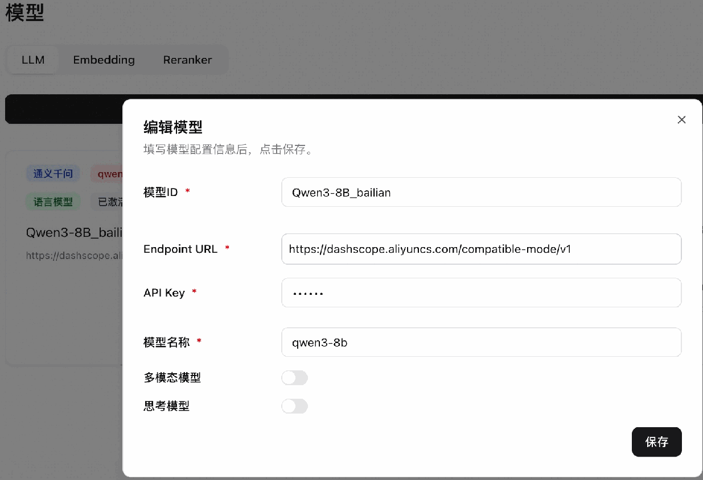

### 2.2 添加知识库

系统已默认配置Embedding模型,可以直接创建知识库并上传文档。

1. 创建知识库。单击左侧知识库,进入知识库⻚面,选择新建知识库。

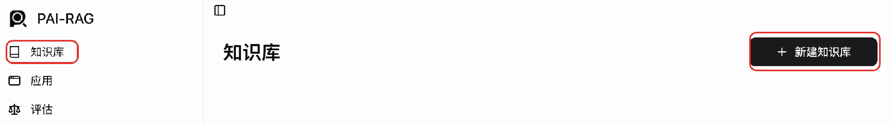

以创建一个iphone16技术规格介绍的知识库为例,设置知识库名称为iphone16介绍,其他参数保持默认。单击创建。

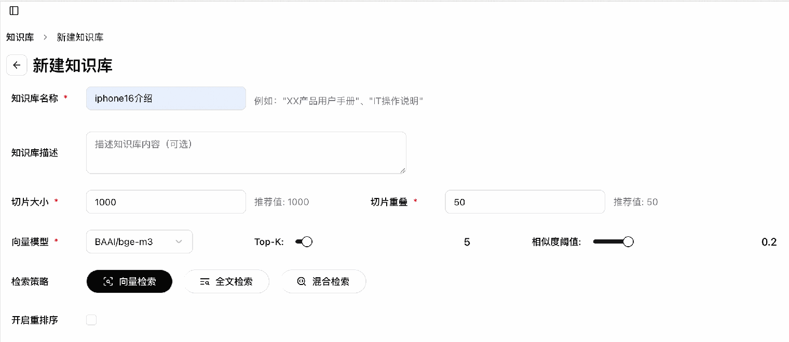

2. 上传文件。在文件管理⻚签,单击上传文件。示例文件:iPhone 16 和 iPhone 16 Plus - 技术规格 - Apple (中国大陆).pdf。

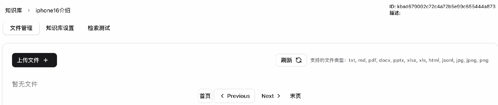

3. 查看知识库文件。上传成功后,可单击切片,查看文档切片。也可以为文档设置访问权限等。

4. 检索测试。切换到检索测试⻚签,输入查询内容(如 iphone16 ),测试知识库检索。

### 2.3 知识库问答

1. 单击左侧新建对话,在对话⻚面上方选择模型,下方单击知识库,选择要使用的知识库(如iphone16介绍)单击激活,然后保存。

**说明**

建议先对话测试模型配置成功,再激活知识库。

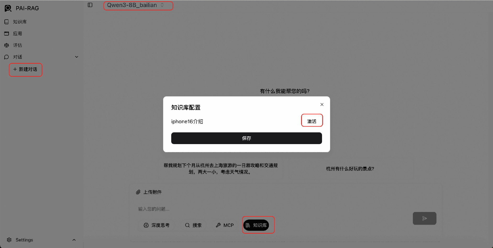

2. 在对话框内输入问题。问题示例:iPhone 16 和 iPhone 16 Plus 采用了怎样的外观设计与机身材质?提供哪些配色选**择?**

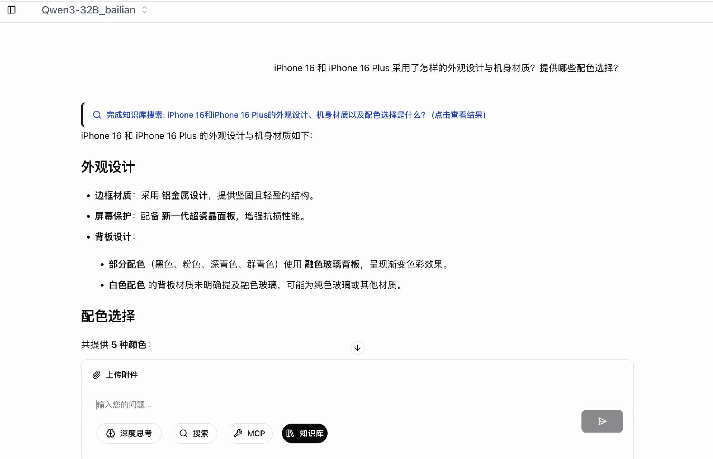

## 步骤三:更多问答模式体验

### 多模态问答(图文对话)

多模态问答需要为RAG服务配置OSS存储信息的环境变量用于存储上传的文件和图片,并使用多模态模型。

1. 为RAG服务配置OSS存储信息的环境变量 。场景化部署不支持直接设置环境变量,在部署服务⻚面右上角选择切换为自定**义部署(已创建的服务可通过更新操作进入部署⻚面),在环境信息区域增加如下环境变量:**

**FILE_STORE_TYPE:设置为oss。**

**OSS_BUCKET:填写OSS BUCKET名称。**

**说明**

**FILE_STORE_TYPE设置为oss后,OSS_BUCKET下会自动生成pairag_knowledgebases目录,存储上传的知**

识库文件和对话中上传的附件。不设置FILE_STORE_TYPE,默认会存储在挂载的OSS目录下。

**OSS_ENDPOINT:OSS访问地址,请参⻅OSS地域和Endpoint。如 oss-cn-hangzhou.aliyuncs.com ,。**

**OSS_ACCESS_KEY_ID、OSS_ACCESS_KEY_SECRET:拥有AliyunOSSFullAccess权限的AK和SK。**

2. 配置多模态大语言模型 (如Qwen-VL系列)。以qwen3-vl-plus为例,配置如下,需打开多模态模型开关。

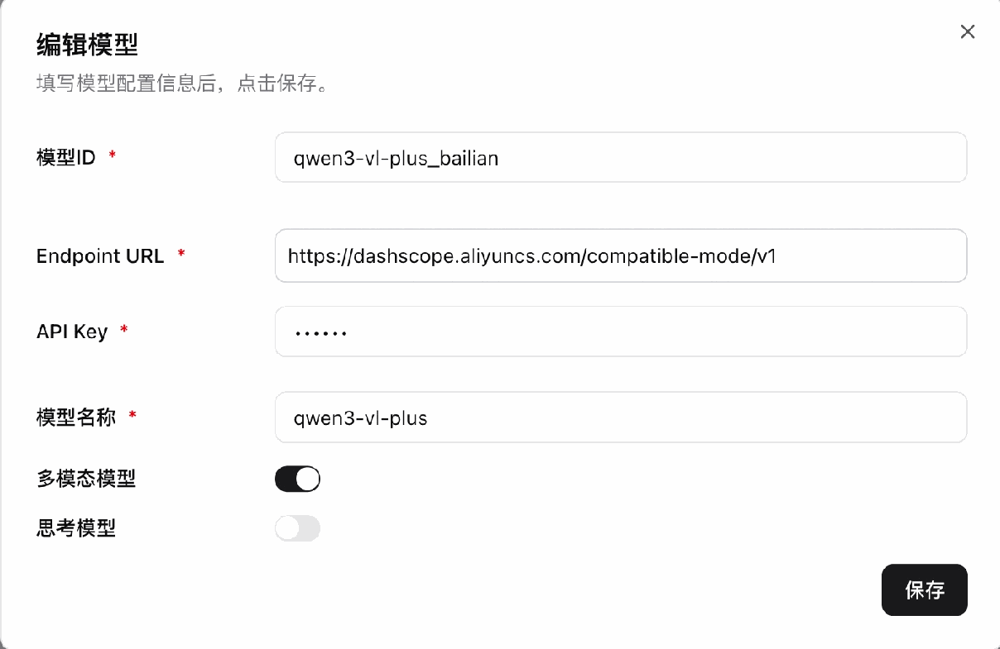

3. 对话示例。上传一张包含多个动物的图片,然后提问:“图中有几个动物?”

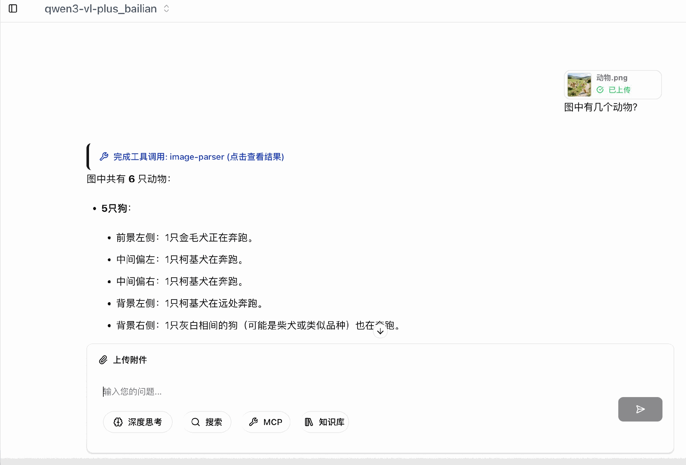

此模式利用模型思考和调用外部工具(如搜索、地图)的能力来回答复杂问题。

使用示例如下:

### Agentic问答(MCP工具调用)

1. 配置支持思考的模型 。模型配置中思考模型选项配置为打开。

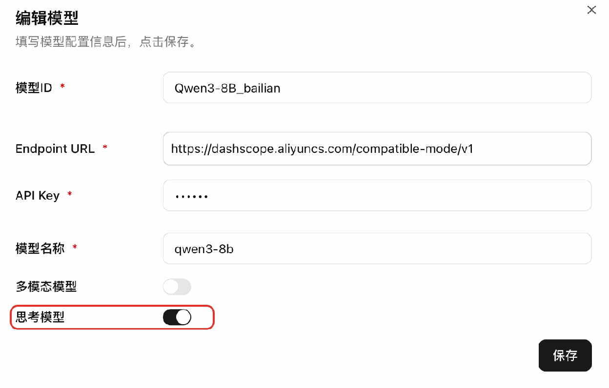

2. 配置阿里云通用搜索 。详情请参⻅配置搜索。

**通用搜索Endpoint:示例RAG服务部署在华东1(杭州),选择同地域接入点 iqs-vpc.cn-**

hangzhou.aliyuncs.com 。

**Access Key ID与Access Key Secret:使用阿里云账号创建RAM用户并授权AliyunIQSFullAccess,访问方式选**

择使用永久 AccessKey 访问 。

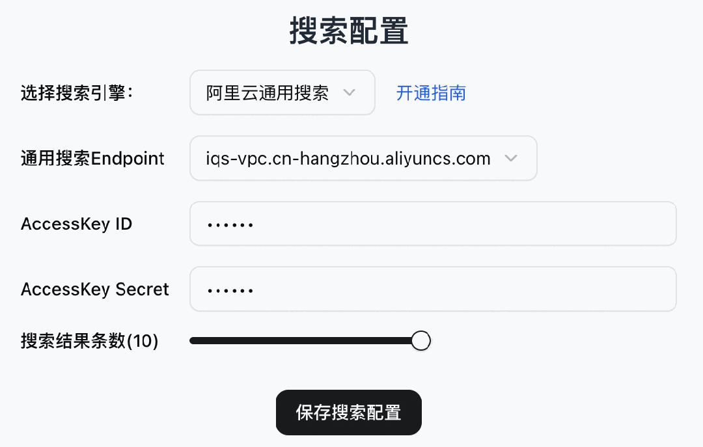

3. 配置高德MCP。单击左下角Settings > MCP,参数配置如下。更多说明参⻅配置MCP。

**MCP 名称:amaps**

**MCP 链接:https://mcp-server-amap-jitptfyoyw.cn-hangzhou.fcapp.run/sse**

**MCP 类型:sse**

**对话测试。单击左侧新建对话,⻚面上方模型选择Qwen3-8B,在对话⻚面下方选择深度思考、搜索和MCP(激**

活amaps)。

问题示例:帮我规划下个月从杭州去上海旅游的一日游攻略和交通规划,两大一小,考虑天气情况 。

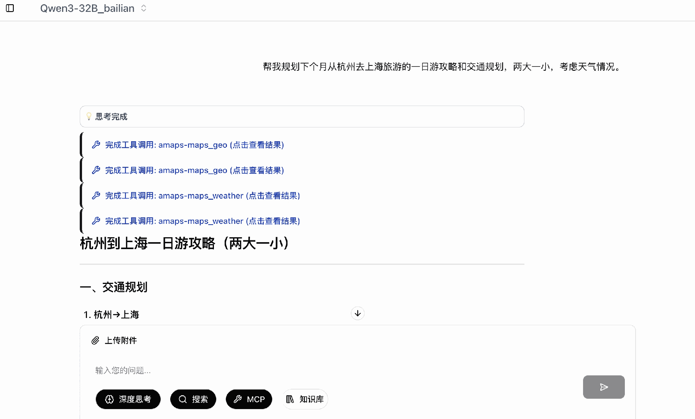

## 步骤四:评估RAG系统性能

RAG系统内置了评估模块,帮助您量化分析不同配置下的问答效果。以下是完整的评估流程:

1. 新建数据集。单击左侧边栏评估,进入评估⻚面,选择新建数据集。

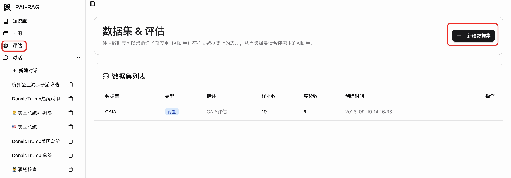

2. 导入样本。单击创建好的数据集,进入评估任务。在样本⻚签下,单击导入数据。

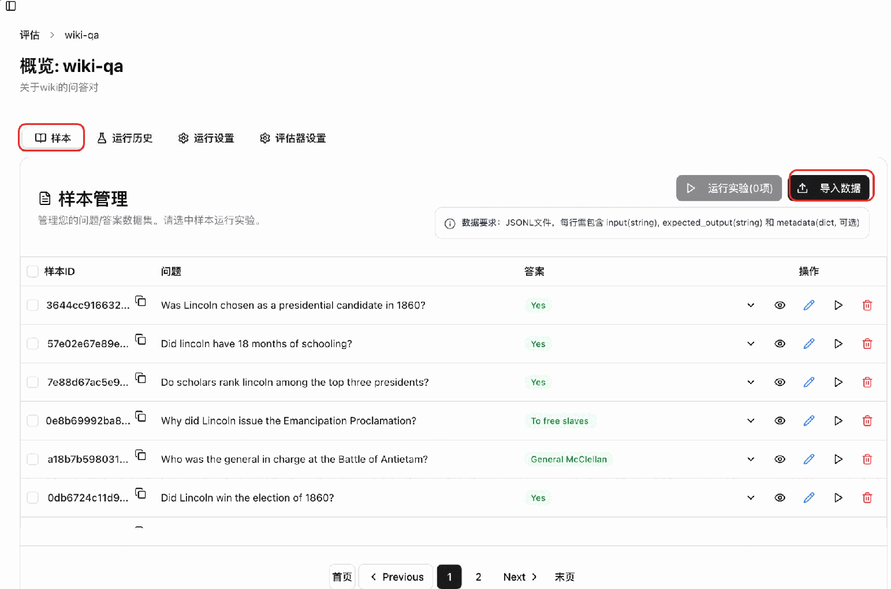

3. 新建运行配置。在运行设置⻚签下,单击新建配置,按需配置。

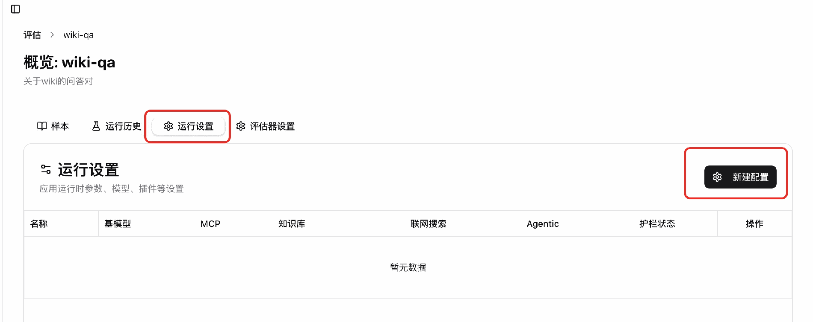

4. 新建评估配置。在评估器设置⻚签下单击新建配置,按需选择配置和评估器类型。

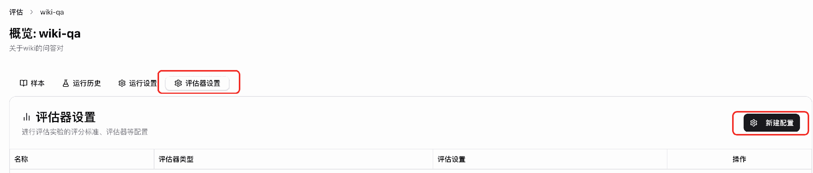

5. 运行评估实验。在样本⻚签,勾选要评估的样本,单击运行实验,填写实验名称,并按需选择运行配置和评估配置。

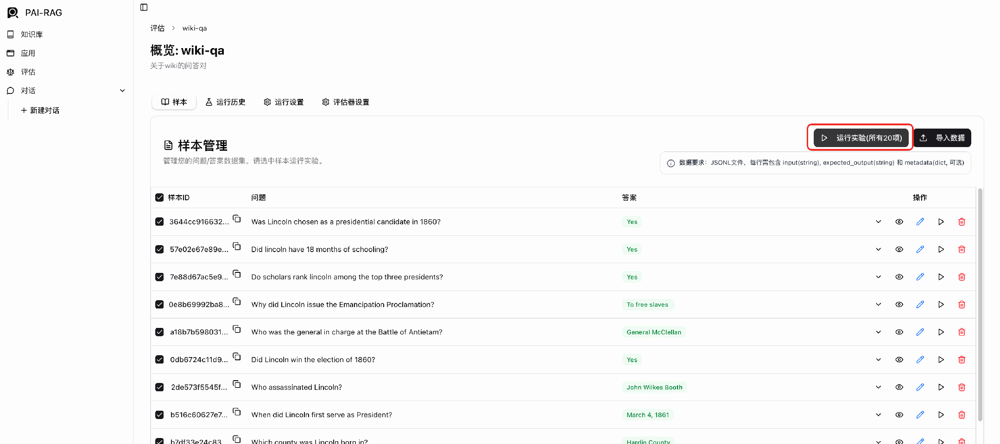

6. 查看评估结果。创建实验成功后,会自动跳转到实验详情⻚面。也可以直接切换到运行历史⻚签,选择目标实验进入。

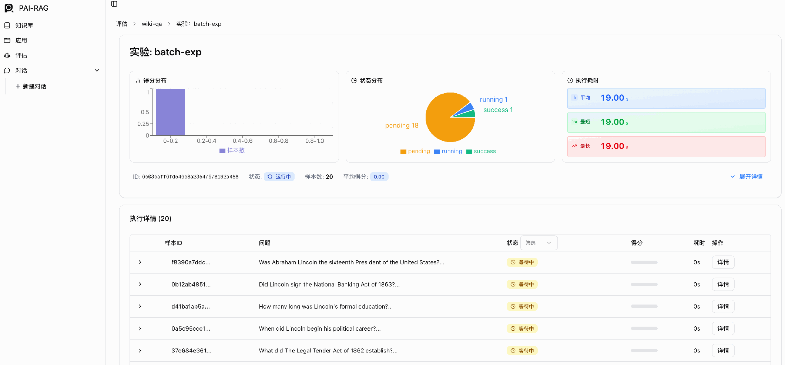

## 生产环境应用

### 使用阿里云向量数据库

PAI-RAG支持通过Elasticsearch、Milvus、Hologres、OpenSearch或RDS PostgreSQL构建向量检索库。

**说明**

Hologres、ElasticSearch、Milvus、RDS PostgreSQL支持通过内网或公网访问,推荐使用内网访问。

OpenSearch只支持通过公网访问。

### ElasticSearch

### 准备Elasticsearch实例

如无Elasticsearch实例,请登录阿里云Elasticsearch控制台,参考如下配置创建。详情请参⻅创建阿里云Elasticsearch实例。

**地域和可用区:选择与EAS服务相同的地域。**

**专有网络:选择与EAS服务一致的VPC,以便通过内网访问。**

**实例类型:选择通用商业版。**

**场景初始化配置:选择通用场景。**

### 服务配置

**重要**

务必设置ElasticSearch实例允许自动创建索引:在Elasticsearch实例的配置与管理 > ES集群配置⻚面,单击修改配**置,将自动创建索引设置为允许自动创建索引。具体操作,请参⻅配置YML参数。**

**版本类型:选择Elasticsearch。**

**私网地址/端口:进入Elasticsearch实例详情⻚,在基本信息区域可获取私网地址和端口,格式为 http://<私网地址>:<私**

网端口> 。

**索引名称:系统会根据输入执行不同操作。**

**输入一个新名称:EAS 将在部署时自动创建符合 PAI-RAG 要求的索引。**

**重要**

阿里云Elasticsearch默认不允许自动创建索引。在Elasticsearch实例的配置与管理 > ES集群配置⻚面,单击修**改配置,更新YML文件配置,将自动创建索引设置为允许自动创建索引。具体操作,请参⻅配置YML参数。**

**输入已存在的名称:EAS 将直接使用该索引。请确保该索引由PAI-RAG服务创建,以保证结构兼容。**

**账号、密码:配置创建Elasticsearch实例时配置的登录名和密码。登录名默认为elastic。密码如忘记,可重置实例访问密**

码。

**OSS地址:请选择当前地域下已创建的OSS存储目录。通过挂载OSS路径实现知识库管理。**

### 通过Kibana管理索引

Elasticsearch提供了索引管理功能,详情请参⻅通过Kibana连接集群。

### Milvus

### 准备Milvus实例

如无Milvus实例,请登录阿里云Milvus控制台,参考如下配置创建。详情请参⻅创建Milvus实例。

**地域和可用区:选择与EAS服务相同的地域。**

**专有网络:选择与EAS服务一致的VPC,以便通过内网访问。**

### 服务配置

**版本类型:选择Milvus。**

**访问地址和代理端口:登录阿里云Milvus控制台,单击目标实例名称进入实例详情⻚签,在访问地址区域,获取内网地**

**址和Proxy Port。**

**账号:默认为root。**

**密码:创建Milvus实例时设置的用户密码,如忘记,可重置实例密码。**

**数据库名称:可使用默认数据库default。也可以手动创建新的数据库,具体操作,请参⻅管理Databases。**

**Collection名称:系统会根据输入执行不同操作。**

**输入一个新名称:EAS 将在部署时会自动创建符合 PAI-RAG 要求的 Collection。**

**输入已存在的Collection名称 :EAS 将直接使用该 Collection。请确保该Collection由PAI-RAG服务创建,以保证结**

构兼容。

**OSS地址:选择已创建的OSS存储目录,用于存放和管理知识库文件。**

### 通过Attu管理Milvus

Attu是Milvus的图形化管理工具,可以查看和管理向量数据。

1. 登录阿里云Milvus控制台,在实例列表⻚面中,单击目标实例名称。

2. 在安全配置⻚签,单击开启公网,为Milvus实例开启公网访问。具体操作,请参⻅网络访问与安全设置。

配置完成后,实例状态变为升级中,大约持续1分钟。

3. 开启成功后,返回实例详情⻚面,单击Attu manager。

4. 在弹出的登录框中,输入用户名和密码,即可进入Attu管理界面。

5. 登录成功后,可在Attu⻚面管理Collection。

更多使用说明,参⻅Attu工具管理。

完整实践文档可参⻅通过阿里云Milvus与PAI搭建高效的检索增强对话系统。

### Hologres

请确认已购买Hologres实例。

**版本类型:选择Hologres。**

**调用信息:配置为指定VPC的host信息。进入Hologres管理控制台的实例详情⻚,在网络信息区域单击指定VPC后的复**

**制,获取域名 :80 前的host信息。**

**数据库名称:配置为Hologres实例的数据库名称。如无,请参⻅创建数据库。**

**账号:配置为已创建的自定义用户账号。具体操作,请参⻅创建自定义用户,其中选择成员角色选择实例超级管理员**

**(SuperUser)。**

**密码:配置为已创建的自定义用户的密码。**

**表名称:系统会根据输入执行不同操作。**

**输入一个新名称:EAS 将在部署时会自动创建符合 PAI-RAG 要求的表。**

**输入已存在的名称:EAS 将直接使用该表。请确保该表由PAI-RAG服务创建,以保证结构兼容。**

**OSS地址:请选择当前地域下已创建的OSS存储目录。通过挂载OSS路径实现知识库管理。**

### OpenSearch

### 准备OpenSearch向量检索版实例

如无OpenSearch实例,请登录OpenSearch控制台,参考如下配置创建。详情请参⻅购买OpenSearch向量检索版实例。

**商品版本:选择向量检索版。**

**地域和可用区、专有网络:OpenSearch只支持通过公网访问,无需与EAS服务一致。**

### 服务配置

**版本类型:选择OpenSearch。**

**访问地址:配置为OpenSearch向量检索版实例的公网访问地址。**

**说明**

需为OpenSearch向量检索版实例开通公网访问功能,并将EAS公网IP地址添加为白名单。

**实例id:在OpenSearch向量检索版实例列表中获取实例ID。**

**用户名、密码:配置为创建OpenSearch向量检索版实例时,输入的用户名和密码。**

**表名称:需先创建满足要求的索引表。参⻅配置实例创建,关键参数如下:**

场景模板选择通用模板,字段配置导入如下配置文件。

**字段配置文件**

{

"schema": {

"summarys": {

"parameter": {

"file_compressor": "zstd"

},

"summary_fields": [

"id",

"embedding",

"file_path",

"file_name",

"file_type",

"node_content",

"node_type",

"doc_id",

"text",

"source_type"

]

},

"file_compress": [

{

"name": "file_compressor",

"type": "zstd"

},

{

"name": "no_compressor",

"type": ""

}

],

"indexs": [

{

"index_fields": [

{

"boost": 1,

"field_name": "id"

},

{

"boost": 1,

"field_name": "embedding"

}

],

"indexer": "aitheta2_indexer",

"index_name": "embedding",

"parameters": {

"enable_rt_build": "true",

"min_scan_doc_cnt": "20000",

"vector_index_type": "Qc",

"major_order": "col",

"builder_name": "QcBuilder",

"distance_type": "SquaredEuclidean",

"embedding_delimiter": ",",

"enable_recall_report": "true",

"ignore_invalid_doc": "true",

"is_embedding_saved": "false",

"linear_build_threshold": "5000",

"dimension": "1536",

"rt_index_params": "{\"proxima.oswg.streamer.segment_size\":2048}",

"rt_index_params": "{\"proxima.oswg.streamer.segment_size\":2048}",

"search_index_params": "{\"proxima.qc.searcher.scan_ratio\":0.01}",

"searcher_name": "QcSearcher",

"build_index_params": "

{\"proxima.qc.builder.quantizer_class\":\"Int8QuantizerConverter\",\"proxima.qc.builder.quantize_by_centroid\":true,\"proxima.qc.builder.optimizer_class\":\"BruteForceBuilder\",\"proxima.qc.builder.thread_count\":10,\"proxima.qc.builder.optimizer_params\":

{\"proxima.linear.builder.column_major_order\":true},\"proxima.qc.builder.store_original_features\":false,\"proxima.qc.builder.train_sample_count\":3000000,\"proxima.qc.builder.train_sample_ratio\":0.5}"},

"index_type": "CUSTOMIZED"

},

{

"has_primary_key_attribute": true,

"index_fields": "id",

"is_primary_key_sorted": false,

"index_name": "id",

"index_type": "PRIMARYKEY64"

},

{

"index_fields": "file_path",

"index_name": "file_path",

"index_type": "STRING"

},

{

"index_fields": "file_name",

"index_name": "file_name",

"index_type": "STRING"

},

{

"index_fields": "file_type",

"index_name": "file_type",

"index_type": "STRING"

},

{

"index_fields": "node_content",

"index_name": "node_content",

"index_type": "STRING"

},

{

"index_fields": "node_type",

"index_name": "node_type",

"index_type": "STRING"

},

{

"index_fields": "doc_id",

"index_name": "doc_id",

"index_type": "STRING"

},

{

"index_fields": "text",

"index_name": "text",

"index_type": "STRING"

},

{

"index_fields": "source_type",

"index_name": "source_type",

"index_type": "STRING"

}

],

"attributes": [

{

{

"file_compress": "no_compressor","field_name": "id"

},

{

"file_compress": "no_compressor","field_name": "embedding"

},

{

"file_compress": "no_compressor","field_name": "file_path"

},

{

"file_compress": "no_compressor","field_name": "file_name"

},

{

"file_compress": "no_compressor","field_name": "file_type"

},

{

"file_compress": "no_compressor","field_name": "node_content"

},

{

"file_compress": "no_compressor","field_name": "node_type"

},

{

"file_compress": "no_compressor","field_name": "doc_id"

},

{

"file_compress": "no_compressor","field_name": "text"

},

{

"file_compress": "no_compressor","field_name": "source_type"

}

],

"fields": [

{

"compress_type": "uniq",

"field_type": "STRING",

"field_name": "id"

},

{

"user_defined_param": {

"multi_value_sep": ","

},

"multi_value": true,

"compress_type": "uniq",

"field_type": "FLOAT",

"field_name": "embedding"

},

{

"compress_type": "uniq",

"field_type": "STRING",

"field_name": "file_path"

},

{

"compress_type": "uniq",

"field_type": "STRING",

"field_name": "file_name"

},

{

"compress_type": "uniq",

"field_type": "STRING",

"field_name": "file_type"

},

{

"compress_type": "uniq",

"field_type": "STRING",

"field_name": "node_content"

},

{

"compress_type": "uniq",

"field_type": "STRING",

"field_name": "node_type"

},

{

"compress_type": "uniq",

"field_type": "STRING",

"field_name": "doc_id"

},

{

"compress_type": "uniq",

"field_type": "STRING",

"field_name": "text"

},

{

"compress_type": "uniq",

"field_type": "STRING",

"field_name": "source_type"

}

],

"table_name": "abc"

},

"extend": {

"description": [],

"vector": [

"embedding"

],

"embeding": []

}

}

**索引结构中,向量维度要与知识库向量模型使用的向量维度保持一致,距离类型建议选择InnerProduct。**

### 管理索引表与数据

1. 登录阿里云OpenSearch向量检索版控制台,单击已创建的实例ID,进入实例详情⻚面。

2. 进入表管理⻚面,对索引表进行管理操作。详情请参⻅表管理。

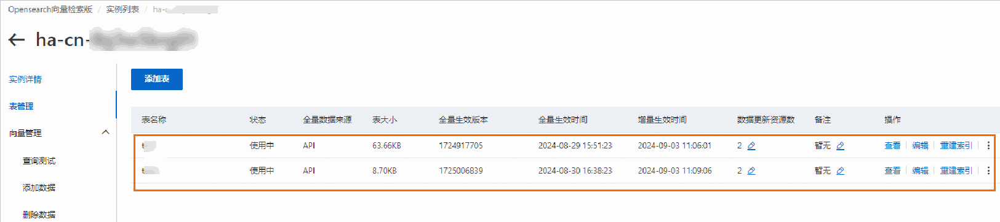

3. 进入向量管理⻚面,进行查询测试、添加或删除数据。详情请参⻅向量管理。

### RDS PostgreSQL

### 准备RDS PostgreSQL实例

1. 如无RDS PostgreSQL实例,点此打开RDS实例创建⻚面,配置如下关键参数后,按照控制台操作指引完成支付和开通操作。详情请参⻅创建RDS PostgreSQL实例。

**引擎:选择PostgreSQL。**

**VPC:选择与EAS服务一致的VPC,以便通过内网访问。**

**高权限账号:在更多配置区域,配置高权限账号。选择立即设置,并配置数据库账号和密码。**

2. 创建数据库。

i. 单击已创建的实例名称,在左侧导航栏单击数据库管理,并单击创建数据库。

ii. 在创建数据库配置面板中,配置数据库(DB)名称,授权账号选择已创建的高权限账号,其他参数配置说明,请参⻅创建账号和数据库。

iii. 参数配置完成后,单击创建。

### 服务配置

请确认已创建RDS PostgreSQL实例。

**版本类型:选择RDS PostgreSQL。**

**主机地址:配置为RDS PostgreSQL实例的内网地址,您可以前往云数据库RDS PostgreSQL控制台⻚面,在RDS**

PostgreSQL实例的数据库连接⻚面进行查看。

**端口:默认为5432,请根据实际情况填写。**

**数据库:数据库的授权账号需为高权限账号,操作请参⻅创建账号和数据库。同时需为数据库安装插件vector和jieba。**

**表名称:自定义配置数据库表名称。**

**账号、密码:配置为创建数据库时的授权账号和密码。如何创建高权限账号,请参⻅创建账号和数据库,其中账号类型选**

择高权限账号。

**OSS地址:请选择当前地域下已创建的OSS存储目录。通过挂载OSS路径实现知识库管理。**

### RDS PostgreSQL数据库管理

1. 访问RDS实例列表,切换到实例所在地域,然后单击实例名称,进入实例详情⻚面。

2. 在左侧导航栏选择数据库管理,然后单击目标数据库操作列下的SQL查询。

3. 输入数据库账号和数据库密码,即您在创建RDS PostgreSQL时设置的高权限账号和密码,然后单击登录。

4. 登录成功后,在已登录数据库实例中查询导入的知识库列表。

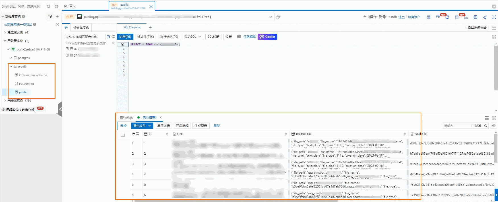

## 附录:WebUI配置说明

### 配置LLM模型

单击左下角Settings > 模型,进入模型配置。在LLM⻚签可添加多个模型。

**说明**

如果是一体化部署,会自动生成一条模型配置记录。还可以继续添加其他来源的模型。

**模型ID:区分不同模型配置。**

**Endpoint URL:单击选择OpenAI或者阿里云百炼的URL,也可直接填写其他模型服务的URL。**

**说明**

阿里云百炼模型调用需单独计费,请参⻅阿里云百炼计费项说明。

如果使用EAS部署的模型服务,在服务实例的基本信息区域单击查看调用信息。注意URL结尾需添加/v1。

公网地址访问LLM服务需为RAG服务配置有公网访问能力的专有网络。

VPC地址访问LLM服务需RAG服务与LLM服务处于同一专有网络内。

**API Key:阿里云百炼参⻅获取API Key填写。EAS服务则填写调用信息中的Token。**

**模型名称:根据实际情况填写。如果是EAS部署的LLM服务且推理引擎为vLLM,请务必填写具体的模型名称。可通**

过 /v1/models 接口获取模型名称。对于其他部署模式,则只需将模型名称设置为 default 即可。

**多模态模型:如果是多模态模型,则勾选,否则不勾选(默认不勾选)。**

**思考模型:有思考与非思考两种模式的模型,可通过该选项来控制是否思考。默认不勾选。**

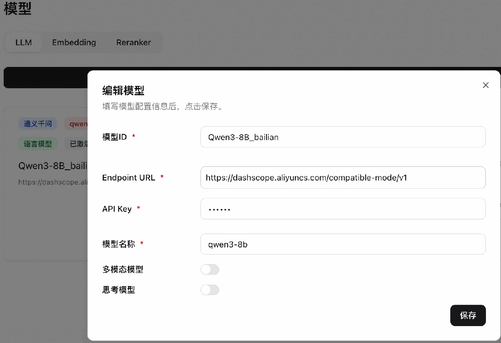

配置成功后建议先测试模型配置。单击左侧新建对话,在对话⻚面上方选择模型进行对话测试。

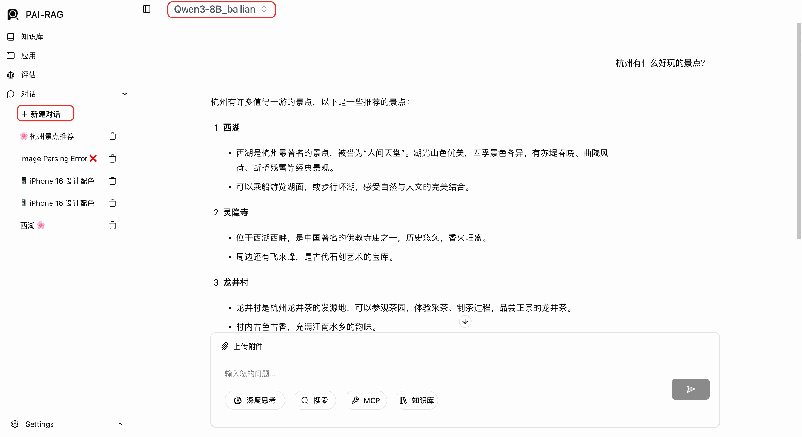

### 配置搜索

单击左下角Settings > 搜索,进入搜索配置。支持Tavily搜索和阿里云通用搜索。

### Tavily搜索

访问 Tavily 官网注册账户,并获取API Key。

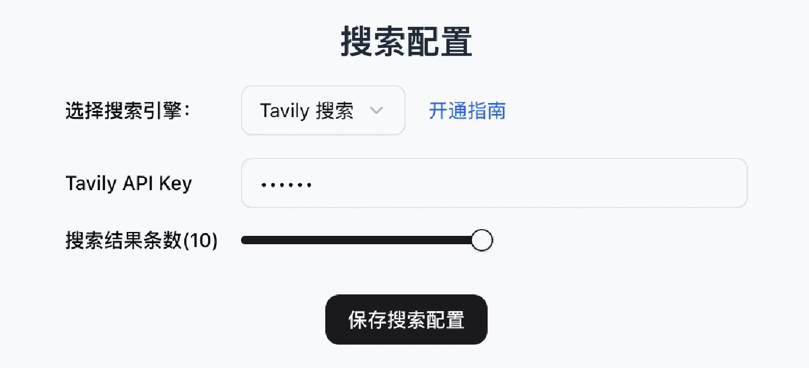

### 阿里云通用搜索

**通用搜索Endpoint:**

优先推荐使用VPC接入,不支持VPC接入的地域请使用公网地址,具体接入地址请参⻅服务接入点。

使用公网地址接入,请确保已为RAG服务配置有公网访问能力的专有网络。

**Access Key ID与Access Key Secret:**

使用阿里云账号创建RAM用户并授权,访问方式选择使用永久 AccessKey 访问 。用户创建成功后,复制Access Key**ID与Access Key Secret填入。**

需要为该用户授予权限AliyunIQSFullAccess,否则使用搜索时会报错。

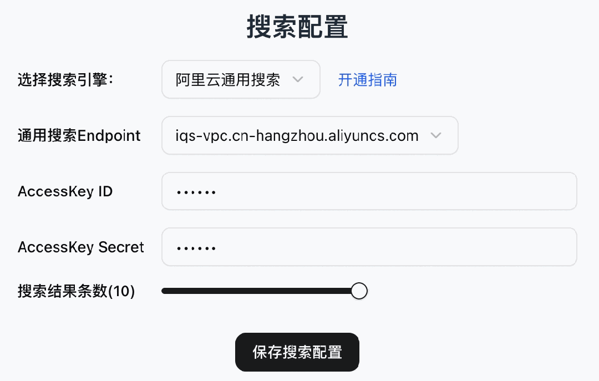

单击左下角Settings > MCP,进入MCP配置。

**MCP链接:MCP 服务的完整访问端点 URL。**

**MCP类型:支持SSE / STDIO / HTTP。**

**Bearer Token:(可选)使用Bearer令牌认证,需填写有效的访问令牌。**

### 配置MCP

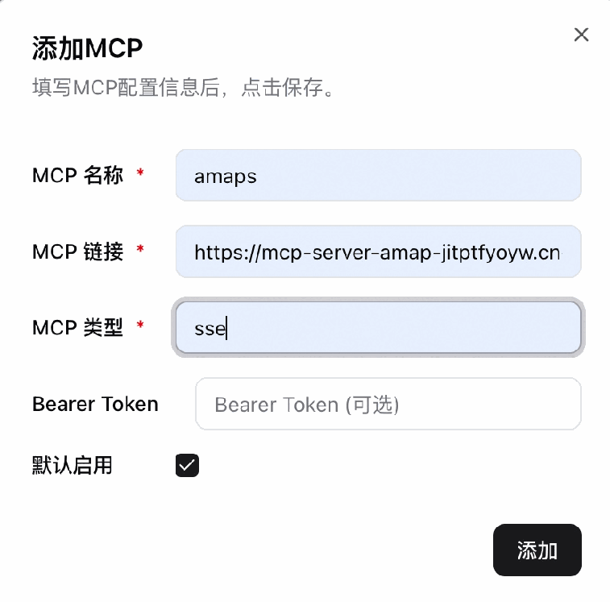
